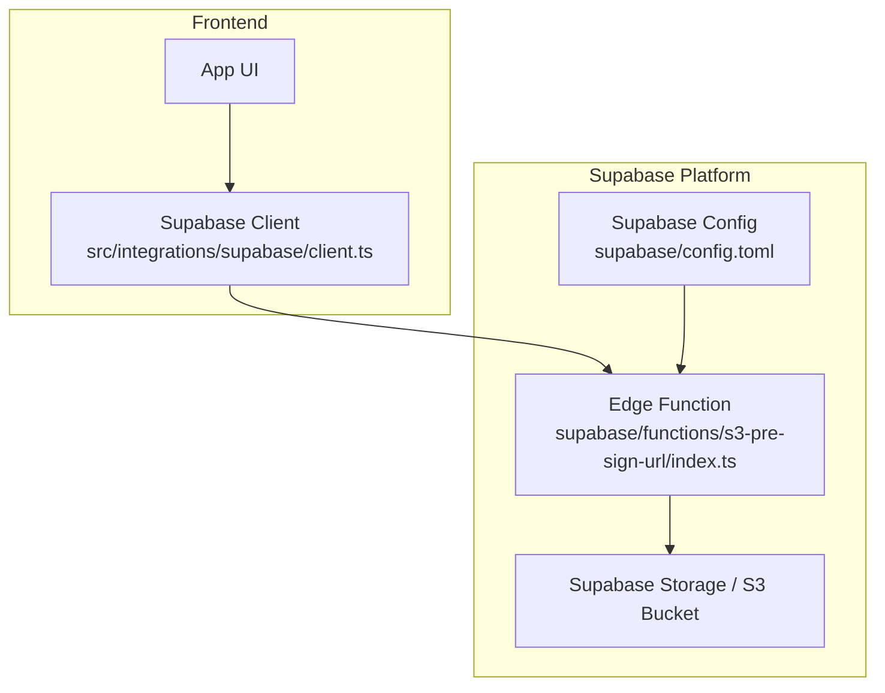
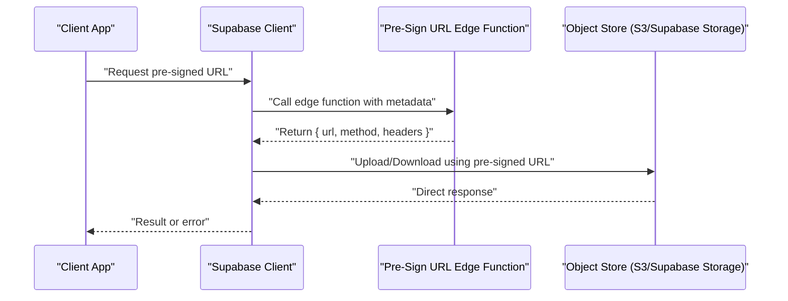
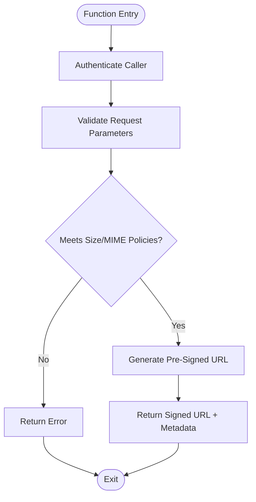
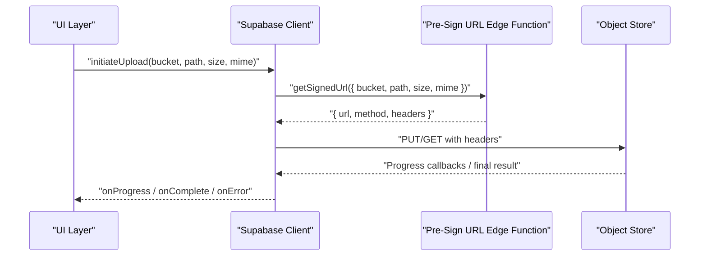
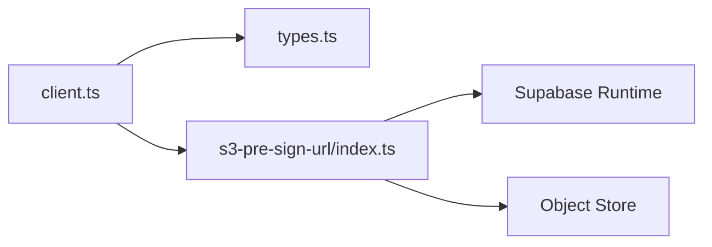

# Storage Integration Functions

<cite>
**Referenced Files in This Document**
- [s3-pre-sign-url/index.ts](file://supabase/functions/s3-pre-sign-url/index.ts)
- [client.ts](file://src/integrations/supabase/client.ts)
- [types.ts](file://src/integrations/supabase/types.ts)
- [config.toml](file://supabase/config.toml)
</cite>

## Table of Contents
1. [Introduction](#introduction)
2. [Project Structure](#project-structure)
3. [Core Components](#core-components)
4. [Architecture Overview](#architecture-overview)
5. [Detailed Component Analysis](#detailed-component-analysis)
6. [Dependency Analysis](#dependency-analysis)
7. [Performance Considerations](#performance-considerations)
8. [Troubleshooting Guide](#troubleshooting-guide)
9. [Conclusion](#conclusion)
10. [Appendices](#appendices)

## Introduction
This document explains the storage integration edge functions in FinSight, focusing on S3 pre-signed URL generation for secure file uploads and downloads. It covers how the client integrates with Supabase Storage, bucket configuration and access controls, upload workflows, size limitations, progress tracking, error recovery, security best practices (including virus scanning and content validation), and guidelines for extending storage capabilities to additional cloud providers.

## Project Structure
FinSight implements storage operations through a combination of:
- A Supabase Edge Function that generates pre-signed URLs for direct object store interactions.
- A Supabase client integration used by the frontend to call the function and perform uploads/downloads.
- Supabase configuration for environment variables and service settings.

**Diagram sources**
- [s3-pre-sign-url/index.ts](file://supabase/functions/s3-pre-sign-url/index.ts)
- [client.ts](file://src/integrations/supabase/client.ts)
- [config.toml](file://supabase/config.toml)

**Section sources**
- [s3-pre-sign-url/index.ts](file://supabase/functions/s3-pre-sign-url/index.ts)
- [client.ts](file://src/integrations/supabase/client.ts)
- [config.toml](file://supabase/config.toml)

## Core Components
- Pre-signed URL Edge Function: Generates time-limited, signed URLs for direct uploads and downloads against the underlying object store.
- Supabase Client Integration: Provides typed helpers to invoke the edge function and manage authentication context.
- Supabase Configuration: Defines runtime environment variables and feature flags consumed by the edge function.

Key responsibilities:
- Validate request inputs and user permissions.
- Construct pre-signed URLs with appropriate scopes, headers, and expiration.
- Return structured responses for both upload and download flows.

**Section sources**
- [s3-pre-sign-url/index.ts](file://supabase/functions/s3-pre-sign-url/index.ts)
- [client.ts](file://src/integrations/supabase/client.ts)
- [types.ts](file://src/integrations/supabase/types.ts)
- [config.toml](file://supabase/config.toml)

## Architecture Overview
The system uses a serverless edge function to issue short-lived credentials for direct object store access. The client obtains a pre-signed URL from the edge function and then performs the actual data transfer directly with the object store, minimizing server load and improving performance.

**Diagram sources**
- [s3-pre-sign-url/index.ts](file://supabase/functions/s3-pre-sign-url/index.ts)
- [client.ts](file://src/integrations/supabase/client.ts)

## Detailed Component Analysis

### Pre-Signed URL Edge Function
Responsibilities:
- Authenticate and authorize the caller.
- Validate requested operation (upload vs download).
- Enforce size limits and allowed MIME types.
- Generate a pre-signed URL with correct HTTP method, headers, and expiration.
- Return a stable JSON payload for the client to consume.

Operational flow:
- Input validation and policy checks.
- URL signing with scoped permissions.
- Response formatting and error handling.

Security considerations:
- Short expiration windows.
- Strict Content-Type enforcement.
- Minimal required permissions for the generated URL.
- Rejection of unsafe paths and disallowed extensions.

Error handling:
- Distinguish between client errors (invalid input) and server-side failures.
- Provide actionable messages and codes for retries.

**Section sources**
- [s3-pre-sign-url/index.ts](file://supabase/functions/s3-pre-sign-url/index.ts)

### Supabase Client Integration
Responsibilities:
- Call the pre-signed URL edge function with typed parameters.
- Perform direct uploads/downloads using the returned URL.
- Manage progress events for large files.
- Normalize errors and surface them to the UI.

Typical workflow:
- Build request payload (bucket, path, size, MIME type).
- Invoke the edge function.
- Execute upload/download via HTTP with provided headers.
- Handle partial failures and retries.

**Diagram sources**
- [client.ts](file://src/integrations/supabase/client.ts)
- [s3-pre-sign-url/index.ts](file://supabase/functions/s3-pre-sign-url/index.ts)

**Section sources**
- [client.ts](file://src/integrations/supabase/client.ts)
- [types.ts](file://src/integrations/supabase/types.ts)

### Supabase Configuration
Environment-driven behavior:
- Bucket names and regions.
- Feature toggles for upload/download modes.
- Security policies and timeouts.

Best practices:
- Keep secrets out of source control.
- Use per-environment configurations.
- Align client and server expectations for keys and endpoints.

**Section sources**
- [config.toml](file://supabase/config.toml)

## Dependency Analysis
High-level dependencies:
- The edge function depends on Supabase’s runtime and object store SDKs.
- The client depends on the Supabase JS client and network stack.
- Types are shared to ensure consistent payloads across layers.

**Diagram sources**
- [client.ts](file://src/integrations/supabase/client.ts)
- [types.ts](file://src/integrations/supabase/types.ts)
- [s3-pre-sign-url/index.ts](file://supabase/functions/s3-pre-sign-url/index.ts)

**Section sources**
- [client.ts](file://src/integrations/supabase/client.ts)
- [types.ts](file://src/integrations/supabase/types.ts)
- [s3-pre-sign-url/index.ts](file://supabase/functions/s3-pre-sign-url/index.ts)

## Performance Considerations
- Prefer direct uploads/downloads via pre-signed URLs to reduce server bandwidth.
- Use multipart uploads for large files when supported by the object store.
- Set reasonable timeouts and retry budgets; implement exponential backoff.
- Cache pre-signed URLs only within their validity window.
- Compress or transcode assets where appropriate before upload.

[No sources needed since this section provides general guidance]

## Troubleshooting Guide
Common issues and resolutions:
- Expired pre-signed URL: Regenerate the URL and retry quickly.
- MIME mismatch: Ensure Content-Type matches what was requested during signing.
- Size exceeded: Enforce client-side checks aligned with server policies.
- Network interruptions: Implement resumable uploads and idempotency keys if supported.
- Permission denied: Verify caller identity and bucket policies.

Operational tips:
- Log minimal, non-sensitive diagnostics at the edge function boundary.
- Surface user-friendly error messages while preserving detailed logs server-side.
- Monitor latency and failure rates for the pre-sign endpoint.

[No sources needed since this section provides general guidance]

## Conclusion
FinSight’s storage integration leverages a pre-signed URL edge function to securely and efficiently move large files directly to the object store. By enforcing strict policies at the edge, providing typed client utilities, and following robust error-handling and security practices, the system achieves scalability and safety. Extensibility is straightforward by adding new edge functions or integrating alternative providers behind a unified interface.

[No sources needed since this section summarizes without analyzing specific files]

## Appendices

### Upload Workflow Reference
- Client requests a pre-signed URL with metadata (bucket, path, size, MIME).
- Edge function validates and returns a signed URL with method and headers.
- Client performs the upload directly to the object store and reports progress.

[No sources needed since this diagram shows conceptual workflow, not actual code structure]

### Security Best Practices
- Enforce minimum password strength and MFA for admin accounts managing buckets.
- Validate and sanitize filenames; reject dangerous extensions.
- Limit maximum file sizes and enforce MIME allowlists.
- Rotate secrets and restrict edge function permissions to least privilege.
- Enable virus scanning and content inspection via post-upload hooks or external services.

[No sources needed since this section provides general guidance]

### Extending Storage Capabilities
- Abstract provider interfaces so the same client API can target multiple backends.
- Add provider-specific edge functions for signing and policy enforcement.
- Centralize configuration and routing logic to switch providers per tenant or region.

[No sources needed since this section provides general guidance]