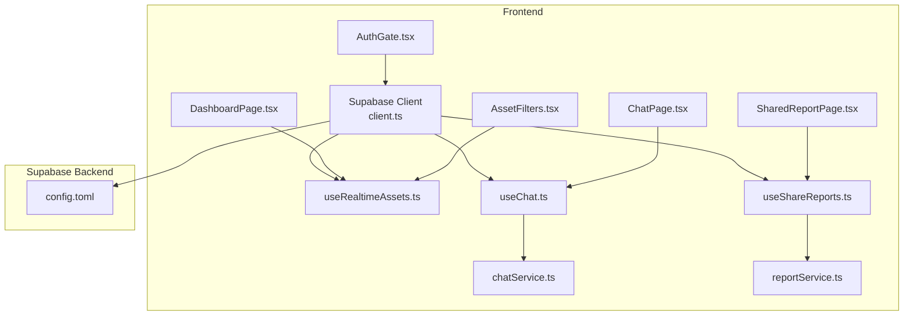
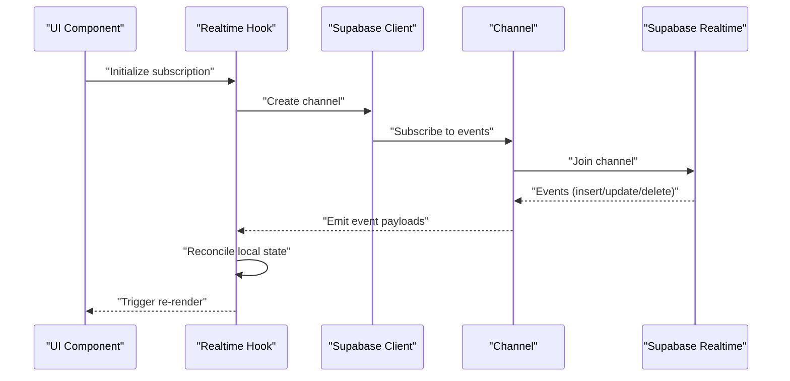
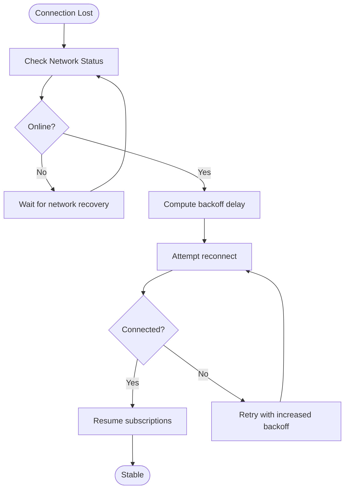
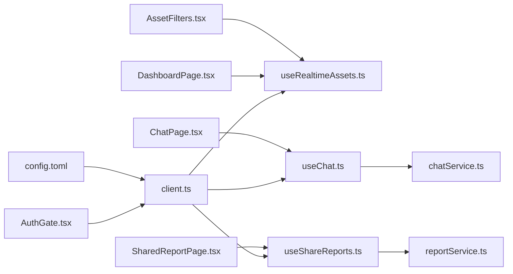

# Real-time Subscriptions

<cite>
**Referenced Files in This Document**
- [client.ts](file://src/integrations/supabase/client.ts)
- [useRealtimeAssets.ts](file://src/hooks/useRealtimeAssets.ts)
- [useChat.ts](file://src/hooks/useChat.ts)
- [useShareReports.ts](file://src/hooks/useShareReports.ts)
- [chatService.ts](file://src/services/chatService.ts)
- [reportService.ts](file://src/services/reportService.ts)
- [AssetFilters.tsx](file://src/components/desktop/AssetFilters.tsx)
- [DashboardPage.tsx](file://src/pages/desktop/DashboardPage.tsx)
- [ChatPage.tsx](file://src/pages/desktop/ChatPage.tsx)
- [SharedReportPage.tsx](file://src/pages/desktop/SharedReportPage.tsx)
- [AuthGate.tsx](file://src/components/desktop/AuthGate.tsx)
- [config.toml](file://supabase/config.toml)
</cite>

## Table of Contents
1. [Introduction](#introduction)
2. [Project Structure](#project-structure)
3. [Core Components](#core-components)
4. [Architecture Overview](#architecture-overview)
5. [Detailed Component Analysis](#detailed-component-analysis)
6. [Dependency Analysis](#dependency-analysis)
7. [Performance Considerations](#performance-considerations)
8. [Security and Permissions](#security-and-permissions)
9. [Troubleshooting Guide](#troubleshooting-guide)
10. [Conclusion](#conclusion)

## Introduction
This document explains how to implement real-time subscriptions in FinSight using Supabase Realtime. It covers subscription patterns for asset updates, portfolio changes, and collaborative features; connection management and reconnection strategies; error handling; practical examples for subscribing to database changes and broadcasting events; client state synchronization; performance considerations such as filtering and payload optimization; security implications and permission controls; and troubleshooting guidance for connection issues, message ordering, and conflict resolution.

## Project Structure
FinSight integrates Supabase via a dedicated client module and uses React hooks and services to manage real-time subscriptions across the application. Key areas include:
- Supabase client initialization and configuration
- Realtime hooks for assets, chat, and shared reports
- Services that encapsulate realtime operations
- Pages and components that consume realtime data
- Supabase server-side configuration

**Diagram sources**
- [client.ts](file://src/integrations/supabase/client.ts)
- [useRealtimeAssets.ts](file://src/hooks/useRealtimeAssets.ts)
- [useChat.ts](file://src/hooks/useChat.ts)
- [useShareReports.ts](file://src/hooks/useShareReports.ts)
- [chatService.ts](file://src/services/chatService.ts)
- [reportService.ts](file://src/services/reportService.ts)
- [DashboardPage.tsx](file://src/pages/desktop/DashboardPage.tsx)
- [ChatPage.tsx](file://src/pages/desktop/ChatPage.tsx)
- [SharedReportPage.tsx](file://src/pages/desktop/SharedReportPage.tsx)
- [AssetFilters.tsx](file://src/components/desktop/AssetFilters.tsx)
- [AuthGate.tsx](file://src/components/desktop/AuthGate.tsx)
- [config.toml](file://supabase/config.toml)

**Section sources**
- [client.ts](file://src/integrations/supabase/client.ts)
- [useRealtimeAssets.ts](file://src/hooks/useRealtimeAssets.ts)
- [useChat.ts](file://src/hooks/useChat.ts)
- [useShareReports.ts](file://src/hooks/useShareReports.ts)
- [chatService.ts](file://src/services/chatService.ts)
- [reportService.ts](file://src/services/reportService.ts)
- [DashboardPage.tsx](file://src/pages/desktop/DashboardPage.tsx)
- [ChatPage.tsx](file://src/pages/desktop/ChatPage.tsx)
- [SharedReportPage.tsx](file://src/pages/desktop/SharedReportPage.tsx)
- [AssetFilters.tsx](file://src/components/desktop/AssetFilters.tsx)
- [AuthGate.tsx](file://src/components/desktop/AuthGate.tsx)
- [config.toml](file://supabase/config.toml)

## Core Components
- Supabase client: Centralizes connection configuration and exposes realtime channels.
- Realtime hooks: Encapsulate channel lifecycle, event handling, and local state synchronization.
- Services: Provide higher-level APIs for broadcasting and subscribing with consistent contracts.
- UI integration: Pages and components subscribe to relevant channels and react to updates.

Key responsibilities:
- Establish and maintain connections
- Subscribe/unsubscribe to channels
- Handle incoming events and reconcile state
- Manage errors and reconnections
- Broadcast user actions or system events

**Section sources**
- [client.ts](file://src/integrations/supabase/client.ts)
- [useRealtimeAssets.ts](file://src/hooks/useRealtimeAssets.ts)
- [useChat.ts](file://src/hooks/useChat.ts)
- [useShareReports.ts](file://src/hooks/useShareReports.ts)
- [chatService.ts](file://src/services/chatService.ts)
- [reportService.ts](file://src/services/reportService.ts)

## Architecture Overview
The realtime architecture follows a layered approach:
- Client layer initializes Supabase and manages channels
- Hooks layer abstracts channel lifecycle and state sync
- Services layer standardizes broadcast and subscription APIs
- UI layer consumes hooks/services to render live updates

**Diagram sources**
- [useRealtimeAssets.ts](file://src/hooks/useRealtimeAssets.ts)
- [useChat.ts](file://src/hooks/useChat.ts)
- [useShareReports.ts](file://src/hooks/useShareReports.ts)
- [client.ts](file://src/integrations/supabase/client.ts)

## Detailed Component Analysis

### Supabase Client Integration
Responsibilities:
- Initialize Supabase client with environment settings
- Expose methods to create and manage channels
- Centralize authentication context usage

Operational notes:
- Ensure client is created once per app lifecycle
- Reuse client instance across hooks and services
- Configure timeouts and retries at the transport level if needed

**Section sources**
- [client.ts](file://src/integrations/supabase/client.ts)
- [AuthGate.tsx](file://src/components/desktop/AuthGate.tsx)

### Assets Realtime Hook
Purpose:
- Subscribe to asset table changes
- Maintain a normalized local cache keyed by asset identifiers
- Filter updates by portfolio or tag when applicable

Subscription pattern:
- Join a channel scoped to the assets table
- Listen to insert, update, and delete events
- Apply optimistic updates and roll back on failure
- Debounce heavy computations and batch updates

State synchronization:
- Merge incoming rows into existing cache
- Remove deleted entries
- Keep derived views (e.g., totals) updated via memoization

Error handling:
- Log and surface connection errors
- Attempt reconnection with exponential backoff
- Fallback to polling if realtime fails persistently

**Section sources**
- [useRealtimeAssets.ts](file://src/hooks/useRealtimeAssets.ts)
- [DashboardPage.tsx](file://src/pages/desktop/DashboardPage.tsx)
- [AssetFilters.tsx](file://src/components/desktop/AssetFilters.tsx)

### Chat Realtime Hook and Service
Purpose:
- Enable collaborative chat with live message delivery
- Broadcast messages to all participants in a room/channel

Subscription pattern:
- Join a channel identified by room ID
- Subscribe to message events
- Persist messages locally and stream new ones

Broadcasting:
- Emit message events through the service
- Include metadata like sender ID and timestamp
- Validate and sanitize payloads before sending

Conflict resolution:
- Use monotonic timestamps or sequence IDs
- Deduplicate messages by unique ID
- Resolve conflicts by last-write-wins with server authority

**Section sources**
- [useChat.ts](file://src/hooks/useChat.ts)
- [chatService.ts](file://src/services/chatService.ts)
- [ChatPage.tsx](file://src/pages/desktop/ChatPage.tsx)

### Shared Reports Realtime Hook and Service
Purpose:
- Collaborative editing and live preview of shared reports
- Coordinate concurrent edits across users

Subscription pattern:
- Join a report-specific channel
- Listen to patch events and full snapshots
- Merge incremental updates efficiently

Broadcasting:
- Send operation deltas rather than full documents
- Include version numbers for conflict detection
- Acknowledge receipt and apply server-side validation

Conflict resolution:
- Implement operational transforms or CRDTs for complex edits
- Fall back to snapshot reconciliation on large divergences
- Notify users of merge outcomes

**Section sources**
- [useShareReports.ts](file://src/hooks/useShareReports.ts)
- [reportService.ts](file://src/services/reportService.ts)
- [SharedReportPage.tsx](file://src/pages/desktop/SharedReportPage.tsx)

### Connection Management and Reconnection Strategy
Guidelines:
- Create channels lazily when components mount
- Unsubscribe on unmount to free resources
- Monitor connection status and display indicators
- Implement exponential backoff with jitter for reconnect attempts
- Gracefully degrade to polling when realtime is unavailable

Flowchart for reconnection:

[No sources needed since this diagram shows conceptual workflow, not actual code structure]

## Dependency Analysis
The following diagram maps key dependencies between modules involved in realtime functionality.

**Diagram sources**
- [client.ts](file://src/integrations/supabase/client.ts)
- [useRealtimeAssets.ts](file://src/hooks/useRealtimeAssets.ts)
- [useChat.ts](file://src/hooks/useChat.ts)
- [useShareReports.ts](file://src/hooks/useShareReports.ts)
- [chatService.ts](file://src/services/chatService.ts)
- [reportService.ts](file://src/services/reportService.ts)
- [DashboardPage.tsx](file://src/pages/desktop/DashboardPage.tsx)
- [ChatPage.tsx](file://src/pages/desktop/ChatPage.tsx)
- [SharedReportPage.tsx](file://src/pages/desktop/SharedReportPage.tsx)
- [AssetFilters.tsx](file://src/components/desktop/AssetFilters.tsx)
- [AuthGate.tsx](file://src/components/desktop/AuthGate.tsx)
- [config.toml](file://supabase/config.toml)

**Section sources**
- [client.ts](file://src/integrations/supabase/client.ts)
- [useRealtimeAssets.ts](file://src/hooks/useRealtimeAssets.ts)
- [useChat.ts](file://src/hooks/useChat.ts)
- [useShareReports.ts](file://src/hooks/useShareReports.ts)
- [chatService.ts](file://src/services/chatService.ts)
- [reportService.ts](file://src/services/reportService.ts)
- [DashboardPage.tsx](file://src/pages/desktop/DashboardPage.tsx)
- [ChatPage.tsx](file://src/pages/desktop/ChatPage.tsx)
- [SharedReportPage.tsx](file://src/pages/desktop/SharedReportPage.tsx)
- [AssetFilters.tsx](file://src/components/desktop/AssetFilters.tsx)
- [AuthGate.tsx](file://src/components/desktop/AuthGate.tsx)
- [config.toml](file://supabase/config.toml)

## Performance Considerations
- Subscription filtering:
  - Use row-level filters where possible to reduce payload size
  - Scope channels to specific portfolios or tags
- Payload optimization:
  - Request only necessary columns
  - Prefer delta updates for collaborative documents
- Bandwidth management:
  - Debounce high-frequency updates
  - Batch multiple small changes into a single event
- Rendering efficiency:
  - Memoize derived data and avoid unnecessary re-renders
  - Virtualize large lists when displaying realtime streams
- Connection scaling:
  - Limit concurrent channels per tab/process
  - Reuse channels across components when safe

[No sources needed since this section provides general guidance]

## Security and Permissions
- Authentication gating:
  - Ensure only authenticated users can join channels
  - Tie channel access to user identity and roles
- Row-level security:
  - Enforce RLS policies on tables accessed via realtime
  - Restrict broadcasts to authorized users
- Input validation:
  - Sanitize and validate all realtime payloads
  - Reject malformed or unauthorized events
- Auditability:
  - Log realtime events for critical operations
  - Track who made changes and when

**Section sources**
- [AuthGate.tsx](file://src/components/desktop/AuthGate.tsx)
- [chatService.ts](file://src/services/chatService.ts)
- [reportService.ts](file://src/services/reportService.ts)
- [config.toml](file://supabase/config.toml)

## Troubleshooting Guide
Common issues and resolutions:
- Connection failures:
  - Verify network connectivity and credentials
  - Inspect channel join logs and error codes
  - Implement fallback polling if realtime remains unstable
- Message ordering:
  - Attach monotonically increasing sequence IDs
  - Buffer and reorder events on the client if needed
- Conflict resolution:
  - Use server-authoritative timestamps or versions
  - Detect duplicates by unique IDs and deduplicate
  - For collaborative edits, adopt OT/CRDT strategies
- State drift:
  - Periodically reconcile with server snapshots
  - Clear stale caches on reconnect
- Debugging tips:
  - Add logging around channel lifecycle and events
  - Visualize connection status and queue lengths
  - Reproduce issues with minimal channels and payloads

**Section sources**
- [useRealtimeAssets.ts](file://src/hooks/useRealtimeAssets.ts)
- [useChat.ts](file://src/hooks/useChat.ts)
- [useShareReports.ts](file://src/hooks/useShareReports.ts)
- [chatService.ts](file://src/services/chatService.ts)
- [reportService.ts](file://src/services/reportService.ts)

## Conclusion
FinSight’s realtime implementation leverages a clear separation of concerns: a centralized Supabase client, reusable hooks for channel management, and services for standardized broadcasting. By applying robust connection management, careful filtering, and strong security controls, the application delivers responsive, collaborative experiences while maintaining performance and reliability. The provided patterns and guidelines serve as a foundation for extending realtime capabilities across additional features.