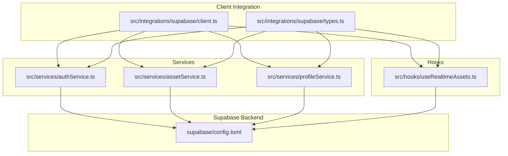
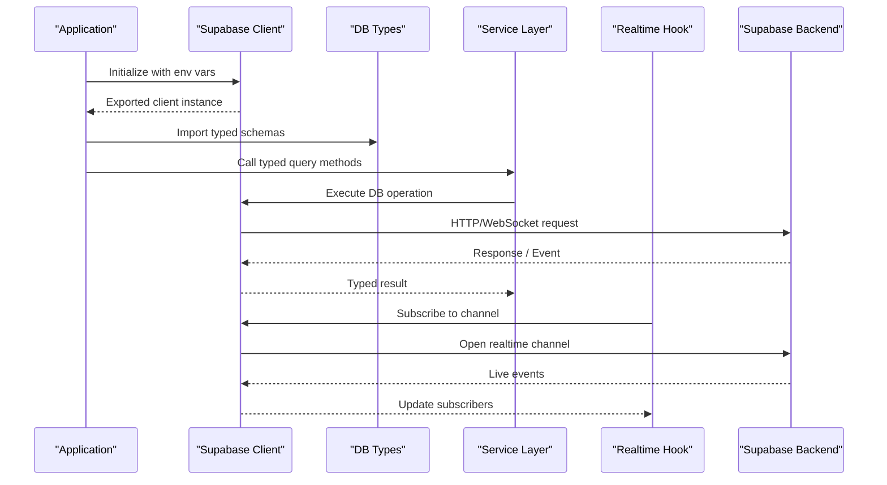
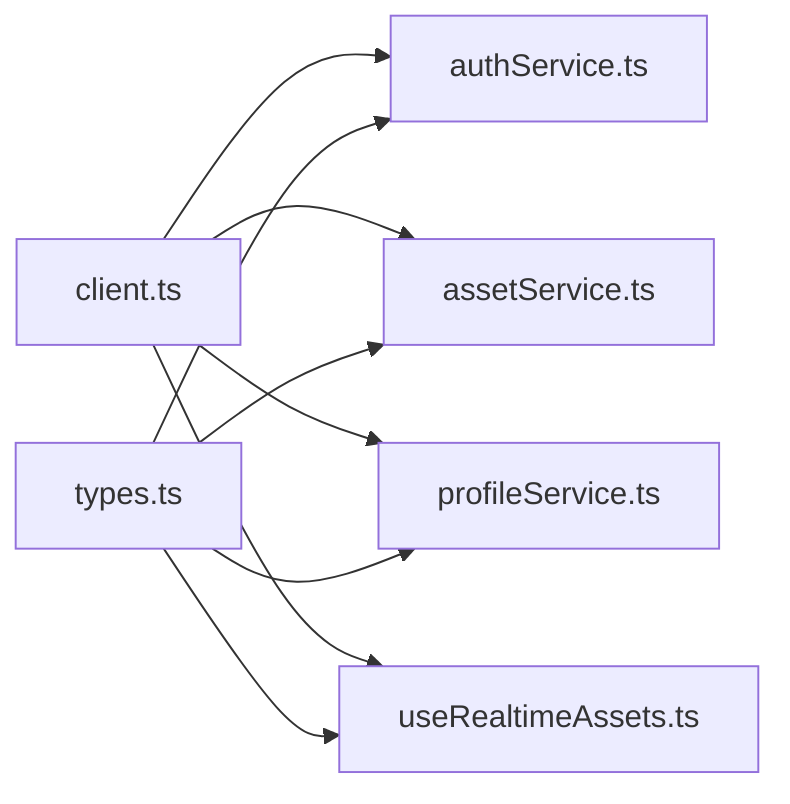

# Supabase Client Setup

<cite>
**Referenced Files in This Document**
- [client.ts](file://src/integrations/supabase/client.ts)
- [types.ts](file://src/integrations/supabase/types.ts)
- [useRealtimeAssets.ts](file://src/hooks/useRealtimeAssets.ts)
- [authService.ts](file://src/services/authService.ts)
- [assetService.ts](file://src/services/assetService.ts)
- [profileService.ts](file://src/services/profileService.ts)
- [config.toml](file://supabase/config.toml)
</cite>

## Table of Contents
1. [Introduction](#introduction)
2. [Project Structure](#project-structure)
3. [Core Components](#core-components)
4. [Architecture Overview](#architecture-overview)
5. [Detailed Component Analysis](#detailed-component-analysis)
6. [Dependency Analysis](#dependency-analysis)
7. [Performance Considerations](#performance-considerations)
8. [Troubleshooting Guide](#troubleshooting-guide)
9. [Conclusion](#conclusion)

## Introduction
This document explains how FinSight configures and uses the Supabase client for database access, authentication, storage, and real-time subscriptions. It covers environment configuration, type-safe database integration, connection pooling considerations, error handling patterns, retry strategies, monitoring, security best practices (API keys and CORS), and troubleshooting guidance.

## Project Structure
FinSight centralizes Supabase client initialization and types under a dedicated integration module and exposes typed services and hooks that consume it.

**Diagram sources**
- [client.ts](file://src/integrations/supabase/client.ts)
- [types.ts](file://src/integrations/supabase/types.ts)
- [authService.ts](file://src/services/authService.ts)
- [assetService.ts](file://src/services/assetService.ts)
- [profileService.ts](file://src/services/profileService.ts)
- [useRealtimeAssets.ts](file://src/hooks/useRealtimeAssets.ts)
- [config.toml](file://supabase/config.toml)

**Section sources**
- [client.ts](file://src/integrations/supabase/client.ts)
- [types.ts](file://src/integrations/supabase/types.ts)
- [authService.ts](file://src/services/authService.ts)
- [assetService.ts](file://src/services/assetService.ts)
- [profileService.ts](file://src/services/profileService.ts)
- [useRealtimeAssets.ts](file://src/hooks/useRealtimeAssets.ts)
- [config.toml](file://supabase/config.toml)

## Core Components
- Supabase client instance: Created once and exported for reuse across services and hooks to avoid redundant connections and ensure consistent configuration.
- Type-safe DB integration: Generated or hand-maintained types define tables, rows, and responses so queries are validated at compile time.
- Authentication provider setup: Centralized auth service wires providers and session management through the client.
- Real-time subscription configuration: Hooks subscribe to table changes and propagate updates to UI components.

Key responsibilities by file:
- Client initialization and environment-driven configuration
- Typed database schema and helper types
- Auth flows and provider configuration
- Database operations with typed queries
- Real-time subscriptions for live data sync

**Section sources**
- [client.ts](file://src/integrations/supabase/client.ts)
- [types.ts](file://src/integrations/supabase/types.ts)
- [authService.ts](file://src/services/authService.ts)
- [assetService.ts](file://src/services/assetService.ts)
- [profileService.ts](file://src/services/profileService.ts)
- [useRealtimeAssets.ts](file://src/hooks/useRealtimeAssets.ts)

## Architecture Overview
The application initializes a single Supabase client configured via environment variables. Services call the client for REST-like database operations, while hooks establish real-time channels for live updates. The backend configuration is defined in the Supabase project settings.

**Diagram sources**
- [client.ts](file://src/integrations/supabase/client.ts)
- [types.ts](file://src/integrations/supabase/types.ts)
- [authService.ts](file://src/services/authService.ts)
- [assetService.ts](file://src/services/assetService.ts)
- [useRealtimeAssets.ts](file://src/hooks/useRealtimeAssets.ts)

## Detailed Component Analysis

### Supabase Client Initialization
- Purpose: Create a single, reusable client instance using environment variables for URL and anon key.
- Responsibilities:
  - Read environment variables for endpoint and API key
  - Configure client options (e.g., persistence, headers)
  - Export the instance for use across the app
- Best practices:
  - Ensure environment variables are present before initialization
  - Avoid multiple instantiations to prevent duplicate connections
  - Keep secrets out of source control; load from runtime environment

Typical usage pattern:
- Import the exported client from the integration module
- Use it within services and hooks without re-initializing

**Section sources**
- [client.ts](file://src/integrations/supabase/client.ts)

### Environment Variable Configuration
- Required variables:
  - Supabase project URL
  - Supabase anonymous/public API key
- Where they are consumed:
  - Client initialization reads these values to connect to the correct project and authenticate requests
- Security notes:
  - Store secrets in environment files not committed to version control
  - Validate presence at startup and fail fast if missing

Environment-specific behavior:
- Development vs production URLs and keys
- Optional toggles for logging or debug modes

**Section sources**
- [client.ts](file://src/integrations/supabase/client.ts)

### Type-Safe Database Integration
- Purpose: Provide compile-time guarantees for table names, columns, and response shapes.
- How it works:
  - Types define database schema and expected payloads
  - Services import types and annotate return values
  - Queries and mutations leverage typed helpers to reduce runtime errors
- Benefits:
  - Early detection of schema mismatches
  - Better IDE autocompletion and refactoring safety

Where types are used:
- Services perform typed queries and map results to domain models
- Hooks subscribe to typed events for real-time updates

**Section sources**
- [types.ts](file://src/integrations/supabase/types.ts)
- [assetService.ts](file://src/services/assetService.ts)
- [profileService.ts](file://src/services/profileService.ts)
- [useRealtimeAssets.ts](file://src/hooks/useRealtimeAssets.ts)

### Authentication Provider Setup
- Responsibilities:
  - Configure supported providers (e.g., email/password, OAuth)
  - Handle sign-in/sign-up flows and session state
  - Expose helpers to check current user and manage tokens
- Typical flow:
  - User triggers login
  - Service calls client auth method
  - Session updated and persisted
  - UI reacts to auth state changes

Security considerations:
- Use secure redirects and CSRF protections on the backend
- Restrict sensitive operations to authenticated users via RLS policies

**Section sources**
- [authService.ts](file://src/services/authService.ts)
- [client.ts](file://src/integrations/supabase/client.ts)

### Real-Time Subscription Configuration
- Purpose: Subscribe to database changes and push updates to UI components.
- Key aspects:
  - Establish channels per table or event type
  - Handle connection lifecycle (connect, reconnect, disconnect)
  - Map incoming events to typed payloads
- Usage example:
  - Hook subscribes to asset changes and updates local state

Reliability:
- Implement reconnection logic and backoff
- Debounce high-frequency updates when necessary

**Section sources**
- [useRealtimeAssets.ts](file://src/hooks/useRealtimeAssets.ts)
- [client.ts](file://src/integrations/supabase/client.ts)

### Storage Buckets
- Purpose: Manage file uploads/downloads via Supabase Storage.
- Common tasks:
  - List buckets and objects
  - Upload/download with signed URLs or direct access
  - Enforce bucket-level permissions and object-level RLS
- Integration points:
  - Services expose upload/download helpers
  - UI components trigger storage actions

Security:
- Apply bucket policies to restrict access
- Validate file types and sizes server-side

**Section sources**
- [client.ts](file://src/integrations/supabase/client.ts)

### Connection Pooling and Lifecycle
- Client-level pooling:
  - Reuse a single client instance to share underlying connections
  - Avoid creating clients per request or component
- Network considerations:
  - Respect rate limits and quotas
  - Batch operations where possible
- Monitoring:
  - Log connection attempts and failures
  - Track latency and error rates

[No sources needed since this section provides general guidance]

## Dependency Analysis
The following diagram shows how the client and types are consumed by services and hooks.

**Diagram sources**
- [client.ts](file://src/integrations/supabase/client.ts)
- [types.ts](file://src/integrations/supabase/types.ts)
- [authService.ts](file://src/services/authService.ts)
- [assetService.ts](file://src/services/assetService.ts)
- [profileService.ts](file://src/services/profileService.ts)
- [useRealtimeAssets.ts](file://src/hooks/useRealtimeAssets.ts)

**Section sources**
- [client.ts](file://src/integrations/supabase/client.ts)
- [types.ts](file://src/integrations/supabase/types.ts)
- [authService.ts](file://src/services/authService.ts)
- [assetService.ts](file://src/services/assetService.ts)
- [profileService.ts](file://src/services/profileService.ts)
- [useRealtimeAssets.ts](file://src/hooks/useRealtimeAssets.ts)

## Performance Considerations
- Prefer a single client instance to minimize overhead.
- Use pagination and selective column fetching to reduce payload size.
- Cache frequently accessed data locally when appropriate.
- Debounce real-time updates for high-churn tables.
- Monitor network metrics and adjust batch sizes.

[No sources needed since this section provides general guidance]

## Troubleshooting Guide
Common issues and resolutions:
- Missing environment variables:
  - Verify URL and anon key are set and loaded at startup
  - Fail fast with clear error messages if absent
- Authentication failures:
  - Check provider configuration and redirect URIs
  - Validate session persistence and token refresh
- Real-time connectivity problems:
  - Inspect WebSocket availability and firewall rules
  - Implement exponential backoff and reconnect retries
- Storage permission errors:
  - Confirm bucket policies and object-level RLS
  - Validate content-type and size constraints
- CORS errors:
  - Ensure allowed origins include your frontend domains
  - Align Supabase project settings with deployment URLs

Operational checks:
- Enable verbose logs in development only
- Add health checks for Supabase endpoints
- Record error categories and counts for alerting

**Section sources**
- [client.ts](file://src/integrations/supabase/client.ts)
- [authService.ts](file://src/services/authService.ts)
- [useRealtimeAssets.ts](file://src/hooks/useRealtimeAssets.ts)

## Conclusion
FinSight’s Supabase integration centers around a single, environment-configured client, strongly-typed database interactions, robust authentication, and reliable real-time subscriptions. By adhering to the patterns outlined here—centralized initialization, strict typing, careful error handling, and security-first configuration—you can maintain a scalable and resilient data layer.