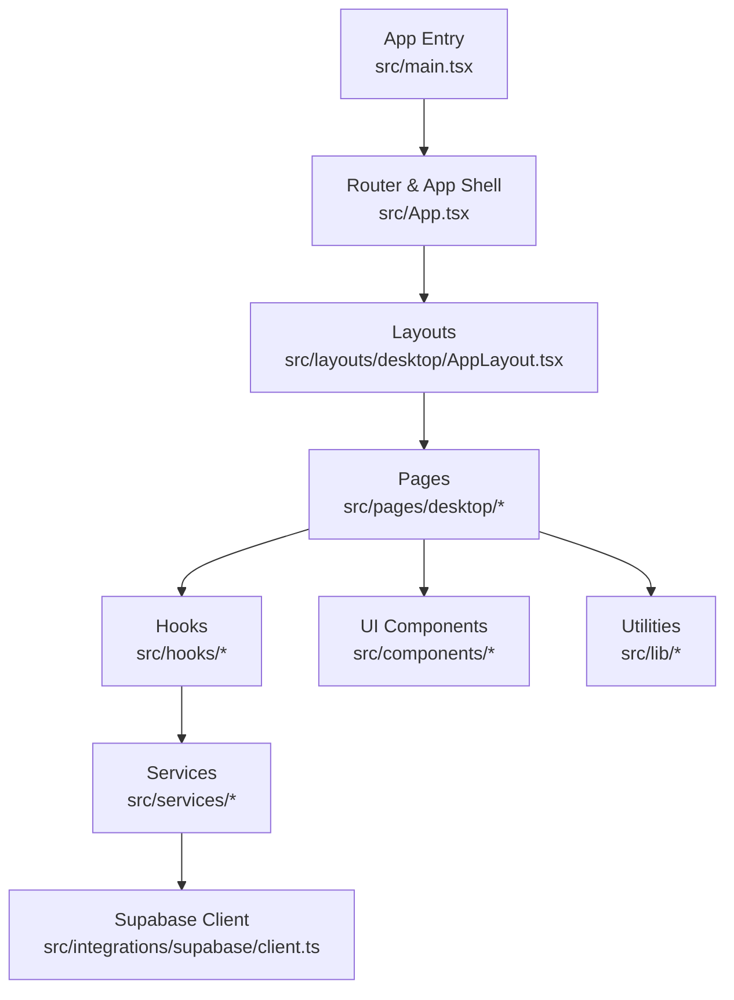
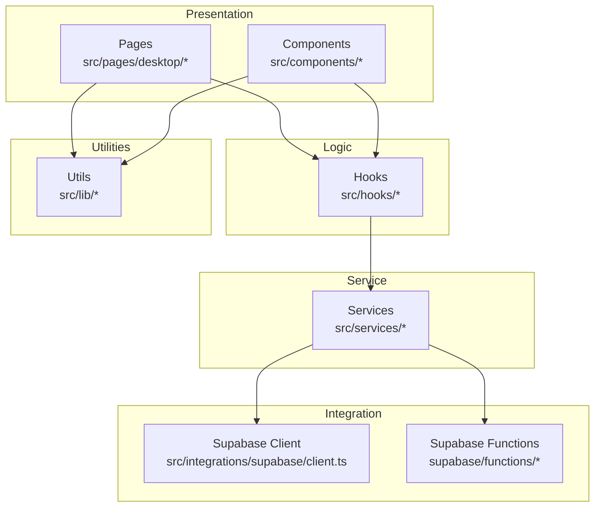
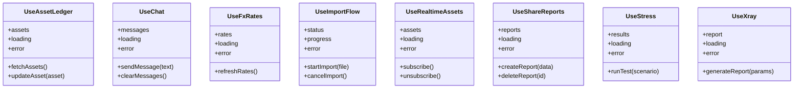
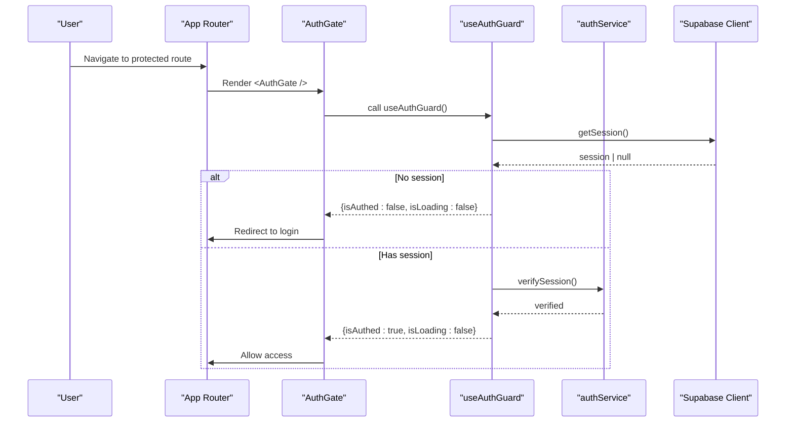
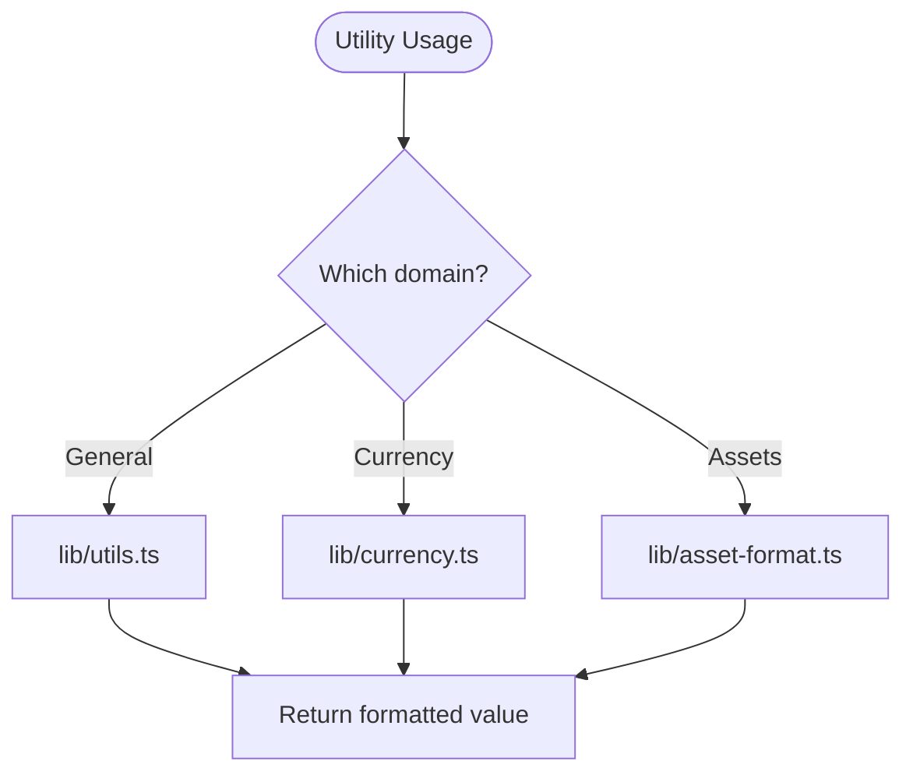
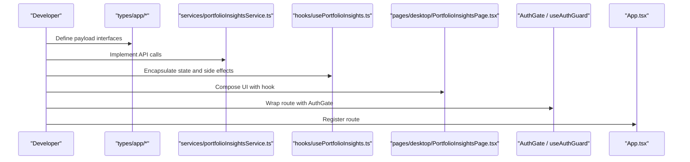
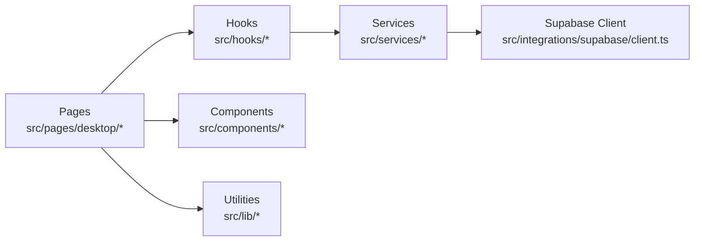

# Development Patterns

<cite>
**Referenced Files in This Document**
- [App.tsx](file://src/App.tsx)
- [main.tsx](file://src/main.tsx)
- [vite.config.ts](file://vite.config.ts)
- [tsconfig.json](file://tsconfig.json)
- [tsconfig.app.json](file://tsconfig.app.json)
- [components/desktop/AuthGate.tsx](file://src/components/desktop/AuthGate.tsx)
- [hooks/useAuthGuard.ts](file://src/hooks/useAuthGuard.ts)
- [services/authService.ts](file://src/services/authService.ts)
- [integrations/supabase/client.ts](file://src/integrations/supabase/client.ts)
- [lib/utils.ts](file://src/lib/utils.ts)
- [lib/currency.ts](file://src/lib/currency.ts)
- [lib/asset-format.ts](file://src/lib/asset-format.ts)
- [hooks/useProfile.ts](file://src/hooks/useProfile.ts)
- [hooks/useAssetLedger.ts](file://src/hooks/useAssetLedger.ts)
- [hooks/useChat.ts](file://src/hooks/useChat.ts)
- [hooks/useFxRates.ts](file://src/hooks/useFxRates.ts)
- [hooks/useImportFlow.ts](file://src/hooks/useImportFlow.ts)
- [hooks/useRealtimeAssets.ts](file://src/hooks/useRealtimeAssets.ts)
- [hooks/useShareReports.ts](file://src/hooks/useShareReports.ts)
- [hooks/useStress.ts](file://src/hooks/useStress.ts)
- [hooks/useXray.ts](file://src/hooks/useXray.ts)
- [services/assetService.ts](file://src/services/assetService.ts)
- [services/chatService.ts](file://src/services/chatService.ts)
- [services/fxService.ts](file://src/services/fxService.ts)
- [services/importService.ts](file://src/services/importService.ts)
- [services/profileService.ts](file://src/services/profileService.ts)
- [services/reportService.ts](file://src/services/reportService.ts)
- [services/stressService.ts](file://src/services/stressService.ts)
- [services/xrayService.ts](file://src/services/xrayService.ts)
- [pages/desktop/DashboardPage.tsx](file://src/pages/desktop/DashboardPage.tsx)
- [pages/desktop/AssetsPage.tsx](file://src/pages/desktop/AssetsPage.tsx)
- [pages/desktop/ChatPage.tsx](file://src/pages/desktop/ChatPage.tsx)
- [pages/desktop/ImportPage.tsx](file://src/pages/desktop/ImportPage.tsx)
- [pages/desktop/StressTestPage.tsx](file://src/pages/desktop/StressTestPage.tsx)
- [pages/desktop/XRayPage.tsx](file://src/pages/desktop/XRayPage.tsx)
- [pages/desktop/SharedReportPage.tsx](file://src/pages/desktop/SharedReportPage.tsx)
- [layouts/desktop/AppLayout.tsx](file://src/layouts/desktop/AppLayout.tsx)
</cite>

## Table of Contents
1. [Introduction](#introduction)
2. [Project Structure](#project-structure)
3. [Core Components](#core-components)
4. [Architecture Overview](#architecture-overview)
5. [Detailed Component Analysis](#detailed-component-analysis)
6. [Dependency Analysis](#dependency-analysis)
7. [Performance Considerations](#performance-considerations)
8. [Troubleshooting Guide](#troubleshooting-guide)
9. [Conclusion](#conclusion)
10. [Appendices](#appendices)

## Introduction
This document defines FinSight’s development patterns and conventions to ensure consistent, maintainable, and scalable code across the application. It covers:
- Hook-based development pattern (when to create hooks, naming, parameters, returns)
- Authentication guard patterns, route protection, and session management
- Utility organization and shared logic extraction for reusability
- TypeScript usage guidelines, error boundaries, loading states, and form handling
- Build configuration with Vite and TypeScript compiler options
- Step-by-step examples for implementing new features following established patterns
- Contribution guidelines to keep code consistency

## Project Structure
FinSight follows a feature-oriented structure with clear separation of concerns:
- src/components: UI components (desktop-specific and shared ui primitives)
- src/hooks: Custom React hooks encapsulating business logic and side effects
- src/services: API/service layer wrapping Supabase functions and client calls
- src/pages: Route-level page components
- src/layouts: Layout wrappers for pages
- src/lib: Pure utilities and domain helpers
- src/types: Shared type definitions
- supabase: Serverless functions and database migrations

**Diagram sources**
- [main.tsx](file://src/main.tsx)
- [App.tsx](file://src/App.tsx)
- [AppLayout.tsx](file://src/layouts/desktop/AppLayout.tsx)
- [DashboardPage.tsx](file://src/pages/desktop/DashboardPage.tsx)
- [AuthGate.tsx](file://src/components/desktop/AuthGate.tsx)
- [useAuthGuard.ts](file://src/hooks/useAuthGuard.ts)
- [authService.ts](file://src/services/authService.ts)
- [client.ts](file://src/integrations/supabase/client.ts)

**Section sources**
- [main.tsx](file://src/main.tsx)
- [App.tsx](file://src/App.tsx)
- [AppLayout.tsx](file://src/layouts/desktop/AppLayout.tsx)

## Core Components
- Application entrypoint initializes providers and routes.
- App shell configures routing and layout composition.
- AuthGate component protects routes by checking authentication state.
- useAuthGuard hook centralizes auth checks and redirects.
- Services abstract all external calls (Supabase functions and client).
- Hooks encapsulate data fetching, caching, and side effects.
- Utilities provide pure helpers for formatting, currency, and asset normalization.

Key responsibilities:
- Routing and layout orchestration: App.tsx, AppLayout.tsx
- Route protection: AuthGate.tsx, useAuthGuard.ts
- Data access: services/* and hooks/*
- UI primitives: components/ui/*
- Domain helpers: lib/*

**Section sources**
- [App.tsx](file://src/App.tsx)
- [AppLayout.tsx](file://src/layouts/desktop/AppLayout.tsx)
- [AuthGate.tsx](file://src/components/desktop/AuthGate.tsx)
- [useAuthGuard.ts](file://src/hooks/useAuthGuard.ts)
- [authService.ts](file://src/services/authService.ts)
- [client.ts](file://src/integrations/supabase/client.ts)

## Architecture Overview
FinSight uses a layered architecture:
- Presentation Layer: Pages and UI components
- Logic Layer: Custom hooks for state and side effects
- Service Layer: Business operations and API integration
- Integration Layer: Supabase client and serverless functions
- Utilities: Pure helpers for cross-cutting concerns

**Diagram sources**
- [DashboardPage.tsx](file://src/pages/desktop/DashboardPage.tsx)
- [AssetsPage.tsx](file://src/pages/desktop/AssetsPage.tsx)
- [ChatPage.tsx](file://src/pages/desktop/ChatPage.tsx)
- [ImportPage.tsx](file://src/pages/desktop/ImportPage.tsx)
- [StressTestPage.tsx](file://src/pages/desktop/StressTestPage.tsx)
- [XRayPage.tsx](file://src/pages/desktop/XRayPage.tsx)
- [SharedReportPage.tsx](file://src/pages/desktop/SharedReportPage.tsx)
- [useAssetLedger.ts](file://src/hooks/useAssetLedger.ts)
- [useChat.ts](file://src/hooks/useChat.ts)
- [useFxRates.ts](file://src/hooks/useFxRates.ts)
- [useImportFlow.ts](file://src/hooks/useImportFlow.ts)
- [useRealtimeAssets.ts](file://src/hooks/useRealtimeAssets.ts)
- [useShareReports.ts](file://src/hooks/useShareReports.ts)
- [useStress.ts](file://src/hooks/useStress.ts)
- [useXray.ts](file://src/hooks/useXray.ts)
- [assetService.ts](file://src/services/assetService.ts)
- [chatService.ts](file://src/services/chatService.ts)
- [fxService.ts](file://src/services/fxService.ts)
- [importService.ts](file://src/services/importService.ts)
- [reportService.ts](file://src/services/reportService.ts)
- [stressService.ts](file://src/services/stressService.ts)
- [xrayService.ts](file://src/services/xrayService.ts)
- [client.ts](file://src/integrations/supabase/client.ts)
- [utils.ts](file://src/lib/utils.ts)
- [currency.ts](file://src/lib/currency.ts)
- [asset-format.ts](file://src/lib/asset-format.ts)

## Detailed Component Analysis

### Hook-Based Development Pattern
Guidelines:
- Create a custom hook when you need to reuse stateful logic or side effects across components.
- Naming: useXxx where Xxx describes the responsibility (e.g., useAssetLedger, useChat).
- Parameters: accept minimal required inputs; prefer typed props objects for complex cases.
- Returns: return a stable object with explicit keys (data, loading, error, actions).
- Side Effects: encapsulate subscriptions, polling, and mutations inside the hook.
- Error Handling: normalize errors into a consistent shape; expose actionable messages.
- Loading States: expose boolean flags and optional skeleton placeholders.
- Memoization: memoize derived values and callbacks to avoid unnecessary re-renders.

Examples of existing hooks:
- useAssetLedger: manages asset ledger state and operations
- useChat: chat interactions and message handling
- useFxRates: fetches and caches exchange rates
- useImportFlow: orchestrates import flows and validation
- useRealtimeAssets: subscribes to real-time asset updates
- useShareReports: share report lifecycle
- useStress: stress test execution and results
- useXray: X-ray report generation and retrieval

**Diagram sources**
- [useAssetLedger.ts](file://src/hooks/useAssetLedger.ts)
- [useChat.ts](file://src/hooks/useChat.ts)
- [useFxRates.ts](file://src/hooks/useFxRates.ts)
- [useImportFlow.ts](file://src/hooks/useImportFlow.ts)
- [useRealtimeAssets.ts](file://src/hooks/useRealtimeAssets.ts)
- [useShareReports.ts](file://src/hooks/useShareReports.ts)
- [useStress.ts](file://src/hooks/useStress.ts)
- [useXray.ts](file://src/hooks/useXray.ts)

**Section sources**
- [useAssetLedger.ts](file://src/hooks/useAssetLedger.ts)
- [useChat.ts](file://src/hooks/useChat.ts)
- [useFxRates.ts](file://src/hooks/useFxRates.ts)
- [useImportFlow.ts](file://src/hooks/useImportFlow.ts)
- [useRealtimeAssets.ts](file://src/hooks/useRealtimeAssets.ts)
- [useShareReports.ts](file://src/hooks/useShareReports.ts)
- [useStress.ts](file://src/hooks/useStress.ts)
- [useXray.ts](file://src/hooks/useXray.ts)

### Authentication Guard Patterns and Route Protection
Patterns:
- Centralized guard hook: useAuthGuard provides isAuthed, isLoading, and redirect behavior.
- Route-level protection: wrap protected routes with AuthGate component.
- Session management: rely on Supabase client session state; refresh on app start.
- Redirect strategy: unauthenticated users are redirected to login; authenticated users proceed.

**Diagram sources**
- [AuthGate.tsx](file://src/components/desktop/AuthGate.tsx)
- [useAuthGuard.ts](file://src/hooks/useAuthGuard.ts)
- [authService.ts](file://src/services/authService.ts)
- [client.ts](file://src/integrations/supabase/client.ts)

**Section sources**
- [AuthGate.tsx](file://src/components/desktop/AuthGate.tsx)
- [useAuthGuard.ts](file://src/hooks/useAuthGuard.ts)
- [authService.ts](file://src/services/authService.ts)
- [client.ts](file://src/integrations/supabase/client.ts)

### Utility Function Organization and Reusability
Principles:
- Keep utilities pure and side-effect free.
- Group by domain: currency formatting, asset normalization, general helpers.
- Export named functions with explicit types.
- Avoid importing heavy dependencies in hot paths.

Existing utilities:
- utils.ts: general helpers
- currency.ts: currency formatting and conversion helpers
- asset-format.ts: asset data normalization and formatting

**Diagram sources**
- [utils.ts](file://src/lib/utils.ts)
- [currency.ts](file://src/lib/currency.ts)
- [asset-format.ts](file://src/lib/asset-format.ts)

**Section sources**
- [utils.ts](file://src/lib/utils.ts)
- [currency.ts](file://src/lib/currency.ts)
- [asset-format.ts](file://src/lib/asset-format.ts)

### TypeScript Usage Guidelines
Recommendations:
- Strict mode enabled via tsconfig settings.
- Prefer explicit types over any; define interfaces for service payloads.
- Use discriminated unions for state machines (e.g., loading/error/data).
- Leverage generics for reusable hooks and services.
- Validate external data at service boundaries before passing to hooks/components.

Relevant configuration:
- tsconfig.json: base compiler options
- tsconfig.app.json: app-specific strictness and path mappings

**Section sources**
- [tsconfig.json](file://tsconfig.json)
- [tsconfig.app.json](file://tsconfig.app.json)

### Error Boundaries, Loading States, and Form Handling
Guidelines:
- Error boundaries: wrap critical route trees to catch rendering errors and show fallback UI.
- Loading states: expose loading flags from hooks; render skeletons or spinners consistently.
- Form handling: use controlled inputs with validation; normalize errors into user-friendly messages.
- Global error handling: centralize network and runtime errors; log and notify users.

[No sources needed since this section provides general guidance]

### Build Configuration and Development Workflow
Vite configuration:
- Define aliases for cleaner imports.
- Configure plugins for optimization and environment variables.
- Enable fast refresh and dev server optimizations.

TypeScript compilation:
- Strict flags for safety.
- Path aliases for readability.
- Separate node vs app configs for tooling clarity.

**Section sources**
- [vite.config.ts](file://vite.config.ts)
- [tsconfig.json](file://tsconfig.json)
- [tsconfig.app.json](file://tsconfig.app.json)

### Implementing New Features Following Established Patterns
Step-by-step example: Adding a “Portfolio Insights” feature
1. Define types in src/types/app if needed.
2. Create a service in src/services/portfolioInsightsService.ts to call Supabase functions.
3. Implement a hook src/hooks/usePortfolioInsights.ts returning { data, loading, error, refresh }.
4. Add a page src/pages/desktop/PortfolioInsightsPage.tsx using the hook and UI components.
5. Protect the route with AuthGate and useAuthGuard.
6. Wire up routing in App.tsx and include in AppLayout.tsx navigation.
7. Add unit tests for service and hook logic.
8. Update documentation and add migration if DB changes are required.

[No sources needed since this diagram shows conceptual workflow, not actual code structure]

## Dependency Analysis
High-level dependency relationships:
- Pages depend on hooks and UI components.
- Hooks depend on services for data access.
- Services depend on Supabase client and serverless functions.
- Utilities are consumed across layers without coupling.

**Diagram sources**
- [DashboardPage.tsx](file://src/pages/desktop/DashboardPage.tsx)
- [AssetsPage.tsx](file://src/pages/desktop/AssetsPage.tsx)
- [ChatPage.tsx](file://src/pages/desktop/ChatPage.tsx)
- [ImportPage.tsx](file://src/pages/desktop/ImportPage.tsx)
- [StressTestPage.tsx](file://src/pages/desktop/StressTestPage.tsx)
- [XRayPage.tsx](file://src/pages/desktop/XRayPage.tsx)
- [SharedReportPage.tsx](file://src/pages/desktop/SharedReportPage.tsx)
- [useAssetLedger.ts](file://src/hooks/useAssetLedger.ts)
- [useChat.ts](file://src/hooks/useChat.ts)
- [useFxRates.ts](file://src/hooks/useFxRates.ts)
- [useImportFlow.ts](file://src/hooks/useImportFlow.ts)
- [useRealtimeAssets.ts](file://src/hooks/useRealtimeAssets.ts)
- [useShareReports.ts](file://src/hooks/useShareReports.ts)
- [useStress.ts](file://src/hooks/useStress.ts)
- [useXray.ts](file://src/hooks/useXray.ts)
- [assetService.ts](file://src/services/assetService.ts)
- [chatService.ts](file://src/services/chatService.ts)
- [fxService.ts](file://src/services/fxService.ts)
- [importService.ts](file://src/services/importService.ts)
- [reportService.ts](file://src/services/reportService.ts)
- [stressService.ts](file://src/services/stressService.ts)
- [xrayService.ts](file://src/services/xrayService.ts)
- [client.ts](file://src/integrations/supabase/client.ts)
- [utils.ts](file://src/lib/utils.ts)

**Section sources**
- [DashboardPage.tsx](file://src/pages/desktop/DashboardPage.tsx)
- [AssetsPage.tsx](file://src/pages/desktop/AssetsPage.tsx)
- [ChatPage.tsx](file://src/pages/desktop/ChatPage.tsx)
- [ImportPage.tsx](file://src/pages/desktop/ImportPage.tsx)
- [StressTestPage.tsx](file://src/pages/desktop/StressTestPage.tsx)
- [XRayPage.tsx](file://src/pages/desktop/XRayPage.tsx)
- [SharedReportPage.tsx](file://src/pages/desktop/SharedReportPage.tsx)
- [useAssetLedger.ts](file://src/hooks/useAssetLedger.ts)
- [useChat.ts](file://src/hooks/useChat.ts)
- [useFxRates.ts](file://src/hooks/useFxRates.ts)
- [useImportFlow.ts](file://src/hooks/useImportFlow.ts)
- [useRealtimeAssets.ts](file://src/hooks/useRealtimeAssets.ts)
- [useShareReports.ts](file://src/hooks/useShareReports.ts)
- [useStress.ts](file://src/hooks/useStress.ts)
- [useXray.ts](file://src/hooks/useXray.ts)
- [assetService.ts](file://src/services/assetService.ts)
- [chatService.ts](file://src/services/chatService.ts)
- [fxService.ts](file://src/services/fxService.ts)
- [importService.ts](file://src/services/importService.ts)
- [reportService.ts](file://src/services/reportService.ts)
- [stressService.ts](file://src/services/stressService.ts)
- [xrayService.ts](file://src/services/xrayService.ts)
- [client.ts](file://src/integrations/supabase/client.ts)
- [utils.ts](file://src/lib/utils.ts)

## Performance Considerations
- Prefer memoization in hooks for expensive computations.
- Debounce search and filter inputs.
- Paginate large datasets at the service layer.
- Use virtualization for long lists.
- Minimize re-renders by splitting components and stabilizing references.
- Optimize images and assets through Vite build pipeline.

[No sources needed since this section provides general guidance]

## Troubleshooting Guide
Common issues and resolutions:
- Authentication loops: ensure useAuthGuard handles loading state and avoids premature redirects.
- Network errors: normalize errors in services; surface user-friendly messages in hooks.
- Real-time subscription leaks: unsubscribe in cleanup functions within hooks.
- Build failures: check tsconfig strictness and Vite plugin compatibility.
- Supabase function timeouts: adjust function limits and optimize queries.

**Section sources**
- [useAuthGuard.ts](file://src/hooks/useAuthGuard.ts)
- [authService.ts](file://src/services/authService.ts)
- [client.ts](file://src/integrations/supabase/client.ts)
- [vite.config.ts](file://vite.config.ts)
- [tsconfig.json](file://tsconfig.json)

## Conclusion
By adhering to these development patterns—hook-centric logic, guarded routes, clean service boundaries, and strong TypeScript practices—FinSight maintains high code quality, scalability, and developer productivity. Consistent contribution workflows and build configurations further streamline collaboration and delivery.

## Appendices

### Contributing Guidelines
- Follow naming conventions for hooks, services, and utilities.
- Write clear commit messages and link related issues.
- Include tests for new hooks and services.
- Update documentation when changing public APIs.
- Run linting and type checks before submitting PRs.

[No sources needed since this section provides general guidance]