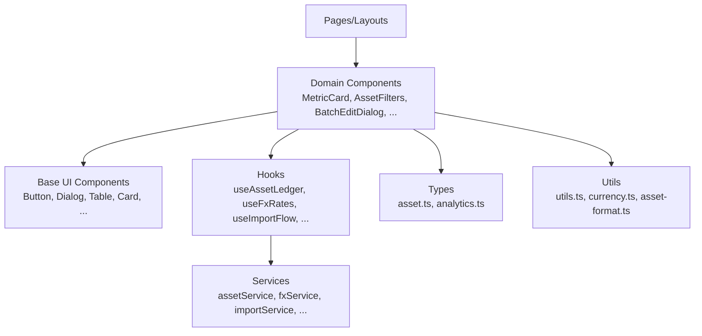
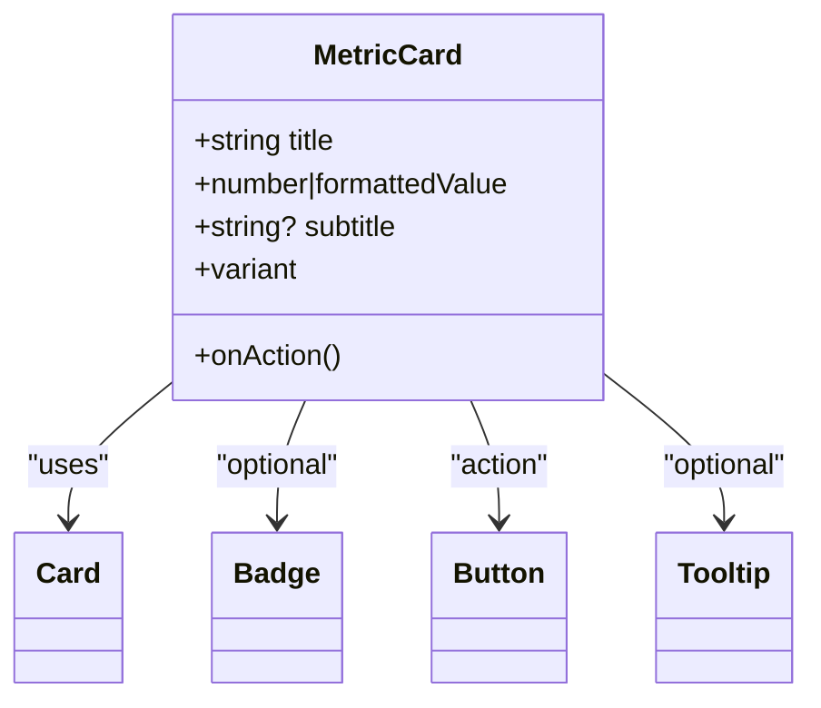
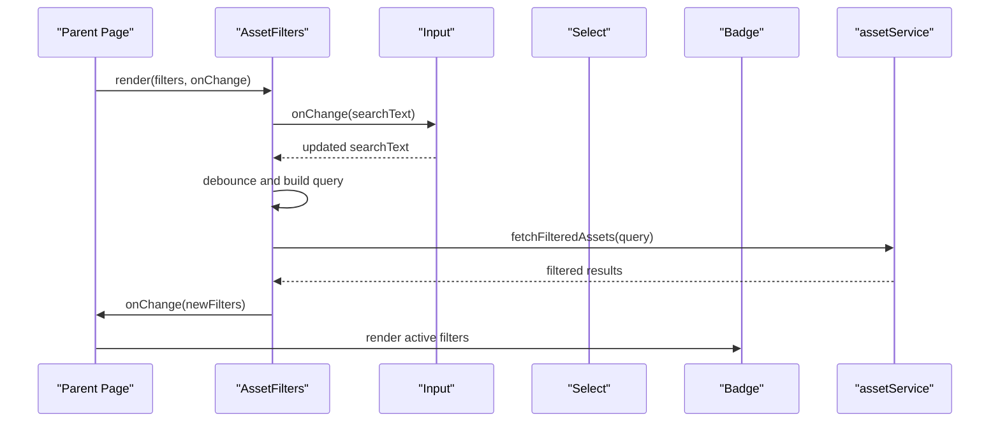
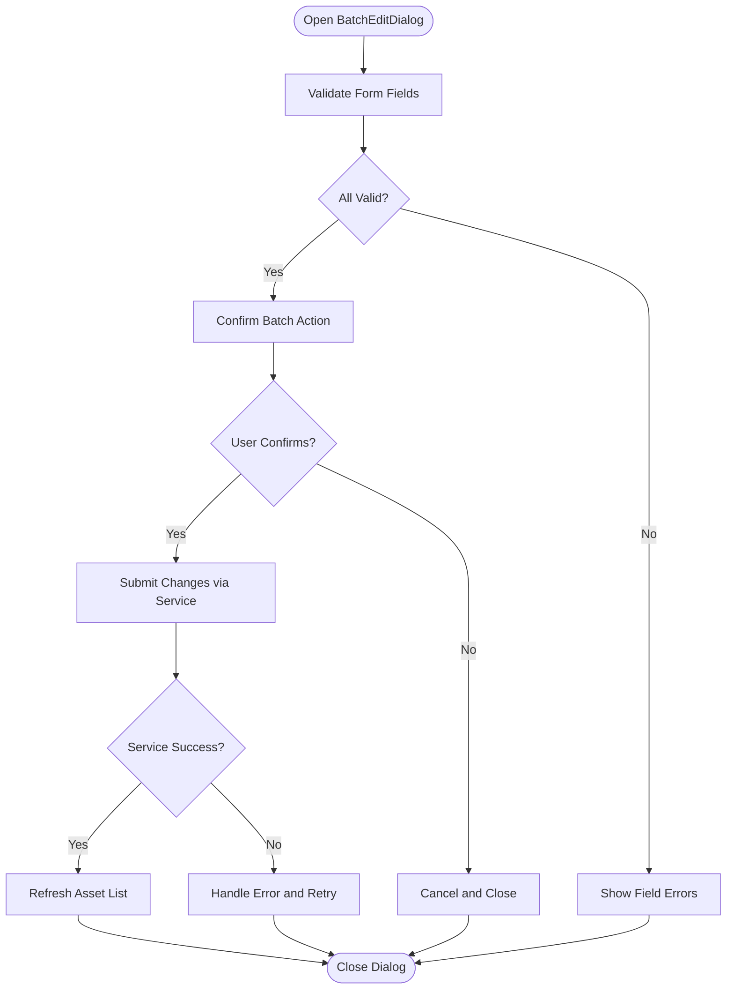
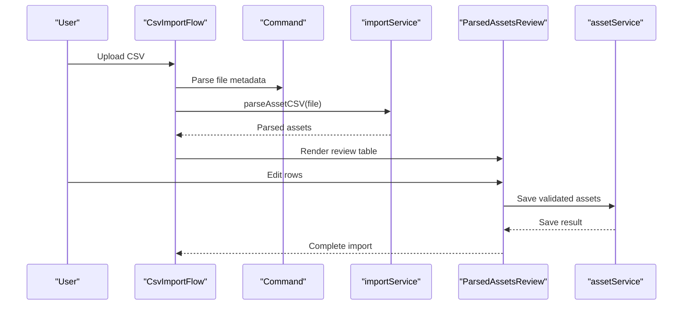
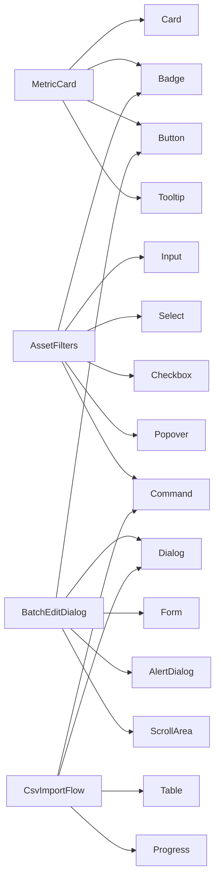

# Component System

<cite>
**Referenced Files in This Document**
- [components.json](file://components.json)
- [tailwind.config.js](file://tailwind.config.js)
- [src/components/ui/button.tsx](file://src/components/ui/button.tsx)
- [src/components/ui/dialog.tsx](file://src/components/ui/dialog.tsx)
- [src/components/ui/table.tsx](file://src/components/ui/table.tsx)
- [src/components/ui/card.tsx](file://src/components/ui/card.tsx)
- [src/components/ui/input.tsx](file://src/components/ui/input.tsx)
- [src/components/ui/select.tsx](file://src/components/ui/select.tsx)
- [src/components/ui/checkbox.tsx](file://src/components/ui/checkbox.tsx)
- [src/components/ui/badge.tsx](file://src/components/ui/badge.tsx)
- [src/components/ui/form.tsx](file://src/components/ui/form.tsx)
- [src/components/ui/popover.tsx](file://src/components/ui/popover.tsx)
- [src/components/ui/dropdown-menu.tsx](file://src/components/ui/dropdown-menu.tsx)
- [src/components/ui/tabs.tsx](file://src/components/ui/tabs.tsx)
- [src/components/ui/accordion.tsx](file://src/components/ui/accordion.tsx)
- [src/components/ui/calendar.tsx](file://src/components/ui/calendar.tsx)
- [src/components/ui/date-picker.tsx](file://src/components/ui/date-picker.tsx)
- [src/components/ui/command.tsx](file://src/components/ui/command.tsx)
- [src/components/ui/sheet.tsx](file://src/components/ui/sheet.tsx)
- [src/components/ui/alert-dialog.tsx](file://src/components/ui/alert-dialog.tsx)
- [src/components/ui/avatar.tsx](file://src/components/ui/avatar.tsx)
- [src/components/ui/breadcrumb.tsx](file://src/components/ui/breadcrumb.tsx)
- [src/components/ui/carousel.tsx](file://src/components/ui/carousel.tsx)
- [src/components/ui/collapsible.tsx](file://src/components/ui/collapsible.tsx)
- [src/components/ui/context-menu.tsx](file://src/components/ui/context-menu.tsx)
- [src/components/ui/hover-card.tsx](file://src/components/ui/hover-card.tsx)
- [src/components/ui/input-otp.tsx](file://src/components/ui/input-otp.tsx)
- [src/components/ui/menubar.tsx](file://src/components/ui/menubar.tsx)
- [src/components/ui/navigation-menu.tsx](file://src/components/ui/navigation-menu.tsx)
- [src/components/ui/pagination.tsx](file://src/components/ui/pagination.tsx)
- [src/components/ui/progress.tsx](file://src/components/ui/progress.tsx)
- [src/components/ui/radio-group.tsx](file://src/components/ui/radio-group.tsx)
- [src/components/ui/resizable.tsx](file://src/components/ui/resizable.tsx)
- [src/components/ui/scroll-area.tsx](file://src/components/ui/scroll-area.tsx)
- [src/components/ui/separator.tsx](file://src/components/ui/separator.tsx)
- [src/components/ui/skeleton.tsx](file://src/components/ui/skeleton.tsx)
- [src/components/ui/slider.tsx](file://src/components/ui/slider.tsx)
- [src/components/ui/sonner.tsx](file://src/components/ui/sonner.tsx)
- [src/components/ui/switch.tsx](file://src/components/ui/switch.tsx)
- [src/components/ui/toggle-group.tsx](file://src/components/ui/toggle-group.tsx)
- [src/components/ui/toggle.tsx](file://src/components/ui/toggle.tsx)
- [src/components/ui/tooltip.tsx](file://src/components/ui/tooltip.tsx)
- [src/components/ui/svg-icon.tsx](file://src/components/ui/svg-icon.tsx)
- [src/components/ui/svg-icon-resources.tsx](file://src/components/ui/svg-icon-resources.tsx)
- [src/components/desktop/MetricCard.tsx](file://src/components/desktop/MetricCard.tsx)
- [src/components/desktop/AssetFilters.tsx](file://src/components/desktop/AssetFilters.tsx)
- [src/components/desktop/BatchEditDialog.tsx](file://src/components/desktop/BatchEditDialog.tsx)
- [src/components/desktop/BatchToolbar.tsx](file://src/components/desktop/BatchToolbar.tsx)
- [src/components/desktop/AccountDialog.tsx](file://src/components/desktop/AccountDialog.tsx)
- [src/components/desktop/AlertRow.tsx](file://src/components/desktop/AlertRow.tsx)
- [src/components/desktop/DiagnosticHeader.tsx](file://src/components/desktop/DiagnosticHeader.tsx)
- [src/components/desktop/MonthlyExpenseDialog.tsx](file://src/components/desktop/MonthlyExpenseDialog.tsx)
- [src/components/desktop/ShareReportPanel.tsx](file://src/components/desktop/ShareReportPanel.tsx)
- [src/components/desktop/import/CsvImportFlow.tsx](file://src/components/desktop/import/CsvImportFlow.tsx)
- [src/components/desktop/import/DemoLoader.tsx](file://src/components/desktop/import/DemoLoader.tsx)
- [src/components/desktop/import/ManualAssetForm.tsx](file://src/components/desktop/import/ManualAssetForm.tsx)
- [src/components/desktop/import/OcrImportFlow.tsx](file://src/components/desktop/import/OcrImportFlow.tsx)
- [src/components/desktop/import/ParsedAssetsReview.tsx](file://src/components/desktop/import/ParsedAssetsReview.tsx)
- [src/hooks/useAssetLedger.ts](file://src/hooks/useAssetLedger.ts)
- [src/hooks/useAuthGuard.ts](file://src/hooks/useAuthGuard.ts)
- [src/hooks/useChat.ts](file://src/hooks/useChat.ts)
- [src/hooks/useFxRates.ts](file://src/hooks/useFxRates.ts)
- [src/hooks/useImportFlow.ts](file://src/hooks/useImportFlow.ts)
- [src/hooks/useProfile.ts](file://src/hooks/useProfile.ts)
- [src/hooks/useRealtimeAssets.ts](file://src/hooks/useRealtimeAssets.ts)
- [src/hooks/useShareReports.ts](file://src/hooks/useShareReports.ts)
- [src/hooks/useStress.ts](file://src/hooks/useStress.ts)
- [src/hooks/useXray.ts](file://src/hooks/useXray.ts)
- [src/services/assetService.ts](file://src/services/assetService.ts)
- [src/services/authService.ts](file://src/services/authService.ts)
- [src/services/chatService.ts](file://src/services/chatService.ts)
- [src/services/fxService.ts](file://src/services/fxService.ts)
- [src/services/importService.ts](file://src/services/importService.ts)
- [src/services/profileService.ts](file://src/services/profileService.ts)
- [src/services/reportService.ts](file://src/services/reportService.ts)
- [src/services/stressService.ts](file://src/services/stressService.ts)
- [src/services/xrayService.ts](file://src/services/xrayService.ts)
- [src/types/app/asset.ts](file://src/types/app/asset.ts)
- [src/types/app/analytics.ts](file://src/types/app/analytics.ts)
- [src/lib/utils.ts](file://src/lib/utils.ts)
- [src/lib/currency.ts](file://src/lib/currency.ts)
- [src/lib/asset-format.ts](file://src/lib/asset-format.ts)
</cite>

## Table of Contents
1. [Introduction](#introduction)
2. [Project Structure](#project-structure)
3. [Core Components](#core-components)
4. [Architecture Overview](#architecture-overview)
5. [Detailed Component Analysis](#detailed-component-analysis)
6. [Dependency Analysis](#dependency-analysis)
7. [Performance Considerations](#performance-considerations)
8. [Troubleshooting Guide](#troubleshooting-guide)
9. [Conclusion](#conclusion)
10. [Appendices](#appendices)

## Introduction
This document explains FinSight’s component system architecture, focusing on the custom UI library built on shadcn/ui primitives and how domain-specific components are composed from them. It covers:
- The hierarchy from base UI components to domain components
- Composition patterns and reusable strategies
- Prop interfaces, event handling, and styling with Tailwind CSS
- Testing approaches, accessibility compliance, and performance optimization
- Lifecycle management, state handling within components, and integration with hooks and services

The goal is to provide a practical guide for building new components that follow established patterns while ensuring consistency, accessibility, and performance.

## Project Structure
FinSight organizes its UI layer into two primary areas:
- Base UI components under src/components/ui (shadcn/ui primitives)
- Domain-specific components under src/components/desktop (composed from base UI)

```mermaid
graph TB
subgraph "Base UI"
UButton["ui/button.tsx"]
UDialog["ui/dialog.tsx"]
UTable["ui/table.tsx"]
UCard["ui/card.tsx"]
UInput["ui/input.tsx"]
USelect["ui/select.tsx"]
UCheckbox["ui/checkbox.tsx"]
UBadge["ui/badge.tsx"]
UForm["ui/form.tsx"]
UPopover["ui/popover.tsx"]
UDropdown["ui/dropdown-menu.tsx"]
UTabs["ui/tabs.tsx"]
UAccordion["ui/accordion.tsx"]
UCalendar["ui/calendar.tsx"]
UDatePicker["ui/date-picker.tsx"]
UCommand["ui/command.tsx"]
USheet["ui/sheet.tsx"]
UAlertDialog["ui/alert-dialog.tsx"]
UAvatar["ui/avatar.tsx"]
UBreadcrumb["ui/breadcrumb.tsx"]
UCarousel["ui/carousel.tsx"]
UCollapsible["ui/collapsible.tsx"]
UContextMenu["ui/context-menu.tsx"]
UHoverCard["ui/hover-card.tsx"]
UInputOTP["ui/input-otp.tsx"]
UMenubar["ui/menubar.tsx"]
UNavMenu["ui/navigation-menu.tsx"]
UPagination["ui/pagination.tsx"]
UProgress["ui/progress.tsx"]
URadioGroup["ui/radio-group.tsx"]
UResizable["ui/resizable.tsx"]
UScrollArea["ui/scroll-area.tsx"]
USeparator["ui/separator.tsx"]
USkeleton["ui/skeleton.tsx"]
USlider["ui/slider.tsx"]
USonner["ui/sonner.tsx"]
USwitch["ui/switch.tsx"]
UToggleGroup["ui/toggle-group.tsx"]
UToggle["ui/toggle.tsx"]
UTooltip["ui/tooltip.tsx"]
USvgIcon["ui/svg-icon.tsx"]
end
subgraph "Domain Components"
DMetricCard["desktop/MetricCard.tsx"]
DAssetFilters["desktop/AssetFilters.tsx"]
DBatchEdit["desktop/BatchEditDialog.tsx"]
DBatchToolbar["desktop/BatchToolbar.tsx"]
DAccountDialog["desktop/AccountDialog.tsx"]
DAlertRow["desktop/AlertRow.tsx"]
DDiagnostics["desktop/DiagnosticHeader.tsx"]
DMonthlyExpense["desktop/MonthlyExpenseDialog.tsx"]
DShareReport["desktop/ShareReportPanel.tsx"]
DCsvImport["desktop/import/CsvImportFlow.tsx"]
DDemoLoader["desktop/import/DemoLoader.tsx"]
DManualAsset["desktop/import/ManualAssetForm.tsx"]
DOcrImport["desktop/import/OcrImportFlow.tsx"]
DParsedReview["desktop/import/ParsedAssetsReview.tsx"]
end
DMetricCard --> UCard
DAssetFilters --> UInput
DAssetFilters --> USelect
DAssetFilters --> UCheckbox
DAssetFilters --> UBadge
DBatchEdit --> UDialog
DBatchEdit --> UForm
DBatchToolbar --> UButton
DAccountDialog --> UDialog
DAlertRow --> UBadge
DDiagnostics --> UTabs
DMonthlyExpense --> UDialog
DShareReport --> UPopover
DCsvImport --> UCommand
DOcrImport --> UCommand
DParsedReview --> UTable
```

**Diagram sources**
- [src/components/ui/button.tsx](file://src/components/ui/button.tsx)
- [src/components/ui/dialog.tsx](file://src/components/ui/dialog.tsx)
- [src/components/ui/table.tsx](file://src/components/ui/table.tsx)
- [src/components/ui/card.tsx](file://src/components/ui/card.tsx)
- [src/components/ui/input.tsx](file://src/components/ui/input.tsx)
- [src/components/ui/select.tsx](file://src/components/ui/select.tsx)
- [src/components/ui/checkbox.tsx](file://src/components/ui/checkbox.tsx)
- [src/components/ui/badge.tsx](file://src/components/ui/badge.tsx)
- [src/components/ui/form.tsx](file://src/components/ui/form.tsx)
- [src/components/ui/popover.tsx](file://src/components/ui/popover.tsx)
- [src/components/ui/dropdown-menu.tsx](file://src/components/ui/dropdown-menu.tsx)
- [src/components/ui/tabs.tsx](file://src/components/ui/tabs.tsx)
- [src/components/ui/accordion.tsx](file://src/components/ui/accordion.tsx)
- [src/components/ui/calendar.tsx](file://src/components/ui/calendar.tsx)
- [src/components/ui/date-picker.tsx](file://src/components/ui/date-picker.tsx)
- [src/components/ui/command.tsx](file://src/components/ui/command.tsx)
- [src/components/ui/sheet.tsx](file://src/components/ui/sheet.tsx)
- [src/components/ui/alert-dialog.tsx](file://src/components/ui/alert-dialog.tsx)
- [src/components/ui/avatar.tsx](file://src/components/ui/avatar.tsx)
- [src/components/ui/breadcrumb.tsx](file://src/components/ui/breadcrumb.tsx)
- [src/components/ui/carousel.tsx](file://src/components/ui/carousel.tsx)
- [src/components/ui/collapsible.tsx](file://src/components/ui/collapsible.tsx)
- [src/components/ui/context-menu.tsx](file://src/components/ui/context-menu.tsx)
- [src/components/ui/hover-card.tsx](file://src/components/ui/hover-card.tsx)
- [src/components/ui/input-otp.tsx](file://src/components/ui/input-otp.tsx)
- [src/components/ui/menubar.tsx](file://src/components/ui/menubar.tsx)
- [src/components/ui/navigation-menu.tsx](file://src/components/ui/navigation-menu.tsx)
- [src/components/ui/pagination.tsx](file://src/components/ui/pagination.tsx)
- [src/components/ui/progress.tsx](file://src/components/ui/progress.tsx)
- [src/components/ui/radio-group.tsx](file://src/components/ui/radio-group.tsx)
- [src/components/ui/resizable.tsx](file://src/components/ui/resizable.tsx)
- [src/components/ui/scroll-area.tsx](file://src/components/ui/scroll-area.tsx)
- [src/components/ui/separator.tsx](file://src/components/ui/separator.tsx)
- [src/components/ui/skeleton.tsx](file://src/components/ui/skeleton.tsx)
- [src/components/ui/slider.tsx](file://src/components/ui/slider.tsx)
- [src/components/ui/sonner.tsx](file://src/components/ui/sonner.tsx)
- [src/components/ui/switch.tsx](file://src/components/ui/switch.tsx)
- [src/components/ui/toggle-group.tsx](file://src/components/ui/toggle-group.tsx)
- [src/components/ui/toggle.tsx](file://src/components/ui/toggle.tsx)
- [src/components/ui/tooltip.tsx](file://src/components/ui/tooltip.tsx)
- [src/components/ui/svg-icon.tsx](file://src/components/ui/svg-icon.tsx)
- [src/components/desktop/MetricCard.tsx](file://src/components/desktop/MetricCard.tsx)
- [src/components/desktop/AssetFilters.tsx](file://src/components/desktop/AssetFilters.tsx)
- [src/components/desktop/BatchEditDialog.tsx](file://src/components/desktop/BatchEditDialog.tsx)
- [src/components/desktop/BatchToolbar.tsx](file://src/components/desktop/BatchToolbar.tsx)
- [src/components/desktop/AccountDialog.tsx](file://src/components/desktop/AccountDialog.tsx)
- [src/components/desktop/AlertRow.tsx](file://src/components/desktop/AlertRow.tsx)
- [src/components/desktop/DiagnosticHeader.tsx](file://src/components/desktop/DiagnosticHeader.tsx)
- [src/components/desktop/MonthlyExpenseDialog.tsx](file://src/components/desktop/MonthlyExpenseDialog.tsx)
- [src/components/desktop/ShareReportPanel.tsx](file://src/components/desktop/ShareReportPanel.tsx)
- [src/components/desktop/import/CsvImportFlow.tsx](file://src/components/desktop/import/CsvImportFlow.tsx)
- [src/components/desktop/import/DemoLoader.tsx](file://src/components/desktop/import/DemoLoader.tsx)
- [src/components/desktop/import/ManualAssetForm.tsx](file://src/components/desktop/import/ManualAssetForm.tsx)
- [src/components/desktop/import/OcrImportFlow.tsx](file://src/components/desktop/import/OcrImportFlow.tsx)
- [src/components/desktop/import/ParsedAssetsReview.tsx](file://src/components/desktop/import/ParsedAssetsReview.tsx)

**Section sources**
- [components.json](file://components.json)
- [tailwind.config.js](file://tailwind.config.js)

## Core Components
FinSight’s base UI components are thin wrappers around shadcn/ui primitives. They standardize:
- Props interface: consistent naming and typing across variants
- Styling: Tailwind classes applied via utility composition
- Accessibility: ARIA attributes and keyboard navigation provided by primitives
- Composition: small, focused components that can be combined

Examples of base components include Button, Dialog, Table, Card, Input, Select, Checkbox, Badge, Form, Popover, Dropdown Menu, Tabs, Accordion, Calendar, Date Picker, Command, Sheet, Alert Dialog, Avatar, Breadcrumb, Carousel, Collapsible, Context Menu, Hover Card, Input OTP, Menubar, Navigation Menu, Pagination, Progress, Radio Group, Resizable, Scroll Area, Separator, Skeleton, Slider, Sonner, Switch, Toggle Group, Toggle, Tooltip, and SVG Icon.

Key responsibilities:
- Provide typed props and default values
- Forward refs where appropriate
- Compose multiple primitives when needed (e.g., form field with label and error)
- Maintain consistent design tokens via Tailwind

**Section sources**
- [src/components/ui/button.tsx](file://src/components/ui/button.tsx)
- [src/components/ui/dialog.tsx](file://src/components/ui/dialog.tsx)
- [src/components/ui/table.tsx](file://src/components/ui/table.tsx)
- [src/components/ui/card.tsx](file://src/components/ui/card.tsx)
- [src/components/ui/input.tsx](file://src/components/ui/input.tsx)
- [src/components/ui/select.tsx](file://src/components/ui/select.tsx)
- [src/components/ui/checkbox.tsx](file://src/components/ui/checkbox.tsx)
- [src/components/ui/badge.tsx](file://src/components/ui/badge.tsx)
- [src/components/ui/form.tsx](file://src/components/ui/form.tsx)
- [src/components/ui/popover.tsx](file://src/components/ui/popover.tsx)
- [src/components/ui/dropdown-menu.tsx](file://src/components/ui/dropdown-menu.tsx)
- [src/components/ui/tabs.tsx](file://src/components/ui/tabs.tsx)
- [src/components/ui/accordion.tsx](file://src/components/ui/accordion.tsx)
- [src/components/ui/calendar.tsx](file://src/components/ui/calendar.tsx)
- [src/components/ui/date-picker.tsx](file://src/components/ui/date-picker.tsx)
- [src/components/ui/command.tsx](file://src/components/ui/command.tsx)
- [src/components/ui/sheet.tsx](file://src/components/ui/sheet.tsx)
- [src/components/ui/alert-dialog.tsx](file://src/components/ui/alert-dialog.tsx)
- [src/components/ui/avatar.tsx](file://src/components/ui/avatar.tsx)
- [src/components/ui/breadcrumb.tsx](file://src/components/ui/breadcrumb.tsx)
- [src/components/ui/carousel.tsx](file://src/components/ui/carousel.tsx)
- [src/components/ui/collapsible.tsx](file://src/components/ui/collapsible.tsx)
- [src/components/ui/context-menu.tsx](file://src/components/ui/context-menu.tsx)
- [src/components/ui/hover-card.tsx](file://src/components/ui/hover-card.tsx)
- [src/components/ui/input-otp.tsx](file://src/components/ui/input-otp.tsx)
- [src/components/ui/menubar.tsx](file://src/components/ui/menubar.tsx)
- [src/components/ui/navigation-menu.tsx](file://src/components/ui/navigation-menu.tsx)
- [src/components/ui/pagination.tsx](file://src/components/ui/pagination.tsx)
- [src/components/ui/progress.tsx](file://src/components/ui/progress.tsx)
- [src/components/ui/radio-group.tsx](file://src/components/ui/radio-group.tsx)
- [src/components/ui/resizable.tsx](file://src/components/ui/resizable.tsx)
- [src/components/ui/scroll-area.tsx](file://src/components/ui/scroll-area.tsx)
- [src/components/ui/separator.tsx](file://src/components/ui/separator.tsx)
- [src/components/ui/skeleton.tsx](file://src/components/ui/skeleton.tsx)
- [src/components/ui/slider.tsx](file://src/components/ui/slider.tsx)
- [src/components/ui/sonner.tsx](file://src/components/ui/sonner.tsx)
- [src/components/ui/switch.tsx](file://src/components/ui/switch.tsx)
- [src/components/ui/toggle-group.tsx](file://src/components/ui/toggle-group.tsx)
- [src/components/ui/toggle.tsx](file://src/components/ui/toggle.tsx)
- [src/components/ui/tooltip.tsx](file://src/components/ui/tooltip.tsx)
- [src/components/ui/svg-icon.tsx](file://src/components/ui/svg-icon.tsx)

## Architecture Overview
The component system follows a layered approach:
- Base UI Layer: shadcn/ui primitives wrapped for consistency
- Domain Layer: business-focused components composed from base UI
- Integration Layer: hooks and services providing data and behavior
- Presentation Layer: pages and layouts composing domain components

**Diagram sources**
- [src/components/desktop/MetricCard.tsx](file://src/components/desktop/MetricCard.tsx)
- [src/components/desktop/AssetFilters.tsx](file://src/components/desktop/AssetFilters.tsx)
- [src/components/ui/button.tsx](file://src/components/ui/button.tsx)
- [src/components/ui/dialog.tsx](file://src/components/ui/dialog.tsx)
- [src/components/ui/table.tsx](file://src/components/ui/table.tsx)
- [src/hooks/useAssetLedger.ts](file://src/hooks/useAssetLedger.ts)
- [src/hooks/useFxRates.ts](file://src/hooks/useFxRates.ts)
- [src/hooks/useImportFlow.ts](file://src/hooks/useImportFlow.ts)
- [src/services/assetService.ts](file://src/services/assetService.ts)
- [src/services/fxService.ts](file://src/services/fxService.ts)
- [src/services/importService.ts](file://src/services/importService.ts)
- [src/types/app/asset.ts](file://src/types/app/asset.ts)
- [src/types/app/analytics.ts](file://src/types/app/analytics.ts)
- [src/lib/utils.ts](file://src/lib/utils.ts)
- [src/lib/currency.ts](file://src/lib/currency.ts)
- [src/lib/asset-format.ts](file://src/lib/asset-format.ts)

## Detailed Component Analysis

### MetricCard
Purpose: Display a single financial metric with title, value, and optional contextual badge or icon.

Composition pattern:
- Uses Card as container
- Integrates Badge for status indicators
- Uses Button or Tooltip for actions
- Applies Tailwind spacing and typography consistently

Props interface:
- Title string
- Value number or formatted string
- Optional subtitle or description
- Optional variant prop controlling color scheme
- Optional action callback

Event handling:
- Click handlers forwarded to underlying Button
- Keyboard accessible via focusable elements

Styling:
- Tailwind classes for layout, colors, and responsive sizing
- Consistent padding and border radius

Lifecycle and state:
- Stateless presentation; receives data via props
- Optional internal hover state for interactive elements

Integration:
- Consumes formatting utilities for numbers and currencies
- Can integrate with hooks for live updates if needed

**Diagram sources**
- [src/components/desktop/MetricCard.tsx](file://src/components/desktop/MetricCard.tsx)
- [src/components/ui/card.tsx](file://src/components/ui/card.tsx)
- [src/components/ui/badge.tsx](file://src/components/ui/badge.tsx)
- [src/components/ui/button.tsx](file://src/components/ui/button.tsx)
- [src/components/ui/tooltip.tsx](file://src/components/ui/tooltip.tsx)

**Section sources**
- [src/components/desktop/MetricCard.tsx](file://src/components/desktop/MetricCard.tsx)
- [src/components/ui/card.tsx](file://src/components/ui/card.tsx)
- [src/components/ui/badge.tsx](file://src/components/ui/badge.tsx)
- [src/components/ui/button.tsx](file://src/components/ui/button.tsx)
- [src/components/ui/tooltip.tsx](file://src/components/ui/tooltip.tsx)
- [src/lib/currency.ts](file://src/lib/currency.ts)
- [src/lib/utils.ts](file://src/lib/utils.ts)

### AssetFilters
Purpose: Provide filtering controls for assets including text search, category selection, checkbox toggles, and date range inputs.

Composition pattern:
- Uses Input for search
- Uses Select for categories
- Uses Checkbox for boolean filters
- Uses Badge for active filter chips
- Uses Popover or Dialog for advanced filters
- Uses Command for quick suggestions

Props interface:
- Filters object with current state
- onChange handler to update filters
- Options arrays for dropdowns
- Placeholder strings for inputs

Event handling:
- Controlled inputs with onChange callbacks
- Debounced search input to reduce re-renders
- Keyboard navigation for select and command lists

Styling:
- Tailwind classes for layout and spacing
- Responsive grid for filter groups

Lifecycle and state:
- Controlled component pattern; state managed by parent
- Optional local ephemeral state for UI interactions

Integration:
- Consumes types for asset fields
- Can integrate with services for server-side filtering

**Diagram sources**
- [src/components/desktop/AssetFilters.tsx](file://src/components/desktop/AssetFilters.tsx)
- [src/components/ui/input.tsx](file://src/components/ui/input.tsx)
- [src/components/ui/select.tsx](file://src/components/ui/select.tsx)
- [src/components/ui/badge.tsx](file://src/components/ui/badge.tsx)
- [src/components/ui/popover.tsx](file://src/components/ui/popover.tsx)
- [src/components/ui/command.tsx](file://src/components/ui/command.tsx)
- [src/services/assetService.ts](file://src/services/assetService.ts)

**Section sources**
- [src/components/desktop/AssetFilters.tsx](file://src/components/desktop/AssetFilters.tsx)
- [src/components/ui/input.tsx](file://src/components/ui/input.tsx)
- [src/components/ui/select.tsx](file://src/components/ui/select.tsx)
- [src/components/ui/badge.tsx](file://src/components/ui/badge.tsx)
- [src/components/ui/popover.tsx](file://src/components/ui/popover.tsx)
- [src/components/ui/command.tsx](file://src/components/ui/command.tsx)
- [src/services/assetService.ts](file://src/services/assetService.ts)
- [src/types/app/asset.ts](file://src/types/app/asset.ts)

### BatchEditDialog
Purpose: Allow users to edit multiple selected assets in a dialog with form validation and batch operations.

Composition pattern:
- Uses Dialog as modal container
- Uses Form for structured inputs and validation
- Uses Button for submit and cancel actions
- Uses Alert Dialog for confirmation prompts
- Uses Scroll Area for long forms

Props interface:
- Open state controlled by parent
- Selected assets array
- onSubmit callback with updated assets
- onCancel callback

Event handling:
- Form submission triggers validation and service calls
- Confirmation dialogs prevent accidental changes

Styling:
- Tailwind classes for layout and spacing
- Accessible focus management within dialog

Lifecycle and state:
- Controlled open state
- Local form state with validation rules

Integration:
- Uses services to persist changes
- Emits events to refresh lists

**Diagram sources**
- [src/components/desktop/BatchEditDialog.tsx](file://src/components/desktop/BatchEditDialog.tsx)
- [src/components/ui/dialog.tsx](file://src/components/ui/dialog.tsx)
- [src/components/ui/form.tsx](file://src/components/ui/form.tsx)
- [src/components/ui/button.tsx](file://src/components/ui/button.tsx)
- [src/components/ui/alert-dialog.tsx](file://src/components/ui/alert-dialog.tsx)
- [src/components/ui/scroll-area.tsx](file://src/components/ui/scroll-area.tsx)
- [src/services/assetService.ts](file://src/services/assetService.ts)

**Section sources**
- [src/components/desktop/BatchEditDialog.tsx](file://src/components/desktop/BatchEditDialog.tsx)
- [src/components/ui/dialog.tsx](file://src/components/ui/dialog.tsx)
- [src/components/ui/form.tsx](file://src/components/ui/form.tsx)
- [src/components/ui/button.tsx](file://src/components/ui/button.tsx)
- [src/components/ui/alert-dialog.tsx](file://src/components/ui/alert-dialog.tsx)
- [src/components/ui/scroll-area.tsx](file://src/components/ui/scroll-area.tsx)
- [src/services/assetService.ts](file://src/services/assetService.ts)

### Import Flows (CsvImportFlow, OcrImportFlow, ManualAssetForm, ParsedAssetsReview, DemoLoader)
Purpose: Provide multi-step workflows for importing assets via CSV, OCR, manual entry, and demo seeding.

Composition pattern:
- Each flow is a step-based component using Tabs or Stepper-like structure
- Uses Command for file selection and parsing hints
- Uses Table for review and editing parsed assets
- Uses Dialog for confirmations and errors
- Uses Progress for long-running tasks

Props interface:
- Step control props (currentStep, onNext, onBack)
- Data payloads for each step
- Callbacks for completion and cancellation

Event handling:
- File upload triggers parsing service
- Review step allows edits before finalizing
- Error states handled with alerts and retry options

Styling:
- Tailwind classes for layout and progress indicators
- Responsive design for mobile and desktop

Lifecycle and state:
- Controlled step state
- Temporary storage for parsed data

Integration:
- Uses importService for parsing and validation
- Uses assetService for saving assets

**Diagram sources**
- [src/components/desktop/import/CsvImportFlow.tsx](file://src/components/desktop/import/CsvImportFlow.tsx)
- [src/components/desktop/import/OcrImportFlow.tsx](file://src/components/desktop/import/OcrImportFlow.tsx)
- [src/components/desktop/import/ManualAssetForm.tsx](file://src/components/desktop/import/ManualAssetForm.tsx)
- [src/components/desktop/import/ParsedAssetsReview.tsx](file://src/components/desktop/import/ParsedAssetsReview.tsx)
- [src/components/desktop/import/DemoLoader.tsx](file://src/components/desktop/import/DemoLoader.tsx)
- [src/components/ui/command.tsx](file://src/components/ui/command.tsx)
- [src/components/ui/table.tsx](file://src/components/ui/table.tsx)
- [src/components/ui/dialog.tsx](file://src/components/ui/dialog.tsx)
- [src/components/ui/progress.tsx](file://src/components/ui/progress.tsx)
- [src/services/importService.ts](file://src/services/importService.ts)
- [src/services/assetService.ts](file://src/services/assetService.ts)

**Section sources**
- [src/components/desktop/import/CsvImportFlow.tsx](file://src/components/desktop/import/CsvImportFlow.tsx)
- [src/components/desktop/import/OcrImportFlow.tsx](file://src/components/desktop/import/OcrImportFlow.tsx)
- [src/components/desktop/import/ManualAssetForm.tsx](file://src/components/desktop/import/ManualAssetForm.tsx)
- [src/components/desktop/import/ParsedAssetsReview.tsx](file://src/components/desktop/import/ParsedAssetsReview.tsx)
- [src/components/desktop/import/DemoLoader.tsx](file://src/components/desktop/import/DemoLoader.tsx)
- [src/components/ui/command.tsx](file://src/components/ui/command.tsx)
- [src/components/ui/table.tsx](file://src/components/ui/table.tsx)
- [src/components/ui/dialog.tsx](file://src/components/ui/dialog.tsx)
- [src/components/ui/progress.tsx](file://src/components/ui/progress.tsx)
- [src/services/importService.ts](file://src/services/importService.ts)
- [src/services/assetService.ts](file://src/services/assetService.ts)

### Conceptual Overview
General guidance for creating new components:
- Start with a clear purpose and minimal props
- Compose from base UI components rather than reinventing
- Use Tailwind for styling and maintain consistent spacing and typography
- Ensure accessibility by leveraging primitive features and adding ARIA attributes when necessary
- Keep state local unless shared across siblings; prefer controlled components for complex flows
- Integrate with hooks and services at the boundary of domain components

[No sources needed since this section doesn't analyze specific files]

## Dependency Analysis
Component dependencies show how domain components rely on base UI and external modules.

**Diagram sources**
- [src/components/desktop/MetricCard.tsx](file://src/components/desktop/MetricCard.tsx)
- [src/components/desktop/AssetFilters.tsx](file://src/components/desktop/AssetFilters.tsx)
- [src/components/desktop/BatchEditDialog.tsx](file://src/components/desktop/BatchEditDialog.tsx)
- [src/components/desktop/import/CsvImportFlow.tsx](file://src/components/desktop/import/CsvImportFlow.tsx)
- [src/components/ui/card.tsx](file://src/components/ui/card.tsx)
- [src/components/ui/badge.tsx](file://src/components/ui/badge.tsx)
- [src/components/ui/button.tsx](file://src/components/ui/button.tsx)
- [src/components/ui/tooltip.tsx](file://src/components/ui/tooltip.tsx)
- [src/components/ui/input.tsx](file://src/components/ui/input.tsx)
- [src/components/ui/select.tsx](file://src/components/ui/select.tsx)
- [src/components/ui/checkbox.tsx](file://src/components/ui/checkbox.tsx)
- [src/components/ui/popover.tsx](file://src/components/ui/popover.tsx)
- [src/components/ui/command.tsx](file://src/components/ui/command.tsx)
- [src/components/ui/dialog.tsx](file://src/components/ui/dialog.tsx)
- [src/components/ui/form.tsx](file://src/components/ui/form.tsx)
- [src/components/ui/alert-dialog.tsx](file://src/components/ui/alert-dialog.tsx)
- [src/components/ui/scroll-area.tsx](file://src/components/ui/scroll-area.tsx)
- [src/components/ui/table.tsx](file://src/components/ui/table.tsx)
- [src/components/ui/progress.tsx](file://src/components/ui/progress.tsx)

**Section sources**
- [src/components/desktop/MetricCard.tsx](file://src/components/desktop/MetricCard.tsx)
- [src/components/desktop/AssetFilters.tsx](file://src/components/desktop/AssetFilters.tsx)
- [src/components/desktop/BatchEditDialog.tsx](file://src/components/desktop/BatchEditDialog.tsx)
- [src/components/desktop/import/CsvImportFlow.tsx](file://src/components/desktop/import/CsvImportFlow.tsx)
- [src/components/ui/card.tsx](file://src/components/ui/card.tsx)
- [src/components/ui/badge.tsx](file://src/components/ui/badge.tsx)
- [src/components/ui/button.tsx](file://src/components/ui/button.tsx)
- [src/components/ui/tooltip.tsx](file://src/components/ui/tooltip.tsx)
- [src/components/ui/input.tsx](file://src/components/ui/input.tsx)
- [src/components/ui/select.tsx](file://src/components/ui/select.tsx)
- [src/components/ui/checkbox.tsx](file://src/components/ui/checkbox.tsx)
- [src/components/ui/popover.tsx](file://src/components/ui/popover.tsx)
- [src/components/ui/command.tsx](file://src/components/ui/command.tsx)
- [src/components/ui/dialog.tsx](file://src/components/ui/dialog.tsx)
- [src/components/ui/form.tsx](file://src/components/ui/form.tsx)
- [src/components/ui/alert-dialog.tsx](file://src/components/ui/alert-dialog.tsx)
- [src/components/ui/scroll-area.tsx](file://src/components/ui/scroll-area.tsx)
- [src/components/ui/table.tsx](file://src/components/ui/table.tsx)
- [src/components/ui/progress.tsx](file://src/components/ui/progress.tsx)

## Performance Considerations
- Prefer memoization for expensive computations in domain components
- Use controlled inputs judiciously; debounce heavy operations like search
- Avoid unnecessary re-renders by splitting large components into smaller ones
- Leverage virtualized lists for large tables (e.g., ParsedAssetsReview)
- Minimize prop drilling by using context or hooks for shared state
- Optimize image and icon loading (SVG icons should be tree-shaken)
- Use lazy loading for heavy dialogs or modals

[No sources needed since this section provides general guidance]

## Troubleshooting Guide
Common issues and resolutions:
- Dialog focus trap not working: ensure primitives are used correctly and no custom overlays block focus
- Form validation not triggering: verify controlled inputs and proper onChange wiring
- Accessibility warnings: add aria-labels and roles where primitives do not infer automatically
- Performance regressions: profile re-renders and introduce memoization or split components
- Network errors in import flows: handle retries and display user-friendly messages

**Section sources**
- [src/components/ui/dialog.tsx](file://src/components/ui/dialog.tsx)
- [src/components/ui/form.tsx](file://src/components/ui/form.tsx)
- [src/components/ui/alert-dialog.tsx](file://src/components/ui/alert-dialog.tsx)
- [src/components/ui/tooltip.tsx](file://src/components/ui/tooltip.tsx)
- [src/components/ui/command.tsx](file://src/components/ui/command.tsx)
- [src/components/ui/table.tsx](file://src/components/ui/table.tsx)

## Conclusion
FinSight’s component system leverages shadcn/ui primitives to create a consistent, accessible, and performant UI layer. Domain components compose base UI elements to deliver business functionality while maintaining clear separation of concerns. By following the patterns outlined here—typed props, controlled state, Tailwind styling, and integration with hooks and services—you can extend the system confidently and maintain high quality across the application.

[No sources needed since this section summarizes without analyzing specific files]

## Appendices

### Creating a New Component: Checklist
- Define a clear purpose and minimal props interface
- Compose from base UI components
- Apply Tailwind classes consistently
- Ensure keyboard navigation and ARIA attributes
- Add tests for rendering, interactions, and edge cases
- Document usage examples and integration points

[No sources needed since this section provides general guidance]

### Testing Approaches
- Unit tests for pure logic and formatting utilities
- Component tests for rendering and user interactions
- Integration tests for flows involving services and hooks
- Accessibility checks using automated tools and manual audits

[No sources needed since this section provides general guidance]

### Accessibility Compliance
- Use semantic HTML and ARIA attributes
- Ensure focus management in dialogs and popovers
- Provide sufficient color contrast and scalable text
- Support keyboard-only navigation

[No sources needed since this section provides general guidance]

### State Handling and Lifecycle
- Prefer controlled components for predictable state
- Use local state for ephemeral UI interactions
- Lift state up when sharing across siblings
- Manage side effects with hooks and services

[No sources needed since this section provides general guidance]

### Integration Patterns with Hooks and Services
- Encapsulate data fetching and mutations in services
- Expose state and actions through hooks
- Keep components free of direct network calls
- Centralize error handling and loading states

[No sources needed since this section provides general guidance]