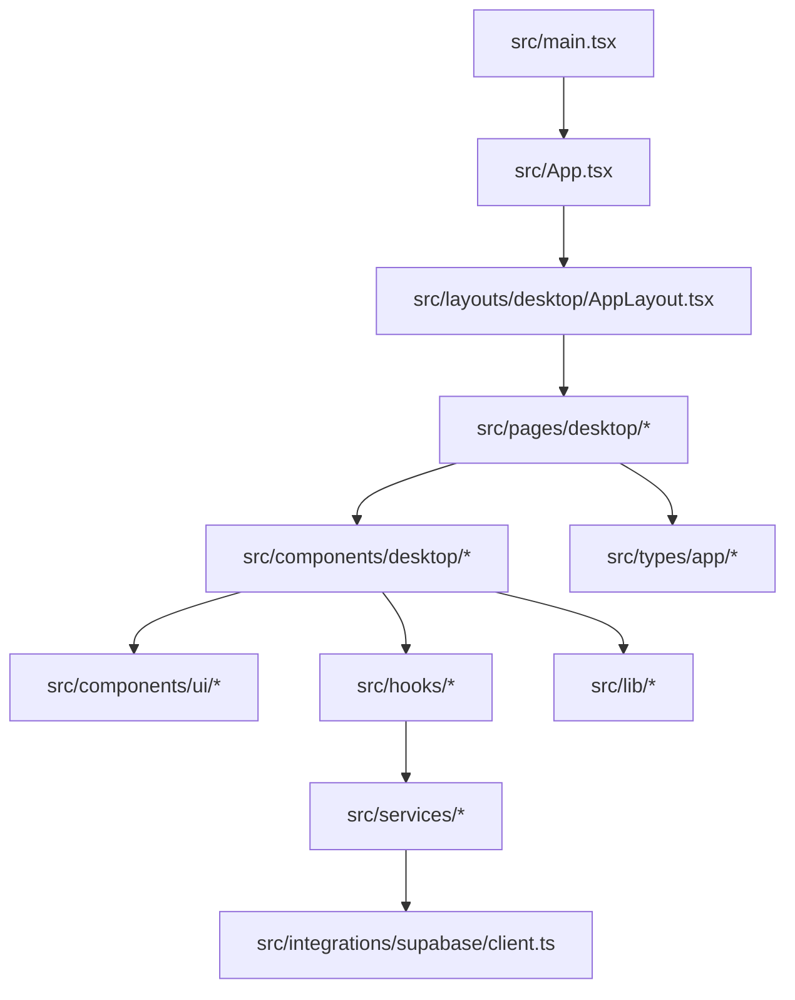
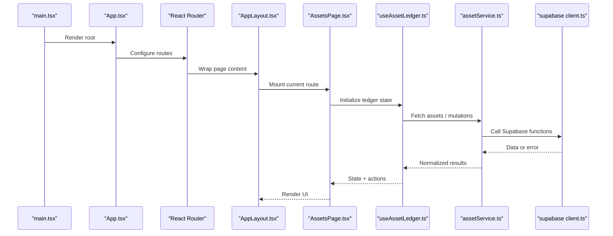
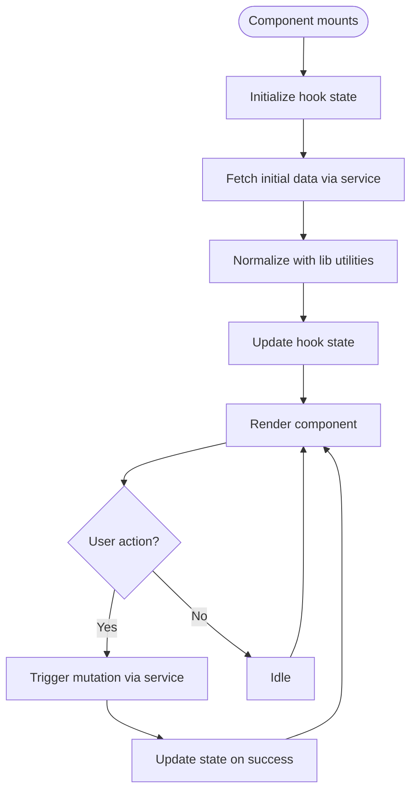
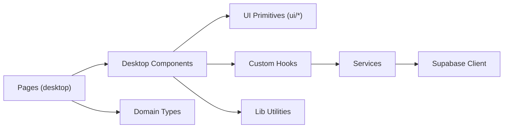

# Frontend Architecture

<cite>
**Referenced Files in This Document**
- [main.tsx](file://src/main.tsx)
- [App.tsx](file://src/App.tsx)
- [index.css](file://src/index.css)
- [tailwind.config.js](file://tailwind.config.js)
- [components.json](file://components.json)
- [vite.config.ts](file://vite.config.ts)
- [AppLayout.tsx](file://src/layouts/desktop/AppLayout.tsx)
- [AssetsPage.tsx](file://src/pages/desktop/AssetsPage.tsx)
- [DashboardPage.tsx](file://src/pages/desktop/DashboardPage.tsx)
- [ImportPage.tsx](file://src/pages/desktop/ImportPage.tsx)
- [ChatPage.tsx](file://src/pages/desktop/ChatPage.tsx)
- [StressTestPage.tsx](file://src/pages/desktop/StressTestPage.tsx)
- [XRayPage.tsx](file://src/pages/desktop/XRayPage.tsx)
- [LandingPage.tsx](file://src/pages/desktop/LandingPage.tsx)
- [SharedReportPage.tsx](file://src/pages/desktop/SharedReportPage.tsx)
- [NotFound.tsx](file://src/pages/NotFound.tsx)
- [useAssetLedger.ts](file://src/hooks/useAssetLedger.ts)
- [useImportFlow.ts](file://src/hooks/useImportFlow.ts)
- [useAuthGuard.ts](file://src/hooks/useAuthGuard.ts)
- [useChat.ts](file://src/hooks/useChat.ts)
- [useFxRates.ts](file://src/hooks/useFxRates.ts)
- [useProfile.ts](file://src/hooks/useProfile.ts)
- [useRealtimeAssets.ts](file://src/hooks/useRealtimeAssets.ts)
- [useShareReports.ts](file://src/hooks/useShareReports.ts)
- [useStress.ts](file://src/hooks/useStress.ts)
- [useXray.ts](file://src/hooks/useXray.ts)
- [CsvImportFlow.tsx](file://src/components/desktop/import/CsvImportFlow.tsx)
- [OcrImportFlow.tsx](file://src/components/desktop/import/OcrImportFlow.tsx)
- [ManualAssetForm.tsx](file://src/components/desktop/import/ManualAssetForm.tsx)
- [ParsedAssetsReview.tsx](file://src/components/desktop/import/ParsedAssetsReview.tsx)
- [DemoLoader.tsx](file://src/components/desktop/import/DemoLoader.tsx)
- [AssetFilters.tsx](file://src/components/desktop/AssetFilters.tsx)
- [AuthGate.tsx](file://src/components/desktop/AuthGate.tsx)
- [BatchEditDialog.tsx](file://src/components/desktop/BatchEditDialog.tsx)
- [BatchToolbar.tsx](file://src/components/desktop/BatchToolbar.tsx)
- [DiagnosticHeader.tsx](file://src/components/desktop/DiagnosticHeader.tsx)
- [MetricCard.tsx](file://src/components/desktop/MetricCard.tsx)
- [MonthlyExpenseDialog.tsx](file://src/components/desktop/MonthlyExpenseDialog.tsx)
- [ShareReportPanel.tsx](file://src/components/desktop/ShareReportPanel.tsx)
- [button.tsx](file://src/components/ui/button.tsx)
- [card.tsx](file://src/components/ui/card.tsx)
- [dialog.tsx](file://src/components/ui/dialog.tsx)
- [table.tsx](file://src/components/ui/table.tsx)
- [form.tsx](file://src/components/ui/form.tsx)
- [input.tsx](file://src/components/ui/input.tsx)
- [label.tsx](file://src/components/ui/label.tsx)
- [select.tsx](file://src/components/ui/select.tsx)
- [tabs.tsx](file://src/components/ui/tabs.tsx)
- [tooltip.tsx](file://src/components/ui/tooltip.tsx)
- [accordion.tsx](file://src/components/ui/accordion.tsx)
- [badge.tsx](file://src/components/ui/badge.tsx)
- [avatar.tsx](file://src/components/ui/avatar.tsx)
- [progress.tsx](file://src/components/ui/progress.tsx)
- [switch.tsx](file://src/components/ui/switch.tsx)
- [checkbox.tsx](file://src/components/ui/checkbox.tsx)
- [radio-group.tsx](file://src/components/ui/radio-group.tsx)
- [slider.tsx](file://src/components/ui/slider.tsx)
- [textarea.tsx](file://src/components/ui/textarea.tsx)
- [pagination.tsx](file://src/components/ui/pagination.tsx)
- [separator.tsx](file://src/components/ui/separator.tsx)
- [scroll-area.tsx](file://src/components/ui/scroll-area.tsx)
- [drawer.tsx](file://src/components/ui/drawer.tsx)
- [sheet.tsx](file://src/components/ui/sheet.tsx)
- [popover.tsx](file://src/components/ui/popover.tsx)
- [dropdown-menu.tsx](file://src/components/ui/dropdown-menu.tsx)
- [menubar.tsx](file://src/components/ui/menubar.tsx)
- [navigation-menu.tsx](file://src/components/ui/navigation-menu.tsx)
- [context-menu.tsx](file://src/components/ui/context-menu.tsx)
- [hover-card.tsx](file://src/components/ui/hover-card.tsx)
- [breadcrumb.tsx](file://src/components/ui/breadcrumb.tsx)
- [calendar.tsx](file://src/components/ui/calendar.tsx)
- [date-picker.tsx](file://src/components/ui/date-picker.tsx)
- [aspect-ratio.tsx](file://src/components/ui/aspect-ratio.tsx)
- [resizable.tsx](file://src/components/ui/resizable.tsx)
- [toggle.tsx](file://src/components/ui/toggle.tsx)
- [toggle-group.tsx](file://src/components/ui/toggle-group.tsx)
- [command.tsx](file://src/components/ui/command.tsx)
- [sonner.tsx](file://src/components/ui/sonner.tsx)
- [skeleton.tsx](file://src/components/ui/skeleton.tsx)
- [svg-icon.tsx](file://src/components/ui/svg/svg-icon.tsx)
- [svg-icon-resources.tsx](file://src/components/ui/svg/svg-icon-resources.tsx)
- [ScrollToHashElement.tsx](file://src/components/ScrollToHashElement.tsx)
- [assetService.ts](file://src/services/assetService.ts)
- [authService.ts](file://src/services/authService.ts)
- [chatService.ts](file://src/services/chatService.ts)
- [fxService.ts](file://src/services/fxService.ts)
- [importService.ts](file://src/services/importService.ts)
- [profileService.ts](file://src/services/profileService.ts)
- [reportService.ts](file://src/services/reportService.ts)
- [stressService.ts](file://src/services/stressService.ts)
- [xrayService.ts](file://src/services/xrayService.ts)
- [client.ts](file://src/integrations/supabase/client.ts)
- [types.ts](file://src/integrations/supabase/types.ts)
- [asset-format.ts](file://src/lib/asset-format.ts)
- [currency.ts](file://src/lib/currency.ts)
- [utils.ts](file://src/lib/utils.ts)
- [analytics.ts](file://src/types/app/analytics.ts)
- [asset.ts](file://src/types/app/asset.ts)
</cite>

## Table of Contents
1. [Introduction](#introduction)
2. [Project Structure](#project-structure)
3. [Core Components](#core-components)
4. [Architecture Overview](#architecture-overview)
5. [Detailed Component Analysis](#detailed-component-analysis)
6. [Dependency Analysis](#dependency-analysis)
7. [Performance Considerations](#performance-considerations)
8. [Troubleshooting Guide](#troubleshooting-guide)
9. [Conclusion](#conclusion)
10. [Appendices](#appendices)

## Introduction
This document describes the FinSight frontend architecture with a focus on React component composition, custom UI primitives built on shadcn/ui, hook-centric state management, routing and layout patterns, styling with Tailwind CSS, and performance strategies. It provides guidance for creating new components and hooks following established patterns and explains how business logic is separated from presentation.

## Project Structure
FinSight follows a feature-oriented structure:
- src/components/ui: Low-level UI primitives (shadcn/ui-based), icons, and shared utilities
- src/components/desktop: Feature-specific desktop components
- src/hooks: Custom hooks encapsulating stateful logic and side effects
- src/pages/desktop: Route-level pages composed from components
- src/layouts/desktop: Layout wrappers like AppLayout
- src/services: API clients and service functions
- src/integrations/supabase: Supabase client and types
- src/lib: Shared formatting, currency helpers, and utility functions
- src/types/app: Domain types used across features

**Diagram sources**
- [main.tsx](file://src/main.tsx)
- [App.tsx](file://src/App.tsx)
- [AppLayout.tsx](file://src/layouts/desktop/AppLayout.tsx)
- [AssetsPage.tsx](file://src/pages/desktop/AssetsPage.tsx)
- [DashboardPage.tsx](file://src/pages/desktop/DashboardPage.tsx)
- [ImportPage.tsx](file://src/pages/desktop/ImportPage.tsx)
- [ChatPage.tsx](file://src/pages/desktop/ChatPage.tsx)
- [StressTestPage.tsx](file://src/pages/desktop/StressTestPage.tsx)
- [XRayPage.tsx](file://src/pages/desktop/XRayPage.tsx)
- [LandingPage.tsx](file://src/pages/desktop/LandingPage.tsx)
- [SharedReportPage.tsx](file://src/pages/desktop/SharedReportPage.tsx)
- [NotFound.tsx](file://src/pages/NotFound.tsx)
- [useAssetLedger.ts](file://src/hooks/useAssetLedger.ts)
- [useImportFlow.ts](file://src/hooks/useImportFlow.ts)
- [assetService.ts](file://src/services/assetService.ts)
- [client.ts](file://src/integrations/supabase/client.ts)
- [asset-format.ts](file://src/lib/asset-format.ts)
- [currency.ts](file://src/lib/currency.ts)
- [utils.ts](file://src/lib/utils.ts)
- [asset.ts](file://src/types/app/asset.ts)
- [analytics.ts](file://src/types/app/analytics.ts)

**Section sources**
- [main.tsx](file://src/main.tsx)
- [App.tsx](file://src/App.tsx)
- [AppLayout.tsx](file://src/layouts/desktop/AppLayout.tsx)
- [AssetsPage.tsx](file://src/pages/desktop/AssetsPage.tsx)
- [DashboardPage.tsx](file://src/pages/desktop/DashboardPage.tsx)
- [ImportPage.tsx](file://src/pages/desktop/ImportPage.tsx)
- [ChatPage.tsx](file://src/pages/desktop/ChatPage.tsx)
- [StressTestPage.tsx](file://src/pages/desktop/StressTestPage.tsx)
- [XRayPage.tsx](file://src/pages/desktop/XRayPage.tsx)
- [LandingPage.tsx](file://src/pages/desktop/LandingPage.tsx)
- [SharedReportPage.tsx](file://src/pages/desktop/SharedReportPage.tsx)
- [NotFound.tsx](file://src/pages/NotFound.tsx)
- [useAssetLedger.ts](file://src/hooks/useAssetLedger.ts)
- [useImportFlow.ts](file://src/hooks/useImportFlow.ts)
- [assetService.ts](file://src/services/assetService.ts)
- [client.ts](file://src/integrations/supabase/client.ts)
- [asset-format.ts](file://src/lib/asset-format.ts)
- [currency.ts](file://src/lib/currency.ts)
- [utils.ts](file://src/lib/utils.ts)
- [asset.ts](file://src/types/app/asset.ts)
- [analytics.ts](file://src/types/app/analytics.ts)

## Core Components
FinSight uses a layered component model:
- Presentation components (pages and feature components) compose UI primitives
- UI primitives are shadcn/ui-based and styled with Tailwind CSS
- Business logic is extracted into custom hooks that coordinate services and state
- Services abstract network calls and data transformations
- Shared libraries provide formatting, currency handling, and common utilities

Key responsibilities:
- src/components/ui: Reusable primitives (Button, Card, Dialog, Table, Form, Input, Label, Select, Tabs, Tooltip, etc.)
- src/components/desktop: Feature-specific components (e.g., import flows, asset filters, dialogs)
- src/hooks: Stateful logic and side effects (e.g., useAssetLedger, useImportFlow)
- src/services: Data access layer over Supabase and backend functions
- src/lib: Formatting and helper utilities
- src/types/app: Domain models and shared types

**Section sources**
- [button.tsx](file://src/components/ui/button.tsx)
- [card.tsx](file://src/components/ui/card.tsx)
- [dialog.tsx](file://src/components/ui/dialog.tsx)
- [table.tsx](file://src/components/ui/table.tsx)
- [form.tsx](file://src/components/ui/form.tsx)
- [input.tsx](file://src/components/ui/input.tsx)
- [label.tsx](file://src/components/ui/label.tsx)
- [select.tsx](file://src/components/ui/select.tsx)
- [tabs.tsx](file://src/components/ui/tabs.tsx)
- [tooltip.tsx](file://src/components/ui/tooltip.tsx)
- [accordion.tsx](file://src/components/ui/accordion.tsx)
- [badge.tsx](file://src/components/ui/badge.tsx)
- [avatar.tsx](file://src/components/ui/avatar.tsx)
- [progress.tsx](file://src/components/ui/progress.tsx)
- [switch.tsx](file://src/components/ui/switch.tsx)
- [checkbox.tsx](file://src/components/ui/checkbox.tsx)
- [radio-group.tsx](file://src/components/ui/radio-group.tsx)
- [slider.tsx](file://src/components/ui/slider.tsx)
- [textarea.tsx](file://src/components/ui/textarea.tsx)
- [pagination.tsx](file://src/components/ui/pagination.tsx)
- [separator.tsx](file://src/components/ui/separator.tsx)
- [scroll-area.tsx](file://src/components/ui/scroll-area.tsx)
- [drawer.tsx](file://src/components/ui/drawer.tsx)
- [sheet.tsx](file://src/components/ui/sheet.tsx)
- [popover.tsx](file://src/components/ui/popover.tsx)
- [dropdown-menu.tsx](file://src/components/ui/dropdown-menu.tsx)
- [menubar.tsx](file://src/components/ui/menubar.tsx)
- [navigation-menu.tsx](file://src/components/ui/navigation-menu.tsx)
- [context-menu.tsx](file://src/components/ui/context-menu.tsx)
- [hover-card.tsx](file://src/components/ui/hover-card.tsx)
- [breadcrumb.tsx](file://src/components/ui/breadcrumb.tsx)
- [calendar.tsx](file://src/components/ui/calendar.tsx)
- [date-picker.tsx](file://src/components/ui/date-picker.tsx)
- [aspect-ratio.tsx](file://src/components/ui/aspect-ratio.tsx)
- [resizable.tsx](file://src/components/ui/resizable.tsx)
- [toggle.tsx](file://src/components/ui/toggle.tsx)
- [toggle-group.tsx](file://src/components/ui/toggle-group.tsx)
- [command.tsx](file://src/components/ui/command.tsx)
- [sonner.tsx](file://src/components/ui/sonner.tsx)
- [skeleton.tsx](file://src/components/ui/skeleton.tsx)
- [svg-icon.tsx](file://src/components/ui/svg/svg-icon.tsx)
- [svg-icon-resources.tsx](file://src/components/ui/svg/svg-icon-resources.tsx)
- [AssetFilters.tsx](file://src/components/desktop/AssetFilters.tsx)
- [AuthGate.tsx](file://src/components/desktop/AuthGate.tsx)
- [BatchEditDialog.tsx](file://src/components/desktop/BatchEditDialog.tsx)
- [BatchToolbar.tsx](file://src/components/desktop/BatchToolbar.tsx)
- [DiagnosticHeader.tsx](file://src/components/desktop/DiagnosticHeader.tsx)
- [MetricCard.tsx](file://src/components/desktop/MetricCard.tsx)
- [MonthlyExpenseDialog.tsx](file://src/components/desktop/MonthlyExpenseDialog.tsx)
- [ShareReportPanel.tsx](file://src/components/desktop/ShareReportPanel.tsx)
- [CsvImportFlow.tsx](file://src/components/desktop/import/CsvImportFlow.tsx)
- [OcrImportFlow.tsx](file://src/components/desktop/import/OcrImportFlow.tsx)
- [ManualAssetForm.tsx](file://src/components/desktop/import/ManualAssetForm.tsx)
- [ParsedAssetsReview.tsx](file://src/components/desktop/import/ParsedAssetsReview.tsx)
- [DemoLoader.tsx](file://src/components/desktop/import/DemoLoader.tsx)
- [useAssetLedger.ts](file://src/hooks/useAssetLedger.ts)
- [useImportFlow.ts](file://src/hooks/useImportFlow.ts)
- [assetService.ts](file://src/services/assetService.ts)
- [asset-format.ts](file://src/lib/asset-format.ts)
- [currency.ts](file://src/lib/currency.ts)
- [utils.ts](file://src/lib/utils.ts)
- [asset.ts](file://src/types/app/asset.ts)
- [analytics.ts](file://src/types/app/analytics.ts)

## Architecture Overview
The application bootstraps via main.tsx, which renders App.tsx. App.tsx configures routing and wraps content with AppLayout.tsx. Pages under src/pages/desktop represent routes and compose feature components. Feature components rely on custom hooks to manage state and orchestrate services. Services call Supabase integrations and backend functions. Shared libraries handle formatting and domain logic.

**Diagram sources**
- [main.tsx](file://src/main.tsx)
- [App.tsx](file://src/App.tsx)
- [AppLayout.tsx](file://src/layouts/desktop/AppLayout.tsx)
- [AssetsPage.tsx](file://src/pages/desktop/AssetsPage.tsx)
- [useAssetLedger.ts](file://src/hooks/useAssetLedger.ts)
- [assetService.ts](file://src/services/assetService.ts)
- [client.ts](file://src/integrations/supabase/client.ts)

## Detailed Component Analysis

### Routing and Layout
- App.tsx sets up React Router and defines top-level routes
- AppLayout.tsx provides consistent chrome (header, sidebar, content area) and applies global layout styles
- Pages under src/pages/desktop implement route handlers and compose feature components
- NotFound.tsx handles unmatched routes

Best practices:
- Keep pages thin; delegate data fetching and mutation to hooks
- Use layout props sparingly; prefer context or hooks for cross-cutting concerns
- Centralize route guards in dedicated components or hooks (e.g., AuthGate)

**Section sources**
- [App.tsx](file://src/App.tsx)
- [AppLayout.tsx](file://src/layouts/desktop/AppLayout.tsx)
- [AssetsPage.tsx](file://src/pages/desktop/AssetsPage.tsx)
- [DashboardPage.tsx](file://src/pages/desktop/DashboardPage.tsx)
- [ImportPage.tsx](file://src/pages/desktop/ImportPage.tsx)
- [ChatPage.tsx](file://src/pages/desktop/ChatPage.tsx)
- [StressTestPage.tsx](file://src/pages/desktop/StressTestPage.tsx)
- [XRayPage.tsx](file://src/pages/desktop/XRayPage.tsx)
- [LandingPage.tsx](file://src/pages/desktop/LandingPage.tsx)
- [SharedReportPage.tsx](file://src/pages/desktop/SharedReportPage.tsx)
- [NotFound.tsx](file://src/pages/NotFound.tsx)

### UI Primitive Library (shadcn/ui)
- Located in src/components/ui, these primitives are themeable and composable
- They leverage Tailwind CSS classes for styling and accessibility best practices
- Examples include Button, Card, Dialog, Table, Form, Input, Label, Select, Tabs, Tooltip, Accordion, Badge, Avatar, Progress, Switch, Checkbox, RadioGroup, Slider, Textarea, Pagination, Separator, ScrollArea, Drawer, Sheet, Popover, DropdownMenu, Menubar, NavigationMenu, ContextMenu, HoverCard, Breadcrumb, Calendar, DatePicker, AspectRatio, Resizable, Toggle, ToggleGroup, Command, Sonner, Skeleton, and SVG icon utilities

Guidelines:
- Prefer primitives over inline styles
- Compose primitives to build higher-level components
- Extend primitives when you need additional behavior while preserving base semantics

**Section sources**
- [button.tsx](file://src/components/ui/button.tsx)
- [card.tsx](file://src/components/ui/card.tsx)
- [dialog.tsx](file://src/components/ui/dialog.tsx)
- [table.tsx](file://src/components/ui/table.tsx)
- [form.tsx](file://src/components/ui/form.tsx)
- [input.tsx](file://src/components/ui/input.tsx)
- [label.tsx](file://src/components/ui/label.tsx)
- [select.tsx](file://src/components/ui/select.tsx)
- [tabs.tsx](file://src/components/ui/tabs.tsx)
- [tooltip.tsx](file://src/components/ui/tooltip.tsx)
- [accordion.tsx](file://src/components/ui/accordion.tsx)
- [badge.tsx](file://src/components/ui/badge.tsx)
- [avatar.tsx](file://src/components/ui/avatar.tsx)
- [progress.tsx](file://src/components/ui/progress.tsx)
- [switch.tsx](file://src/components/ui/switch.tsx)
- [checkbox.tsx](file://src/components/ui/checkbox.tsx)
- [radio-group.tsx](file://src/components/ui/radio-group.tsx)
- [slider.tsx](file://src/components/ui/slider.tsx)
- [textarea.tsx](file://src/components/ui/textarea.tsx)
- [pagination.tsx](file://src/components/ui/pagination.tsx)
- [separator.tsx](file://src/components/ui/separator.tsx)
- [scroll-area.tsx](file://src/components/ui/scroll-area.tsx)
- [drawer.tsx](file://src/components/ui/drawer.tsx)
- [sheet.tsx](file://src/components/ui/sheet.tsx)
- [popover.tsx](file://src/components/ui/popover.tsx)
- [dropdown-menu.tsx](file://src/components/ui/dropdown-menu.tsx)
- [menubar.tsx](file://src/components/ui/menubar.tsx)
- [navigation-menu.tsx](file://src/components/ui/navigation-menu.tsx)
- [context-menu.tsx](file://src/components/ui/context-menu.tsx)
- [hover-card.tsx](file://src/components/ui/hover-card.tsx)
- [breadcrumb.tsx](file://src/components/ui/breadcrumb.tsx)
- [calendar.tsx](file://src/components/ui/calendar.tsx)
- [date-picker.tsx](file://src/components/ui/date-picker.tsx)
- [aspect-ratio.tsx](file://src/components/ui/aspect-ratio.tsx)
- [resizable.tsx](file://src/components/ui/resizable.tsx)
- [toggle.tsx](file://src/components/ui/toggle.tsx)
- [toggle-group.tsx](file://src/components/ui/toggle-group.tsx)
- [command.tsx](file://src/components/ui/command.tsx)
- [sonner.tsx](file://src/components/ui/sonner.tsx)
- [skeleton.tsx](file://src/components/ui/skeleton.tsx)
- [svg-icon.tsx](file://src/components/ui/svg/svg-icon.tsx)
- [svg-icon-resources.tsx](file://src/components/ui/svg/svg-icon-resources.tsx)

### Desktop Feature Components
Feature components encapsulate domain-specific UI and orchestration:
- Import flows: CsvImportFlow, OcrImportFlow, ManualAssetForm, ParsedAssetsReview, DemoLoader
- Asset management: AssetFilters, BatchEditDialog, BatchToolbar, MetricCard, MonthlyExpenseDialog
- Reporting and analytics: ShareReportPanel, DiagnosticHeader
- Authentication gate: AuthGate

Composition pattern:
- Pages compose feature components
- Feature components consume hooks for state and side effects
- Hooks coordinate services and normalize data using lib utilities

**Section sources**
- [CsvImportFlow.tsx](file://src/components/desktop/import/CsvImportFlow.tsx)
- [OcrImportFlow.tsx](file://src/components/desktop/import/OcrImportFlow.tsx)
- [ManualAssetForm.tsx](file://src/components/desktop/import/ManualAssetForm.tsx)
- [ParsedAssetsReview.tsx](file://src/components/desktop/import/ParsedAssetsReview.tsx)
- [DemoLoader.tsx](file://src/components/desktop/import/DemoLoader.tsx)
- [AssetFilters.tsx](file://src/components/desktop/AssetFilters.tsx)
- [AuthGate.tsx](file://src/components/desktop/AuthGate.tsx)
- [BatchEditDialog.tsx](file://src/components/desktop/BatchEditDialog.tsx)
- [BatchToolbar.tsx](file://src/components/desktop/BatchToolbar.tsx)
- [DiagnosticHeader.tsx](file://src/components/desktop/DiagnosticHeader.tsx)
- [MetricCard.tsx](file://src/components/desktop/MetricCard.tsx)
- [MonthlyExpenseDialog.tsx](file://src/components/desktop/MonthlyExpenseDialog.tsx)
- [ShareReportPanel.tsx](file://src/components/desktop/ShareReportPanel.tsx)

### Hook-Centric State Management
Custom hooks centralize state and side effects:
- useAssetLedger: Manages asset collection state, filtering, and mutations; coordinates with assetService and formats via asset-format and currency
- useImportFlow: Orchestrates multi-step import workflows (CSV/OCR/manual), validation, review, and submission
- useAuthGuard: Guards routes based on authentication state
- useChat, useFxRates, useProfile, useRealtimeAssets, useShareReports, useStress, useXray: Domain-specific state and data fetching

Patterns:
- Encapsulate loading, error, and success states within hooks
- Expose stable APIs (getters/setters) to components
- Normalize and transform data using lib utilities before exposing to components
- Separate pure computations from side effects

**Diagram sources**
- [useAssetLedger.ts](file://src/hooks/useAssetLedger.ts)
- [useImportFlow.ts](file://src/hooks/useImportFlow.ts)
- [assetService.ts](file://src/services/assetService.ts)
- [asset-format.ts](file://src/lib/asset-format.ts)
- [currency.ts](file://src/lib/currency.ts)
- [utils.ts](file://src/lib/utils.ts)

**Section sources**
- [useAssetLedger.ts](file://src/hooks/useAssetLedger.ts)
- [useImportFlow.ts](file://src/hooks/useImportFlow.ts)
- [useAuthGuard.ts](file://src/hooks/useAuthGuard.ts)
- [useChat.ts](file://src/hooks/useChat.ts)
- [useFxRates.ts](file://src/hooks/useFxRates.ts)
- [useProfile.ts](file://src/hooks/useProfile.ts)
- [useRealtimeAssets.ts](file://src/hooks/useRealtimeAssets.ts)
- [useShareReports.ts](file://src/hooks/useShareReports.ts)
- [useStress.ts](file://src/hooks/useStress.ts)
- [useXray.ts](file://src/hooks/useXray.ts)
- [assetService.ts](file://src/services/assetService.ts)
- [asset-format.ts](file://src/lib/asset-format.ts)
- [currency.ts](file://src/lib/currency.ts)
- [utils.ts](file://src/lib/utils.ts)

### Services and Integrations
Services abstract external interactions:
- assetService, authService, chatService, fxService, importService, profileService, reportService, stressService, xrayService
- Supabase integration via client.ts and typed responses in types.ts

Responsibilities:
- Make HTTP/RPC calls to Supabase functions
- Handle errors and retries where appropriate
- Normalize payloads and map to domain types

**Section sources**
- [assetService.ts](file://src/services/assetService.ts)
- [authService.ts](file://src/services/authService.ts)
- [chatService.ts](file://src/services/chatService.ts)
- [fxService.ts](file://src/services/fxService.ts)
- [importService.ts](file://src/services/importService.ts)
- [profileService.ts](file://src/services/profileService.ts)
- [reportService.ts](file://src/services/reportService.ts)
- [stressService.ts](file://src/services/stressService.ts)
- [xrayService.ts](file://src/services/xrayService.ts)
- [client.ts](file://src/integrations/supabase/client.ts)
- [types.ts](file://src/integrations/supabase/types.ts)

### Styling System
- Tailwind CSS configured via tailwind.config.js
- Global styles in index.css
- shadcn/ui primitives themed through Tailwind tokens
- Consistent spacing, typography, and color scales enforced by configuration

**Section sources**
- [tailwind.config.js](file://tailwind.config.js)
- [index.css](file://src/index.css)
- [components.json](file://components.json)

## Dependency Analysis
High-level dependency relationships:
- Pages depend on feature components and hooks
- Feature components depend on UI primitives and hooks
- Hooks depend on services and lib utilities
- Services depend on Supabase client and types

**Diagram sources**
- [AssetsPage.tsx](file://src/pages/desktop/AssetsPage.tsx)
- [DashboardPage.tsx](file://src/pages/desktop/DashboardPage.tsx)
- [ImportPage.tsx](file://src/pages/desktop/ImportPage.tsx)
- [ChatPage.tsx](file://src/pages/desktop/ChatPage.tsx)
- [StressTestPage.tsx](file://src/pages/desktop/StressTestPage.tsx)
- [XRayPage.tsx](file://src/pages/desktop/XRayPage.tsx)
- [LandingPage.tsx](file://src/pages/desktop/LandingPage.tsx)
- [SharedReportPage.tsx](file://src/pages/desktop/SharedReportPage.tsx)
- [AssetFilters.tsx](file://src/components/desktop/AssetFilters.tsx)
- [CsvImportFlow.tsx](file://src/components/desktop/import/CsvImportFlow.tsx)
- [OcrImportFlow.tsx](file://src/components/desktop/import/OcrImportFlow.tsx)
- [ManualAssetForm.tsx](file://src/components/desktop/import/ManualAssetForm.tsx)
- [ParsedAssetsReview.tsx](file://src/components/desktop/import/ParsedAssetsReview.tsx)
- [DemoLoader.tsx](file://src/components/desktop/import/DemoLoader.tsx)
- [useAssetLedger.ts](file://src/hooks/useAssetLedger.ts)
- [useImportFlow.ts](file://src/hooks/useImportFlow.ts)
- [assetService.ts](file://src/services/assetService.ts)
- [client.ts](file://src/integrations/supabase/client.ts)
- [asset-format.ts](file://src/lib/asset-format.ts)
- [currency.ts](file://src/lib/currency.ts)
- [utils.ts](file://src/lib/utils.ts)
- [asset.ts](file://src/types/app/asset.ts)
- [analytics.ts](file://src/types/app/analytics.ts)

**Section sources**
- [AssetsPage.tsx](file://src/pages/desktop/AssetsPage.tsx)
- [DashboardPage.tsx](file://src/pages/desktop/DashboardPage.tsx)
- [ImportPage.tsx](file://src/pages/desktop/ImportPage.tsx)
- [ChatPage.tsx](file://src/pages/desktop/ChatPage.tsx)
- [StressTestPage.tsx](file://src/pages/desktop/StressTestPage.tsx)
- [XRayPage.tsx](file://src/pages/desktop/XRayPage.tsx)
- [LandingPage.tsx](file://src/pages/desktop/LandingPage.tsx)
- [SharedReportPage.tsx](file://src/pages/desktop/SharedReportPage.tsx)
- [AssetFilters.tsx](file://src/components/desktop/AssetFilters.tsx)
- [CsvImportFlow.tsx](file://src/components/desktop/import/CsvImportFlow.tsx)
- [OcrImportFlow.tsx](file://src/components/desktop/import/OcrImportFlow.tsx)
- [ManualAssetForm.tsx](file://src/components/desktop/import/ManualAssetForm.tsx)
- [ParsedAssetsReview.tsx](file://src/components/desktop/import/ParsedAssetsReview.tsx)
- [DemoLoader.tsx](file://src/components/desktop/import/DemoLoader.tsx)
- [useAssetLedger.ts](file://src/hooks/useAssetLedger.ts)
- [useImportFlow.ts](file://src/hooks/useImportFlow.ts)
- [assetService.ts](file://src/services/assetService.ts)
- [client.ts](file://src/integrations/supabase/client.ts)
- [asset-format.ts](file://src/lib/asset-format.ts)
- [currency.ts](file://src/lib/currency.ts)
- [utils.ts](file://src/lib/utils.ts)
- [asset.ts](file://src/types/app/asset.ts)
- [analytics.ts](file://src/types/app/analytics.ts)

## Performance Considerations
- Code splitting: Use dynamic imports for heavy pages or components to reduce initial bundle size
- Memoization: Apply memoization at component boundaries where expensive re-renders occur
- Virtualization: For large lists (e.g., assets table), consider virtual scrolling
- Data normalization: Keep normalized state in hooks to avoid redundant computations
- Debounce/throttle: For search inputs and frequent updates (e.g., filters)
- Image optimization: Lazy-load images and use appropriate formats
- Avoid unnecessary re-renders: Pass stable props and split contexts judiciously

[No sources needed since this section provides general guidance]

## Troubleshooting Guide
Common issues and strategies:
- Network errors: Ensure services surface meaningful errors and hooks expose error states for UI feedback
- Validation failures: Use form primitives and centralized validation in hooks
- Stale data: Implement refetch strategies and optimistic updates where safe
- Routing guards: Verify auth state and redirect logic in guards and hooks
- Styling conflicts: Check Tailwind class precedence and ensure consistent token usage

**Section sources**
- [useAuthGuard.ts](file://src/hooks/useAuthGuard.ts)
- [form.tsx](file://src/components/ui/form.tsx)
- [dialog.tsx](file://src/components/ui/dialog.tsx)
- [toast notifications via sonner.tsx](file://src/components/ui/sonner.tsx)

## Conclusion
FinSight’s frontend architecture emphasizes separation of concerns:
- Thin pages and feature components focused on composition
- Robust UI primitives for consistency and accessibility
- Hook-centric state management for clear data flow and testability
- Service-layer abstraction for reliable data access
- Tailwind-driven styling for maintainable design systems

Adhering to these patterns ensures scalability, readability, and performance.

[No sources needed since this section summarizes without analyzing specific files]

## Appendices

### Creating a New Component
- Place reusable UI in src/components/ui if it is generic; otherwise, add to src/components/desktop
- Compose from existing primitives and keep styling declarative with Tailwind
- Extract complex logic into a custom hook in src/hooks
- Reference domain types from src/types/app

**Section sources**
- [button.tsx](file://src/components/ui/button.tsx)
- [card.tsx](file://src/components/ui/card.tsx)
- [dialog.tsx](file://src/components/ui/dialog.tsx)
- [table.tsx](file://src/components/ui/table.tsx)
- [form.tsx](file://src/components/ui/form.tsx)
- [input.tsx](file://src/components/ui/input.tsx)
- [label.tsx](file://src/components/ui/label.tsx)
- [select.tsx](file://src/components/ui/select.tsx)
- [tabs.tsx](file://src/components/ui/tabs.tsx)
- [tooltip.tsx](file://src/components/ui/tooltip.tsx)
- [AssetFilters.tsx](file://src/components/desktop/AssetFilters.tsx)
- [CsvImportFlow.tsx](file://src/components/desktop/import/CsvImportFlow.tsx)
- [useAssetLedger.ts](file://src/hooks/useAssetLedger.ts)
- [asset.ts](file://src/types/app/asset.ts)

### Implementing a Custom Hook
- Define state and side effects in src/hooks
- Coordinate with services in src/services
- Normalize data with lib utilities
- Expose a stable API to components

**Section sources**
- [useAssetLedger.ts](file://src/hooks/useAssetLedger.ts)
- [useImportFlow.ts](file://src/hooks/useImportFlow.ts)
- [assetService.ts](file://src/services/assetService.ts)
- [asset-format.ts](file://src/lib/asset-format.ts)
- [currency.ts](file://src/lib/currency.ts)
- [utils.ts](file://src/lib/utils.ts)

### Maintaining Consistent Styling
- Use Tailwind tokens defined in tailwind.config.js
- Prefer primitives from src/components/ui for consistent look and feel
- Centralize global styles in index.css

**Section sources**
- [tailwind.config.js](file://tailwind.config.js)
- [index.css](file://src/index.css)
- [components.json](file://components.json)
- [button.tsx](file://src/components/ui/button.tsx)
- [card.tsx](file://src/components/ui/card.tsx)
- [dialog.tsx](file://src/components/ui/dialog.tsx)
- [table.tsx](file://src/components/ui/table.tsx)
- [form.tsx](file://src/components/ui/form.tsx)
- [input.tsx](file://src/components/ui/input.tsx)
- [label.tsx](file://src/components/ui/label.tsx)
- [select.tsx](file://src/components/ui/select.tsx)
- [tabs.tsx](file://src/components/ui/tabs.tsx)
- [tooltip.tsx](file://src/components/ui/tooltip.tsx)

### Routing and Layout Patterns
- Configure routes in App.tsx
- Wrap content with AppLayout.tsx for consistent chrome
- Create pages under src/pages/desktop and compose feature components

**Section sources**
- [App.tsx](file://src/App.tsx)
- [AppLayout.tsx](file://src/layouts/desktop/AppLayout.tsx)
- [AssetsPage.tsx](file://src/pages/desktop/AssetsPage.tsx)
- [DashboardPage.tsx](file://src/pages/desktop/DashboardPage.tsx)
- [ImportPage.tsx](file://src/pages/desktop/ImportPage.tsx)
- [ChatPage.tsx](file://src/pages/desktop/ChatPage.tsx)
- [StressTestPage.tsx](file://src/pages/desktop/StressTestPage.tsx)
- [XRayPage.tsx](file://src/pages/desktop/XRayPage.tsx)
- [LandingPage.tsx](file://src/pages/desktop/LandingPage.tsx)
- [SharedReportPage.tsx](file://src/pages/desktop/SharedReportPage.tsx)
- [NotFound.tsx](file://src/pages/NotFound.tsx)

### Build and Configuration Notes
- Vite configuration in vite.config.ts controls bundling and code-splitting
- Tailwind configuration in tailwind.config.js defines design tokens
- shadcn/ui setup referenced via components.json

**Section sources**
- [vite.config.ts](file://vite.config.ts)
- [tailwind.config.js](file://tailwind.config.js)
- [components.json](file://components.json)