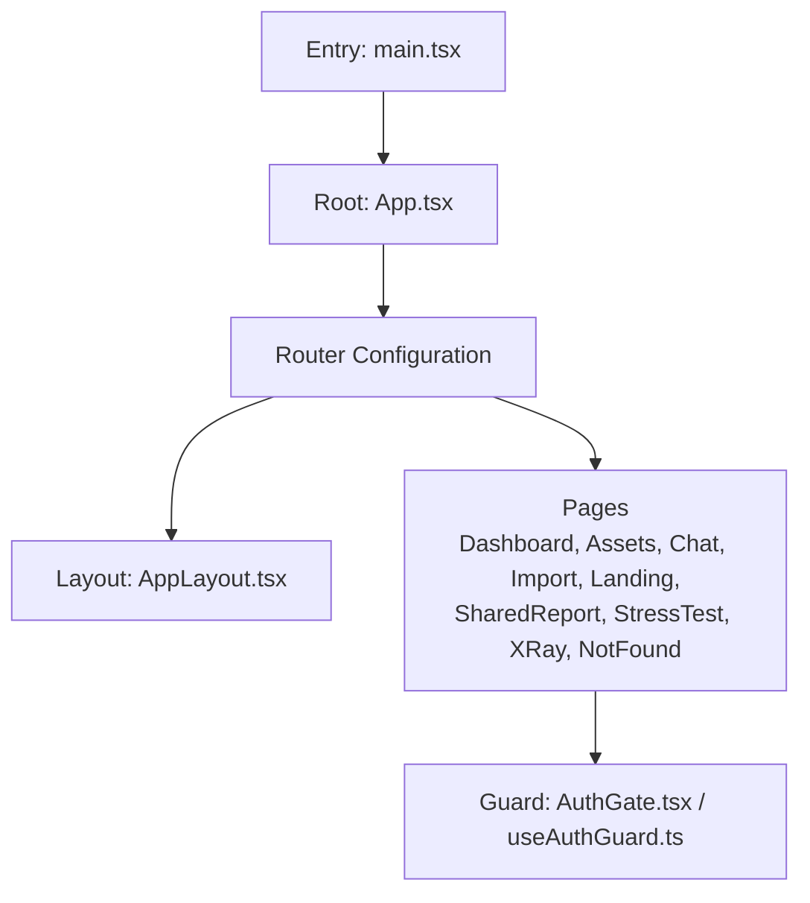
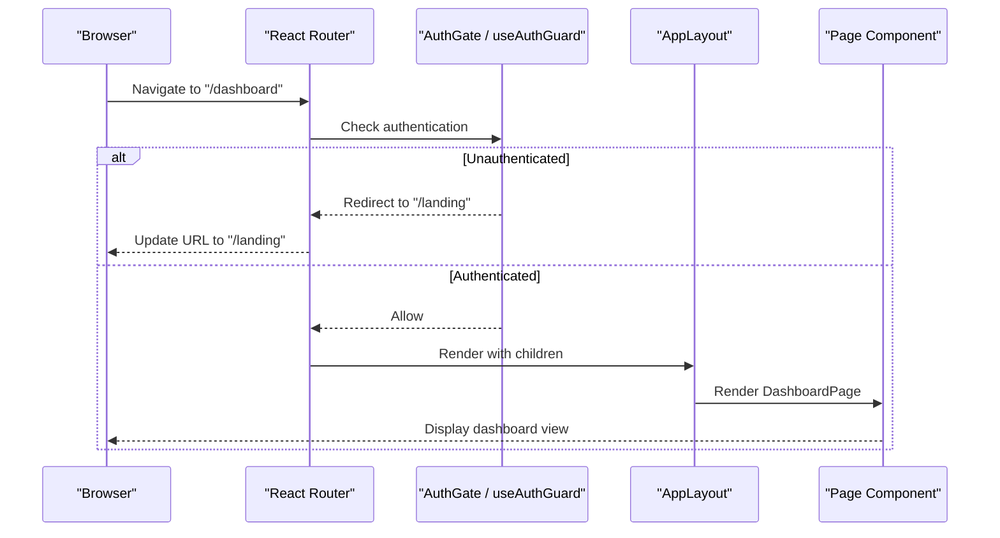
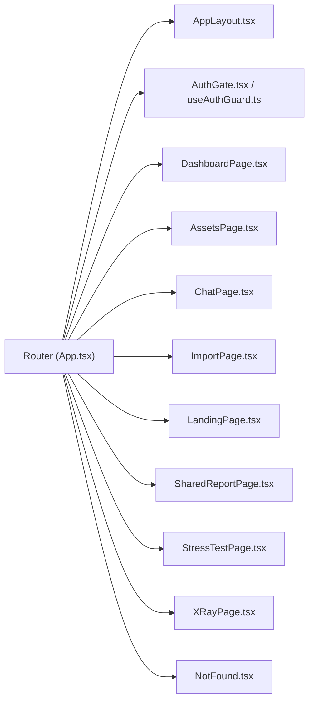

# Routing and Navigation

<cite>
**Referenced Files in This Document**
- [main.tsx](file://src/main.tsx)
- [App.tsx](file://src/App.tsx)
- [AppLayout.tsx](file://src/layouts/desktop/AppLayout.tsx)
- [AuthGate.tsx](file://src/components/desktop/AuthGate.tsx)
- [useAuthGuard.ts](file://src/hooks/useAuthGuard.ts)
- [DashboardPage.tsx](file://src/pages/desktop/DashboardPage.tsx)
- [AssetsPage.tsx](file://src/pages/desktop/AssetsPage.tsx)
- [ChatPage.tsx](file://src/pages/desktop/ChatPage.tsx)
- [ImportPage.tsx](file://src/pages/desktop/ImportPage.tsx)
- [LandingPage.tsx](file://src/pages/desktop/LandingPage.tsx)
- [SharedReportPage.tsx](file://src/pages/desktop/SharedReportPage.tsx)
- [StressTestPage.tsx](file://src/pages/desktop/StressTestPage.tsx)
- [XRayPage.tsx](file://src/pages/desktop/XRayPage.tsx)
- [NotFound.tsx](file://src/pages/NotFound.tsx)
</cite>

## Table of Contents
1. [Introduction](#introduction)
2. [Project Structure](#project-structure)
3. [Core Components](#core-components)
4. [Architecture Overview](#architecture-overview)
5. [Detailed Component Analysis](#detailed-component-analysis)
6. [Dependency Analysis](#dependency-analysis)
7. [Performance Considerations](#performance-considerations)
8. [Troubleshooting Guide](#troubleshooting-guide)
9. [Conclusion](#conclusion)
10. [Appendices](#appendices)

## Introduction
This document explains FinSight’s routing and navigation system, focusing on the React Router implementation, nested layouts with AppLayout, page-level organization, navigation patterns (programmatic navigation, route parameters, query strings), protected routes with authentication guards, deep linking support, and performance optimizations such as lazy loading and code splitting. It also provides practical guidance for adding new routes, composing layouts, handling guards, and managing navigation state.

## Project Structure
FinSight organizes routes around a small set of top-level pages under src/pages/desktop, each representing a distinct feature area. A shared desktop layout wraps authenticated sections via AppLayout. Authentication is enforced using an AuthGate component and a useAuthGuard hook. The application entry point initializes the router and root layout.

**Diagram sources**
- [main.tsx](file://src/main.tsx)
- [App.tsx](file://src/App.tsx)
- [AppLayout.tsx](file://src/layouts/desktop/AppLayout.tsx)
- [AuthGate.tsx](file://src/components/desktop/AuthGate.tsx)
- [useAuthGuard.ts](file://src/hooks/useAuthGuard.ts)
- [DashboardPage.tsx](file://src/pages/desktop/DashboardPage.tsx)
- [AssetsPage.tsx](file://src/pages/desktop/AssetsPage.tsx)
- [ChatPage.tsx](file://src/pages/desktop/ChatPage.tsx)
- [ImportPage.tsx](file://src/pages/desktop/ImportPage.tsx)
- [LandingPage.tsx](file://src/pages/desktop/LandingPage.tsx)
- [SharedReportPage.tsx](file://src/pages/desktop/SharedReportPage.tsx)
- [StressTestPage.tsx](file://src/pages/desktop/StressTestPage.tsx)
- [XRayPage.tsx](file://src/pages/desktop/XRayPage.tsx)
- [NotFound.tsx](file://src/pages/NotFound.tsx)

**Section sources**
- [main.tsx](file://src/main.tsx)
- [App.tsx](file://src/App.tsx)
- [AppLayout.tsx](file://src/layouts/desktop/AppLayout.tsx)
- [AuthGate.tsx](file://src/components/desktop/AuthGate.tsx)
- [useAuthGuard.ts](file://src/hooks/useAuthGuard.ts)
- [DashboardPage.tsx](file://src/pages/desktop/DashboardPage.tsx)
- [AssetsPage.tsx](file://src/pages/desktop/AssetsPage.tsx)
- [ChatPage.tsx](file://src/pages/desktop/ChatPage.tsx)
- [ImportPage.tsx](file://src/pages/desktop/ImportPage.tsx)
- [LandingPage.tsx](file://src/pages/desktop/LandingPage.tsx)
- [SharedReportPage.tsx](file://src/pages/desktop/SharedReportPage.tsx)
- [StressTestPage.tsx](file://src/pages/desktop/StressTestPage.tsx)
- [XRayPage.tsx](file://src/pages/desktop/XRayPage.tsx)
- [NotFound.tsx](file://src/pages/NotFound.tsx)

## Core Components
- Router initialization and root setup: The application bootstraps the router at the entry point and configures routes in the root component.
- Nested layout: AppLayout provides a consistent shell for authenticated views, including navigation chrome and content outlet.
- Authentication guard: AuthGate and useAuthGuard enforce access control by checking authentication state before rendering protected pages.
- Page components: Each feature has a dedicated page component under src/pages/desktop, which can be composed within AppLayout or used standalone for public routes.

Key responsibilities:
- Route configuration: Centralized mapping of URL paths to page components.
- Layout composition: Wrapping protected routes with AppLayout to share UI and behavior.
- Guarding: Redirecting unauthenticated users to login or landing when accessing protected routes.
- Deep linking: Supporting direct navigation via URLs with optional parameters and query strings.

**Section sources**
- [main.tsx](file://src/main.tsx)
- [App.tsx](file://src/App.tsx)
- [AppLayout.tsx](file://src/layouts/desktop/AppLayout.tsx)
- [AuthGate.tsx](file://src/components/desktop/AuthGate.tsx)
- [useAuthGuard.ts](file://src/hooks/useAuthGuard.ts)

## Architecture Overview
The routing architecture centers on a single router instance that maps paths to page components. Protected routes are wrapped with a layout and a guard, while public routes render directly. The following diagram shows how the router composes layouts and applies guards.

**Diagram sources**
- [App.tsx](file://src/App.tsx)
- [AppLayout.tsx](file://src/layouts/desktop/AppLayout.tsx)
- [AuthGate.tsx](file://src/components/desktop/AuthGate.tsx)
- [useAuthGuard.ts](file://src/hooks/useAuthGuard.ts)
- [DashboardPage.tsx](file://src/pages/desktop/DashboardPage.tsx)

## Detailed Component Analysis

### Router Configuration and Root Setup
- Entry point initializes the router and mounts the root component.
- Root component defines route definitions, grouping protected routes under a layout and applying guards.
- Public routes (e.g., landing) render without layout or guard.

Best practices:
- Keep route definitions centralized in the root component for clarity.
- Use nested routes to compose layouts and reuse common UI.
- Prefer lazy loading for heavy pages to improve initial load time.

**Section sources**
- [main.tsx](file://src/main.tsx)
- [App.tsx](file://src/App.tsx)

### Nested Layouts with AppLayout
- AppLayout provides a consistent shell for authenticated features, including navigation elements and a content outlet where page components render.
- Protected routes wrap their page components inside AppLayout to ensure uniform presentation and behavior.

Usage patterns:
- Wrap multiple related routes with AppLayout to share navigation and header/footer.
- Compose smaller sub-layouts within AppLayout if needed for specific sections.

**Section sources**
- [AppLayout.tsx](file://src/layouts/desktop/AppLayout.tsx)

### Authentication Guards
- AuthGate and useAuthGuard implement access control by evaluating authentication state and redirecting unauthorized users.
- Guards can be applied at the route level or component level depending on granularity needs.

Flow:
- On navigation to a protected route, the guard checks authentication.
- If not authenticated, redirect to a public route (e.g., landing).
- If authenticated, proceed to render the target page.

**Section sources**
- [AuthGate.tsx](file://src/components/desktop/AuthGate.tsx)
- [useAuthGuard.ts](file://src/hooks/useAuthGuard.ts)

### Page-Level Components
Each feature is represented by a page component under src/pages/desktop. These components focus on domain-specific logic and UI, relying on services and hooks for data and behavior.

- DashboardPage: Primary overview and metrics.
- AssetsPage: Asset management and listing.
- ChatPage: AI chat interface.
- ImportPage: Data import flows.
- LandingPage: Public landing experience.
- SharedReportPage: View shared reports.
- StressTestPage: Run stress tests.
- XRayPage: Advanced diagnostics.
- NotFound: Fallback for unmatched routes.

Navigation patterns:
- Programmatic navigation: Use router APIs to navigate between pages from event handlers or side effects.
- Route parameters: Pass identifiers via dynamic segments for resource-specific pages.
- Query strings: Encode filters, sorting, and pagination state for deep linking and sharing.

Deep linking:
- Ensure all important states are reflected in the URL (params and query) so links can be bookmarked and shared.

**Section sources**
- [DashboardPage.tsx](file://src/pages/desktop/DashboardPage.tsx)
- [AssetsPage.tsx](file://src/pages/desktop/AssetsPage.tsx)
- [ChatPage.tsx](file://src/pages/desktop/ChatPage.tsx)
- [ImportPage.tsx](file://src/pages/desktop/ImportPage.tsx)
- [LandingPage.tsx](file://src/pages/desktop/LandingPage.tsx)
- [SharedReportPage.tsx](file://src/pages/desktop/SharedReportPage.tsx)
- [StressTestPage.tsx](file://src/pages/desktop/StressTestPage.tsx)
- [XRayPage.tsx](file://src/pages/desktop/XRayPage.tsx)
- [NotFound.tsx](file://src/pages/NotFound.tsx)

### Adding New Routes
Steps:
1. Create a new page component under src/pages/desktop.
2. Add a route definition in the root component, choosing whether it should be public or protected.
3. If protected, wrap the route with AppLayout and apply the guard.
4. For deep linking, include route parameters and/or query strings as needed.
5. Optionally, lazy-load the page component to reduce bundle size.

Example references:
- See existing page components for structure and conventions.
- Review the root component for route configuration patterns.

**Section sources**
- [App.tsx](file://src/App.tsx)
- [DashboardPage.tsx](file://src/pages/desktop/DashboardPage.tsx)
- [AssetsPage.tsx](file://src/pages/desktop/AssetsPage.tsx)
- [ChatPage.tsx](file://src/pages/desktop/ChatPage.tsx)
- [ImportPage.tsx](file://src/pages/desktop/ImportPage.tsx)
- [LandingPage.tsx](file://src/pages/desktop/LandingPage.tsx)
- [SharedReportPage.tsx](file://src/pages/desktop/SharedReportPage.tsx)
- [StressTestPage.tsx](file://src/pages/desktop/StressTestPage.tsx)
- [XRayPage.tsx](file://src/pages/desktop/XRayPage.tsx)
- [NotFound.tsx](file://src/pages/NotFound.tsx)

### Implementing Layout Compositions
- Use AppLayout for authenticated sections to maintain consistent chrome and navigation.
- For specialized sections, create sub-layouts and nest them within AppLayout.
- Keep layout concerns separate from page logic to improve reusability.

**Section sources**
- [AppLayout.tsx](file://src/layouts/desktop/AppLayout.tsx)

### Handling Navigation Guards
- Apply guards at the route level for coarse-grained protection.
- Use component-level guards for fine-grained access control within a page.
- Ensure redirects are user-friendly and preserve intended destination when possible.

**Section sources**
- [AuthGate.tsx](file://src/components/desktop/AuthGate.tsx)
- [useAuthGuard.ts](file://src/hooks/useAuthGuard.ts)

### Managing Navigation State
- Persist critical navigation state in the URL (route params and query strings) to enable deep linking and browser history integration.
- Avoid storing large state in memory; prefer URL-driven state for shareable links.
- Debounce expensive operations triggered by navigation changes.

[No sources needed since this section provides general guidance]

## Dependency Analysis
The routing layer depends on layout and guard components, and each page component may depend on services and hooks for data fetching and business logic. The following diagram illustrates these relationships.

**Diagram sources**
- [App.tsx](file://src/App.tsx)
- [AppLayout.tsx](file://src/layouts/desktop/AppLayout.tsx)
- [AuthGate.tsx](file://src/components/desktop/AuthGate.tsx)
- [useAuthGuard.ts](file://src/hooks/useAuthGuard.ts)
- [DashboardPage.tsx](file://src/pages/desktop/DashboardPage.tsx)
- [AssetsPage.tsx](file://src/pages/desktop/AssetsPage.tsx)
- [ChatPage.tsx](file://src/pages/desktop/ChatPage.tsx)
- [ImportPage.tsx](file://src/pages/desktop/ImportPage.tsx)
- [LandingPage.tsx](file://src/pages/desktop/LandingPage.tsx)
- [SharedReportPage.tsx](file://src/pages/desktop/SharedReportPage.tsx)
- [StressTestPage.tsx](file://src/pages/desktop/StressTestPage.tsx)
- [XRayPage.tsx](file://src/pages/desktop/XRayPage.tsx)
- [NotFound.tsx](file://src/pages/NotFound.tsx)

**Section sources**
- [App.tsx](file://src/App.tsx)
- [AppLayout.tsx](file://src/layouts/desktop/AppLayout.tsx)
- [AuthGate.tsx](file://src/components/desktop/AuthGate.tsx)
- [useAuthGuard.ts](file://src/hooks/useAuthGuard.ts)
- [DashboardPage.tsx](file://src/pages/desktop/DashboardPage.tsx)
- [AssetsPage.tsx](file://src/pages/desktop/AssetsPage.tsx)
- [ChatPage.tsx](file://src/pages/desktop/ChatPage.tsx)
- [ImportPage.tsx](file://src/pages/desktop/ImportPage.tsx)
- [LandingPage.tsx](file://src/pages/desktop/LandingPage.tsx)
- [SharedReportPage.tsx](file://src/pages/desktop/SharedReportPage.tsx)
- [StressTestPage.tsx](file://src/pages/desktop/StressTestPage.tsx)
- [XRayPage.tsx](file://src/pages/desktop/XRayPage.tsx)
- [NotFound.tsx](file://src/pages/NotFound.tsx)

## Performance Considerations
- Lazy loading: Load heavy page components on demand using dynamic imports to reduce initial bundle size.
- Code splitting: Split routes into separate chunks so only the necessary code is downloaded for the current route.
- Prefetching: Preload likely next routes during idle time or on hover to improve perceived performance.
- Memoization: Memoize expensive computations within pages to avoid unnecessary re-renders on navigation.
- Route-level suspense: Show lightweight skeletons while lazy-loaded components resolve.

Implementation tips:
- Replace static imports of page components with dynamic imports in route definitions.
- Combine lazy loading with Suspense boundaries for graceful loading states.
- Monitor bundle sizes and split points to balance initial load vs. runtime overhead.

[No sources needed since this section provides general guidance]

## Troubleshooting Guide
Common issues and resolutions:
- Redirect loops: Ensure guards check authentication correctly and do not redirect back to the same guarded route. Verify redirect targets and conditions.
- Missing layouts: Confirm protected routes are wrapped with AppLayout and that nested routes render children properly.
- Deep link failures: Validate that route parameters and query strings are parsed and handled consistently across pages.
- Blank pages: Check for missing route definitions and ensure NotFound handles unmatched paths gracefully.
- Performance regressions: Identify heavy components loaded eagerly and switch to lazy loading.

Diagnostic steps:
- Inspect the active route and URL to confirm expected path and parameters.
- Log guard evaluations to understand redirect decisions.
- Use network tab to verify chunk loading and identify oversized bundles.

**Section sources**
- [AuthGate.tsx](file://src/components/desktop/AuthGate.tsx)
- [useAuthGuard.ts](file://src/hooks/useAuthGuard.ts)
- [NotFound.tsx](file://src/pages/NotFound.tsx)

## Conclusion
FinSight’s routing and navigation system leverages React Router with a clear separation of concerns: central route configuration, shared layout via AppLayout, and robust authentication guards. Pages are organized by feature, supporting programmatic navigation, route parameters, and query strings for deep linking. Adopting lazy loading and code splitting further optimizes performance. Following the guidelines in this document will help you add new routes, compose layouts, handle guards, and manage navigation state effectively.

## Appendices

### Quick Reference: Navigation Patterns
- Programmatic navigation: Use router APIs to navigate from event handlers or side effects.
- Route parameters: Include dynamic segments for resource-specific pages.
- Query strings: Encode filters and pagination for shareable links.
- Protected routes: Wrap with AppLayout and apply guards.
- Deep linking: Reflect important state in the URL.

[No sources needed since this section provides general guidance]