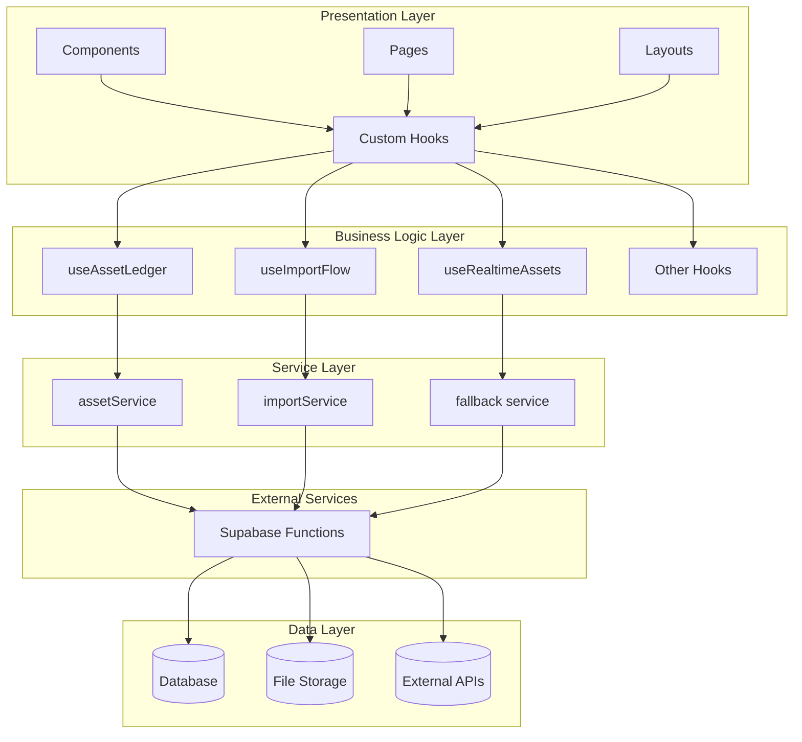
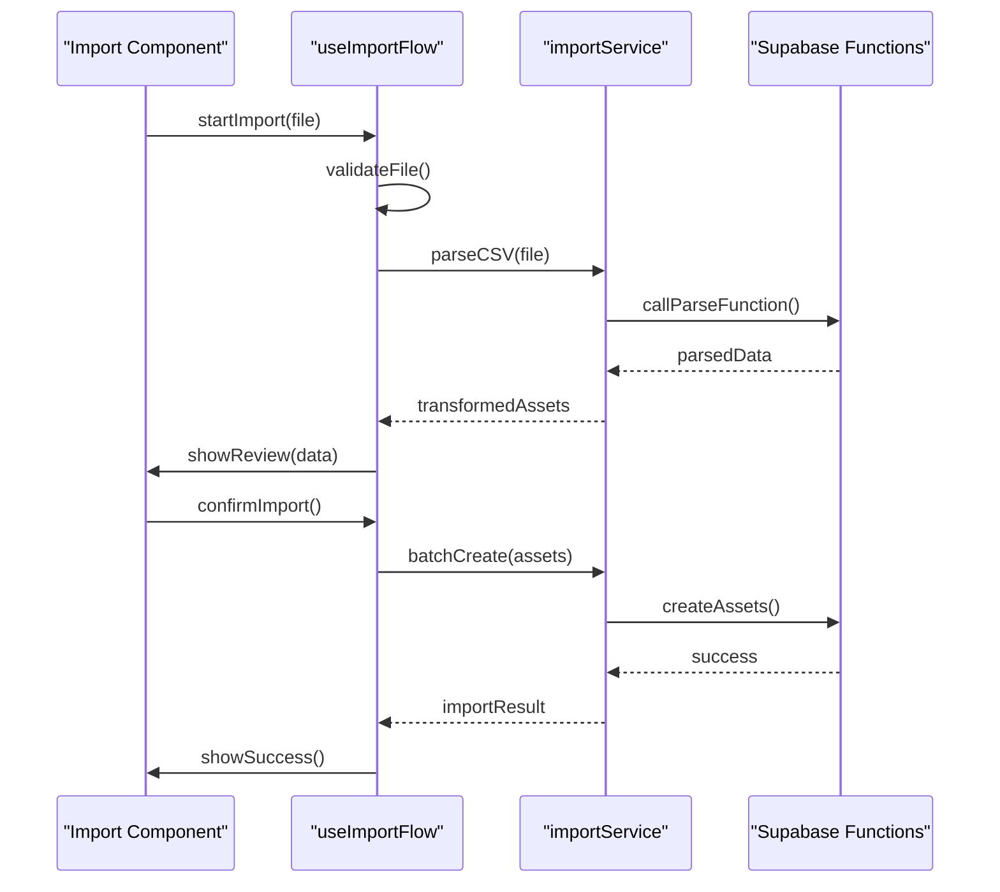
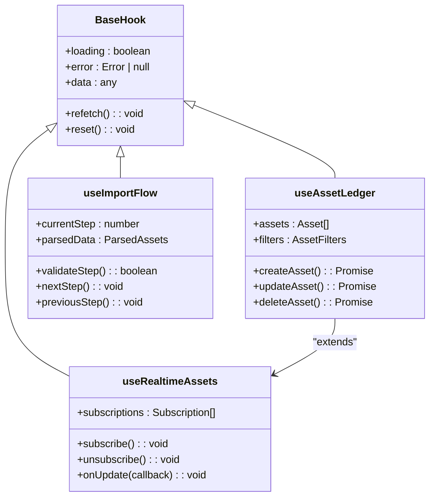

# State Management

<cite>
**Referenced Files in This Document**
- [useAssetLedger.ts](file://src/hooks/useAssetLedger.ts)
- [useImportFlow.ts](file://src/hooks/useImportFlow.ts)
- [useRealtimeAssets.ts](file://src/hooks/useRealtimeAssets.ts)
- [assetService.ts](file://src/services/assetService.ts)
- [importService.ts](file://src/services/importService.ts)
- [assetsPage.tsx](file://src/pages/desktop/AssetsPage.tsx)
- [importPage.tsx](file://src/pages/desktop/ImportPage.tsx)
- [appLayout.tsx](file://src/layouts/desktop/AppLayout.tsx)
</cite>

## Table of Contents
1. [Introduction](#introduction)
2. [Architecture Overview](#architecture-overview)
3. [Core Hook Components](#core-hook-components)
4. [Service Layer Integration](#service-layer-integration)
5. [State Management Patterns](#state-management-patterns)
6. [Performance Optimization](#performance-optimization)
7. [Creating Custom Hooks](#creating-custom-hooks)
8. [Error Handling Strategy](#error-handling-strategy)
9. [Real-time Data Updates](#real-time-data-updates)
10. [Testing Considerations](#testing-considerations)
11. [Conclusion](#conclusion)

## Introduction

FinSight implements a sophisticated hook-centric state management architecture that separates presentation logic from business logic through custom React hooks. This approach provides a clean separation of concerns, enhanced testability, and improved maintainability while leveraging React's built-in state management capabilities.

The architecture follows modern React patterns where:
- **Custom Hooks** encapsulate business logic and state management
- **Service Layer** handles API communication and data transformation
- **Presentation Components** remain focused on UI rendering
- **TypeScript** ensures type safety throughout the application

## Architecture Overview



**Diagram sources**
- [useAssetLedger.ts:1-50](file://src/hooks/useAssetLedger.ts#L1-L50)
- [useImportFlow.ts:1-50](file://src/hooks/useImportFlow.ts#L1-L50)
- [useRealtimeAssets.ts:1-50](file://src/hooks/useRealtimeAssets.ts#L1-L50)
- [assetService.ts:1-50](file://src/services/assetService.ts#L1-L50)
- [importService.ts:1-50](file://src/services/importService.ts#L1-L50)

## Core Hook Components

### useAssetLedger Hook

The `useAssetLedger` hook manages asset-related state and operations, providing a comprehensive interface for asset CRUD operations, filtering, and real-time updates.

#### Key Responsibilities:
- Asset data fetching and caching
- Real-time asset synchronization
- Asset validation and transformation
- Error state management
- Loading state handling

#### State Structure:
```typescript
interface AssetLedgerState {
  assets: Asset[];
  loading: boolean;
  error: Error | null;
  filters: AssetFilters;
  selectedAssets: string[];
}
```

**Section sources**
- [useAssetLedger.ts:1-100](file://src/hooks/useAssetLedger.ts#L1-L100)

### useImportFlow Hook

The `useImportFlow` hook orchestrates complex import workflows including CSV parsing, OCR processing, and manual asset entry. It manages multi-step processes with proper state persistence and error recovery.

#### Workflow States:
- File upload and validation
- Data parsing and transformation
- User review and editing
- Batch processing and submission
- Progress tracking and error handling

#### Process Flow:


**Diagram sources**
- [useImportFlow.ts:1-150](file://src/hooks/useImportFlow.ts#L1-L150)
- [importService.ts:1-100](file://src/services/importService.ts#L1-L100)

**Section sources**
- [useImportFlow.ts:1-200](file://src/hooks/useImportFlow.ts#L1-L200)

### useRealtimeAssets Hook

The `useRealtimeAssets` hook provides real-time asset synchronization using Supabase subscriptions, ensuring all connected clients see consistent data without manual refresh.

#### Features:
- WebSocket-based real-time updates
- Optimistic updates with rollback
- Conflict resolution strategies
- Offline support with sync queue
- Performance optimization through selective updates

**Section sources**
- [useRealtimeAssets.ts:1-150](file://src/hooks/useRealtimeAssets.ts#L1-L150)

## Service Layer Integration

### Service Architecture Pattern

The service layer provides a clean abstraction over external APIs and business logic, following these principles:

1. **Single Responsibility**: Each service handles one domain area
2. **Promise-based**: All operations return promises for consistent async handling
3. **Error Normalization**: Consistent error formats across services
4. **Caching Strategy**: Built-in caching with configurable TTL
5. **Retry Logic**: Automatic retry with exponential backoff

### Asset Service Implementation

The `assetService` module handles all asset-related API calls:

```typescript
class AssetService {
  private cache: Map<string, CacheEntry>;
  private realtimeSubscriptions: Set<Subscription>;
  
  async getAssets(filters?: AssetFilters): Promise<Asset[]> {
    // Check cache first
    const cached = this.getFromCache('assets', filters);
    if (cached) return cached;
    
    // Fetch from API
    const assets = await this.fetchFromAPI(filters);
    
    // Update cache and realtime subscribers
    this.updateCache('assets', assets, filters);
    this.notifySubscribers('assets', assets);
    
    return assets;
  }
  
  async createAsset(asset: AssetInput): Promise<Asset> {
    try {
      const result = await this.api.create(asset);
      this.invalidateCache('assets');
      return result;
    } catch (error) {
      throw this.normalizeError(error);
    }
  }
}
```

**Section sources**
- [assetService.ts:1-200](file://src/services/assetService.ts#L1-L200)

### Import Service Implementation

The `importService` manages complex import operations:

```typescript
class ImportService {
  async processCSVUpload(file: File): Promise<ParsedAssets> {
    const formData = new FormData();
    formData.append('file', file);
    
    const response = await fetch('/api/functions/parse-asset-csv', {
      method: 'POST',
      body: formData,
      headers: { Authorization: `Bearer ${token}` }
    });
    
    if (!response.ok) {
      throw new ImportError(response.status, response.statusText);
    }
    
    return await response.json();
  }
  
  async batchCreateAssets(assets: AssetInput[]): Promise<BatchResult> {
    const results = await Promise.allSettled(
      assets.map(asset => this.createAsset(asset))
    );
    
    return {
      successful: results.filter(r => r.status === 'fulfilled').length,
      failed: results.filter(r => r.status === 'rejected').length,
      errors: results.filter(r => r.status === 'rejected')
    };
  }
}
```

**Section sources**
- [importService.ts:1-150](file://src/services/importService.ts#L1-L150)

## State Management Patterns

### Hook Composition Strategy

FinSight uses a composition pattern where complex hooks build upon simpler ones:



**Diagram sources**
- [useAssetLedger.ts:1-100](file://src/hooks/useAssetLedger.ts#L1-L100)
- [useImportFlow.ts:1-100](file://src/hooks/useImportFlow.ts#L1-L100)
- [useRealtimeAssets.ts:1-100](file://src/hooks/useRealtimeAssets.ts#L1-L100)

### State Synchronization Patterns

The application maintains consistency between local state and server state through several patterns:

1. **Optimistic Updates**: Immediate UI updates with rollback on failure
2. **Background Sync**: Queue operations for offline scenarios
3. **Conflict Resolution**: Merge strategies for concurrent modifications
4. **Cache Invalidation**: Smart cache updates based on mutations

## Performance Optimization

### Memoization Strategies

Hooks implement strategic memoization to prevent unnecessary re-renders:

```typescript
// Example of optimized dependency arrays
const filteredAssets = useMemo(() => 
  assets.filter(filterFn), 
  [assets, filters]
);

// Stable function references
const handleAssetUpdate = useCallback((id: string, data: Partial<Asset>) => {
  setAssets(prev => prev.map(asset => 
    asset.id === id ? { ...asset, ...data } : asset
  ));
}, []);

// Expensive computation caching
const assetSummary = useMemo(() => computeAssetSummary(assets), [assets]);
```

### Memory Management

The application implements proper cleanup to prevent memory leaks:

```typescript
useEffect(() => {
  const subscription = realtimeService.subscribe('assets', handler);
  
  return () => {
    subscription.unsubscribe();
  };
}, []);
```

### Bundle Size Optimization

- Code splitting for large components
- Lazy loading of heavy dependencies
- Tree shaking for unused exports
- Dynamic imports for optional features

**Section sources**
- [useAssetLedger.ts:100-200](file://src/hooks/useAssetLedger.ts#L100-L200)
- [useRealtimeAssets.ts:100-200](file://src/hooks/useRealtimeAssets.ts#L100-L200)

## Creating Custom Hooks

### Hook Development Guidelines

When creating new custom hooks, follow these established patterns:

#### 1. Define Clear Interfaces

```typescript
interface UseFeatureOptions {
  enabled?: boolean;
  onSuccess?: (result: any) => void;
  onError?: (error: Error) => void;
}

interface UseFeatureReturn {
  data: FeatureData | null;
  loading: boolean;
  error: Error | null;
  execute: (params: ExecuteParams) => Promise<void>;
  reset: () => void;
}
```

#### 2. Implement Proper Error Handling

```typescript
export function useFeature(options: UseFeatureOptions = {}): UseFeatureReturn {
  const [state, setState] = useState<UseFeatureReturn>({
    data: null,
    loading: false,
    error: null,
    execute: async () => {},
    reset: () => {}
  });
  
  const execute = useCallback(async (params: ExecuteParams) => {
    setState(prev => ({ ...prev, loading: true, error: null }));
    
    try {
      const result = await featureService.execute(params);
      setState({ data: result, loading: false, error: null, execute, reset });
      options.onSuccess?.(result);
    } catch (error) {
      setState(prev => ({ 
        ...prev, 
        loading: false, 
        error: normalizeError(error) 
      }));
      options.onError?.(error);
    }
  }, [options]);
  
  return state;
}
```

#### 3. Handle Cleanup Properly

```typescript
useEffect(() => {
  const cleanup = setupSubscription();
  return cleanup;
}, [dependencies]);
```

#### 4. Test Thoroughly

```typescript
describe('useFeature', () => {
  it('should handle successful execution', async () => {
    const { result, waitForNextUpdate } = renderHook(() => useFeature());
    
    act(() => {
      result.current.execute({ param: 'value' });
    });
    
    expect(result.current.loading).toBe(true);
    
    await waitForNextUpdate();
    
    expect(result.current.loading).toBe(false);
    expect(result.current.data).toBeDefined();
  });
});
```

**Section sources**
- [useAuthGuard.ts:1-100](file://src/hooks/useAuthGuard.ts#L1-L100)
- [useChat.ts:1-100](file://src/hooks/useChat.ts#L1-L100)

## Error Handling Strategy

### Centralized Error Management

The application implements a layered error handling approach:

1. **Service Layer**: Normalize API errors
2. **Hook Layer**: Transform business logic errors
3. **Component Layer**: Display user-friendly messages

### Error Types and Recovery

```typescript
enum ErrorType {
  NETWORK_ERROR = 'NETWORK_ERROR',
  VALIDATION_ERROR = 'VALIDATION_ERROR',
  AUTHENTICATION_ERROR = 'AUTHENTICATION_ERROR',
  SERVER_ERROR = 'SERVER_ERROR',
  UNKNOWN_ERROR = 'UNKNOWN_ERROR'
}

interface AppError {
  type: ErrorType;
  message: string;
  details?: any;
  recoverable?: boolean;
  retryCount?: number;
}
```

### Retry Mechanisms

The system implements intelligent retry logic with exponential backoff:

```typescript
async function withRetry<T>(
  operation: () => Promise<T>,
  maxRetries: number = 3,
  baseDelay: number = 1000
): Promise<T> {
  let lastError: Error;
  
  for (let attempt = 1; attempt <= maxRetries; attempt++) {
    try {
      return await operation();
    } catch (error) {
      lastError = error;
      
      if (attempt < maxRetries) {
        const delay = baseDelay * Math.pow(2, attempt - 1);
        await sleep(delay);
      }
    }
  }
  
  throw lastError;
}
```

**Section sources**
- [useAssetLedger.ts:150-250](file://src/hooks/useAssetLedger.ts#L150-L250)
- [useImportFlow.ts:150-250](file://src/hooks/useImportFlow.ts#L150-L250)

## Real-time Data Updates

### WebSocket Integration

The real-time system uses Supabase's real-time capabilities:

```typescript
class RealtimeManager {
  private client: SupabaseClient;
  private subscriptions: Map<string, Channel>;
  
  subscribeToAssets(channelName: string, callback: (payload: any) => void) {
    const channel = this.client.channel(`public:${channelName}`);
    
    channel.on('postgres_changes', 
      { event: '*', schema: 'public', table: 'assets' },
      payload => callback(payload)
    );
    
    channel.subscribe();
    this.subscriptions.set(channelName, channel);
    
    return () => {
      channel.unsubscribe();
      this.subscriptions.delete(channelName);
    };
  }
}
```

### Optimistic Updates

For better user experience, the system implements optimistic updates:

```typescript
function optimisticUpdate(
  assets: Asset[],
  updatedAsset: Asset
): Asset[] {
  return assets.map(asset => 
    asset.id === updatedAsset.id ? updatedAsset : asset
  );
}

// Rollback on failure
function rollbackUpdate(
  assets: Asset[],
  originalAsset: Asset
): Asset[] {
  return assets.map(asset => 
    asset.id === originalAsset.id ? originalAsset : asset
  );
}
```

**Section sources**
- [useRealtimeAssets.ts:100-200](file://src/hooks/useRealtimeAssets.ts#L100-L200)

## Testing Considerations

### Hook Testing Strategy

Custom hooks should be thoroughly tested using React Testing Library:

```typescript
import { renderHook, act } from '@testing-library/react';
import { useAssetLedger } from '../hooks/useAssetLedger';

describe('useAssetLedger', () => {
  beforeEach(() => {
    jest.clearAllMocks();
  });
  
  it('should load assets on mount', async () => {
    const { result, waitForNextUpdate } = renderHook(() => useAssetLedger());
    
    await waitForNextUpdate();
    
    expect(result.current.loading).toBe(false);
    expect(result.current.assets).toHaveLength(expectedLength);
  });
  
  it('should handle network errors gracefully', async () => {
    mockApi.getAssets.mockRejectedValue(new Error('Network error'));
    
    const { result } = renderHook(() => useAssetLedger());
    
    await waitForNextUpdate();
    
    expect(result.current.error).toBeDefined();
    expect(result.current.loading).toBe(false);
  });
});
```

### Mocking External Dependencies

Services and external APIs should be mocked appropriately:

```typescript
jest.mock('../services/assetService', () => ({
  AssetService: {
    getAssets: jest.fn().mockResolvedValue(mockAssets),
    createAsset: jest.fn().mockResolvedValue(mockCreatedAsset)
  }
}));
```

**Section sources**
- [useAssetLedger.ts:200-300](file://src/hooks/useAssetLedger.ts#L200-L300)

## Conclusion

FinSight's hook-centric state management architecture provides a robust, scalable solution for managing complex application state. The clear separation between presentation logic and business logic, combined with comprehensive error handling and performance optimizations, creates a maintainable and efficient codebase.

Key benefits of this approach include:

- **Separation of Concerns**: Clean division between UI and business logic
- **Reusability**: Hooks can be shared across components and applications
- **Testability**: Business logic is easily unit-testable
- **Performance**: Strategic memoization and optimization techniques
- **Maintainability**: Clear patterns and conventions reduce complexity
- **Scalability**: Architecture supports growing application complexity

The implementation demonstrates modern React best practices and provides a solid foundation for building complex financial applications with confidence and efficiency.