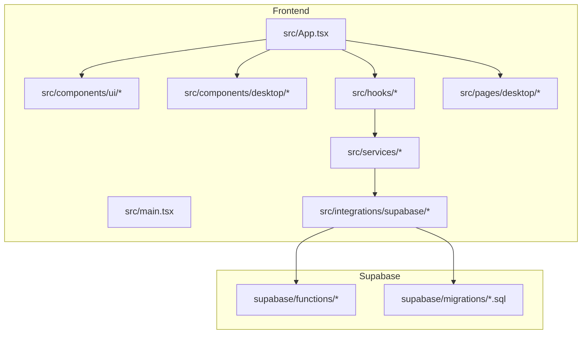
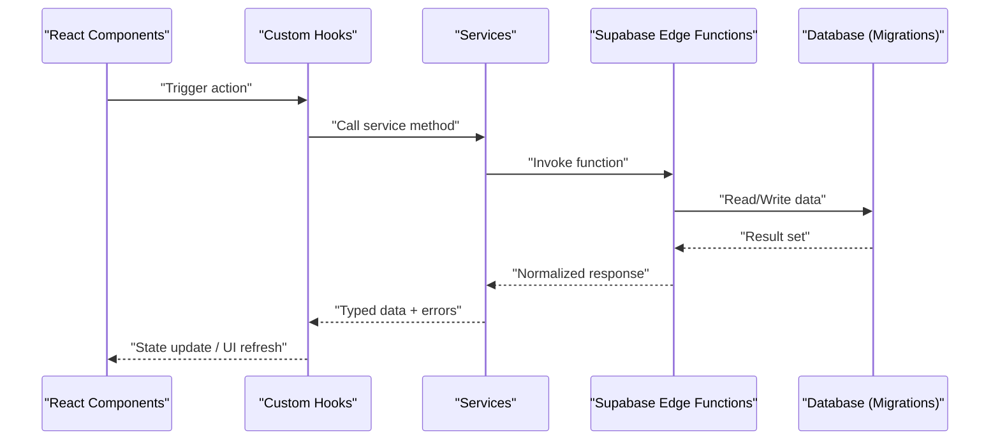
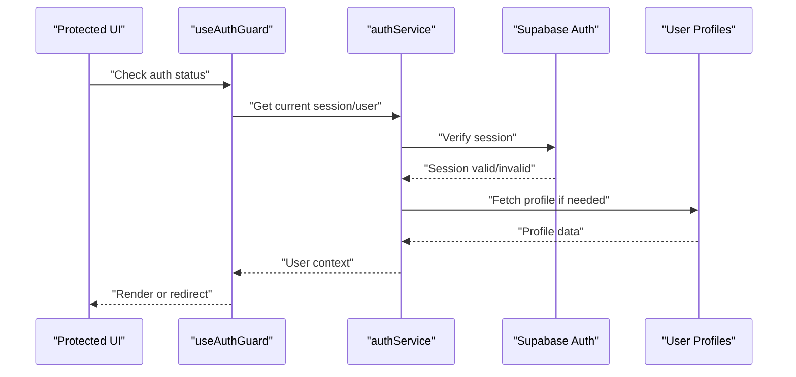
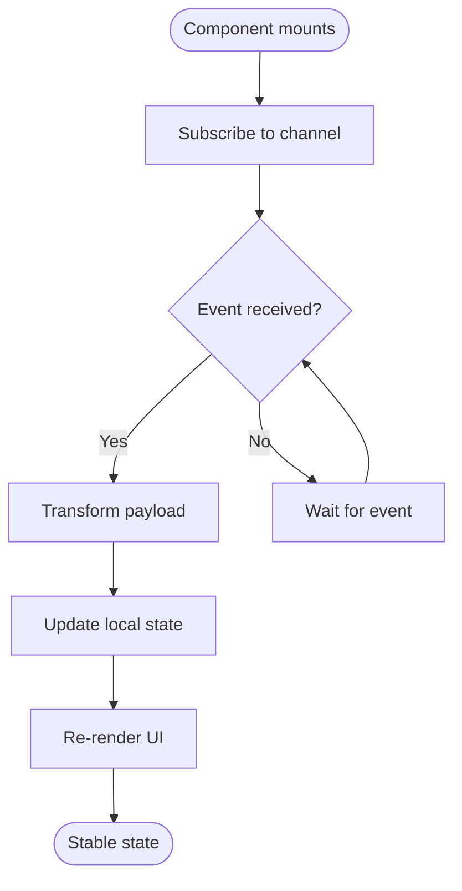
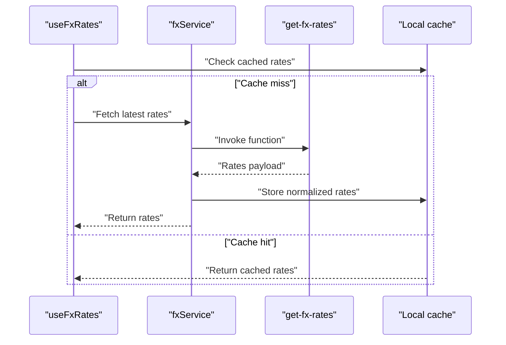
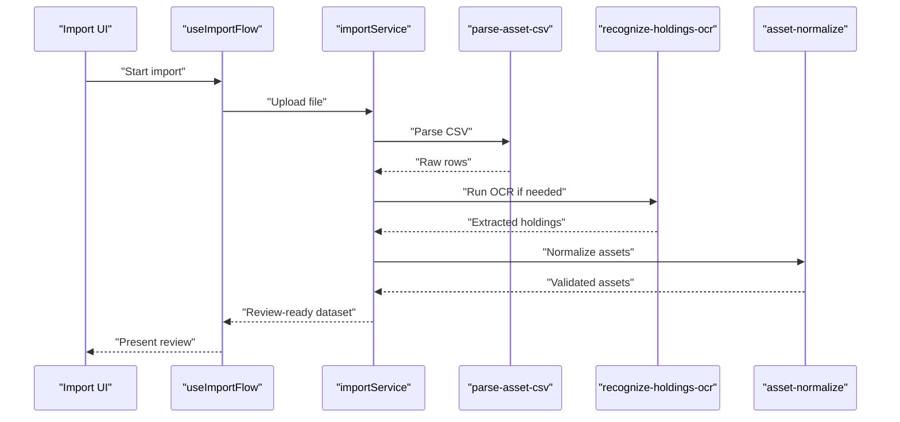
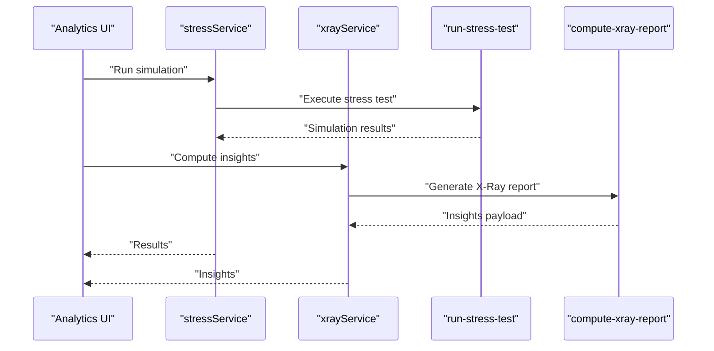
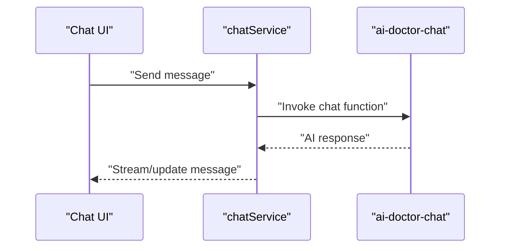
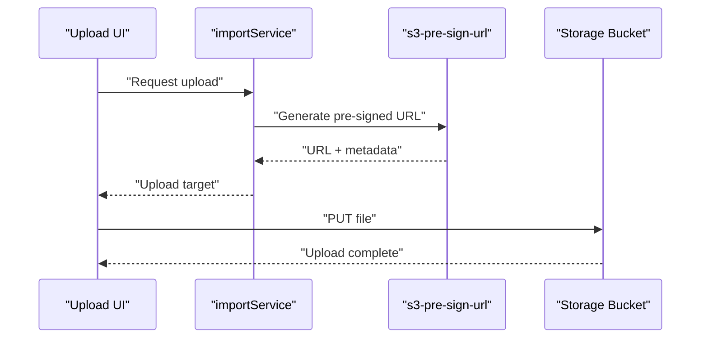
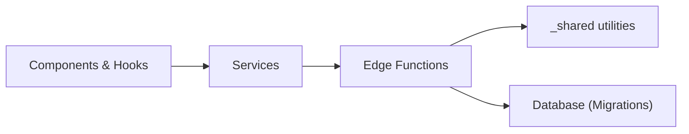

# Technical Implementation

<cite>
**Referenced Files in This Document**
- [App.tsx](file://src/App.tsx)
- [main.tsx](file://src/main.tsx)
- [client.ts](file://src/integrations/supabase/client.ts)
- [types.ts](file://src/integrations/supabase/types.ts)
- [useAuthGuard.ts](file://src/hooks/useAuthGuard.ts)
- [useAssetLedger.ts](file://src/hooks/useAssetLedger.ts)
- [useRealtimeAssets.ts](file://src/hooks/useRealtimeAssets.ts)
- [useFxRates.ts](file://src/hooks/useFxRates.ts)
- [assetService.ts](file://src/services/assetService.ts)
- [authService.ts](file://src/services/authService.ts)
- [fxService.ts](file://src/services/fxService.ts)
- [chatService.ts](file://src/services/chatService.ts)
- [importService.ts](file://src/services/importService.ts)
- [profileService.ts](file://src/services/profileService.ts)
- [reportService.ts](file://src/services/reportService.ts)
- [stressService.ts](file://src/services/stressService.ts)
- [xrayService.ts](file://src/services/xrayService.ts)
- [index.ts (ai-doctor-chat)](file://supabase/functions/ai-doctor-chat/index.ts)
- [index.ts (compute-xray-report)](file://supabase/functions/compute-xray-report/index.ts)
- [index.ts (create-shared-report)](file://supabase/functions/create-shared-report/index.ts)
- [index.ts (get-fx-rates)](file://supabase/functions/get-fx-rates/index.ts)
- [index.ts (parse-asset-csv)](file://supabase/functions/parse-asset-csv/index.ts)
- [index.ts (read-shared-report)](file://supabase/functions/read-shared-report/index.ts)
- [index.ts (recognize-holdings-ocr)](file://supabase/functions/recognize-holdings-ocr/index.ts)
- [index.ts (run-stress-test)](file://supabase/functions/run-stress-test/index.ts)
- [index.ts (s3-pre-sign-url)](file://supabase/functions/s3-pre-sign-url/index.ts)
- [index.ts (seed-demo-portfolio)](file://supabase/functions/seed-demo-portfolio/index.ts)
- [asset-normalize.ts](file://supabase/functions/_shared/asset-normalize.ts)
- [auth.ts](file://supabase/functions/_shared/auth.ts)
- [currency.ts](file://supabase/functions/_shared/currency.ts)
- [20260723121144_c74c73213ed84575a8837d9cd36d15e4.sql](file://supabase/migrations/20260723121144_c74c73213ed84575a8837d9cd36d15e4.sql)
- [20260723153952_c71b1045dcdf4f018225805c503c6b0d.sql](file://supabase/migrations/20260723153952_c71b1045dcdf4f018225805c503c6b0d.sql)
- [20260723155331_68c1a30a78ff4e48bf404ad2cc6b6efb.sql](file://supabase/migrations/20260723155331_68c1a30a78ff4e48bf404ad2cc6b6efb.sql)
- [20260723155413_7c3191b7c8f548c595ab9f78639759.sql](file://supabase/migrations/20260723155413_7c3191b7c8f548c595ab9f78639759.sql)
- [20260723163446_e5b73a6e70e543bb974e94bd42eaef26.sql](file://supabase/migrations/20260723163446_e5b73a6e70e543bb974e94bd42eaef26.sql)
- [20260723173518_0b0744c7dcdf4ce19d0f633f7cc564.sql](file://supabase/migrations/20260723173518_0b0744c7dcdf4ce19d0f633f7cc564.sql)
- [20260723173615_1714d0fb53f4be484aeaf5ae6126285.sql](file://supabase/migrations/20260723173615_1714d0fb53f4be484aeaf5ae6126285.sql)
- [20260723180315_7037aff8609246c09c1687e43402551b.sql](file://supabase/migrations/20260723180315_7037aff8609246c09c1687e43402551b.sql)
- [20260723182152_1ef372d9776b467997d05a24cc896e.sql](file://supabase/migrations/20260723182152_1ef372d9776b467997d05a24cc896e.sql)
- [20260723182205_0a1bea3f394be484aeaf5ae6126285.sql](file://supabase/migrations/20260723182205_0a1bea3f394be484aeaf5ae6126285.sql)
- [20260723182220_76855ba279467997d05a24cc896e.sql](file://supabase/migrations/20260723182220_76855ba279467997d05a24cc896e.sql)
- [20260723182238_2c1e9690de31436f84bc008367aae82f.sql](file://supabase/migrations/20260723182238_2c1e9690de31436f84bc008367aae82f.sql)
- [20260723182351_edc6719154248bc008367aae82f.sql](file://supabase/migrations/20260723182351_edc6719154248bc008367aae82f.sql)
- [20260723185127_9c934d440460467997d05a24cc896e.sql](file://supabase/migrations/20260723185127_9c934d440460467997d05a24cc896e.sql)
- [20260723193427_c3d33b84bc14b391cd0ce84628a6aa.sql](file://supabase/migrations/20260723193427_c3d33b84bc14b391cd0ce84628a6aa.sql)
- [20260723193624_d41656f9e95f43044e8256bc3044e545a.sql](file://supabase/migrations/20260723193624_d41656f9e95f43044e8256bc3044e545a.sql)
</cite>

## Table of Contents
1. [Introduction](#introduction)
2. [Project Structure](#project-structure)
3. [Core Components](#core-components)
4. [Architecture Overview](#architecture-overview)
5. [Detailed Component Analysis](#detailed-component-analysis)
6. [Dependency Analysis](#dependency-analysis)
7. [Performance Considerations](#performance-considerations)
8. [Troubleshooting Guide](#troubleshooting-guide)
9. [Conclusion](#conclusion)
10. [Appendices](#appendices)

## Introduction
This document describes FinSight’s technical implementation across frontend, backend integration, and API layer. It focuses on:
- Frontend architecture using React with a component library, custom hooks for state and side effects, and routing patterns.
- Backend integration with Supabase Edge Functions, database schema design via migrations, real-time subscriptions, and authentication flows.
- Service-oriented API layer with consistent error handling, data transformation, and type safety from client to server.

The goal is to provide actionable guidance for extending functionality and integrating third-party services while maintaining consistency and reliability.

## Project Structure
FinSight follows a feature-oriented structure with clear separation between UI components, hooks, services, types, and Supabase integrations. The frontend uses a component library under src/components/ui, domain-specific desktop components under src/components/desktop, and reusable logic encapsulated in src/hooks. Data access and business operations are centralized in src/services. Supabase configuration and typed clients live under src/integrations/supabase, while serverless functions and database migrations reside under supabase/.



**Diagram sources**
- [App.tsx](file://src/App.tsx)
- [main.tsx](file://src/main.tsx)
- [client.ts](file://src/integrations/supabase/client.ts)
- [types.ts](file://src/integrations/supabase/types.ts)
- [useAuthGuard.ts](file://src/hooks/useAuthGuard.ts)
- [useAssetLedger.ts](file://src/hooks/useAssetLedger.ts)
- [useRealtimeAssets.ts](file://src/hooks/useRealtimeAssets.ts)
- [useFxRates.ts](file://src/hooks/useFxRates.ts)
- [assetService.ts](file://src/services/assetService.ts)
- [authService.ts](file://src/services/authService.ts)
- [fxService.ts](file://src/services/fxService.ts)
- [chatService.ts](file://src/services/chatService.ts)
- [importService.ts](file://src/services/importService.ts)
- [profileService.ts](file://src/services/profileService.ts)
- [reportService.ts](file://src/services/reportService.ts)
- [stressService.ts](file://src/services/stressService.ts)
- [xrayService.ts](file://src/services/xrayService.ts)
- [index.ts (ai-doctor-chat)](file://supabase/functions/ai-doctor-chat/index.ts)
- [index.ts (compute-xray-report)](file://supabase/functions/compute-xray-report/index.ts)
- [index.ts (create-shared-report)](file://supabase/functions/create-shared-report/index.ts)
- [index.ts (get-fx-rates)](file://supabase/functions/get-fx-rates/index.ts)
- [index.ts (parse-asset-csv)](file://supabase/functions/parse-asset-csv/index.ts)
- [index.ts (read-shared-report)](file://supabase/functions/read-shared-report/index.ts)
- [index.ts (recognize-holdings-ocr)](file://supabase/functions/recognize-holdings-ocr/index.ts)
- [index.ts (run-stress-test)](file://supabase/functions/run-stress-test/index.ts)
- [index.ts (s3-pre-sign-url)](file://supabase/functions/s3-pre-sign-url/index.ts)
- [index.ts (seed-demo-portfolio)](file://supabase/functions/seed-demo-portfolio/index.ts)
- [asset-normalize.ts](file://supabase/functions/_shared/asset-normalize.ts)
- [auth.ts](file://supabase/functions/_shared/auth.ts)
- [currency.ts](file://supabase/functions/_shared/currency.ts)
- [20260723121144_c74c73213ed84575a8837d9cd36d15e4.sql](file://supabase/migrations/20260723121144_c74c73213ed84575a8837d9cd36d15e4.sql)
- [20260723153952_c71b1045dcdf4f018225805c503c6b0d.sql](file://supabase/migrations/20260723153952_c71b1045dcdf4f018225805c503c6b0d.sql)
- [20260723155331_68c1a30a78ff4e48bf404ad2cc6b6efb.sql](file://supabase/migrations/20260723155331_68c1a30a78ff4e48bf404ad2cc6b6efb.sql)
- [20260723155413_7c3191b7c8f548c595ab9f78639759.sql](file://supabase/migrations/20260723155413_7c3191b7c8f548c595ab9f78639759.sql)
- [20260723163446_e5b73a6e70e543bb974e94bd42eaef26.sql](file://supabase/migrations/20260723163446_e5b73a6e70e543bb974e94bd42eaef26.sql)
- [20260723173518_0b0744c7dcdf4ce19d0f633f7cc564.sql](file://supabase/migrations/20260723173518_0b0744c7dcdf4ce19d0f633f7cc564.sql)
- [20260723173615_1714d0fb53f4be484aeaf5ae6126285.sql](file://supabase/migrations/20260723173615_1714d0fb53f4be484aeaf5ae6126285.sql)
- [20260723180315_7037aff8609246c09c1687e43402551b.sql](file://supabase/migrations/20260723180315_7037aff8609246c09c1687e43402551b.sql)
- [20260723182152_1ef372d9776b467997d05a24cc896e.sql](file://supabase/migrations/20260723182152_1ef372d9776b467997d05a24cc896e.sql)
- [20260723182205_0a1bea3f394be484aeaf5ae6126285.sql](file://supabase/migrations/20260723182205_0a1bea3f394be484aeaf5ae6126285.sql)
- [20260723182220_76855ba279467997d05a24cc896e.sql](file://supabase/migrations/20260723182220_76855ba279467997d05a24cc896e.sql)
- [20260723182238_2c1e9690de31436f84bc008367aae82f.sql](file://supabase/migrations/20260723182238_2c1e9690de31436f84bc008367aae82f.sql)
- [20260723182351_edc6719154248bc008367aae82f.sql](file://supabase/migrations/20260723182351_edc6719154248bc008367aae82f.sql)
- [20260723185127_9c934d440460467997d05a24cc896e.sql](file://supabase/migrations/20260723185127_9c934d440460467997d05a24cc896e.sql)
- [20260723193427_c3d33b84bc14b391cd0ce84628a6aa.sql](file://supabase/migrations/20260723193427_c3d33b84bc14b391cd0ce84628a6aa.sql)
- [20260723193624_d41656f9e95f43044e8256bc3044e545a.sql](file://supabase/migrations/20260723193624_d41656f9e95f43044e8256bc3044e545a.sql)

**Section sources**
- [App.tsx](file://src/App.tsx)
- [main.tsx](file://src/main.tsx)
- [client.ts](file://src/integrations/supabase/client.ts)
- [types.ts](file://src/integrations/supabase/types.ts)

## Core Components
- Component Library: Reusable primitives under src/components/ui (buttons, dialogs, forms, tables, etc.) used consistently across pages and features.
- Desktop Components: Feature-specific UI under src/components/desktop (accounts, assets, import flows, batch editing, sharing reports).
- Custom Hooks: Encapsulate cross-cutting concerns such as auth gating, asset ledger management, real-time updates, FX rates, chat, stress tests, and X-Ray analysis.
- Services: Centralized API layer that calls Supabase Edge Functions and manages data transformation and error handling.
- Types: Shared TypeScript types for app domains and Supabase client types.

Key responsibilities:
- Routing and layout orchestration at the application entry points.
- State management through React hooks and service abstractions.
- Real-time data synchronization via Supabase subscriptions.
- Authentication enforcement and user context propagation.

**Section sources**
- [useAuthGuard.ts](file://src/hooks/useAuthGuard.ts)
- [useAssetLedger.ts](file://src/hooks/useAssetLedger.ts)
- [useRealtimeAssets.ts](file://src/hooks/useRealtimeAssets.ts)
- [useFxRates.ts](file://src/hooks/useFxRates.ts)
- [assetService.ts](file://src/services/assetService.ts)
- [authService.ts](file://src/services/authService.ts)
- [fxService.ts](file://src/services/fxService.ts)
- [chatService.ts](file://src/services/chatService.ts)
- [importService.ts](file://src/services/importService.ts)
- [profileService.ts](file://src/services/profileService.ts)
- [reportService.ts](file://src/services/reportService.ts)
- [stressService.ts](file://src/services/stressService.ts)
- [xrayService.ts](file://src/services/xrayService.ts)

## Architecture Overview
FinSight employs a service-oriented architecture where React components call hooks, which delegate to services. Services interact with Supabase Edge Functions and database schemas defined by migrations. Type safety is enforced via shared types and generated Supabase types.



**Diagram sources**
- [useAuthGuard.ts](file://src/hooks/useAuthGuard.ts)
- [useAssetLedger.ts](file://src/hooks/useAssetLedger.ts)
- [useRealtimeAssets.ts](file://src/hooks/useRealtimeAssets.ts)
- [assetService.ts](file://src/services/assetService.ts)
- [authService.ts](file://src/services/authService.ts)
- [index.ts (ai-doctor-chat)](file://supabase/functions/ai-doctor-chat/index.ts)
- [index.ts (compute-xray-report)](file://supabase/functions/compute-xray-report/index.ts)
- [index.ts (create-shared-report)](file://supabase/functions/create-shared-report/index.ts)
- [index.ts (get-fx-rates)](file://supabase/functions/get-fx-rates/index.ts)
- [index.ts (parse-asset-csv)](file://supabase/functions/parse-asset-csv/index.ts)
- [index.ts (read-shared-report)](file://supabase/functions/read-shared-report/index.ts)
- [index.ts (recognize-holdings-ocr)](file://supabase/functions/recognize-holdings-ocr/index.ts)
- [index.ts (run-stress-test)](file://supabase/functions/run-stress-test/index.ts)
- [index.ts (s3-pre-sign-url)](file://supabase/functions/s3-pre-sign-url/index.ts)
- [index.ts (seed-demo-portfolio)](file://supabase/functions/seed-demo-portfolio/index.ts)
- [20260723121144_c74c73213ed84575a8837d9cd36d15e4.sql](file://supabase/migrations/20260723121144_c74c73213ed84575a8837d9cd36d15e4.sql)
- [20260723153952_c71b1045dcdf4f018225805c503c6b0d.sql](file://supabase/migrations/20260723153952_c71b1045dcdf4f018225805c503c6b0d.sql)
- [20260723155331_68c1a30a78ff4e48bf404ad2cc6b6efb.sql](file://supabase/migrations/20260723155331_68c1a30a78ff4e48bf404ad2cc6b6efb.sql)
- [20260723155413_7c3191b7c8f548c595ab9f78639759.sql](file://supabase/migrations/20260723155413_7c3191b7c8f548c595ab9f78639759.sql)
- [20260723163446_e5b73a6e70e543bb974e94bd42eaef26.sql](file://supabase/migrations/20260723163446_e5b73a6e70e543bb974e94bd42eaef26.sql)
- [20260723173518_0b0744c7dcdf4ce19d0f633f7cc564.sql](file://supabase/migrations/20260723173518_0b0744c7dcdf4ce19d0f633f7cc564.sql)
- [20260723173615_1714d0fb53f4be484aeaf5ae6126285.sql](file://supabase/migrations/20260723173615_1714d0fb53f4be484aeaf5ae6126285.sql)
- [20260723180315_7037aff8609246c09c1687e43402551b.sql](file://supabase/migrations/20260723180315_7037aff8609246c09c1687e43402551b.sql)
- [20260723182152_1ef372d9776b467997d05a24cc896e.sql](file://supabase/migrations/20260723182152_1ef372d9776b467997d05a24cc896e.sql)
- [20260723182205_0a1bea3f394be484aeaf5ae6126285.sql](file://supabase/migrations/20260723182205_0a1bea3f394be484aeaf5ae6126285.sql)
- [20260723182220_76855ba279467997d05a24cc896e.sql](file://supabase/migrations/20260723182220_76855ba279467997d05a24cc896e.sql)
- [20260723182238_2c1e9690de31436f84bc008367aae82f.sql](file://supabase/migrations/20260723182238_2c1e9690de31436f84bc008367aae82f.sql)
- [20260723182351_edc6719154248bc008367aae82f.sql](file://supabase/migrations/20260723182351_edc6719154248bc008367aae82f.sql)
- [20260723185127_9c934d440460467997d05a24cc896e.sql](file://supabase/migrations/20260723185127_9c934d440460467997d05a24cc896e.sql)
- [20260723193427_c3d33b84bc14b391cd0ce84628a6aa.sql](file://supabase/migrations/20260723193427_c3d33b84bc14b391cd0ce84628a6aa.sql)
- [20260723193624_d41656f9e95f43044e8256bc3044e545a.sql](file://supabase/migrations/20260723193624_d41656f9e95f43044e8256bc3044e545a.sql)

## Detailed Component Analysis

### Frontend Architecture
- Entry Points: Application bootstrap and root layout are defined in the main entry files.
- Routing: Pages are organized under src/pages/desktop; routing is configured at the application level to mount page components.
- Component Library: Consistent UI primitives under src/components/ui ensure visual and behavioral consistency.
- Custom Hooks: Domain-specific hooks encapsulate state and side effects, promoting reusability and testability.

Implementation patterns:
- Use hooks to manage local and derived state, and to coordinate service calls.
- Keep UI components presentational; move business logic into hooks and services.
- Leverage the component library for accessibility and consistency.

**Section sources**
- [App.tsx](file://src/App.tsx)
- [main.tsx](file://src/main.tsx)

### State Management with React Hooks
Patterns observed:
- useAuthGuard: Enforces authentication before rendering protected routes or features.
- useAssetLedger: Manages asset-related state and mutations.
- useRealtimeAssets: Subscribes to real-time changes and keeps UI in sync.
- useFxRates: Fetches and caches exchange rates for multi-currency support.

Best practices:
- Derive UI state from minimal source of truth.
- Separate data fetching from presentation.
- Handle loading, error, and success states explicitly within hooks.

**Section sources**
- [useAuthGuard.ts](file://src/hooks/useAuthGuard.ts)
- [useAssetLedger.ts](file://src/hooks/useAssetLedger.ts)
- [useRealtimeAssets.ts](file://src/hooks/useRealtimeAssets.ts)
- [useFxRates.ts](file://src/hooks/useFxRates.ts)

### Routing Implementation
- Page modules are grouped by platform (desktop) and mounted via the application router.
- Route guards leverage authentication hooks to protect sensitive areas.

Guidelines:
- Keep route definitions declarative and colocated with page components.
- Apply guards at route level to prevent unauthorized navigation.

**Section sources**
- [App.tsx](file://src/App.tsx)
- [useAuthGuard.ts](file://src/hooks/useAuthGuard.ts)

### Backend Integration with Supabase
- Client Configuration: Typed Supabase client setup under src/integrations/supabase provides strongly-typed queries and function invocations.
- Edge Functions: Each capability is exposed as an Edge Function under supabase/functions, enabling secure server-side logic.
- Database Schema: Migrations define tables, constraints, and policies ensuring data integrity and security.

Integration guidelines:
- Prefer Edge Functions for sensitive operations and external API calls.
- Use typed clients to enforce contract consistency between frontend and backend.
- Centralize error mapping in services for uniform UX.

**Section sources**
- [client.ts](file://src/integrations/supabase/client.ts)
- [types.ts](file://src/integrations/supabase/types.ts)
- [index.ts (ai-doctor-chat)](file://supabase/functions/ai-doctor-chat/index.ts)
- [index.ts (compute-xray-report)](file://supabase/functions/compute-xray-report/index.ts)
- [index.ts (create-shared-report)](file://supabase/functions/create-shared-report/index.ts)
- [index.ts (get-fx-rates)](file://supabase/functions/get-fx-rates/index.ts)
- [index.ts (parse-asset-csv)](file://supabase/functions/parse-asset-csv/index.ts)
- [index.ts (read-shared-report)](file://supabase/functions/read-shared-report/index.ts)
- [index.ts (recognize-holdings-ocr)](file://supabase/functions/recognize-holdings-ocr/index.ts)
- [index.ts (run-stress-test)](file://supabase/functions/run-stress-test/index.ts)
- [index.ts (s3-pre-sign-url)](file://supabase/functions/s3-pre-sign-url/index.ts)
- [index.ts (seed-demo-portfolio)](file://supabase/functions/seed-demo-portfolio/index.ts)
- [20260723121144_c74c73213ed84575a8837d9cd36d15e4.sql](file://supabase/migrations/20260723121144_c74c73213ed84575a8837d9cd36d15e4.sql)
- [20260723153952_c71b1045dcdf4f018225805c503c6b0d.sql](file://supabase/migrations/20260723153952_c71b1045dcdf4f018225805c503c6b0d.sql)
- [20260723155331_68c1a30a78ff4e48bf404ad2cc6b6efb.sql](file://supabase/migrations/20260723155331_68c1a30a78ff4e48bf404ad2cc6b6efb.sql)
- [20260723155413_7c3191b7c8f548c595ab9f78639759.sql](file://supabase/migrations/20260723155413_7c3191b7c8f548c595ab9f78639759.sql)
- [20260723163446_e5b73a6e70e543bb974e94bd42eaef26.sql](file://supabase/migrations/20260723163446_e5b73a6e70e543bb974e94bd42eaef26.sql)
- [20260723173518_0b0744c7dcdf4ce19d0f633f7cc564.sql](file://supabase/migrations/20260723173518_0b0744c7dcdf4ce19d0f633f7cc564.sql)
- [20260723173615_1714d0fb53f4be484aeaf5ae6126285.sql](file://supabase/migrations/20260723173615_1714d0fb53f4be484aeaf5ae6126285.sql)
- [20260723180315_7037aff8609246c09c1687e43402551b.sql](file://supabase/migrations/20260723180315_7037aff8609246c09c1687e43402551b.sql)
- [20260723182152_1ef372d9776b467997d05a24cc896e.sql](file://supabase/migrations/20260723182152_1ef372d9776b467997d05a24cc896e.sql)
- [20260723182205_0a1bea3f394be484aeaf5ae6126285.sql](file://supabase/migrations/20260723182205_0a1bea3f394be484aeaf5ae6126285.sql)
- [20260723182220_76855ba279467997d05a24cc896e.sql](file://supabase/migrations/20260723182220_76855ba279467997d05a24cc896e.sql)
- [20260723182238_2c1e9690de31436f84bc008367aae82f.sql](file://supabase/migrations/20260723182238_2c1e9690de31436f84bc008367aae82f.sql)
- [20260723182351_edc6719154248bc008367aae82f.sql](file://supabase/migrations/20260723182351_edc6719154248bc008367aae82f.sql)
- [20260723185127_9c934d440460467997d05a24cc896e.sql](file://supabase/migrations/20260723185127_9c934d440460467997d05a24cc896e.sql)
- [20260723193427_c3d33b84bc14b391cd0ce84628a6aa.sql](file://supabase/migrations/20260723193427_c3d33b84bc14b391cd0ce84628a6aa.sql)
- [20260723193624_d41656f9e95f43044e8256bc3044e545a.sql](file://supabase/migrations/20260723193624_d41656f9e95f43044e8256bc3044e545a.sql)

### API Layer Architecture (Service-Oriented Design)
Services encapsulate all interactions with Supabase Edge Functions and database operations. They normalize responses, handle errors, and expose clean interfaces to hooks and components.

Responsibilities:
- Asset operations: CRUD and transformations via assetService.
- Authentication flows: Sign-in, sign-up, session checks via authService.
- FX rates: Fetching and caching via fxService.
- Chat and AI features: Orchestrating AI doctor chat via chatService.
- Import workflows: CSV parsing and OCR via importService.
- Profile management: User profile reads/writes via profileService.
- Reports and sharing: Creating and reading shared reports via reportService.
- Stress testing and analytics: Running simulations and computing insights via stressService and xrayService.

Error handling patterns:
- Normalize network and validation errors into consistent shapes.
- Surface user-friendly messages while preserving detailed logs for debugging.
- Provide retry strategies for transient failures where appropriate.

Data transformation:
- Convert raw payloads into domain models.
- Ensure currency normalization and formatting.
- Validate inputs and outputs against shared types.

Type safety:
- Use generated Supabase types and shared app types to enforce contracts.
- Avoid any casts; prefer explicit transformations.

**Section sources**
- [assetService.ts](file://src/services/assetService.ts)
- [authService.ts](file://src/services/authService.ts)
- [fxService.ts](file://src/services/fxService.ts)
- [chatService.ts](file://src/services/chatService.ts)
- [importService.ts](file://src/services/importService.ts)
- [profileService.ts](file://src/services/profileService.ts)
- [reportService.ts](file://src/services/reportService.ts)
- [stressService.ts](file://src/services/stressService.ts)
- [xrayService.ts](file://src/services/xrayService.ts)

### Authentication Flow
Authentication is enforced via a guard hook and service methods. Protected routes and features check user state before rendering or executing actions.



**Diagram sources**
- [useAuthGuard.ts](file://src/hooks/useAuthGuard.ts)
- [authService.ts](file://src/services/authService.ts)
- [auth.ts](file://supabase/functions/_shared/auth.ts)

**Section sources**
- [useAuthGuard.ts](file://src/hooks/useAuthGuard.ts)
- [authService.ts](file://src/services/authService.ts)
- [auth.ts](file://supabase/functions/_shared/auth.ts)

### Real-Time Subscriptions
Real-time updates keep the UI synchronized with database changes. The realtime assets hook subscribes to relevant channels and updates local state upon events.



**Diagram sources**
- [useRealtimeAssets.ts](file://src/hooks/useRealtimeAssets.ts)

**Section sources**
- [useRealtimeAssets.ts](file://src/hooks/useRealtimeAssets.ts)

### Exchange Rates and Currency Normalization
FX rates are fetched via a dedicated service and cached to minimize latency. Shared utilities normalize currencies and formats values consistently.



**Diagram sources**
- [useFxRates.ts](file://src/hooks/useFxRates.ts)
- [fxService.ts](file://src/services/fxService.ts)
- [index.ts (get-fx-rates)](file://supabase/functions/get-fx-rates/index.ts)
- [currency.ts](file://supabase/functions/_shared/currency.ts)

**Section sources**
- [useFxRates.ts](file://src/hooks/useFxRates.ts)
- [fxService.ts](file://src/services/fxService.ts)
- [index.ts (get-fx-rates)](file://supabase/functions/get-fx-rates/index.ts)
- [currency.ts](file://supabase/functions/_shared/currency.ts)

### Import Flows and OCR
Import workflows orchestrate CSV parsing and OCR recognition via Edge Functions, normalizing assets and presenting review steps.



**Diagram sources**
- [useImportFlow.ts](file://src/hooks/useImportFlow.ts)
- [importService.ts](file://src/services/importService.ts)
- [index.ts (parse-asset-csv)](file://supabase/functions/parse-asset-csv/index.ts)
- [index.ts (recognize-holdings-ocr)](file://supabase/functions/recognize-holdings-ocr/index.ts)
- [asset-normalize.ts](file://supabase/functions/_shared/asset-normalize.ts)

**Section sources**
- [useImportFlow.ts](file://src/hooks/useImportFlow.ts)
- [importService.ts](file://src/services/importService.ts)
- [index.ts (parse-asset-csv)](file://supabase/functions/parse-asset-csv/index.ts)
- [index.ts (recognize-holdings-ocr)](file://supabase/functions/recognize-holdings-ocr/index.ts)
- [asset-normalize.ts](file://supabase/functions/_shared/asset-normalize.ts)

### Shared Report Creation and Reading
Shared reports are created and read via dedicated Edge Functions, with services handling permissions and data shaping.

```mermaid
sequenceDiagram
participant UI as "Report UI"
participant Svc as "reportService"
participant Create as "create-shared-report"
participant Read as "read-shared-report"
UI->>Svc : "Create report"
Svc->>Create : "Persist report metadata"
Create-->>Svc : "Report ID"
UI->>Svc : "Read report"
Svc->>Read : "Fetch report content"
Read-->>Svc : "Report data"
Svc-->>UI : "Render report"
```

**Diagram sources**
- [reportService.ts](file://src/services/reportService.ts)
- [index.ts (create-shared-report)](file://supabase/functions/create-shared-report/index.ts)
- [index.ts (read-shared-report)](file://supabase/functions/read-shared-report/index.ts)

**Section sources**
- [reportService.ts](file://src/services/reportService.ts)
- [index.ts (create-shared-report)](file://supabase/functions/create-shared-report/index.ts)
- [index.ts (read-shared-report)](file://supabase/functions/read-shared-report/index.ts)

### Stress Testing and X-Ray Analytics
Stress tests and X-Ray computations are executed via Edge Functions, returning results consumed by analytics UI.



**Diagram sources**
- [stressService.ts](file://src/services/stressService.ts)
- [xrayService.ts](file://src/services/xrayService.ts)
- [index.ts (run-stress-test)](file://supabase/functions/run-stress-test/index.ts)
- [index.ts (compute-xray-report)](file://supabase/functions/compute-xray-report/index.ts)

**Section sources**
- [stressService.ts](file://src/services/stressService.ts)
- [xrayService.ts](file://src/services/xrayService.ts)
- [index.ts (run-stress-test)](file://supabase/functions/run-stress-test/index.ts)
- [index.ts (compute-xray-report)](file://supabase/functions/compute-xray-report/index.ts)

### AI Doctor Chat
Chat interactions are orchestrated through a service calling the AI doctor chat Edge Function, managing conversation state and streaming responses where applicable.



**Diagram sources**
- [chatService.ts](file://src/services/chatService.ts)
- [index.ts (ai-doctor-chat)](file://supabase/functions/ai-doctor-chat/index.ts)

**Section sources**
- [chatService.ts](file://src/services/chatService.ts)
- [index.ts (ai-doctor-chat)](file://supabase/functions/ai-doctor-chat/index.ts)

### File Uploads via Pre-signed URLs
Secure uploads use pre-signed URLs generated by an Edge Function, allowing direct uploads to storage without exposing credentials.



**Diagram sources**
- [importService.ts](file://src/services/importService.ts)
- [index.ts (s3-pre-sign-url)](file://supabase/functions/s3-pre-sign-url/index.ts)

**Section sources**
- [importService.ts](file://src/services/importService.ts)
- [index.ts (s3-pre-sign-url)](file://supabase/functions/s3-pre-sign-url/index.ts)

## Dependency Analysis
The frontend depends on services, which depend on Supabase Edge Functions and database schemas. Shared utilities in Edge Functions standardize normalization and currency handling.



**Diagram sources**
- [useAuthGuard.ts](file://src/hooks/useAuthGuard.ts)
- [useAssetLedger.ts](file://src/hooks/useAssetLedger.ts)
- [useRealtimeAssets.ts](file://src/hooks/useRealtimeAssets.ts)
- [useFxRates.ts](file://src/hooks/useFxRates.ts)
- [assetService.ts](file://src/services/assetService.ts)
- [authService.ts](file://src/services/authService.ts)
- [fxService.ts](file://src/services/fxService.ts)
- [chatService.ts](file://src/services/chatService.ts)
- [importService.ts](file://src/services/importService.ts)
- [profileService.ts](file://src/services/profileService.ts)
- [reportService.ts](file://src/services/reportService.ts)
- [stressService.ts](file://src/services/stressService.ts)
- [xrayService.ts](file://src/services/xrayService.ts)
- [asset-normalize.ts](file://supabase/functions/_shared/asset-normalize.ts)
- [auth.ts](file://supabase/functions/_shared/auth.ts)
- [currency.ts](file://supabase/functions/_shared/currency.ts)

**Section sources**
- [client.ts](file://src/integrations/supabase/client.ts)
- [types.ts](file://src/integrations/supabase/types.ts)

## Performance Considerations
- Minimize re-renders by deriving state efficiently in hooks.
- Cache FX rates and other stable datasets locally to reduce network calls.
- Use real-time subscriptions selectively to avoid unnecessary updates.
- Batch mutations where possible to reduce round trips.
- Debounce heavy computations and defer non-critical work.

[No sources needed since this section provides general guidance]

## Troubleshooting Guide
Common issues and resolutions:
- Authentication failures: Verify session validity and ensure guard hooks are applied to protected routes.
- Network errors: Check Edge Function logs and validate request payloads; normalize errors in services for consistent UX.
- Real-time not updating: Confirm channel subscriptions and event filters; inspect database policies.
- Type mismatches: Align shared types with Edge Function responses; avoid casting and use explicit transformations.

Operational tips:
- Log structured errors with context (user ID, operation, timestamp).
- Implement retries with exponential backoff for transient failures.
- Add health checks for critical services and Edge Functions.

**Section sources**
- [useAuthGuard.ts](file://src/hooks/useAuthGuard.ts)
- [authService.ts](file://src/services/authService.ts)
- [useRealtimeAssets.ts](file://src/hooks/useRealtimeAssets.ts)

## Conclusion
FinSight’s architecture emphasizes clear separation of concerns, strong typing, and robust integration with Supabase. By centralizing logic in services, encapsulating state in hooks, and enforcing authentication and real-time updates, the system remains maintainable and extensible. Following the patterns outlined here will help you add new features safely and integrate third-party services effectively.

[No sources needed since this section summarizes without analyzing specific files]

## Appendices

### Best Practices for Extending Functionality
- Add new capabilities as Edge Functions under supabase/functions and expose them via corresponding services.
- Define shared types and normalize payloads consistently.
- Implement guard hooks for new protected features.
- Use the component library for consistent UI behavior.

### Integration Guidelines for Third-Party Services
- Wrap external APIs in Edge Functions to keep secrets safe.
- Map external errors to standardized shapes in services.
- Cache responses when appropriate and invalidate on changes.
- Monitor latency and implement timeouts and retries.

[No sources needed since this section provides general guidance]