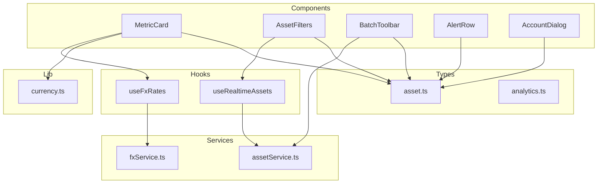
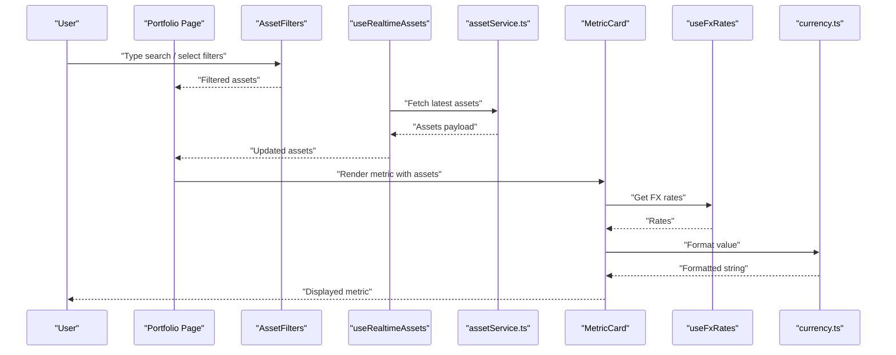
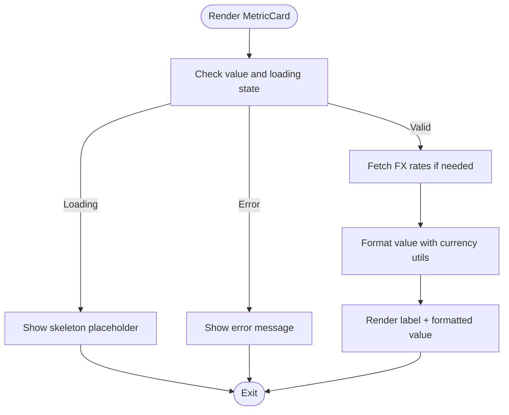
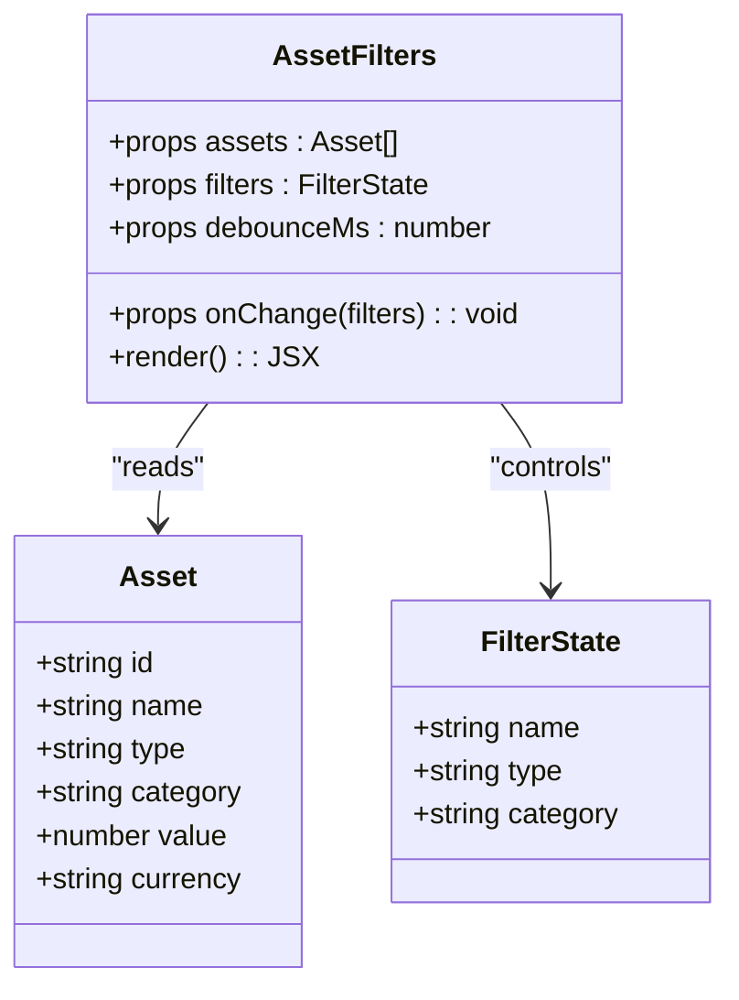
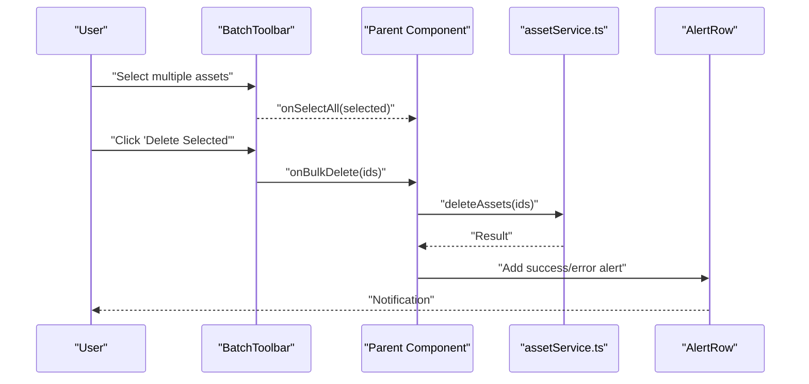
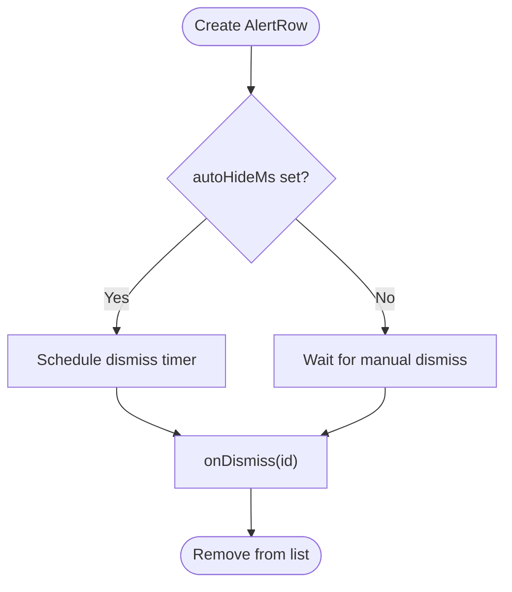
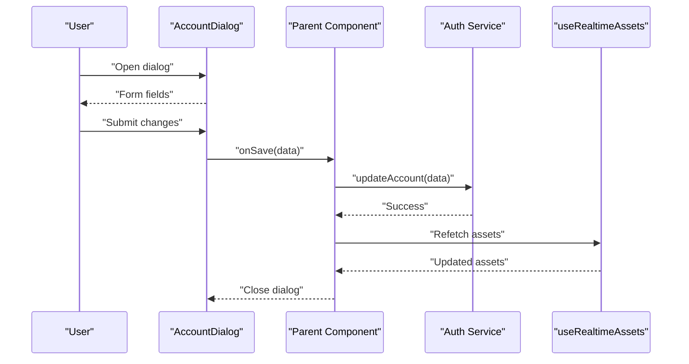
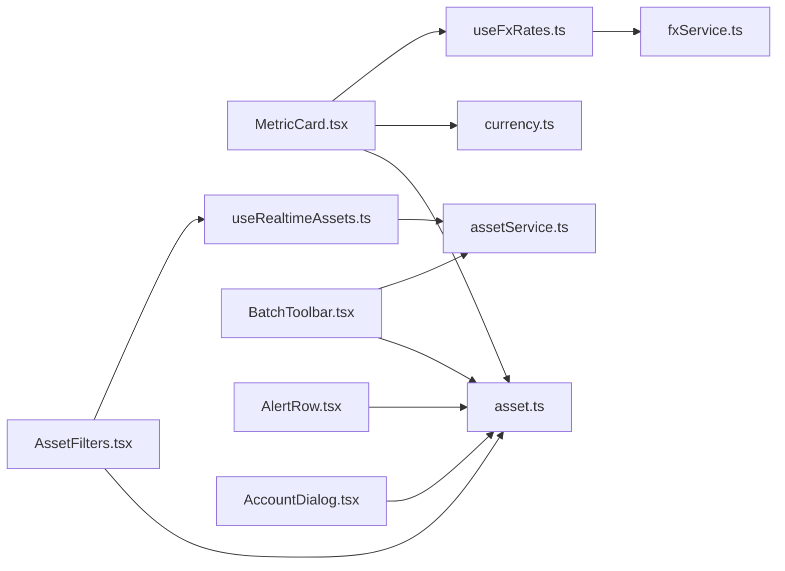

# Domain-Specific Components

<cite>
**Referenced Files in This Document**
- [MetricCard.tsx](file://src/components/desktop/MetricCard.tsx)
- [AssetFilters.tsx](file://src/components/desktop/AssetFilters.tsx)
- [BatchToolbar.tsx](file://src/components/desktop/BatchToolbar.tsx)
- [AlertRow.tsx](file://src/components/desktop/AlertRow.tsx)
- [AccountDialog.tsx](file://src/components/desktop/AccountDialog.tsx)
- [asset.ts](file://src/types/app/asset.ts)
- [analytics.ts](file://src/types/app/analytics.ts)
- [useRealtimeAssets.ts](file://src/hooks/useRealtimeAssets.ts)
- [useFxRates.ts](file://src/hooks/useFxRates.ts)
- [currency.ts](file://src/lib/currency.ts)
- [assetService.ts](file://src/services/assetService.ts)
- [fxService.ts](file://src/services/fxService.ts)
</cite>

## Table of Contents
1. [Introduction](#introduction)
2. [Project Structure](#project-structure)
3. [Core Components](#core-components)
4. [Architecture Overview](#architecture-overview)
5. [Detailed Component Analysis](#detailed-component-analysis)
6. [Dependency Analysis](#dependency-analysis)
7. [Performance Considerations](#performance-considerations)
8. [Troubleshooting Guide](#troubleshooting-guide)
9. [Conclusion](#conclusion)
10. [Appendices](#appendices)

## Introduction
This document provides detailed documentation for FinSight’s domain-specific financial components used across portfolio management workflows. It focuses on:
- MetricCard: Displaying key portfolio metrics with currency-aware formatting and optional real-time updates.
- AssetFilters: Filtering and searching assets by name, type, category, and other attributes.
- BatchToolbar: Enabling bulk operations (select, edit, delete) over multiple assets.
- AlertRow: Presenting system notifications and alerts to users.
- AccountDialog: Managing account-related actions such as viewing details and switching contexts.

The guide explains component props, data binding patterns, integration with financial data models, usage examples, performance optimization techniques, and customization options tailored to different financial contexts.

## Project Structure
FinSight organizes domain-specific UI components under src/components/desktop, with shared types, hooks, services, and utilities supporting them. The following diagram shows how the five target components relate to core data models and services.

**Diagram sources**
- [MetricCard.tsx](file://src/components/desktop/MetricCard.tsx)
- [AssetFilters.tsx](file://src/components/desktop/AssetFilters.tsx)
- [BatchToolbar.tsx](file://src/components/desktop/BatchToolbar.tsx)
- [AlertRow.tsx](file://src/components/desktop/AlertRow.tsx)
- [AccountDialog.tsx](file://src/components/desktop/AccountDialog.tsx)
- [asset.ts](file://src/types/app/asset.ts)
- [analytics.ts](file://src/types/app/analytics.ts)
- [useRealtimeAssets.ts](file://src/hooks/useRealtimeAssets.ts)
- [useFxRates.ts](file://src/hooks/useFxRates.ts)
- [currency.ts](file://src/lib/currency.ts)
- [assetService.ts](file://src/services/assetService.ts)
- [fxService.ts](file://src/services/fxService.ts)

**Section sources**
- [MetricCard.tsx](file://src/components/desktop/MetricCard.tsx)
- [AssetFilters.tsx](file://src/components/desktop/AssetFilters.tsx)
- [BatchToolbar.tsx](file://src/components/desktop/BatchToolbar.tsx)
- [AlertRow.tsx](file://src/components/desktop/AlertRow.tsx)
- [AccountDialog.tsx](file://src/components/desktop/AccountDialog.tsx)
- [asset.ts](file://src/types/app/asset.ts)
- [analytics.ts](file://src/types/app/analytics.ts)
- [useRealtimeAssets.ts](file://src/hooks/useRealtimeAssets.ts)
- [useFxRates.ts](file://src/hooks/useFxRates.ts)
- [currency.ts](file://src/lib/currency.ts)
- [assetService.ts](file://src/services/assetService.ts)
- [fxService.ts](file://src/services/fxService.ts)

## Core Components
This section summarizes each component’s purpose, primary props, data binding patterns, and integration points.

- MetricCard
  - Purpose: Displays a single metric (e.g., total value, allocation percentage) with formatted values and optional trend indicators.
  - Props: label, value, unit or currency code, precision, format options, optional loading state, optional error state, optional refresh interval.
  - Data Binding: Reads from typed asset/analytics models; uses currency utilities for formatting; can subscribe to real-time updates via hooks.
  - Integration: Uses currency formatting utilities and FX rate hooks when multi-currency is involved.

- AssetFilters
  - Purpose: Provides search and filter controls for assets (by name, type, category, status).
  - Props: assets list, filters object, onChange callback, debounce delay, locale/currency context.
  - Data Binding: Filters are applied client-side against typed asset models; debounced input reduces re-renders.
  - Integration: Can integrate with real-time asset updates and service-backed queries if needed.

- BatchToolbar
  - Purpose: Enables bulk selection and operations (edit, delete, export) on selected assets.
  - Props: assets list, selectedIds, onSelectAll, onBulkAction handlers, disabled state.
  - Data Binding: Maintains selection state; triggers batch mutations through services.
  - Integration: Calls asset service methods for batch operations; may show confirmation dialogs before destructive actions.

- AlertRow
  - Purpose: Renders a notification row with severity, message, and optional action.
  - Props: id, severity, message, dismissible, onDismiss, autoHide duration.
  - Data Binding: Typically bound to a global alert store or local state; supports programmatic add/remove.
  - Integration: Used across pages to surface warnings, errors, and info messages.

- AccountDialog
  - Purpose: Modal for account management tasks (view profile, switch accounts, update settings).
  - Props: open flag, account data, onClose, onSave, validation rules.
  - Data Binding: Two-way binding for editable fields; validates inputs before submission.
  - Integration: Uses profile and auth services; may trigger re-fetch of assets after account changes.

**Section sources**
- [MetricCard.tsx](file://src/components/desktop/MetricCard.tsx)
- [AssetFilters.tsx](file://src/components/desktop/AssetFilters.tsx)
- [BatchToolbar.tsx](file://src/components/desktop/BatchToolbar.tsx)
- [AlertRow.tsx](file://src/components/desktop/AlertRow.tsx)
- [AccountDialog.tsx](file://src/components/desktop/AccountDialog.tsx)
- [asset.ts](file://src/types/app/asset.ts)
- [analytics.ts](file://src/types/app/analytics.ts)
- [useRealtimeAssets.ts](file://src/hooks/useRealtimeAssets.ts)
- [useFxRates.ts](file://src/hooks/useFxRates.ts)
- [currency.ts](file://src/lib/currency.ts)
- [assetService.ts](file://src/services/assetService.ts)
- [fxService.ts](file://src/services/fxService.ts)

## Architecture Overview
The components interact with typed data models and services to ensure consistent behavior across portfolio views. Real-time updates and FX rates are consumed via hooks, while services encapsulate network calls.

**Diagram sources**
- [AssetFilters.tsx](file://src/components/desktop/AssetFilters.tsx)
- [useRealtimeAssets.ts](file://src/hooks/useRealtimeAssets.ts)
- [assetService.ts](file://src/services/assetService.ts)
- [MetricCard.tsx](file://src/components/desktop/MetricCard.tsx)
- [useFxRates.ts](file://src/hooks/useFxRates.ts)
- [currency.ts](file://src/lib/currency.ts)

## Detailed Component Analysis

### MetricCard
- Responsibilities:
  - Display a labeled metric with formatted numeric values.
  - Support optional loading/error states and periodic refresh.
  - Format values using currency utilities and FX rates when applicable.
- Key Props:
  - label: string
  - value: number | null
  - currencyCode: string (optional)
  - precision: number (optional)
  - loading: boolean (optional)
  - error: Error | null (optional)
  - refreshMs: number (optional)
- Data Binding Patterns:
  - Accepts raw numeric values and delegates formatting to currency utilities.
  - Integrates with FX rate hooks to convert values into display currency.
- Integration Points:
  - useFxRates hook for exchange rates.
  - currency utility for localized formatting.
  - Optional subscription to real-time asset updates for live dashboards.
- Customization Options:
  - Precision control for decimal places.
  - Conditional rendering of trend indicators based on previous vs current values.
  - Theme-aware styling via CSS classes.

**Diagram sources**
- [MetricCard.tsx](file://src/components/desktop/MetricCard.tsx)
- [useFxRates.ts](file://src/hooks/useFxRates.ts)
- [currency.ts](file://src/lib/currency.ts)

**Section sources**
- [MetricCard.tsx](file://src/components/desktop/MetricCard.tsx)
- [useFxRates.ts](file://src/hooks/useFxRates.ts)
- [currency.ts](file://src/lib/currency.ts)

### AssetFilters
- Responsibilities:
  - Provide text search and dropdown filters for assets.
  - Debounce user input to minimize re-renders.
  - Emit filtered results to parent components.
- Key Props:
  - assets: Asset[]
  - filters: FilterState (name, type, category, etc.)
  - onChange: (filters) => void
  - debounceMs: number (optional)
  - locale: string (optional)
- Data Binding Patterns:
  - Controlled component pattern: filters state is owned by parent and passed down.
  - Debounced input handlers reduce unnecessary computations.
- Integration Points:
  - Typed Asset model ensures consistent filtering logic.
  - Optional integration with real-time asset updates to keep filters current.
- Customization Options:
  - Extendable filter schema via FilterState.
  - Locale-aware sorting and matching.

**Diagram sources**
- [AssetFilters.tsx](file://src/components/desktop/AssetFilters.tsx)
- [asset.ts](file://src/types/app/asset.ts)

**Section sources**
- [AssetFilters.tsx](file://src/components/desktop/AssetFilters.tsx)
- [asset.ts](file://src/types/app/asset.ts)

### BatchToolbar
- Responsibilities:
  - Manage selection state for multiple assets.
  - Expose bulk actions (edit, delete, export).
  - Prevent accidental destructive operations via confirmations.
- Key Props:
  - assets: Asset[]
  - selectedIds: string[]
  - onSelectAll: (selected: boolean) => void
  - onBulkEdit: (ids: string[]) => Promise<void>
  - onBulkDelete: (ids: string[]) => Promise<void>
  - disabled: boolean (optional)
- Data Binding Patterns:
  - Selection state is controlled externally; toolbar emits events for parent to handle.
  - Bulk actions return promises to support async operations and feedback.
- Integration Points:
  - assetService for batch mutations.
  - Optional integration with AlertRow to report success/failure.
- Customization Options:
  - Pluggable action buttons based on permissions.
  - Configurable selection mode (single/multi).

**Diagram sources**
- [BatchToolbar.tsx](file://src/components/desktop/BatchToolbar.tsx)
- [assetService.ts](file://src/services/assetService.ts)
- [AlertRow.tsx](file://src/components/desktop/AlertRow.tsx)

**Section sources**
- [BatchToolbar.tsx](file://src/components/desktop/BatchToolbar.tsx)
- [assetService.ts](file://src/services/assetService.ts)
- [AlertRow.tsx](file://src/components/desktop/AlertRow.tsx)

### AlertRow
- Responsibilities:
  - Display a single alert with severity and optional action.
  - Support auto-dismiss and manual dismissal.
- Key Props:
  - id: string
  - severity: "info" | "warning" | "error"
  - message: string
  - dismissible: boolean
  - onDismiss: (id: string) => void
  - autoHideMs: number (optional)
- Data Binding Patterns:
  - Controlled by external alert store or local state.
  - Emits dismissal events for parent to manage lifecycle.
- Integration Points:
  - Used by BatchToolbar and AccountDialog to communicate outcomes.
- Customization Options:
  - Severity-based styling.
  - Action button configuration.

**Diagram sources**
- [AlertRow.tsx](file://src/components/desktop/AlertRow.tsx)

**Section sources**
- [AlertRow.tsx](file://src/components/desktop/AlertRow.tsx)

### AccountDialog
- Responsibilities:
  - Provide a modal interface for account management tasks.
  - Validate inputs and persist changes via services.
- Key Props:
  - open: boolean
  - account: AccountData
  - onClose: () => void
  - onSave: (data: AccountData) => Promise<void>
  - validationRules: ValidationSchema (optional)
- Data Binding Patterns:
  - Two-way binding for form fields within the dialog.
  - Save handler returns a promise for async persistence and feedback.
- Integration Points:
  - Profile/auth services for account operations.
  - May trigger re-fetch of assets after successful save.
- Customization Options:
  - Field-level validation rules.
  - Conditional visibility of sections based on role/permissions.

**Diagram sources**
- [AccountDialog.tsx](file://src/components/desktop/AccountDialog.tsx)
- [useRealtimeAssets.ts](file://src/hooks/useRealtimeAssets.ts)

**Section sources**
- [AccountDialog.tsx](file://src/components/desktop/AccountDialog.tsx)
- [useRealtimeAssets.ts](file://src/hooks/useRealtimeAssets.ts)

## Dependency Analysis
The following diagram maps dependencies among components, types, hooks, and services.

**Diagram sources**
- [MetricCard.tsx](file://src/components/desktop/MetricCard.tsx)
- [AssetFilters.tsx](file://src/components/desktop/AssetFilters.tsx)
- [BatchToolbar.tsx](file://src/components/desktop/BatchToolbar.tsx)
- [AlertRow.tsx](file://src/components/desktop/AlertRow.tsx)
- [AccountDialog.tsx](file://src/components/desktop/AccountDialog.tsx)
- [asset.ts](file://src/types/app/asset.ts)
- [useRealtimeAssets.ts](file://src/hooks/useRealtimeAssets.ts)
- [useFxRates.ts](file://src/hooks/useFxRates.ts)
- [currency.ts](file://src/lib/currency.ts)
- [assetService.ts](file://src/services/assetService.ts)
- [fxService.ts](file://src/services/fxService.ts)

**Section sources**
- [MetricCard.tsx](file://src/components/desktop/MetricCard.tsx)
- [AssetFilters.tsx](file://src/components/desktop/AssetFilters.tsx)
- [BatchToolbar.tsx](file://src/components/desktop/BatchToolbar.tsx)
- [AlertRow.tsx](file://src/components/desktop/AlertRow.tsx)
- [AccountDialog.tsx](file://src/components/desktop/AccountDialog.tsx)
- [asset.ts](file://src/types/app/asset.ts)
- [useRealtimeAssets.ts](file://src/hooks/useRealtimeAssets.ts)
- [useFxRates.ts](file://src/hooks/useFxRates.ts)
- [currency.ts](file://src/lib/currency.ts)
- [assetService.ts](file://src/services/assetService.ts)
- [fxService.ts](file://src/services/fxService.ts)

## Performance Considerations
- Debounce Inputs: Use debounce for search and filter inputs to avoid excessive re-renders and computations.
- Memoize Derived Data: Cache filtered lists and computed metrics to prevent redundant recalculations.
- Lazy Loading: Load heavy components or large datasets lazily to improve initial render time.
- Efficient Updates: Prefer immutable updates and stable references for props to leverage React’s reconciliation optimizations.
- FX Rate Caching: Cache FX rates per currency pair and timestamp to minimize network requests.
- Pagination/Virtualization: For large asset lists, implement pagination or virtual scrolling to maintain smooth interactions.

[No sources needed since this section provides general guidance]

## Troubleshooting Guide
- MetricCard displays NaN or blank values:
  - Ensure value is a valid number and currency code is supported.
  - Verify FX rates are available for the requested currency.
- AssetFilters not responding to input:
  - Confirm debounceMs is not too high.
  - Check that assets array reference changes only when necessary.
- BatchToolbar actions fail silently:
  - Inspect service responses and propagate errors to AlertRow.
  - Ensure selectedIds are non-empty and valid.
- AlertRow does not dismiss:
  - Verify autoHideMs is configured and timers are cleared on unmount.
  - Confirm onDismiss handler removes the alert from the list.
- AccountDialog save fails:
  - Validate inputs before submission.
  - Handle service errors and display meaningful messages.

**Section sources**
- [MetricCard.tsx](file://src/components/desktop/MetricCard.tsx)
- [AssetFilters.tsx](file://src/components/desktop/AssetFilters.tsx)
- [BatchToolbar.tsx](file://src/components/desktop/BatchToolbar.tsx)
- [AlertRow.tsx](file://src/components/desktop/AlertRow.tsx)
- [AccountDialog.tsx](file://src/components/desktop/AccountDialog.tsx)
- [useFxRates.ts](file://src/hooks/useFxRates.ts)
- [assetService.ts](file://src/services/assetService.ts)

## Conclusion
FinSight’s domain-specific components provide a robust foundation for portfolio management interfaces. By leveraging typed data models, hooks for real-time updates and FX rates, and services for persistence, these components deliver consistent, performant, and customizable experiences. Adhering to the recommended patterns and optimizations will help maintain scalability and reliability across diverse financial contexts.

[No sources needed since this section summarizes without analyzing specific files]

## Appendices

### Real-World Usage Examples
- Portfolio Dashboard:
  - Use MetricCard to show total portfolio value, daily P&L, and top sector allocations.
  - Integrate useFxRates to present values in the user’s preferred currency.
- Asset Explorer:
  - Combine AssetFilters with a paginated table to let users quickly find holdings by name or type.
  - Apply debounced search to keep interactions responsive.
- Bulk Editing:
  - Employ BatchToolbar to change categories or tags across multiple assets.
  - Surface operation results via AlertRow for clear feedback.
- Account Management:
  - Open AccountDialog to update profile details or switch between linked accounts.
  - Trigger asset refetch upon successful save to reflect new contexts.

[No sources needed since this section provides conceptual usage scenarios]