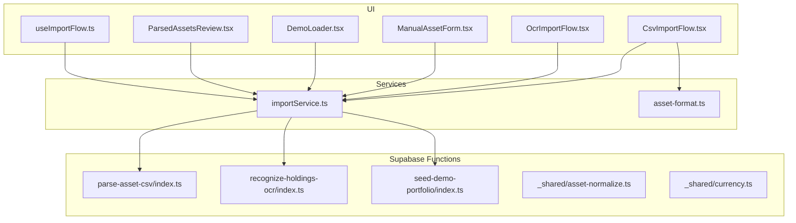
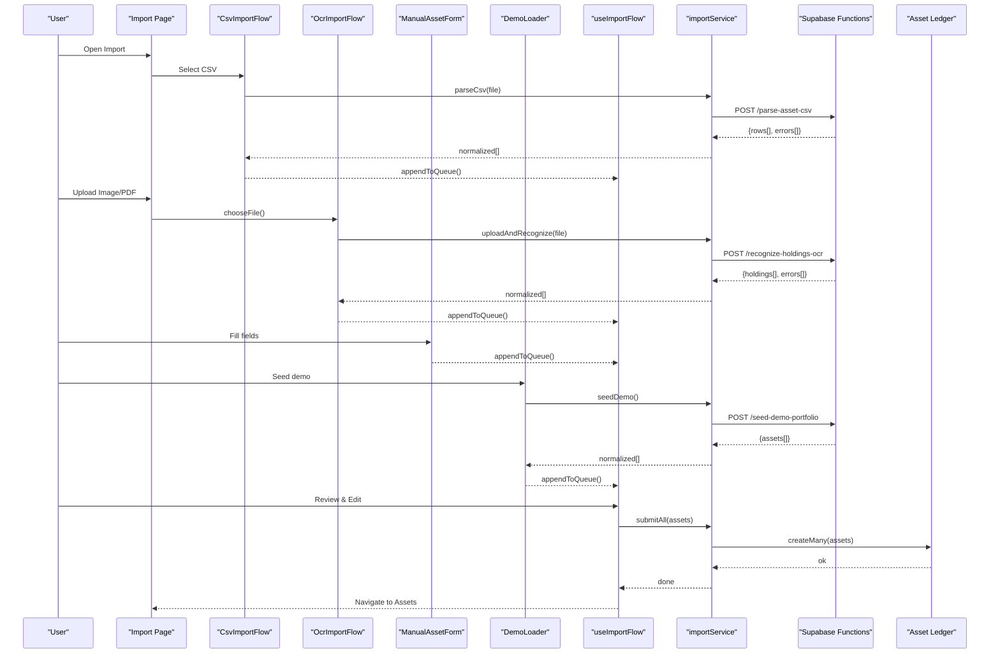
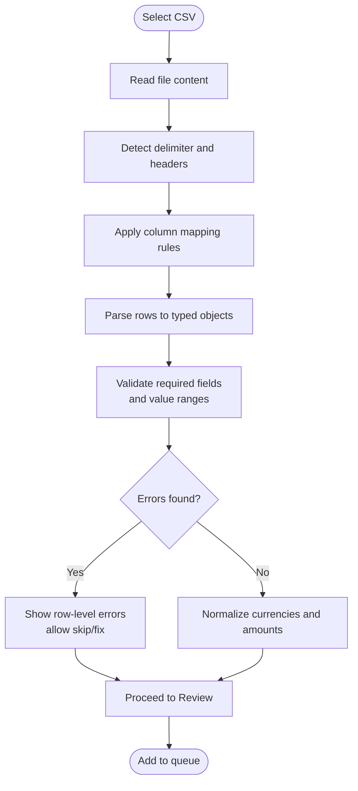
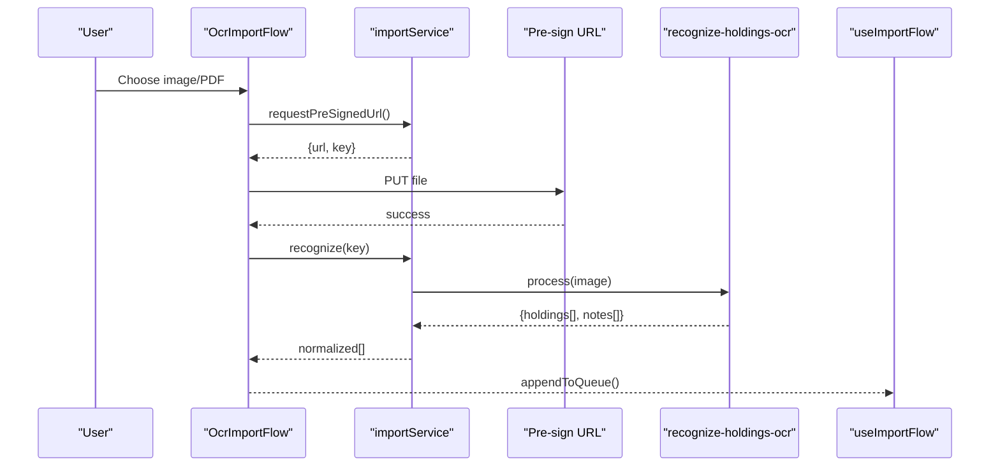
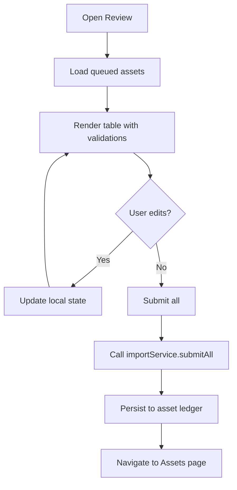
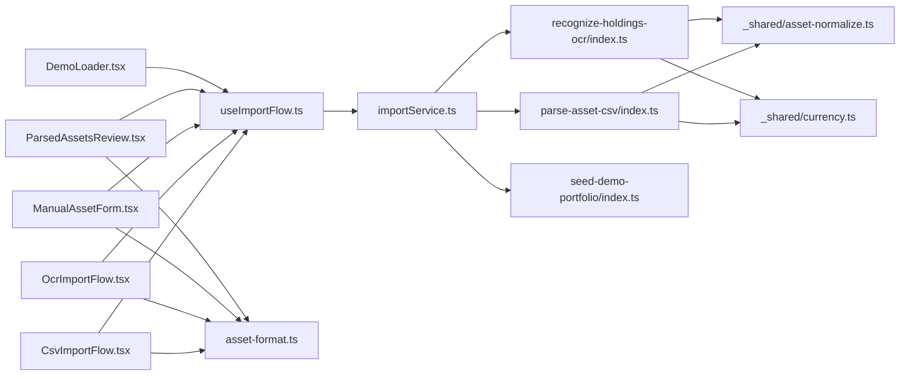
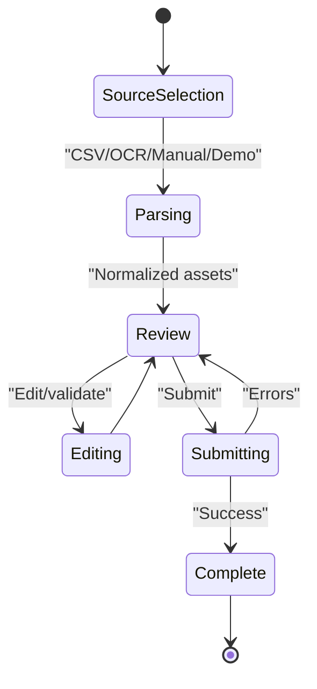

# Import Flow Components

<cite>
**Referenced Files in This Document**
- [CsvImportFlow.tsx](file://src/components/desktop/import/CsvImportFlow.tsx)
- [OcrImportFlow.tsx](file://src/components/desktop/import/OcrImportFlow.tsx)
- [ManualAssetForm.tsx](file://src/components/desktop/import/ManualAssetForm.tsx)
- [ParsedAssetsReview.tsx](file://src/components/desktop/import/ParsedAssetsReview.tsx)
- [DemoLoader.tsx](file://src/components/desktop/import/DemoLoader.tsx)
- [useImportFlow.ts](file://src/hooks/useImportFlow.ts)
- [importService.ts](file://src/services/importService.ts)
- [asset-format.ts](file://src/lib/asset-format.ts)
- [parse-asset-csv/index.ts](file://supabase/functions/parse-asset-csv/index.ts)
- [recognize-holdings-ocr/index.ts](file://supabase/functions/recognize-holdings-ocr/index.ts)
- [seed-demo-portfolio/index.ts](file://supabase/functions/seed-demo-portfolio/index.ts)
- [asset-normalize.ts](file://supabase/functions/_shared/asset-normalize.ts)
- [currency.ts](file://supabase/functions/_shared/currency.ts)
- [assetsPage.tsx](file://src/pages/desktop/AssetsPage.tsx)
- [importPage.tsx](file://src/pages/desktop/ImportPage.tsx)
</cite>

## Table of Contents
1. [Introduction](#introduction)
2. [Project Structure](#project-structure)
3. [Core Components](#core-components)
4. [Architecture Overview](#architecture-overview)
5. [Detailed Component Analysis](#detailed-component-analysis)
6. [Dependency Analysis](#dependency-analysis)
7. [Performance Considerations](#performance-considerations)
8. [Troubleshooting Guide](#troubleshooting-guide)
9. [Conclusion](#conclusion)
10. [Appendices](#appendices)

## Introduction
This document explains FinSight’s import flow components and the multi-step pipeline that ingests assets from CSV files, scanned documents (OCR), manual entry, and sample data. It covers data transformation, validation, error handling, and user experience patterns, with guidance for custom formats and integration with the asset management system.

## Project Structure
The import feature is implemented as a set of React components under the desktop import directory, orchestrated by a hook and backed by Supabase Edge Functions for parsing and OCR. The review step integrates with the asset service to persist validated entries.

**Diagram sources**
- [CsvImportFlow.tsx:1-200](file://src/components/desktop/import/CsvImportFlow.tsx#L1-L200)
- [OcrImportFlow.tsx:1-200](file://src/components/desktop/import/OcrImportFlow.tsx#L1-L200)
- [ManualAssetForm.tsx:1-200](file://src/components/desktop/import/ManualAssetForm.tsx#L1-L200)
- [ParsedAssetsReview.tsx:1-200](file://src/components/desktop/import/ParsedAssetsReview.tsx#L1-L200)
- [DemoLoader.tsx:1-200](file://src/components/desktop/import/DemoLoader.tsx#L1-L200)
- [useImportFlow.ts:1-200](file://src/hooks/useImportFlow.ts#L1-L200)
- [importService.ts:1-200](file://src/services/importService.ts#L1-L200)
- [asset-format.ts:1-200](file://src/lib/asset-format.ts#L1-L200)
- [parse-asset-csv/index.ts:1-200](file://supabase/functions/parse-asset-csv/index.ts#L1-L200)
- [recognize-holdings-ocr/index.ts:1-200](file://supabase/functions/recognize-holdings-ocr/index.ts#L1-L200)
- [seed-demo-portfolio/index.ts:1-200](file://supabase/functions/seed-demo-portfolio/index.ts#L1-L200)
- [asset-normalize.ts:1-200](file://supabase/functions/_shared/asset-normalize.ts#L1-L200)
- [currency.ts:1-200](file://supabase/functions/_shared/currency.ts#L1-L200)

**Section sources**
- [CsvImportFlow.tsx:1-200](file://src/components/desktop/import/CsvImportFlow.tsx#L1-L200)
- [OcrImportFlow.tsx:1-200](file://src/components/desktop/import/OcrImportFlow.tsx#L1-L200)
- [ManualAssetForm.tsx:1-200](file://src/components/desktop/import/ManualAssetForm.tsx#L1-L200)
- [ParsedAssetsReview.tsx:1-200](file://src/components/desktop/import/ParsedAssetsReview.tsx#L1-L200)
- [DemoLoader.tsx:1-200](file://src/components/desktop/import/DemoLoader.tsx#L1-L200)
- [useImportFlow.ts:1-200](file://src/hooks/useImportFlow.ts#L1-L200)
- [importService.ts:1-200](file://src/services/importService.ts#L1-L200)
- [asset-format.ts:1-200](file://src/lib/asset-format.ts#L1-L200)
- [parse-asset-csv/index.ts:1-200](file://supabase/functions/parse-asset-csv/index.ts#L1-L200)
- [recognize-holdings-ocr/index.ts:1-200](file://supabase/functions/recognize-holdings-ocr/index.ts#L1-L200)
- [seed-demo-portfolio/index.ts:1-200](file://supabase/functions/seed-demo-portfolio/index.ts#L1-L200)
- [asset-normalize.ts:1-200](file://supabase/functions/_shared/asset-normalize.ts#L1-L200)
- [currency.ts:1-200](file://supabase/functions/_shared/currency.ts#L1-L200)

## Core Components
- CsvImportFlow: Guides users through selecting a CSV file, mapping columns, previewing parsed rows, and proceeding to review.
- OcrImportFlow: Accepts images or PDFs, uploads them via pre-signed URLs, calls OCR, and presents extracted holdings for review.
- ManualAssetForm: Provides a form to add one or more assets manually with field-level validation.
- ParsedAssetsReview: Displays all collected assets across sources, allows edits, filtering, and final submission to the asset ledger.
- DemoLoader: Seeds sample portfolio data for quick onboarding and testing.

These components share state via useImportFlow and call importService to interact with Supabase functions and normalize data using shared utilities.

**Section sources**
- [CsvImportFlow.tsx:1-200](file://src/components/desktop/import/CsvImportFlow.tsx#L1-L200)
- [OcrImportFlow.tsx:1-200](file://src/components/desktop/import/OcrImportFlow.tsx#L1-L200)
- [ManualAssetForm.tsx:1-200](file://src/components/desktop/import/ManualAssetForm.tsx#L1-L200)
- [ParsedAssetsReview.tsx:1-200](file://src/components/desktop/import/ParsedAssetsReview.tsx#L1-L200)
- [DemoLoader.tsx:1-200](file://src/components/desktop/import/DemoLoader.tsx#L1-L200)
- [useImportFlow.ts:1-200](file://src/hooks/useImportFlow.ts#L1-L200)
- [importService.ts:1-200](file://src/services/importService.ts#L1-L200)

## Architecture Overview
The import pipeline follows a consistent pattern:
- Ingest source (CSV, image/PDF, manual input, demo seed).
- Parse and normalize into a unified asset model.
- Present a review screen for validation and corrections.
- Persist validated assets to the asset ledger.

**Diagram sources**
- [CsvImportFlow.tsx:1-200](file://src/components/desktop/import/CsvImportFlow.tsx#L1-L200)
- [OcrImportFlow.tsx:1-200](file://src/components/desktop/import/OcrImportFlow.tsx#L1-L200)
- [ManualAssetForm.tsx:1-200](file://src/components/desktop/import/ManualAssetForm.tsx#L1-L200)
- [DemoLoader.tsx:1-200](file://src/components/desktop/import/DemoLoader.tsx#L1-L200)
- [useImportFlow.ts:1-200](file://src/hooks/useImportFlow.ts#L1-L200)
- [importService.ts:1-200](file://src/services/importService.ts#L1-L200)
- [parse-asset-csv/index.ts:1-200](file://supabase/functions/parse-asset-csv/index.ts#L1-L200)
- [recognize-holdings-ocr/index.ts:1-200](file://supabase/functions/recognize-holdings-ocr/index.ts#L1-L200)
- [seed-demo-portfolio/index.ts:1-200](file://supabase/functions/seed-demo-portfolio/index.ts#L1-L200)

## Detailed Component Analysis

### CsvImportFlow
Responsibilities:
- File selection and progress indication.
- Column mapping configuration.
- Preview of parsed rows with per-row status.
- Error reporting and retry controls.

Data flow:
- Calls importService.parseCsv which invokes the parse-asset-csv function.
- Normalizes results using asset-format helpers before queuing.

Validation and UX:
- Highlights invalid rows and missing required fields.
- Allows skipping bad rows and continuing.

Customization:
- Supports configurable column mappings and delimiter options.
- Extensible to additional CSV schemas via mapping presets.

**Section sources**
- [CsvImportFlow.tsx:1-200](file://src/components/desktop/import/CsvImportFlow.tsx#L1-L200)
- [importService.ts:1-200](file://src/services/importService.ts#L1-L200)
- [parse-asset-csv/index.ts:1-200](file://supabase/functions/parse-asset-csv/index.ts#L1-L200)
- [asset-format.ts:1-200](file://src/lib/asset-format.ts#L1-L200)

#### CSV Parsing Flowchart

**Diagram sources**
- [CsvImportFlow.tsx:1-200](file://src/components/desktop/import/CsvImportFlow.tsx#L1-L200)
- [parse-asset-csv/index.ts:1-200](file://supabase/functions/parse-asset-csv/index.ts#L1-L200)
- [asset-format.ts:1-200](file://src/lib/asset-format.ts#L1-L200)

### OcrImportFlow
Responsibilities:
- Accept images/PDFs and upload via pre-signed URL.
- Call OCR function to extract holdings.
- Present extracted items with confidence indicators and edit capabilities.

Data flow:
- Uses importService.uploadAndRecognize to handle upload and recognition.
- Normalizes OCR output to the same asset model used by CSV and manual flows.

Error handling:
- Reports upload failures, unsupported formats, and low-confidence extractions.
- Offers re-upload and manual correction paths.

**Section sources**
- [OcrImportFlow.tsx:1-200](file://src/components/desktop/import/OcrImportFlow.tsx#L1-L200)
- [importService.ts:1-200](file://src/services/importService.ts#L1-L200)
- [recognize-holdings-ocr/index.ts:1-200](file://supabase/functions/recognize-holdings-ocr/index.ts#L1-L200)
- [asset-format.ts:1-200](file://src/lib/asset-format.ts#L1-L200)

#### OCR Sequence

**Diagram sources**
- [OcrImportFlow.tsx:1-200](file://src/components/desktop/import/OcrImportFlow.tsx#L1-L200)
- [importService.ts:1-200](file://src/services/importService.ts#L1-L200)
- [recognize-holdings-ocr/index.ts:1-200](file://supabase/functions/recognize-holdings-ocr/index.ts#L1-L200)

### ManualAssetForm
Responsibilities:
- Provide a guided form for adding assets manually.
- Enforce field-level validation (e.g., non-negative amounts, valid currency codes).
- Support batch additions and inline editing.

UX patterns:
- Inline hints and examples for each field.
- Clear error messages and auto-suggestions where applicable.

Integration:
- Appends validated entries directly to the import queue managed by useImportFlow.

**Section sources**
- [ManualAssetForm.tsx:1-200](file://src/components/desktop/import/ManualAssetForm.tsx#L1-L200)
- [useImportFlow.ts:1-200](file://src/hooks/useImportFlow.ts#L1-L200)
- [asset-format.ts:1-200](file://src/lib/asset-format.ts#L1-L200)

### ParsedAssetsReview
Responsibilities:
- Aggregate assets from all sources into a single table.
- Allow sorting, filtering, and per-row edits.
- Compute summary metrics (counts, totals) and highlight anomalies.
- Submit validated assets to the asset ledger.

Data flow:
- Reads from useImportFlow queue.
- Calls importService.submitAll to persist changes.

Validation:
- Cross-field checks (e.g., date vs. amount sign).
- Duplicate detection and merge suggestions.

**Section sources**
- [ParsedAssetsReview.tsx:1-200](file://src/components/desktop/import/ParsedAssetsReview.tsx#L1-L200)
- [useImportFlow.ts:1-200](file://src/hooks/useImportFlow.ts#L1-L200)
- [importService.ts:1-200](file://src/services/importService.ts#L1-L200)

#### Review Submission Flow

**Diagram sources**
- [ParsedAssetsReview.tsx:1-200](file://src/components/desktop/import/ParsedAssetsReview.tsx#L1-L200)
- [useImportFlow.ts:1-200](file://src/hooks/useImportFlow.ts#L1-L200)
- [importService.ts:1-200](file://src/services/importService.ts#L1-L200)

### DemoLoader
Responsibilities:
- Populate the system with realistic sample assets for exploration.
- Use seed-demo-portfolio function to generate consistent datasets.

UX patterns:
- One-click seeding with confirmation dialog.
- Progress feedback and rollback on failure.

**Section sources**
- [DemoLoader.tsx:1-200](file://src/components/desktop/import/DemoLoader.tsx#L1-L200)
- [importService.ts:1-200](file://src/services/importService.ts#L1-L200)
- [seed-demo-portfolio/index.ts:1-200](file://supabase/functions/seed-demo-portfolio/index.ts#L1-L200)

## Dependency Analysis
Key relationships:
- Components depend on useImportFlow for queue state and lifecycle.
- useImportFlow delegates to importService for network operations.
- importService calls Supabase functions for parsing, OCR, and seeding.
- Shared normalization logic resides in Supabase _shared modules and client-side asset-format.

**Diagram sources**
- [CsvImportFlow.tsx:1-200](file://src/components/desktop/import/CsvImportFlow.tsx#L1-L200)
- [OcrImportFlow.tsx:1-200](file://src/components/desktop/import/OcrImportFlow.tsx#L1-L200)
- [ManualAssetForm.tsx:1-200](file://src/components/desktop/import/ManualAssetForm.tsx#L1-L200)
- [ParsedAssetsReview.tsx:1-200](file://src/components/desktop/import/ParsedAssetsReview.tsx#L1-L200)
- [DemoLoader.tsx:1-200](file://src/components/desktop/import/DemoLoader.tsx#L1-L200)
- [useImportFlow.ts:1-200](file://src/hooks/useImportFlow.ts#L1-L200)
- [importService.ts:1-200](file://src/services/importService.ts#L1-L200)
- [asset-format.ts:1-200](file://src/lib/asset-format.ts#L1-L200)
- [parse-asset-csv/index.ts:1-200](file://supabase/functions/parse-asset-csv/index.ts#L1-L200)
- [recognize-holdings-ocr/index.ts:1-200](file://supabase/functions/recognize-holdings-ocr/index.ts#L1-L200)
- [seed-demo-portfolio/index.ts:1-200](file://supabase/functions/seed-demo-portfolio/index.ts#L1-L200)
- [asset-normalize.ts:1-200](file://supabase/functions/_shared/asset-normalize.ts#L1-L200)
- [currency.ts:1-200](file://supabase/functions/_shared/currency.ts#L1-L200)

**Section sources**
- [useImportFlow.ts:1-200](file://src/hooks/useImportFlow.ts#L1-L200)
- [importService.ts:1-200](file://src/services/importService.ts#L1-L200)
- [asset-format.ts:1-200](file://src/lib/asset-format.ts#L1-L200)
- [parse-asset-csv/index.ts:1-200](file://supabase/functions/parse-asset-csv/index.ts#L1-L200)
- [recognize-holdings-ocr/index.ts:1-200](file://supabase/functions/recognize-holdings-ocr/index.ts#L1-L200)
- [seed-demo-portfolio/index.ts:1-200](file://supabase/functions/seed-demo-portfolio/index.ts#L1-L200)
- [asset-normalize.ts:1-200](file://supabase/functions/_shared/asset-normalize.ts#L1-L200)
- [currency.ts:1-200](file://supabase/functions/_shared/currency.ts#L1-L200)

## Performance Considerations
- Batch processing: Prefer submitting validated assets in batches to reduce round trips.
- Lazy rendering: Virtualize large tables in ParsedAssetsReview for smooth scrolling.
- Early validation: Perform client-side checks before network calls to minimize retries.
- Idempotency: Ensure server-side deduplication to avoid duplicate writes on retries.
- Memory usage: Stream large CSVs and avoid loading entire files into memory when possible.

[No sources needed since this section provides general guidance]

## Troubleshooting Guide
Common issues and resolutions:
- CSV parsing failures: Check delimiter settings, header names, and numeric formatting; inspect row-level errors in the preview.
- OCR extraction errors: Verify image quality and supported formats; re-upload if pre-signed URL expires.
- Validation errors: Fix required fields, negative amounts, or invalid currency codes; use inline hints.
- Network timeouts: Retry failed submissions; check rate limits and function logs.
- Data inconsistencies: Normalize currencies and amounts consistently; leverage shared normalization utilities.

Operational tips:
- Use DemoLoader to reproduce issues with known-good data.
- Inspect queue state in useImportFlow to confirm pending items.
- Confirm navigation to Assets after successful submission.

**Section sources**
- [CsvImportFlow.tsx:1-200](file://src/components/desktop/import/CsvImportFlow.tsx#L1-L200)
- [OcrImportFlow.tsx:1-200](file://src/components/desktop/import/OcrImportFlow.tsx#L1-L200)
- [ManualAssetForm.tsx:1-200](file://src/components/desktop/import/ManualAssetForm.tsx#L1-L200)
- [ParsedAssetsReview.tsx:1-200](file://src/components/desktop/import/ParsedAssetsReview.tsx#L1-L200)
- [useImportFlow.ts:1-200](file://src/hooks/useImportFlow.ts#L1-L200)
- [importService.ts:1-200](file://src/services/importService.ts#L1-L200)

## Conclusion
FinSight’s import flow unifies multiple ingestion channels into a consistent, review-first pipeline. By separating parsing, normalization, validation, and persistence, it enables extensibility for new formats and robust error handling. The provided components and services offer clear extension points for custom import formats, advanced validation rules, and deeper integration with the asset management system.

[No sources needed since this section summarizes without analyzing specific files]

## Appendices

### Multi-step Pipeline Summary
- Step 1: Choose source (CSV, OCR, Manual, Demo).
- Step 2: Parse and normalize to unified asset model.
- Step 3: Review, validate, and correct.
- Step 4: Submit to asset ledger and navigate to Assets.

[No sources needed since this diagram shows conceptual workflow, not actual code structure]

### Custom Import Formats and Validation Rules
- Define a mapping preset for new CSV schemas in CsvImportFlow.
- Implement client-side validators in asset-format and enforce in ManualAssetForm.
- Extend importService with new endpoints for specialized parsers.
- Add server-side normalization in Supabase functions and shared utilities.

**Section sources**
- [CsvImportFlow.tsx:1-200](file://src/components/desktop/import/CsvImportFlow.tsx#L1-L200)
- [asset-format.ts:1-200](file://src/lib/asset-format.ts#L1-L200)
- [importService.ts:1-200](file://src/services/importService.ts#L1-L200)
- [parse-asset-csv/index.ts:1-200](file://supabase/functions/parse-asset-csv/index.ts#L1-L200)
- [asset-normalize.ts:1-200](file://supabase/functions/_shared/asset-normalize.ts#L1-L200)
- [currency.ts:1-200](file://supabase/functions/_shared/currency.ts#L1-L200)

### Integration with Asset Management System
- After submission, ParsedAssetsReview navigates to the Assets page to reflect newly imported data.
- Ensure idempotent writes and consistent schema alignment with the asset ledger.

**Section sources**
- [ParsedAssetsReview.tsx:1-200](file://src/components/desktop/import/ParsedAssetsReview.tsx#L1-L200)
- [assetsPage.tsx:1-200](file://src/pages/desktop/AssetsPage.tsx#L1-200)
- [importPage.tsx:1-200](file://src/pages/desktop/ImportPage.tsx#L1-200)