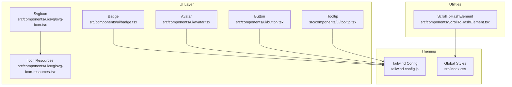
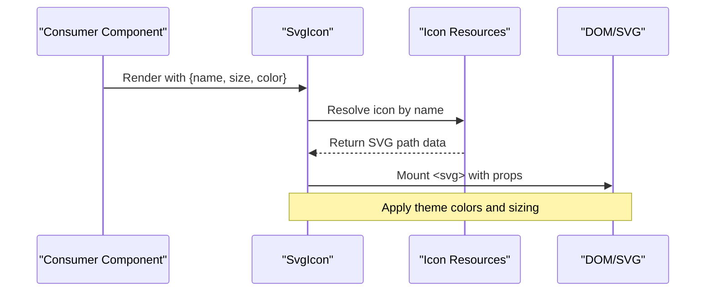
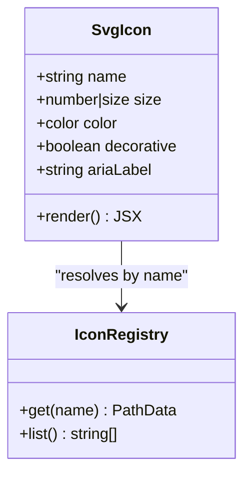
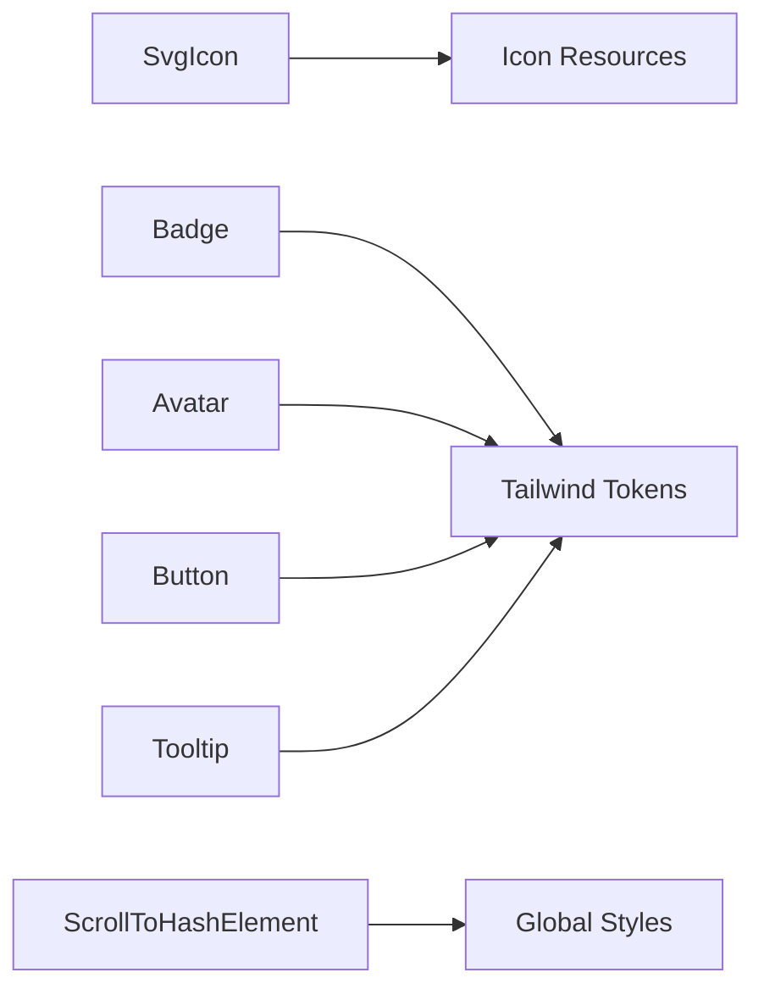

# Shared UI Elements

<cite>
**Referenced Files in This Document**
- [svg-icon.tsx](file://src/components/ui/svg/svg-icon.tsx)
- [svg-icon-resources.tsx](file://src/components/ui/svg/svg-icon-resources.tsx)
- [ScrollToHashElement.tsx](file://src/components/ScrollToHashElement.tsx)
- [badge.tsx](file://src/components/ui/badge.tsx)
- [avatar.tsx](file://src/components/ui/avatar.tsx)
- [button.tsx](file://src/components/ui/button.tsx)
- [tooltip.tsx](file://src/components/ui/tooltip.tsx)
- [tailwind.config.js](file://tailwind.config.js)
- [index.css](file://src/index.css)
</cite>

## Table of Contents
1. [Introduction](#introduction)
2. [Project Structure](#project-structure)
3. [Core Components](#core-components)
4. [Architecture Overview](#architecture-overview)
5. [Detailed Component Analysis](#detailed-component-analysis)
6. [Dependency Analysis](#dependency-analysis)
7. [Performance Considerations](#performance-considerations)
8. [Troubleshooting Guide](#troubleshooting-guide)
9. [Conclusion](#conclusion)
10. [Appendices](#appendices)

## Introduction
This document describes FinSight’s shared UI elements and utilities with a focus on the SVG icon system, navigation helper, and reusable visual components such as Badge and Avatar. It explains how icons are managed and themed, how to integrate them into the application, accessibility considerations, and performance optimization strategies. It also provides guidelines for adding new icons, customizing visual elements, and maintaining consistency across the app.

## Project Structure
The shared UI layer is organized under src/components/ui and includes:
- Icon system: SvgIcon component and centralized icon resources
- Visual primitives: Badge, Avatar, Button, Tooltip, etc.
- Utilities: ScrollToHashElement for hash-based navigation

**Diagram sources**
- [svg-icon.tsx](file://src/components/ui/svg/svg-icon.tsx)
- [svg-icon-resources.tsx](file://src/components/ui/svg/svg-icon-resources.tsx)
- [badge.tsx](file://src/components/ui/badge.tsx)
- [avatar.tsx](file://src/components/ui/avatar.tsx)
- [button.tsx](file://src/components/ui/button.tsx)
- [tooltip.tsx](file://src/components/ui/tooltip.tsx)
- [ScrollToHashElement.tsx](file://src/components/ScrollToHashElement.tsx)
- [tailwind.config.js](file://tailwind.config.js)
- [index.css](file://src/index.css)

**Section sources**
- [svg-icon.tsx](file://src/components/ui/svg/svg-icon.tsx)
- [svg-icon-resources.tsx](file://src/components/ui/svg/svg-icon-resources.tsx)
- [ScrollToHashElement.tsx](file://src/components/ScrollToHashElement.tsx)
- [badge.tsx](file://src/components/ui/badge.tsx)
- [avatar.tsx](file://src/components/ui/avatar.tsx)
- [button.tsx](file://src/components/ui/button.tsx)
- [tooltip.tsx](file://src/components/ui/tooltip.tsx)
- [tailwind.config.js](file://tailwind.config.js)
- [index.css](file://src/index.css)

## Core Components
- SvgIcon: Centralized rendering of SVG icons by name with theme-aware color and sizing.
- Icon Resources: Central registry of available icons and their SVG paths.
- Badge: Compact status or count indicator with variant and size options.
- Avatar: User representation with initials fallback and image support.
- ScrollToHashElement: Utility that scrolls to an element matching the current URL hash.

These components are designed to be composable, themeable via Tailwind classes, and accessible by default.

**Section sources**
- [svg-icon.tsx](file://src/components/ui/svg/svg-icon.tsx)
- [svg-icon-resources.tsx](file://src/components/ui/svg/svg-icon-resources.tsx)
- [badge.tsx](file://src/components/ui/badge.tsx)
- [avatar.tsx](file://src/components/ui/avatar.tsx)
- [ScrollToHashElement.tsx](file://src/components/ScrollToHashElement.tsx)

## Architecture Overview
The icon system follows a resource-driven architecture:
- Icons are defined once in a central registry.
- The SvgIcon component resolves and renders icons by name.
- Theme integration uses CSS variables and Tailwind utilities for consistent colors and sizes.
- Accessibility attributes (role, aria-label) are applied where appropriate.

**Diagram sources**
- [svg-icon.tsx](file://src/components/ui/svg/svg-icon.tsx)
- [svg-icon-resources.tsx](file://src/components/ui/svg/svg-icon-resources.tsx)

## Detailed Component Analysis

### SvgIcon and Icon Resources
Responsibilities:
- Provide a single entry point to render any registered icon.
- Normalize props like size, color, and accessibility attributes.
- Integrate with theme tokens for consistent styling.

Key behaviors:
- Resolves icon path from the central registry.
- Applies size scaling and color inheritance.
- Ensures proper semantic role and labels for screen readers.

Usage patterns:
- Import SvgIcon and pass a known icon name.
- Use theme-aware color tokens via Tailwind classes or CSS variables.
- Combine with Tooltip for contextual descriptions when needed.

Accessibility:
- Set meaningful aria-labels for informative icons.
- Use decorative mode (e.g., aria-hidden) for purely decorative icons.

Performance:
- Prefer lightweight SVG paths.
- Avoid unnecessary re-renders by memoizing icon usage where appropriate.

Guidelines for adding new icons:
- Add a new entry to the icon registry with a unique name and path.
- Ensure the path fits within a standard viewBox and scales cleanly.
- Test at multiple sizes and contrast levels.
- Update documentation and examples if applicable.

**Diagram sources**
- [svg-icon.tsx](file://src/components/ui/svg/svg-icon.tsx)
- [svg-icon-resources.tsx](file://src/components/ui/svg/svg-icon-resources.tsx)

**Section sources**
- [svg-icon.tsx](file://src/components/ui/svg/svg-icon.tsx)
- [svg-icon-resources.tsx](file://src/components/ui/svg/svg-icon-resources.tsx)

### Badge
Purpose:
- Display compact status indicators, counts, or tags.

Props and variants:
- Variant: e.g., default, success, warning, error, info.
- Size: small, medium, large.
- Color overrides via Tailwind classes.

Styling and theme:
- Uses Tailwind utility classes for background, text, and border colors.
- Integrates with global theme tokens for consistent appearance.

Accessibility:
- Use semantic roles only when representing live status; otherwise keep it presentational.
- Provide context through surrounding text or tooltips.

Best practices:
- Keep text concise.
- Maintain sufficient contrast against backgrounds.
- Avoid using color alone to convey meaning; pair with text or icons.

**Section sources**
- [badge.tsx](file://src/components/ui/badge.tsx)
- [tailwind.config.js](file://tailwind.config.js)

### Avatar
Purpose:
- Represent users with images or initials fallback.

Features:
- Image source with loading states and error fallback.
- Initials generation based on user names.
- Size variants and shape customization.

Theme integration:
- Background and border colors follow theme tokens.
- Consistent spacing and typography for initials.

Accessibility:
- Provide alt text for images.
- For decorative avatars, mark appropriately.

Best practices:
- Cache images to avoid repeated network requests.
- Use placeholder skeletons during load.
- Limit avatar size to maintain readability of initials.

**Section sources**
- [avatar.tsx](file://src/components/ui/avatar.tsx)
- [tailwind.config.js](file://tailwind.config.js)

### ScrollToHashElement
Purpose:
- Automatically scroll to the element whose id matches the current URL hash.

Behavior:
- Watches URL hash changes and scrolls into view.
- Supports smooth scrolling and optional offset for fixed headers.

Integration:
- Place near the root of your layout or page to ensure early execution.
- Pair with anchor links for deep-linking to sections.

Accessibility:
- Ensure target elements have visible focus indicators.
- Avoid excessive motion; respect reduced-motion preferences.

**Section sources**
- [ScrollToHashElement.tsx](file://src/components/ScrollToHashElement.tsx)
- [index.css](file://src/index.css)

### Supporting Visual Elements
- Button: Primary interactive control with variants and disabled states.
- Tooltip: Contextual information overlay for icons and controls.

These components share common design tokens and accessibility patterns, ensuring consistency across the interface.

**Section sources**
- [button.tsx](file://src/components/ui/button.tsx)
- [tooltip.tsx](file://src/components/ui/tooltip.tsx)
- [tailwind.config.js](file://tailwind.config.js)

## Dependency Analysis
High-level relationships among shared UI elements:

**Diagram sources**
- [svg-icon.tsx](file://src/components/ui/svg/svg-icon.tsx)
- [svg-icon-resources.tsx](file://src/components/ui/svg/svg-icon-resources.tsx)
- [badge.tsx](file://src/components/ui/badge.tsx)
- [avatar.tsx](file://src/components/ui/avatar.tsx)
- [button.tsx](file://src/components/ui/button.tsx)
- [tooltip.tsx](file://src/components/ui/tooltip.tsx)
- [ScrollToHashElement.tsx](file://src/components/ScrollToHashElement.tsx)
- [tailwind.config.js](file://tailwind.config.js)
- [index.css](file://src/index.css)

**Section sources**
- [svg-icon.tsx](file://src/components/ui/svg/svg-icon.tsx)
- [svg-icon-resources.tsx](file://src/components/ui/svg/svg-icon-resources.tsx)
- [badge.tsx](file://src/components/ui/badge.tsx)
- [avatar.tsx](file://src/components/ui/avatar.tsx)
- [button.tsx](file://src/components/ui/button.tsx)
- [tooltip.tsx](file://src/components/ui/tooltip.tsx)
- [ScrollToHashElement.tsx](file://src/components/ScrollToHashElement.tsx)
- [tailwind.config.js](file://tailwind.config.js)
- [index.css](file://src/index.css)

## Performance Considerations
- Icon system:
  - Keep SVG paths minimal and optimized.
  - Avoid inline complex filters or gradients unless necessary.
  - Memoize frequently used icons to prevent redundant renders.
- Avatar:
  - Implement image caching and skeleton placeholders.
  - Defer non-critical image loads when possible.
- ScrollToHashElement:
  - Debounce scroll events if listening to frequent updates.
  - Respect prefers-reduced-motion for smoother UX.
- Theming:
  - Prefer Tailwind utility classes for predictable style recalculation.
  - Minimize runtime style mutations; use CSS variables for dynamic tokens.

[No sources needed since this section provides general guidance]

## Troubleshooting Guide
Common issues and resolutions:
- Icon not found:
  - Verify the icon name exists in the registry.
  - Check for typos and ensure the registry exports the icon correctly.
- Incorrect color or size:
  - Confirm Tailwind theme tokens are configured.
  - Ensure parent components do not override styles unexpectedly.
- Badge not visible:
  - Check contrast against background; adjust variant or color.
  - Validate container padding and font-size settings.
- Avatar image fails to load:
  - Provide a valid fallback (initials).
  - Inspect network requests and CORS policies.
- Hash scroll not working:
  - Ensure target element has a matching id.
  - Verify ScrollToHashElement is mounted and active.
  - Check for fixed headers that may require an offset.

**Section sources**
- [svg-icon.tsx](file://src/components/ui/svg/svg-icon.tsx)
- [svg-icon-resources.tsx](file://src/components/ui/svg/svg-icon-resources.tsx)
- [badge.tsx](file://src/components/ui/badge.tsx)
- [avatar.tsx](file://src/components/ui/avatar.tsx)
- [ScrollToHashElement.tsx](file://src/components/ScrollToHashElement.tsx)

## Conclusion
FinSight’s shared UI elements provide a cohesive, accessible, and performant foundation for building consistent interfaces. The icon system centralizes asset management and integrates seamlessly with the theme. Badge and Avatar offer flexible, theme-aware primitives for status and user representation. ScrollToHashElement enhances navigation with hash-based deep linking. Following the provided guidelines ensures maintainability, accessibility, and optimal performance across the application.

[No sources needed since this section summarizes without analyzing specific files]

## Appendices

### Adding a New Icon
Steps:
- Open the icon resources file and add a new entry with a unique name and SVG path.
- Ensure the path aligns with the standard viewBox and scales well.
- Use SvgIcon in components by passing the new icon name.
- Test across sizes, themes, and dark/light modes.
- Update any relevant documentation or examples.

**Section sources**
- [svg-icon-resources.tsx](file://src/components/ui/svg/svg-icon-resources.tsx)
- [svg-icon.tsx](file://src/components/ui/svg/svg-icon.tsx)

### Customizing Visual Elements
- Colors and sizes:
  - Extend Tailwind configuration to add new tokens or variants.
  - Apply utility classes directly to components for quick overrides.
- Spacing and typography:
  - Use consistent spacing scale and type scale defined in theme config.
- Accessibility:
  - Ensure sufficient contrast ratios.
  - Provide descriptive labels for interactive elements.

**Section sources**
- [tailwind.config.js](file://tailwind.config.js)
- [index.css](file://src/index.css)