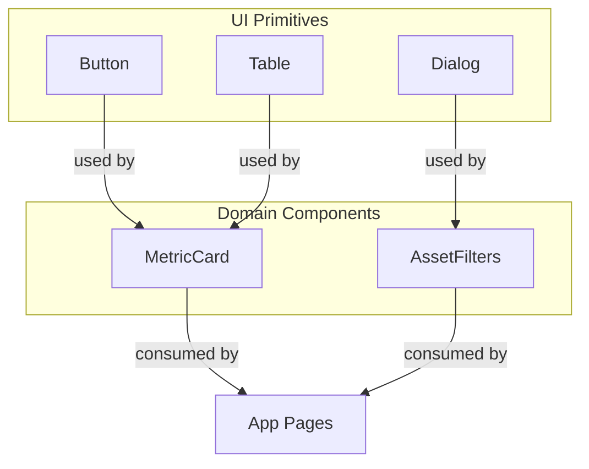
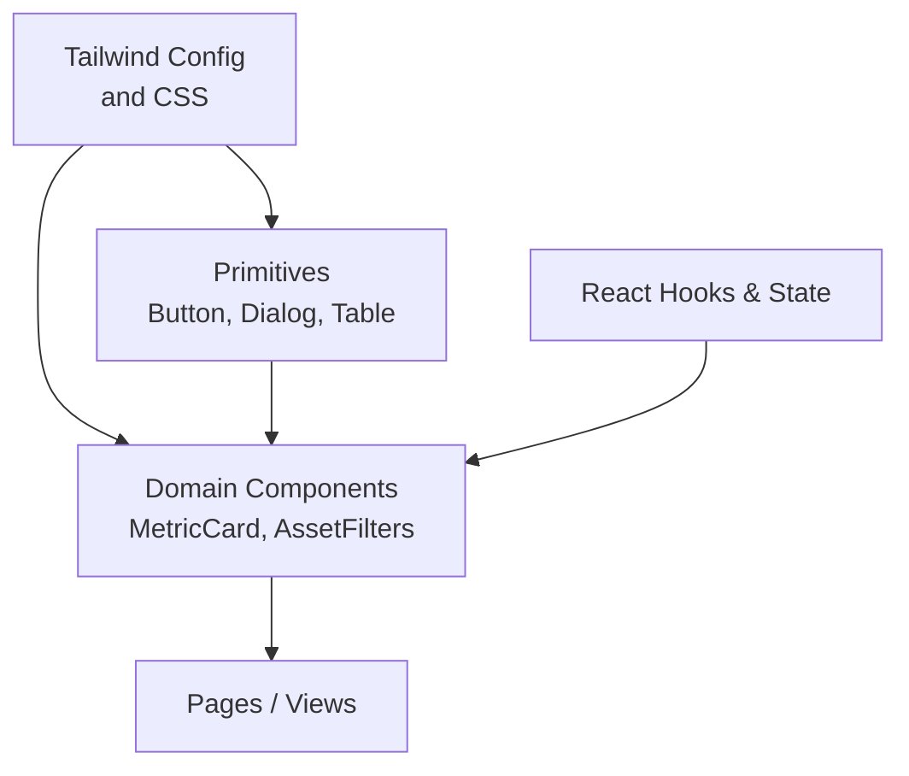
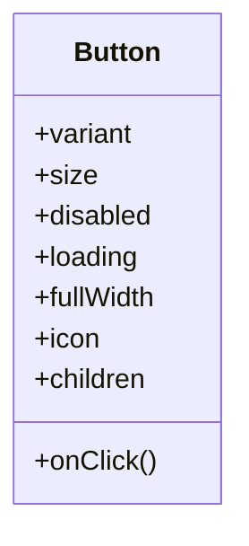
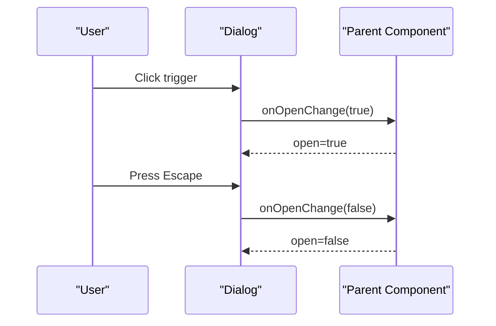
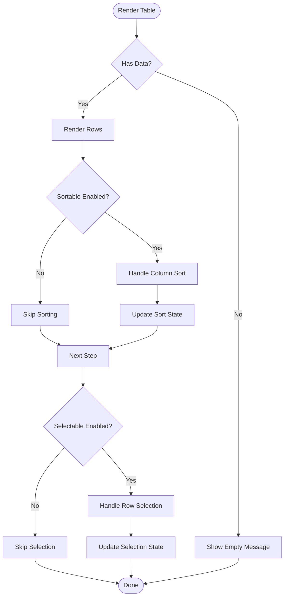
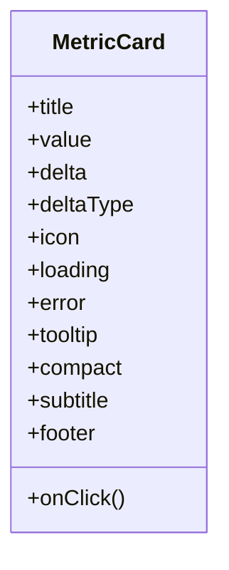
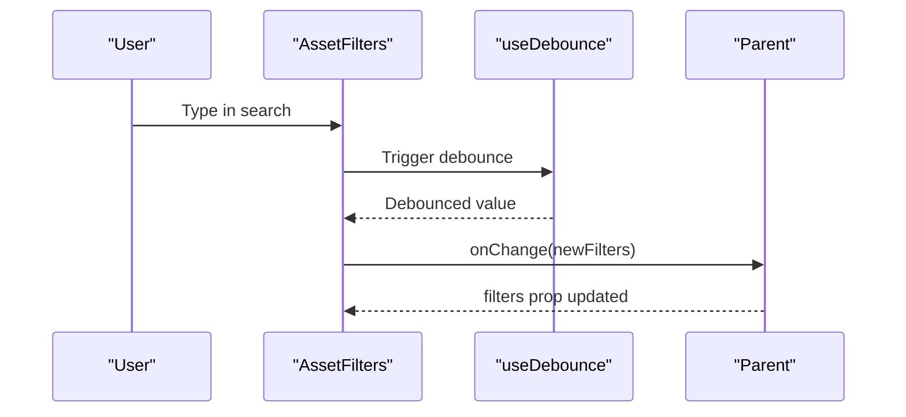
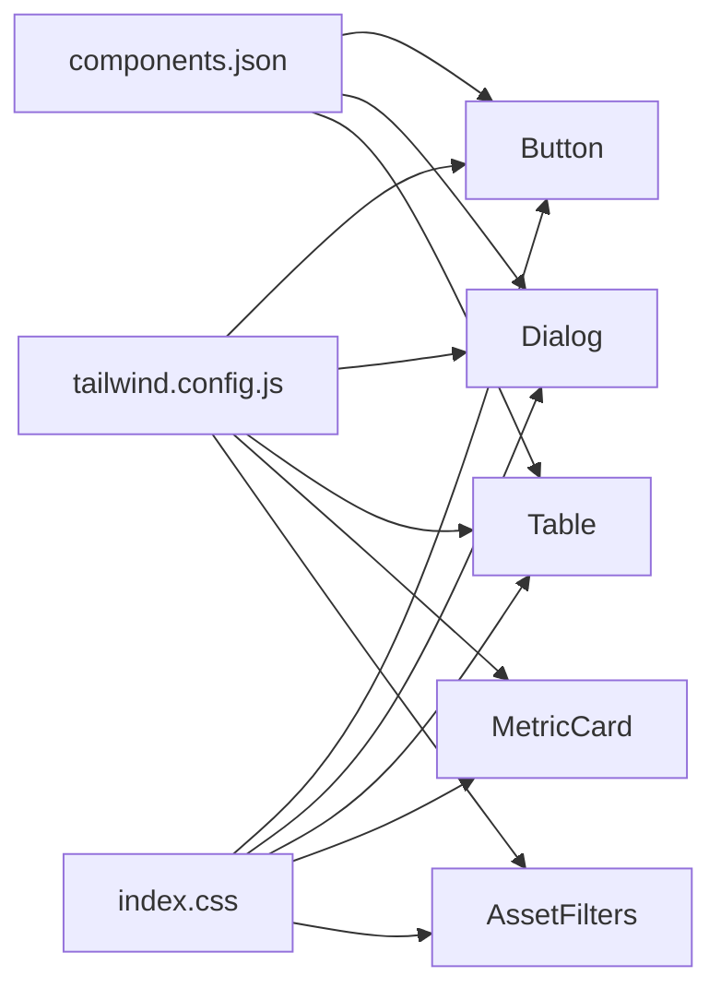

# UI Components

<cite>
**Referenced Files in This Document**
- [button.tsx](file://src/components/ui/button.tsx)
- [dialog.tsx](file://src/components/ui/dialog.tsx)
- [table.tsx](file://src/components/ui/table.tsx)
- [MetricCard.tsx](file://src/components/desktop/MetricCard.tsx)
- [AssetFilters.tsx](file://src/components/desktop/AssetFilters.tsx)
- [tailwind.config.js](file://tailwind.config.js)
- [components.json](file://components.json)
- [index.css](file://src/index.css)
</cite>

## Table of Contents
1. [Introduction](#introduction)
2. [Project Structure](#project-structure)
3. [Core Components](#core-components)
4. [Architecture Overview](#architecture-overview)
5. [Detailed Component Analysis](#detailed-component-analysis)
6. [Dependency Analysis](#dependency-analysis)
7. [Performance Considerations](#performance-considerations)
8. [Troubleshooting Guide](#troubleshooting-guide)
9. [Conclusion](#conclusion)
10. [Appendices](#appendices)

## Introduction
This document provides comprehensive documentation for FinSight’s UI component library, covering both reusable primitives and domain-specific components. It explains props, events, slots (children), customization options, appearance guidelines, behavior specifications, interaction patterns, responsive design, accessibility, cross-browser compatibility, composition patterns, theming, style customization, performance optimization, and integration with React hooks and state management.

## Project Structure
FinSight organizes UI components into two primary areas:
- Reusable primitives under src/components/ui
- Domain-specific components under src/components/desktop

**Diagram sources**
- [button.tsx](file://src/components/ui/button.tsx)
- [dialog.tsx](file://src/components/ui/dialog.tsx)
- [table.tsx](file://src/components/ui/table.tsx)
- [MetricCard.tsx](file://src/components/desktop/MetricCard.tsx)
- [AssetFilters.tsx](file://src/components/desktop/AssetFilters.tsx)

**Section sources**
- [button.tsx](file://src/components/ui/button.tsx)
- [dialog.tsx](file://src/components/ui/dialog.tsx)
- [table.tsx](file://src/components/ui/table.tsx)
- [MetricCard.tsx](file://src/components/desktop/MetricCard.tsx)
- [AssetFilters.tsx](file://src/components/desktop/AssetFilters.tsx)

## Core Components
This section summarizes the core UI primitives and domain components used across FinSight.

- Button
  - Purpose: Primary interactive element for actions and navigation.
  - Key behaviors: Focus management, keyboard support, disabled state, loading indicator, variant selection.
  - Customization: Variants, sizes, icons, full-width mode, ring/focus styles.
  - Accessibility: Semantic button role, aria attributes when needed, focus-visible outlines.
  - Responsive: Scales via size variants; icon-only modes on small screens.

- Dialog
  - Purpose: Modal overlays for confirmations, forms, or focused tasks.
  - Key behaviors: Open/close control, backdrop click-to-close, escape key to dismiss, focus trap, scroll lock.
  - Customization: Size, positioning, animation, header/footer slots.
  - Accessibility: ARIA roles, modal semantics, focus restoration.
  - Responsive: Drawer-like behavior on mobile if configured.

- Table
  - Purpose: Display tabular data with sorting, pagination, and selection.
  - Key behaviors: Column definitions, row rendering, cell formatting, sticky headers, virtualization-ready.
  - Customization: Cell renderers, row height, zebra striping, borders.
  - Accessibility: Proper table semantics, captions, scope attributes.
  - Responsive: Horizontal scrolling, collapsible columns, card layout fallback.

- MetricCard
  - Purpose: Summarize a single metric with title, value, delta, and optional sparkline or icon.
  - Key behaviors: Loading states, error fallbacks, tooltip details, copy-to-clipboard.
  - Customization: Color themes, iconography, unit formatting, compact vs spacious layouts.
  - Accessibility: Descriptive labels, semantic headings, color contrast.
  - Responsive: Stacks vertically on narrow viewports.

- AssetFilters
  - Purpose: Filter assets by multiple criteria (type, currency, status).
  - Key behaviors: Multi-select filters, search, reset, debounced updates, URL sync.
  - Customization: Filter groups, custom operators, label overrides.
  - Accessibility: Grouped controls, clearable chips, keyboard navigation.
  - Responsive: Collapsible filter panels, chip overflow handling.

**Section sources**
- [button.tsx](file://src/components/ui/button.tsx)
- [dialog.tsx](file://src/components/ui/dialog.tsx)
- [table.tsx](file://src/components/ui/table.tsx)
- [MetricCard.tsx](file://src/components/desktop/MetricCard.tsx)
- [AssetFilters.tsx](file://src/components/desktop/AssetFilters.tsx)

## Architecture Overview
The UI layer is built from composable primitives that are themed via Tailwind CSS and optionally extended through configuration files. Domain components compose primitives to deliver financial dashboards and workflows.

**Diagram sources**
- [tailwind.config.js](file://tailwind.config.js)
- [index.css](file://src/index.css)
- [button.tsx](file://src/components/ui/button.tsx)
- [dialog.tsx](file://src/components/ui/dialog.tsx)
- [table.tsx](file://src/components/ui/table.tsx)
- [MetricCard.tsx](file://src/components/desktop/MetricCard.tsx)
- [AssetFilters.tsx](file://src/components/desktop/AssetFilters.tsx)

## Detailed Component Analysis

### Button
- Props
  - variant: visual style (primary, secondary, outline, ghost)
  - size: sm, md, lg
  - disabled: boolean
  - loading: boolean
  - fullWidth: boolean
  - icon: left/right icon slot
  - onClick: event handler
- Events
  - onClick: standard click event
  - onKeyDown: supports Enter/Space activation
- Slots
  - children: content inside the button
- Appearance Guidelines
  - Maintain consistent padding and typography scales
  - Ensure sufficient color contrast for all variants
- Behavior Specifications
  - Disabled buttons cannot be focused or activated
  - Loading state disables interactions and shows spinner
- Interaction Patterns
  - Single-action triggers; avoid nested interactive elements
- Responsive Design
  - Use smaller sizes and icon-only modes on narrow screens
- Accessibility
  - Semantic <button>, focus-visible rings, aria-busy when loading
- Theming and Customization
  - Extend variants/sizes via Tailwind config
- Performance
  - Memoize expensive children; avoid unnecessary re-renders
- Integration with Hooks
  - Combine with useMutation/useQuery for async actions

**Diagram sources**
- [button.tsx](file://src/components/ui/button.tsx)

**Section sources**
- [button.tsx](file://src/components/ui/button.tsx)

### Dialog
- Props
  - open: controlled open state
  - onOpenChange: callback for open state changes
  - title: dialog heading
  - description: optional description
  - size: default, sm, md, lg
  - closeOnOverlayClick: boolean
  - closeOnEscape: boolean
- Events
  - onOpenChange: triggered by user actions and programmatic calls
- Slots
  - header: title and close button area
  - body: main content
  - footer: actions and secondary links
- Appearance Guidelines
  - Clear hierarchy with title and description
  - Consistent spacing and action alignment
- Behavior Specifications
  - Focus trap while open
  - Scroll lock behind overlay
  - Escape and overlay-click dismissal
- Interaction Patterns
  - Confirm/cancel flows; destructive actions highlighted
- Responsive Design
  - Full-screen or drawer-like on mobile
- Accessibility
  - Role="dialog", aria-modal, aria-labelledby, aria-describedby
- Theming and Customization
  - Overlay opacity, border radius, shadow via Tailwind
- Performance
  - Lazy mount content if heavy; portal rendering
- Integration with Hooks
  - Controlled by useState or context-based state managers

**Diagram sources**
- [dialog.tsx](file://src/components/ui/dialog.tsx)

**Section sources**
- [dialog.tsx](file://src/components/ui/dialog.tsx)

### Table
- Props
  - columns: array of column definitions
  - data: array of rows
  - sortable: enable column sorting
  - selectable: enable row selection
  - pagination: page size and current page
  - loading: show skeleton rows
  - emptyMessage: message when no data
- Events
  - onSortChange: sort state update
  - onSelectionChange: selected rows update
  - onPageChange: pagination change
- Slots
  - cellRenderers: per-column custom renderers
  - rowActions: per-row action menu
- Appearance Guidelines
  - Clear headers, alternating row backgrounds, hover states
- Behavior Specifications
  - Stable keys for rows
  - Debounced server-side sorting/pagination if applicable
- Interaction Patterns
  - Click to select, double-click to open details
- Responsive Design
  - Horizontal scroll, hide non-essential columns on small screens
- Accessibility
  - Caption, scope attributes, keyboard navigation
- Theming and Customization
  - Borders, spacing, typography via Tailwind utilities
- Performance
  - Virtualization for large datasets; memoized cells
- Integration with Hooks
  - UseTableState hook pattern for local state; integrate with TanStack Query for remote data

**Diagram sources**
- [table.tsx](file://src/components/ui/table.tsx)

**Section sources**
- [table.tsx](file://src/components/ui/table.tsx)

### MetricCard
- Props
  - title: string
  - value: number or formatted string
  - delta: numeric change (optional)
  - deltaType: positive/negative/neutral
  - icon: optional icon
  - loading: boolean
  - error: error message
  - tooltip: detailed info
  - compact: boolean
- Events
  - onClick: optional action on card click
- Slots
  - subtitle: additional context below title
  - footer: actions or links
- Appearance Guidelines
  - Emphasize value with larger font; use color for delta direction
- Behavior Specifications
  - Skeleton while loading; error banner on failure
- Interaction Patterns
  - Click to drill-down; hover to see tooltip
- Responsive Design
  - Stack cards in grid; reduce padding on small screens
- Accessibility
  - aria-label for screen readers; ensure contrast
- Theming and Customization
  - Variant colors for delta; icon palette
- Performance
  - Avoid heavy computations in render; memoize derived values
- Integration with Hooks
  - Fetch metrics via useQuery; display loading/error states

**Diagram sources**
- [MetricCard.tsx](file://src/components/desktop/MetricCard.tsx)

**Section sources**
- [MetricCard.tsx](file://src/components/desktop/MetricCard.tsx)

### AssetFilters
- Props
  - filters: object describing active filters
  - onChange: callback with updated filters
  - presets: predefined filter sets
  - debounceMs: debounce delay for input
  - maxVisibleChips: limit visible chips before overflow
- Events
  - onChange: emits new filter set
  - onReset: clears all filters
- Slots
  - customFilter: inject custom filter control
- Appearance Guidelines
  - Group related filters; use chips for active selections
- Behavior Specifications
  - Debounced search; URL-synced state
- Interaction Patterns
  - Add/remove chips; multi-select dropdowns; clear-all
- Responsive Design
  - Collapsible panel; horizontal scroll for chips
- Accessibility
  - Group labels, clearable chips, keyboard navigation
- Theming and Customization
  - Chip colors, spacing, typography
- Performance
  - Debounce inputs; memoize filter lists
- Integration with Hooks
  - UseSearchParams or custom hook for URL sync; combine with useDebounce

**Diagram sources**
- [AssetFilters.tsx](file://src/components/desktop/AssetFilters.tsx)

**Section sources**
- [AssetFilters.tsx](file://src/components/desktop/AssetFilters.tsx)

## Dependency Analysis
Components rely on shared styling and configuration:
- Tailwind CSS for utility-first styling
- Optional shadcn-style configuration file for component defaults
- Global CSS for base resets and tokens

**Diagram sources**
- [tailwind.config.js](file://tailwind.config.js)
- [components.json](file://components.json)
- [index.css](file://src/index.css)
- [button.tsx](file://src/components/ui/button.tsx)
- [dialog.tsx](file://src/components/ui/dialog.tsx)
- [table.tsx](file://src/components/ui/table.tsx)
- [MetricCard.tsx](file://src/components/desktop/MetricCard.tsx)
- [AssetFilters.tsx](file://src/components/desktop/AssetFilters.tsx)

**Section sources**
- [tailwind.config.js](file://tailwind.config.js)
- [components.json](file://components.json)
- [index.css](file://src/index.css)

## Performance Considerations
- Memoization
  - Wrap expensive child components with React.memo where appropriate
  - Memoize computed values and filter lists
- Rendering Optimization
  - Use virtualization for large tables
  - Lazy-load heavy dialogs and offscreen content
- Event Handling
  - Debounce input-heavy filters
  - Throttle resize handlers
- Memory Management
  - Unsubscribe from listeners and cancel pending requests on unmount
- Bundle Size
  - Code-split heavy components and routes
  - Prefer tree-shakeable libraries

[No sources needed since this section provides general guidance]

## Troubleshooting Guide
- Dialog not trapping focus
  - Verify role="dialog" and aria-modal are set
  - Ensure focus trap is mounted only when open
- Table misalignment
  - Check column widths and fixed headers
  - Validate stable row keys
- Button not clickable
  - Confirm disabled/loading states are not blocking events
  - Ensure pointer-events are not overridden by parent
- Accessibility issues
  - Run automated checks (axe) and manual keyboard tests
  - Validate color contrast ratios
- Styling conflicts
  - Inspect Tailwind order and global CSS overrides
  - Use component-level className overrides sparingly

**Section sources**
- [dialog.tsx](file://src/components/ui/dialog.tsx)
- [table.tsx](file://src/components/ui/table.tsx)
- [button.tsx](file://src/components/ui/button.tsx)

## Conclusion
FinSight’s UI components provide a robust foundation for building financial dashboards. By composing primitives like Button, Dialog, and Table into domain components such as MetricCard and AssetFilters, teams can maintain consistency, accessibility, and performance. Leverage Tailwind theming, hooks-driven state, and careful performance practices to deliver responsive, accessible, and high-quality user experiences.

[No sources needed since this section summarizes without analyzing specific files]

## Appendices

### Theming and Style Customization
- Tailwind Configuration
  - Define custom colors, spacing, and typography scales
  - Extend component variants and sizes
- Global Styles
  - Base resets and tokens in index.css
- Component Defaults
  - Adjust defaults via components.json if using shadcn-style setup

**Section sources**
- [tailwind.config.js](file://tailwind.config.js)
- [index.css](file://src/index.css)
- [components.json](file://components.json)

### Accessibility Checklist
- Keyboard Navigation
  - All interactive elements reachable via Tab
  - Logical focus order and visible focus indicators
- ARIA Semantics
  - Correct roles, labels, and descriptions
- Color Contrast
  - Minimum contrast ratios for text and icons
- Screen Readers
  - Meaningful labels and live regions for dynamic updates

[No sources needed since this section provides general guidance]

### Cross-Browser Compatibility
- Modern browsers supported
  - Latest versions of Chrome, Firefox, Safari, Edge
- Polyfills and Fallbacks
  - Graceful degradation for unsupported features
- Testing Strategy
  - Automated browser matrix testing
  - Visual regression tests for critical paths

[No sources needed since this section provides general guidance]