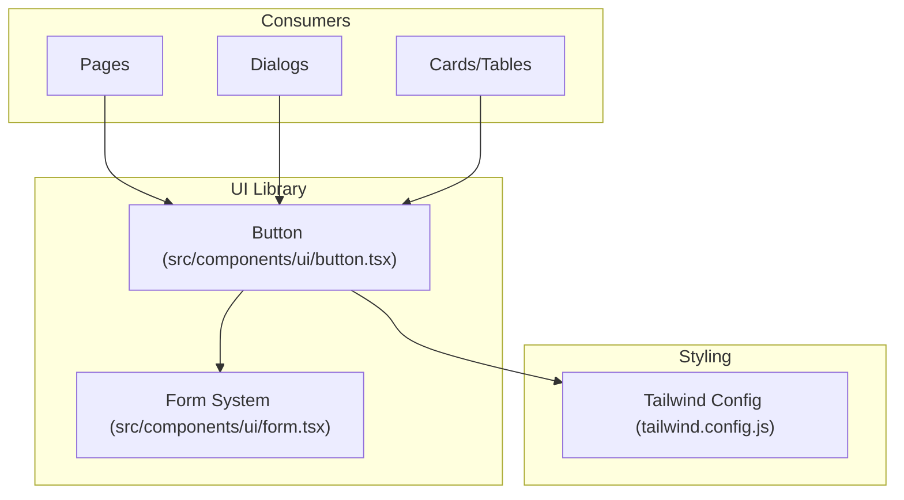
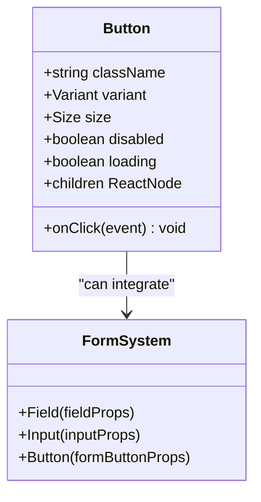
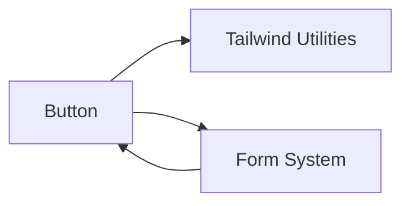

# Button Component

<cite>
**Referenced Files in This Document**
- [button.tsx](file://src/components/ui/button.tsx)
- [form.tsx](file://src/components/ui/form.tsx)
- [tailwind.config.js](file://tailwind.config.js)
</cite>

## Table of Contents
1. [Introduction](#introduction)
2. [Project Structure](#project-structure)
3. [Core Components](#core-components)
4. [Architecture Overview](#architecture-overview)
5. [Detailed Component Analysis](#detailed-component-analysis)
6. [Dependency Analysis](#dependency-analysis)
7. [Performance Considerations](#performance-considerations)
8. [Troubleshooting Guide](#troubleshooting-guide)
9. [Conclusion](#conclusion)
10. [Appendices](#appendices)

## Introduction
This document provides comprehensive documentation for the Button component, including all variants, sizes, states, props, usage examples, styling customization options, accessibility features, and guidance on extending styles and integrating with form components. The goal is to help both new and experienced developers use the Button consistently and effectively across the application.

## Project Structure
The Button component is implemented as a UI primitive under the shared UI library and is used throughout the application’s pages and dialogs. It integrates with Tailwind CSS for styling and can be composed with other UI primitives such as those provided by the form system.

[No sources needed since this diagram shows conceptual workflow, not actual code structure]

## Core Components
- Button: A versatile interactive element supporting multiple visual variants, sizes, and states. It accepts standard HTML button attributes and additional props for variant, size, disabled state, and click handling. It composes well with Tailwind classes and can be integrated into forms.

Key responsibilities:
- Render an accessible <button> element with consistent semantics.
- Apply visual variants and sizes via class composition.
- Support disabled and loading states.
- Forward events like onClick and accept className overrides.

**Section sources**
- [button.tsx](file://src/components/ui/button.tsx)

## Architecture Overview
The Button component follows a simple architecture:
- Props-driven styling through variant and size.
- Class composition using Tailwind utilities.
- Optional integration with form libraries for controlled inputs.
- Accessibility-first defaults (semantic button, keyboard support).

[No sources needed since this diagram shows conceptual relationships, not specific code structure]

## Detailed Component Analysis

### Variants
Available variants:
- default: Primary action style.
- destructive: Emphasizes danger or deletion actions.
- outline: Secondary emphasis with visible border.
- secondary: Muted primary-like style.
- ghost: Minimal background, subtle hover.
- link: Text-link appearance without box styling.

Usage guidance:
- Use default for main CTAs.
- Use destructive for delete/danger operations.
- Use outline for less prominent actions.
- Use secondary for alternative actions.
- Use ghost for tertiary actions or dense interfaces.
- Use link for inline navigation or text-only interactions.

**Section sources**
- [button.tsx](file://src/components/ui/button.tsx)

### Sizes
Supported sizes:
- sm: Compact buttons for dense layouts.
- default: Standard size for most contexts.
- lg: Larger buttons for emphasis or touch-friendly targets.
- icon: Square-ish sizing optimized for icon-only buttons.

Guidance:
- Prefer default for general use.
- Use sm in toolbars, tables, or compact panels.
- Use lg for hero actions or mobile touch targets.
- Use icon when only an icon is present; consider adding aria-label.

**Section sources**
- [button.tsx](file://src/components/ui/button.tsx)

### States
- disabled: Prevents interaction and applies muted visuals. Keyboard focus may remain but should not trigger actions.
- loading: Indicates asynchronous work. Typically disables pointer events and may show a spinner. Ensure screen readers are informed if content changes.

Accessibility notes:
- Always set aria-disabled when programmatically disabling.
- For loading, consider aria-busy="true" and ensure focus management remains predictable.

**Section sources**
- [button.tsx](file://src/components/ui/button.tsx)

### Props Specification
- className: string
  - Purpose: Override or extend default styles.
  - Behavior: Appended to internal classes; use Tailwind utilities for best results.
- variant: Variant
  - Values: "default", "destructive", "outline", "secondary", "ghost", "link".
  - Default: "default".
- size: Size
  - Values: "sm", "default", "lg", "icon".
  - Default: "default".
- disabled: boolean
  - Purpose: Disables the button and applies disabled styles.
  - Accessibility: Ensures semantic disabled state and prevents pointer events.
- onClick: (event) => void
  - Purpose: Click handler.
  - Behavior: Only invoked when not disabled and not loading.
- Additional common props:
  - type: "button" | "submit" | "reset" (defaults to "button" unless inside a form where appropriate).
  - children: ReactNode (text, icons, or combined).
  - loading: boolean (optional, if supported by implementation).
  - aria-* attributes: Forwarded as needed for accessibility.

**Section sources**
- [button.tsx](file://src/components/ui/button.tsx)

### Usage Examples
- Basic default button:
  - Use variant="default" and size="default".
  - Provide meaningful label in children.
- Destructive action:
  - variant="destructive" for delete or cancel-dangerous actions.
- Outline button:
  - variant="outline" for secondary actions.
- Ghost button:
  - variant="ghost" for tertiary actions or within dense lists.
- Link-style button:
  - variant="link" for inline text links that behave as buttons.
- Small and large buttons:
  - size="sm" for compact areas; size="lg" for emphasis or touch targets.
- Icon-only button:
  - size="icon" with an icon child and aria-label for context.
- Disabled button:
  - disabled={true} to prevent interaction.
- Loading button:
  - loading={true} to indicate async operation; optionally disable pointer events.

Integration tips:
- Combine with icons from your SVG icon system.
- Wrap with Tooltip for concise labels.
- Use with Badge or Skeleton for dynamic content.

**Section sources**
- [button.tsx](file://src/components/ui/button.tsx)

### Styling Customization
- Tailwind-first approach:
  - Extend base styles via className.
  - Use utility classes for spacing, typography, colors, and borders.
- Theme integration:
  - If your project defines custom color tokens or design tokens, reference them via Tailwind config or CSS variables.
- Overriding variants/sizes:
  - Compose additional classes in className to adjust padding, font-size, or radius while preserving core behavior.

Best practices:
- Keep overrides minimal and scoped.
- Avoid !important; prefer Tailwind precedence.
- Test contrast ratios for all variants and sizes.

**Section sources**
- [button.tsx](file://src/components/ui/button.tsx)
- [tailwind.config.js](file://tailwind.config.js)

### Accessibility Features
- Semantic button element ensures correct role and keyboard behavior.
- Focus management:
  - Visible focus ring by default; customize via Tailwind focus utilities if needed.
- Screen reader support:
  - Use aria-label for icon-only buttons.
  - Announce loading state with aria-busy when applicable.
- Color contrast:
  - Ensure sufficient contrast for text and icons across variants.
- Reduced motion:
  - Respect prefers-reduced-motion for any animations.

**Section sources**
- [button.tsx](file://src/components/ui/button.tsx)

### Extending Button Styles
Approaches:
- Create themed wrappers:
  - Build higher-level components that preset variant/size combinations.
- Add new variants/sizes:
  - Extend internal mapping to include new values and corresponding class sets.
- Global theme updates:
  - Adjust Tailwind config to introduce new tokens or modify existing ones.

Recommendations:
- Centralize variant and size logic to keep consistency.
- Document new variants/sizes alongside this guide.

**Section sources**
- [button.tsx](file://src/components/ui/button.tsx)
- [tailwind.config.js](file://tailwind.config.js)

### Integration with Forms
- Native forms:
  - Use type="submit" when inside a <form> to submit data.
- Controlled forms:
  - Integrate with form libraries (e.g., react-hook-form) by passing form-provided handlers and validation states.
- Error states:
  - Pair with form field error messages; avoid embedding errors directly in the button unless necessary.
- Accessibility:
  - Ensure form-associated buttons have descriptive labels and clear success/error feedback.

Example patterns:
- Submit button with loading state during submission.
- Reset button styled as ghost or outline.
- Action buttons in dialog forms (Confirm/Cancel).

**Section sources**
- [button.tsx](file://src/components/ui/button.tsx)
- [form.tsx](file://src/components/ui/form.tsx)

## Dependency Analysis
The Button component depends on:
- Tailwind CSS utilities for styling.
- Optional integration with form systems for controlled workflows.
- Application-wide design tokens (colors, spacing, typography) configured via Tailwind.

[No sources needed since this diagram shows conceptual dependencies, not specific code structure]

## Performance Considerations
- Keep Button lightweight:
  - Avoid heavy computations in onClick; offload to services or hooks.
- Minimize re-renders:
  - Memoize event handlers if passed to many instances.
- Optimize icon rendering:
  - Use memoized SVG icons and avoid unnecessary prop churn.
- Debounce rapid clicks:
  - Guard against double submissions with loading state or debounced handlers.

[No sources needed since this section provides general guidance]

## Troubleshooting Guide
Common issues and resolutions:
- Button not clickable:
  - Check disabled and loading states; ensure no overlay blocks pointer events.
- Styles not applying:
  - Verify Tailwind is configured and className is appended correctly.
- Inconsistent focus styles:
  - Ensure focus-visible utilities are enabled; test keyboard navigation.
- Accessibility warnings:
  - Add aria-label for icon-only buttons; confirm aria-busy during loading.
- Form submission not triggered:
  - Confirm type="submit" and proper form association.

**Section sources**
- [button.tsx](file://src/components/ui/button.tsx)

## Conclusion
The Button component offers a robust, accessible foundation for user interactions across the app. By leveraging its variants, sizes, and states—and following the styling and accessibility guidelines—you can maintain a consistent and high-quality user experience. Extend it thoughtfully and integrate it seamlessly with forms and other UI primitives.

[No sources needed since this section summarizes without analyzing specific files]

## Appendices

### Quick Reference: Props
- className: string
- variant: "default" | "destructive" | "outline" | "secondary" | "ghost" | "link"
- size: "sm" | "default" | "lg" | "icon"
- disabled: boolean
- onClick: (event) => void
- loading: boolean (if supported)
- type: "button" | "submit" | "reset"

**Section sources**
- [button.tsx](file://src/components/ui/button.tsx)