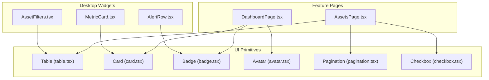
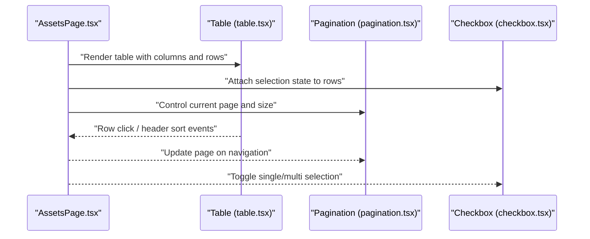
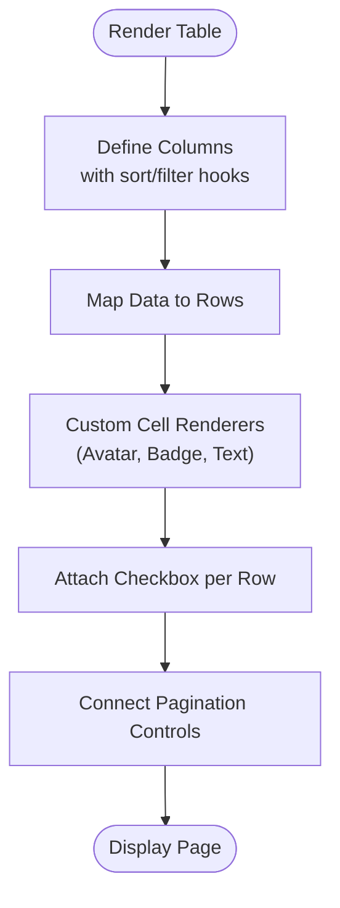
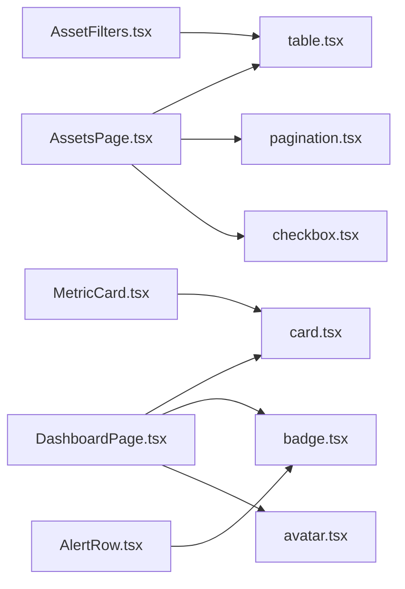

# Data Display Components

<cite>
**Referenced Files in This Document**
- [table.tsx](file://src/components/ui/table.tsx)
- [card.tsx](file://src/components/ui/card.tsx)
- [badge.tsx](file://src/components/ui/badge.tsx)
- [avatar.tsx](file://src/components/ui/avatar.tsx)
- [pagination.tsx](file://src/components/ui/pagination.tsx)
- [checkbox.tsx](file://src/components/ui/checkbox.tsx)
- [AssetsPage.tsx](file://src/pages/desktop/AssetsPage.tsx)
- [DashboardPage.tsx](file://src/pages/desktop/DashboardPage.tsx)
- [MetricCard.tsx](file://src/components/desktop/MetricCard.tsx)
- [AlertRow.tsx](file://src/components/desktop/AlertRow.tsx)
- [AssetFilters.tsx](file://src/components/desktop/AssetFilters.tsx)
</cite>

## Table of Contents
1. [Introduction](#introduction)
2. [Project Structure](#project-structure)
3. [Core Components](#core-components)
4. [Architecture Overview](#architecture-overview)
5. [Detailed Component Analysis](#detailed-component-analysis)
6. [Dependency Analysis](#dependency-analysis)
7. [Performance Considerations](#performance-considerations)
8. [Troubleshooting Guide](#troubleshooting-guide)
9. [Conclusion](#conclusion)

## Introduction
This document provides comprehensive guidance for data display components: Table, Card, Badge, and Avatar. It covers table features such as sorting, filtering, pagination, and row selection; card layouts and responsive behavior; badge variants for status indicators; and avatar configurations for user representation. It also includes examples of complex data presentations, custom cell renderers, and performance optimization techniques for large datasets.

## Project Structure
The data display components are implemented as reusable UI primitives under src/components/ui and composed into feature pages and desktop widgets. The key files include:
- Table, Card, Badge, Avatar primitives
- Pagination primitive used by tables
- Checkbox primitive used for row selection
- Feature pages and widgets that compose these primitives to present data

**Diagram sources**
- [table.tsx](file://src/components/ui/table.tsx)
- [card.tsx](file://src/components/ui/card.tsx)
- [badge.tsx](file://src/components/ui/badge.tsx)
- [avatar.tsx](file://src/components/ui/avatar.tsx)
- [pagination.tsx](file://src/components/ui/pagination.tsx)
- [checkbox.tsx](file://src/components/ui/checkbox.tsx)
- [AssetsPage.tsx](file://src/pages/desktop/AssetsPage.tsx)
- [DashboardPage.tsx](file://src/pages/desktop/DashboardPage.tsx)
- [MetricCard.tsx](file://src/components/desktop/MetricCard.tsx)
- [AlertRow.tsx](file://src/components/desktop/AlertRow.tsx)
- [AssetFilters.tsx](file://src/components/desktop/AssetFilters.tsx)

**Section sources**
- [table.tsx](file://src/components/ui/table.tsx)
- [card.tsx](file://src/components/ui/card.tsx)
- [badge.tsx](file://src/components/ui/badge.tsx)
- [avatar.tsx](file://src/components/ui/avatar.tsx)
- [pagination.tsx](file://src/components/ui/pagination.tsx)
- [checkbox.tsx](file://src/components/ui/checkbox.tsx)
- [AssetsPage.tsx](file://src/pages/desktop/AssetsPage.tsx)
- [DashboardPage.tsx](file://src/pages/desktop/DashboardPage.tsx)
- [MetricCard.tsx](file://src/components/desktop/MetricCard.tsx)
- [AlertRow.tsx](file://src/components/desktop/AlertRow.tsx)
- [AssetFilters.tsx](file://src/components/desktop/AssetFilters.tsx)

## Core Components
- Table: Provides a semantic HTML table with support for headers, rows, cells, and composition patterns. It is designed to be extended with sorting, filtering, pagination, and selection logic at the page level.
- Card: A container component for grouping related content and actions, commonly used for metrics, summaries, and dashboards.
- Badge: A small visual indicator for status or metadata, often used alongside table rows and cards.
- Avatar: Displays a user image or initials, typically used in table rows and list items.
- Pagination: Controls for navigating through large datasets, often paired with tables.
- Checkbox: Used for row selection within tables.

These primitives are composed in feature pages and widgets to build rich data experiences.

**Section sources**
- [table.tsx](file://src/components/ui/table.tsx)
- [card.tsx](file://src/components/ui/card.tsx)
- [badge.tsx](file://src/components/ui/badge.tsx)
- [avatar.tsx](file://src/components/ui/avatar.tsx)
- [pagination.tsx](file://src/components/ui/pagination.tsx)
- [checkbox.tsx](file://src/components/ui/checkbox.tsx)

## Architecture Overview
The data display architecture separates presentation primitives from business logic. Tables are rendered using the Table primitive, while sorting, filtering, pagination, and selection are managed by the consuming page or widget. Cards, badges, and avatars provide consistent visual building blocks across dashboards and lists.

**Diagram sources**
- [AssetsPage.tsx](file://src/pages/desktop/AssetsPage.tsx)
- [table.tsx](file://src/components/ui/table.tsx)
- [pagination.tsx](file://src/components/ui/pagination.tsx)
- [checkbox.tsx](file://src/components/ui/checkbox.tsx)

## Detailed Component Analysis

### Table Component
Responsibilities:
- Semantic structure for tabular data
- Header and cell composition
- Integration points for sorting, filtering, pagination, and selection

Key usage patterns:
- Sorting: Attach handlers to column headers to update sort state and re-render rows.
- Filtering: Apply client-side filters before rendering or trigger server-side queries.
- Pagination: Use Pagination controls to slice data and manage current page.
- Row selection: Use Checkbox to track selected row IDs.

Complex data presentation:
- Combine multiple primitives inside cells (e.g., Avatar + text, Badge + value).
- Implement custom cell renderers by passing JSX elements or functions to column definitions.

**Diagram sources**
- [table.tsx](file://src/components/ui/table.tsx)
- [pagination.tsx](file://src/components/ui/pagination.tsx)
- [checkbox.tsx](file://src/components/ui/checkbox.tsx)
- [AssetsPage.tsx](file://src/pages/desktop/AssetsPage.tsx)

**Section sources**
- [table.tsx](file://src/components/ui/table.tsx)
- [AssetsPage.tsx](file://src/pages/desktop/AssetsPage.tsx)
- [pagination.tsx](file://src/components/ui/pagination.tsx)
- [checkbox.tsx](file://src/components/ui/checkbox.tsx)

### Card Component
Responsibilities:
- Group related content and actions
- Provide consistent spacing and layout
- Support responsive stacking and alignment

Common compositions:
- Metric summary cards with title, value, and trend indicators
- Dashboard panels containing charts or mini-tables
- Action-oriented cards with buttons and links

Responsive behavior:
- Stack vertically on narrow screens
- Arrange horizontally on wider screens using grid/flex utilities

**Section sources**
- [card.tsx](file://src/components/ui/card.tsx)
- [DashboardPage.tsx](file://src/pages/desktop/DashboardPage.tsx)
- [MetricCard.tsx](file://src/components/desktop/MetricCard.tsx)

### Badge Component
Responsibilities:
- Visual status indicators
- Metadata labels (e.g., tags, counts)
- Consistent color and shape semantics

Variants:
- Success, warning, error, neutral states
- Size and density options when combined with other components

Usage examples:
- Status in table rows
- Tags in cards
- Inline annotations next to values

**Section sources**
- [badge.tsx](file://src/components/ui/badge.tsx)
- [AlertRow.tsx](file://src/components/desktop/AlertRow.tsx)

### Avatar Component
Responsibilities:
- Display user images or fallback initials
- Maintain aspect ratio and sizing consistency

Configurations:
- Image source with fallback
- Size variants (small, medium, large)
- Tooltip or label integration

Usage examples:
- Author or owner in table rows
- User presence in dashboard panels

**Section sources**
- [avatar.tsx](file://src/components/ui/avatar.tsx)
- [AssetsPage.tsx](file://src/pages/desktop/AssetsPage.tsx)

### Pagination Component
Responsibilities:
- Navigate between pages
- Control items per page
- Communicate total count and current range

Integration:
- Pair with Table to slice data
- Update URL state for shareable views

**Section sources**
- [pagination.tsx](file://src/components/ui/pagination.tsx)
- [AssetsPage.tsx](file://src/pages/desktop/AssetsPage.tsx)

### Checkbox Component
Responsibilities:
- Single and multi-selection toggles
- Indeterminate state for partial selection

Integration:
- Row-level selection in tables
- Bulk actions toolbar

**Section sources**
- [checkbox.tsx](file://src/components/ui/checkbox.tsx)
- [AssetsPage.tsx](file://src/pages/desktop/AssetsPage.tsx)

## Dependency Analysis
The following diagram shows how feature pages and widgets depend on UI primitives to construct data displays.

**Diagram sources**
- [AssetsPage.tsx](file://src/pages/desktop/AssetsPage.tsx)
- [DashboardPage.tsx](file://src/pages/desktop/DashboardPage.tsx)
- [MetricCard.tsx](file://src/components/desktop/MetricCard.tsx)
- [AlertRow.tsx](file://src/components/desktop/AlertRow.tsx)
- [AssetFilters.tsx](file://src/components/desktop/AssetFilters.tsx)
- [table.tsx](file://src/components/ui/table.tsx)
- [card.tsx](file://src/components/ui/card.tsx)
- [badge.tsx](file://src/components/ui/badge.tsx)
- [avatar.tsx](file://src/components/ui/avatar.tsx)
- [pagination.tsx](file://src/components/ui/pagination.tsx)
- [checkbox.tsx](file://src/components/ui/checkbox.tsx)

**Section sources**
- [AssetsPage.tsx](file://src/pages/desktop/AssetsPage.tsx)
- [DashboardPage.tsx](file://src/pages/desktop/DashboardPage.tsx)
- [MetricCard.tsx](file://src/components/desktop/MetricCard.tsx)
- [AlertRow.tsx](file://src/components/desktop/AlertRow.tsx)
- [AssetFilters.tsx](file://src/components/desktop/AssetFilters.tsx)
- [table.tsx](file://src/components/ui/table.tsx)
- [card.tsx](file://src/components/ui/card.tsx)
- [badge.tsx](file://src/components/ui/badge.tsx)
- [avatar.tsx](file://src/components/ui/avatar.tsx)
- [pagination.tsx](file://src/components/ui/pagination.tsx)
- [checkbox.tsx](file://src/components/ui/checkbox.tsx)

## Performance Considerations
For large datasets:
- Prefer server-side pagination and filtering to reduce payload sizes.
- Use virtualization or windowing libraries if rendering thousands of rows client-side.
- Memoize expensive computations and custom cell renderers to avoid unnecessary re-renders.
- Debounce search inputs and filter changes to limit frequent re-renders.
- Keep row keys stable and unique to optimize reconciliation.
- Avoid heavy operations in render paths; move formatting and calculations to pre-processing steps.

[No sources needed since this section provides general guidance]

## Troubleshooting Guide
Common issues and resolutions:
- Table not updating after sort/filter: Ensure state updates trigger re-renders and that column sort handlers correctly update sort state.
- Pagination out of sync: Verify page index and size are bound to controlled state and that data slicing matches current page parameters.
- Row selection not persisting: Confirm selection state is stored centrally and checkbox props reflect current selection.
- Badges not visible: Check contrast and variant mapping; ensure correct styling classes are applied.
- Avatars failing to load: Provide fallback initials and handle error states gracefully.

**Section sources**
- [table.tsx](file://src/components/ui/table.tsx)
- [pagination.tsx](file://src/components/ui/pagination.tsx)
- [checkbox.tsx](file://src/components/ui/checkbox.tsx)
- [badge.tsx](file://src/components/ui/badge.tsx)
- [avatar.tsx](file://src/components/ui/avatar.tsx)

## Conclusion
By composing Table, Card, Badge, and Avatar primitives with Pagination and Checkbox, you can build robust, accessible, and performant data displays. Follow the patterns outlined here for sorting, filtering, pagination, and selection, and apply the performance tips to maintain responsiveness with large datasets.

[No sources needed since this section summarizes without analyzing specific files]