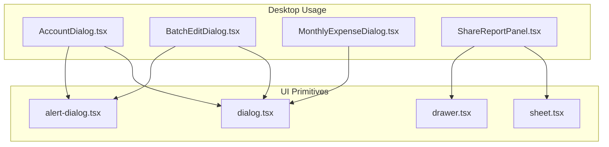
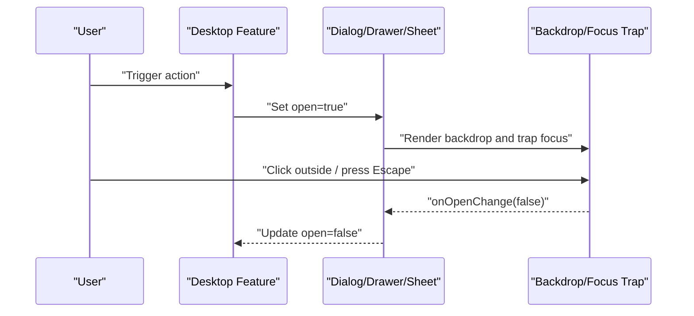
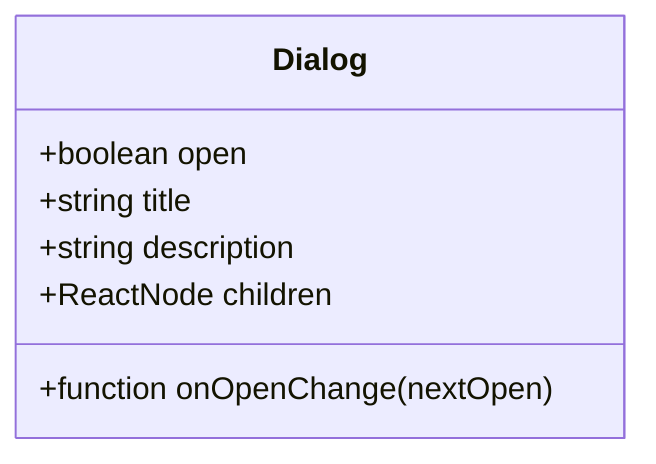
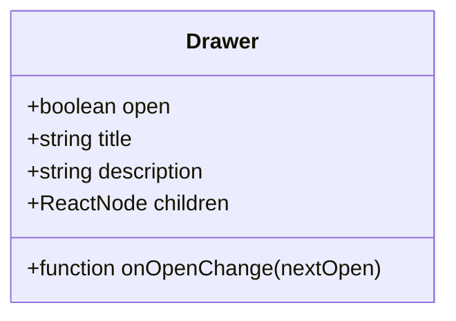
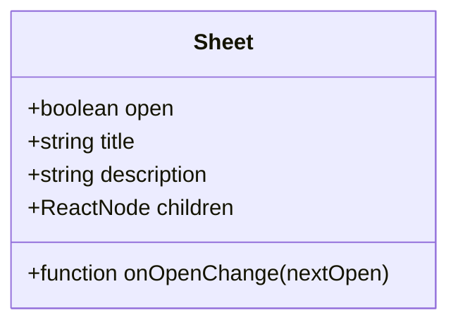
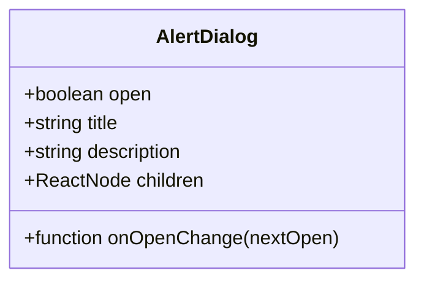
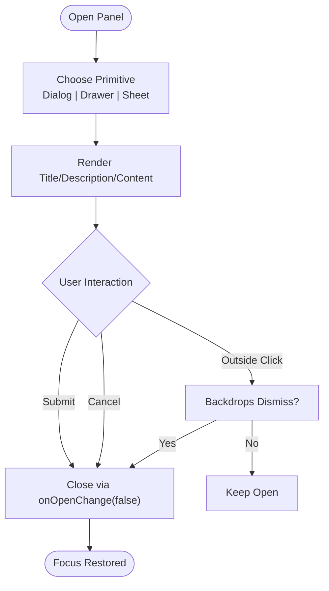
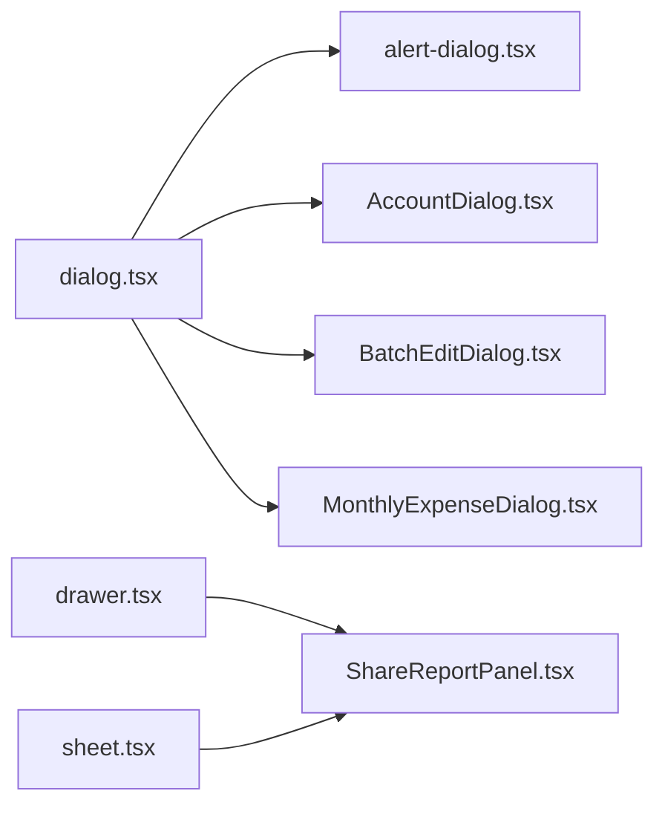

# Dialog & Modal Components

<cite>
**Referenced Files in This Document**
- [dialog.tsx](file://src/components/ui/dialog.tsx)
- [drawer.tsx](file://src/components/ui/drawer.tsx)
- [sheet.tsx](file://src/components/ui/sheet.tsx)
- [alert-dialog.tsx](file://src/components/ui/alert-dialog.tsx)
- [AccountDialog.tsx](file://src/components/desktop/AccountDialog.tsx)
- [BatchEditDialog.tsx](file://src/components/desktop/BatchEditDialog.tsx)
- [MonthlyExpenseDialog.tsx](file://src/components/desktop/MonthlyExpenseDialog.tsx)
- [ShareReportPanel.tsx](file://src/components/desktop/ShareReportPanel.tsx)
</cite>

## Table of Contents
1. [Introduction](#introduction)
2. [Project Structure](#project-structure)
3. [Core Components](#core-components)
4. [Architecture Overview](#architecture-overview)
5. [Detailed Component Analysis](#detailed-component-analysis)
6. [Dependency Analysis](#dependency-analysis)
7. [Performance Considerations](#performance-considerations)
8. [Troubleshooting Guide](#troubleshooting-guide)
9. [Conclusion](#conclusion)
10. [Appendices](#appendices)

## Introduction
This document provides comprehensive documentation for dialog and modal components: Dialog, Drawer, and Sheet. It covers trigger mechanisms, content rendering, backdrop behavior, focus management, prop specifications (open state, onOpenChange handlers, title, description, custom content), and practical examples such as confirmation dialogs, forms inside modals, and slide-out panels. Accessibility considerations, keyboard navigation, and responsive behavior across devices are also addressed.

## Project Structure
The dialog and modal primitives live under the shared UI layer and are consumed by desktop-specific features. The following files implement the core primitives and their usage patterns:
- Primitives: Dialog, Drawer, Sheet, AlertDialog
- Usage examples: AccountDialog, BatchEditDialog, MonthlyExpenseDialog, ShareReportPanel

**Diagram sources**
- [dialog.tsx](file://src/components/ui/dialog.tsx)
- [drawer.tsx](file://src/components/ui/drawer.tsx)
- [sheet.tsx](file://src/components/ui/sheet.tsx)
- [alert-dialog.tsx](file://src/components/ui/alert-dialog.tsx)
- [AccountDialog.tsx](file://src/components/desktop/AccountDialog.tsx)
- [BatchEditDialog.tsx](file://src/components/desktop/BatchEditDialog.tsx)
- [MonthlyExpenseDialog.tsx](file://src/components/desktop/MonthlyExpenseDialog.tsx)
- [ShareReportPanel.tsx](file://src/components/desktop/ShareReportPanel.tsx)

**Section sources**
- [dialog.tsx](file://src/components/ui/dialog.tsx)
- [drawer.tsx](file://src/components/ui/drawer.tsx)
- [sheet.tsx](file://src/components/ui/sheet.tsx)
- [alert-dialog.tsx](file://src/components/ui/alert-dialog.tsx)
- [AccountDialog.tsx](file://src/components/desktop/AccountDialog.tsx)
- [BatchEditDialog.tsx](file://src/components/desktop/BatchEditDialog.tsx)
- [MonthlyExpenseDialog.tsx](file://src/components/desktop/MonthlyExpenseDialog.tsx)
- [ShareReportPanel.tsx](file://src/components/desktop/ShareReportPanel.tsx)

## Core Components
This section summarizes the responsibilities and behaviors of each primitive.

- Dialog
  - Purpose: Centered overlay for focused tasks or confirmations.
  - Trigger: Controlled via open state and onOpenChange handler.
  - Backdrop: Renders a dimmed backdrop that closes on interaction when configured to do so.
  - Focus: Traps focus within the dialog; restores focus on close.
  - Content: Supports title, description, and arbitrary custom content.

- Drawer
  - Purpose: Slide-in panel from an edge (typically bottom on mobile).
  - Trigger: Controlled via open state and onOpenChange handler.
  - Backdrop: Optional backdrop; can be dismissed by tapping outside when enabled.
  - Focus: Traps focus within the drawer; restores focus on close.
  - Content: Supports title, description, and arbitrary custom content.

- Sheet
  - Purpose: Side panel (left/right/top/bottom) often used for secondary workflows.
  - Trigger: Controlled via open state and onOpenChange handler.
  - Backdrop: Optional backdrop; can be dismissed by tapping outside when enabled.
  - Focus: Traps focus within the sheet; restores focus on close.
  - Content: Supports title, description, and arbitrary custom content.

- AlertDialog
  - Purpose: Specialized confirmation dialog with explicit actions.
  - Trigger: Controlled via open state and onOpenChange handler.
  - Backdrop: Renders a backdrop; dismissible based on configuration.
  - Focus: Traps focus within the alert dialog; restores focus on close.
  - Content: Supports title, description, and action buttons.

Key behavioral themes:
- Open state is controlled externally using open and onOpenChange props.
- Backdrop behavior is configurable per component.
- Focus management ensures accessibility compliance.
- All components accept custom content for flexible layouts.

**Section sources**
- [dialog.tsx](file://src/components/ui/dialog.tsx)
- [drawer.tsx](file://src/components/ui/drawer.tsx)
- [sheet.tsx](file://src/components/ui/sheet.tsx)
- [alert-dialog.tsx](file://src/components/ui/alert-dialog.tsx)

## Architecture Overview
The primitives provide consistent APIs for opening/closing, managing focus, and rendering overlays/backdrops. Desktop components consume these primitives to implement specific flows like account editing, batch operations, expense entry, and report sharing.

**Diagram sources**
- [dialog.tsx](file://src/components/ui/dialog.tsx)
- [drawer.tsx](file://src/components/ui/drawer.tsx)
- [sheet.tsx](file://src/components/ui/sheet.tsx)
- [alert-dialog.tsx](file://src/components/ui/alert-dialog.tsx)

## Detailed Component Analysis

### Dialog
- Trigger mechanism
  - Controlled via open and onOpenChange props.
  - Can be opened programmatically or via user interactions.
- Content rendering
  - Accepts title, description, and custom children.
  - Suitable for confirmations, forms, and rich content.
- Backdrop behavior
  - Renders a backdrop; closing behavior depends on configuration.
- Focus management
  - Focus is trapped inside; restored to the trigger element on close.

Typical use cases
- Confirmation dialogs
- Forms embedded in modals
- Rich informational overlays

Accessibility and keyboard navigation
- Focus trap active while open.
- Escape key typically closes the dialog.
- Screen readers announce dialog role and title.

Responsive behavior
- Centers on larger screens; adapts to viewport constraints.

**Section sources**
- [dialog.tsx](file://src/components/ui/dialog.tsx)
- [AccountDialog.tsx](file://src/components/desktop/AccountDialog.tsx)
- [BatchEditDialog.tsx](file://src/components/desktop/BatchEditDialog.tsx)
- [MonthlyExpenseDialog.tsx](file://src/components/desktop/MonthlyExpenseDialog.tsx)

#### Dialog Class Diagram

**Diagram sources**
- [dialog.tsx](file://src/components/ui/dialog.tsx)

### Drawer
- Trigger mechanism
  - Controlled via open and onOpenChange props.
- Content rendering
  - Accepts title, description, and custom children.
  - Ideal for bottom sheets on mobile or side panels on desktop.
- Backdrop behavior
  - Optional backdrop; can be dismissed by tapping outside when enabled.
- Focus management
  - Focus is trapped inside; restored to the trigger element on close.

Typical use cases
- Mobile-first bottom sheets
- Quick actions and settings panels
- Secondary content that complements the main view

Accessibility and keyboard navigation
- Focus trap active while open.
- Escape key typically closes the drawer.
- Announced appropriately to assistive technologies.

Responsive behavior
- Slides from bottom on small screens; can adapt to other edges on larger screens depending on configuration.

**Section sources**
- [drawer.tsx](file://src/components/ui/drawer.tsx)
- [ShareReportPanel.tsx](file://src/components/desktop/ShareReportPanel.tsx)

#### Drawer Class Diagram

**Diagram sources**
- [drawer.tsx](file://src/components/ui/drawer.tsx)

### Sheet
- Trigger mechanism
  - Controlled via open and onOpenChange props.
- Content rendering
  - Accepts title, description, and custom children.
  - Commonly used for side panels (left/right/top/bottom).
- Backdrop behavior
  - Optional backdrop; can be dismissed by tapping outside when enabled.
- Focus management
  - Focus is trapped inside; restored to the trigger element on close.

Typical use cases
- Sidebars for filters, details, or editing
- Parallel workflows alongside primary content

Accessibility and keyboard navigation
- Focus trap active while open.
- Escape key typically closes the sheet.
- Proper roles and labels for screen readers.

Responsive behavior
- Adapts to device size; may overlay or push content depending on configuration.

**Section sources**
- [sheet.tsx](file://src/components/ui/sheet.tsx)
- [ShareReportPanel.tsx](file://src/components/desktop/ShareReportPanel.tsx)

#### Sheet Class Diagram

**Diagram sources**
- [sheet.tsx](file://src/components/ui/sheet.tsx)

### AlertDialog
- Trigger mechanism
  - Controlled via open and onOpenChange props.
- Content rendering
  - Accepts title, description, and action buttons.
- Backdrop behavior
  - Renders a backdrop; dismissible based on configuration.
- Focus management
  - Focus is trapped inside; restored to the trigger element on close.

Typical use cases
- Confirm destructive actions
- Critical warnings requiring explicit acknowledgment

Accessibility and keyboard navigation
- Focus trap active while open.
- Escape key behavior aligns with platform conventions.
- Announced as alert dialog to assistive technologies.

**Section sources**
- [alert-dialog.tsx](file://src/components/ui/alert-dialog.tsx)
- [AccountDialog.tsx](file://src/components/desktop/AccountDialog.tsx)
- [BatchEditDialog.tsx](file://src/components/desktop/BatchEditDialog.tsx)

#### AlertDialog Class Diagram

**Diagram sources**
- [alert-dialog.tsx](file://src/components/ui/alert-dialog.tsx)

### Practical Examples

#### Confirmation Dialog
- Use case: Confirm deletion or irreversible actions.
- Behavior: Shows title, description, and action buttons; prevents accidental dismissal unless explicitly confirmed.
- Implementation references:
  - [AccountDialog.tsx](file://src/components/desktop/AccountDialog.tsx)
  - [BatchEditDialog.tsx](file://src/components/desktop/BatchEditDialog.tsx)

#### Form in Modal
- Use case: Edit profile or add new items without leaving context.
- Behavior: Captures focus, supports form submission, and manages open state via onOpenChange.
- Implementation references:
  - [AccountDialog.tsx](file://src/components/desktop/AccountDialog.tsx)
  - [MonthlyExpenseDialog.tsx](file://src/components/desktop/MonthlyExpenseDialog.tsx)

#### Slide-out Panel
- Use case: Share reports or show detailed information.
- Behavior: Uses Drawer or Sheet for side/bottom panels; optional backdrop; dismissible by outside tap or escape.
- Implementation references:
  - [ShareReportPanel.tsx](file://src/components/desktop/ShareReportPanel.tsx)

[No sources needed since this diagram shows conceptual workflow, not actual code structure]

## Dependency Analysis
The primitives encapsulate overlay, backdrop, and focus-trap logic. Desktop components depend on them for consistent UX and accessibility.

**Diagram sources**
- [dialog.tsx](file://src/components/ui/dialog.tsx)
- [drawer.tsx](file://src/components/ui/drawer.tsx)
- [sheet.tsx](file://src/components/ui/sheet.tsx)
- [alert-dialog.tsx](file://src/components/ui/alert-dialog.tsx)
- [AccountDialog.tsx](file://src/components/desktop/AccountDialog.tsx)
- [BatchEditDialog.tsx](file://src/components/desktop/BatchEditDialog.tsx)
- [MonthlyExpenseDialog.tsx](file://src/components/desktop/MonthlyExpenseDialog.tsx)
- [ShareReportPanel.tsx](file://src/components/desktop/ShareReportPanel.tsx)

**Section sources**
- [dialog.tsx](file://src/components/ui/dialog.tsx)
- [drawer.tsx](file://src/components/ui/drawer.tsx)
- [sheet.tsx](file://src/components/ui/sheet.tsx)
- [alert-dialog.tsx](file://src/components/ui/alert-dialog.tsx)
- [AccountDialog.tsx](file://src/components/desktop/AccountDialog.tsx)
- [BatchEditDialog.tsx](file://src/components/desktop/BatchEditDialog.tsx)
- [MonthlyExpenseDialog.tsx](file://src/components/desktop/MonthlyExpenseDialog.tsx)
- [ShareReportPanel.tsx](file://src/components/desktop/ShareReportPanel.tsx)

## Performance Considerations
- Prefer controlled open state to avoid unnecessary re-renders.
- Keep modal content lightweight; defer heavy computations until open if possible.
- Avoid deep nested overlays; prefer single-layer dialogs at a time.
- Use memoization for expensive child trees when appropriate.
- Debounce rapid open/close toggles to prevent layout thrashing.

[No sources needed since this section provides general guidance]

## Troubleshooting Guide
Common issues and resolutions:
- Modal does not close on Escape
  - Ensure the primitive’s default behavior is not overridden and that no event listeners prevent default.
- Focus not trapped
  - Verify that the primitive renders its focus trap wrapper and that custom focusable elements are placed inside it.
- Backdrop click does nothing
  - Check backdrop configuration and ensure onOpenChange is wired correctly.
- Multiple modals stacked
  - Limit to one active overlay; manage z-index and stacking context carefully.
- Form submission not updating open state
  - Make sure onOpenChange is called after successful submission or validation.

**Section sources**
- [dialog.tsx](file://src/components/ui/dialog.tsx)
- [drawer.tsx](file://src/components/ui/drawer.tsx)
- [sheet.tsx](file://src/components/ui/sheet.tsx)
- [alert-dialog.tsx](file://src/components/ui/alert-dialog.tsx)

## Conclusion
Dialog, Drawer, and Sheet provide a consistent, accessible foundation for overlays and side panels. By controlling open state through open and onOpenChange, leveraging built-in focus traps, and configuring backdrops appropriately, you can build reliable confirmation dialogs, in-modal forms, and slide-out panels that work well across devices and meet accessibility standards.

[No sources needed since this section summarizes without analyzing specific files]

## Appendices

### Prop Specifications Summary
- open: boolean — Controls visibility of the overlay.
- onOpenChange: function(nextOpen) — Handler to update open state.
- title: string — Primary heading for the overlay.
- description: string — Supplementary text for context.
- children: ReactNode — Custom content area for forms, lists, or rich content.

Behavioral notes:
- Backdrop: Configurable per primitive; can be dismissed by outside click when enabled.
- Focus: Trapped while open; restored to trigger on close.
- Keyboard: Escape typically closes; arrow/tab navigation respects focus boundaries.

**Section sources**
- [dialog.tsx](file://src/components/ui/dialog.tsx)
- [drawer.tsx](file://src/components/ui/drawer.tsx)
- [sheet.tsx](file://src/components/ui/sheet.tsx)
- [alert-dialog.tsx](file://src/components/ui/alert-dialog.tsx)