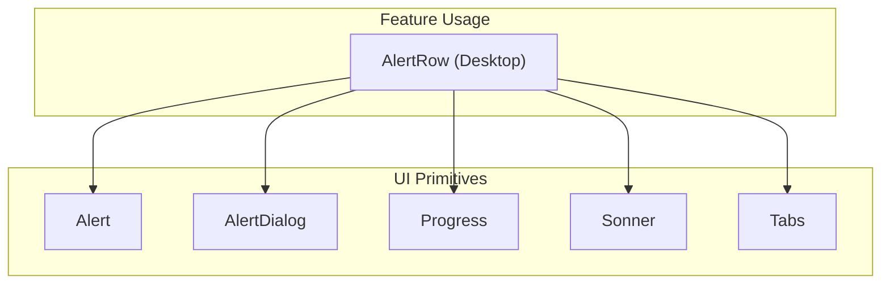
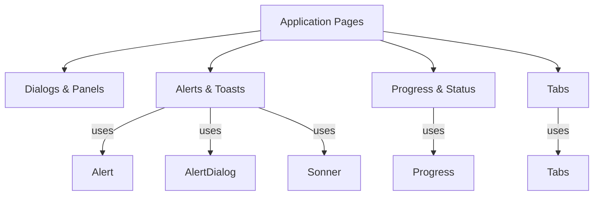
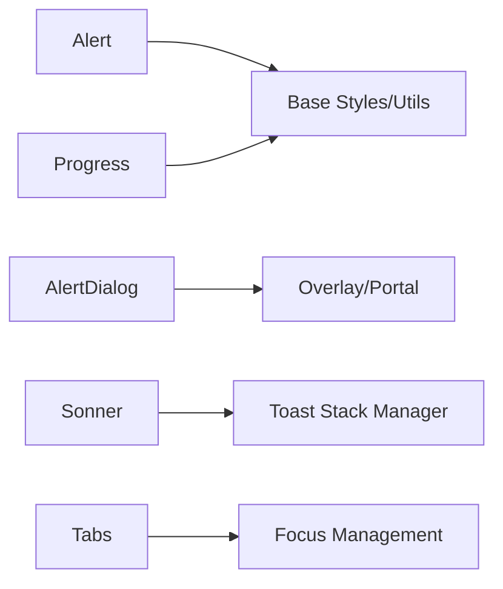

# Feedback & Indicator Components

<cite>
**Referenced Files in This Document**
- [alert.tsx](file://src/components/ui/alert.tsx)
- [alert-dialog.tsx](file://src/components/ui/alert-dialog.tsx)
- [progress.tsx](file://src/components/ui/progress.tsx)
- [sonner.tsx](file://src/components/ui/sonner.tsx)
- [tabs.tsx](file://src/components/ui/tabs.tsx)
- [AlertRow.tsx](file://src/components/desktop/AlertRow.tsx)
</cite>

## Table of Contents
1. [Introduction](#introduction)
2. [Project Structure](#project-structure)
3. [Core Components](#core-components)
4. [Architecture Overview](#architecture-overview)
5. [Detailed Component Analysis](#detailed-component-analysis)
6. [Dependency Analysis](#dependency-analysis)
7. [Performance Considerations](#performance-considerations)
8. [Troubleshooting Guide](#troubleshooting-guide)
9. [Conclusion](#conclusion)

## Introduction
This document provides comprehensive documentation for feedback and indicator components: Alert, AlertDialog, Progress, Sonner (toast notifications), and Tabs. It covers alert types (success, error, warning, info), progress bar configurations, toast notification management, automated alerts, manual progress tracking, tab-based navigation, animation options, positioning strategies, and accessibility considerations for screen readers.

## Project Structure
The feedback and indicator components are implemented as reusable UI primitives under src/components/ui and are consumed by feature-specific components such as desktop dialogs and rows. The key files include:
- Alert and AlertDialog for inline and modal alerts
- Progress for linear progress indication
- Sonner for toast notifications
- Tabs for tabbed navigation and content organization
- A desktop-level example component that demonstrates alert usage

[No sources needed since this diagram shows conceptual workflow, not actual code structure]

## Core Components
- Alert: Inline contextual messages with variants for success, error, warning, and info. Supports icons, descriptions, and optional actions.
- AlertDialog: Modal dialog for critical confirmations or important information, typically used to interrupt user flow safely.
- Progress: Linear progress indicator supporting determinate and indeterminate modes, with styling hooks for customization.
- Sonner: Toast notification system for brief, non-blocking feedback. Supports multiple positions, durations, and rich content.
- Tabs: Accessible tablist/tabpanel pattern for organizing related content into navigable sections.

Key capabilities:
- Variants and theming via props and CSS classes
- Keyboard and focus management for accessibility
- Composable layouts for complex feedback scenarios
- Integration points for automation (e.g., triggering toasts on async operations)

**Section sources**
- [alert.tsx](file://src/components/ui/alert.tsx)
- [alert-dialog.tsx](file://src/components/ui/alert-dialog.tsx)
- [progress.tsx](file://src/components/ui/progress.tsx)
- [sonner.tsx](file://src/components/ui/sonner.tsx)
- [tabs.tsx](file://src/components/ui/tabs.tsx)
- [AlertRow.tsx](file://src/components/desktop/AlertRow.tsx)

## Architecture Overview
The components follow a layered architecture:
- UI primitives provide low-level building blocks with consistent APIs
- Feature components compose primitives to implement domain-specific behaviors
- Global state or context is used sparingly; most feedback is event-driven

[No sources needed since this diagram shows conceptual workflow, not actual code structure]

## Detailed Component Analysis

### Alert
Purpose:
- Display concise status messages with semantic meaning
- Support variants for success, error, warning, and info

Typical usage patterns:
- Inline validation feedback
- Success confirmation after an action
- Warning about potential side effects
- Informational notices

Accessibility:
- Use appropriate roles and aria attributes for live regions when auto-updating
- Ensure sufficient color contrast and icon semantics

Animation:
- Enter/exit transitions can be configured via the underlying animation library or CSS utilities

Positioning:
- Typically inline within layout; can be placed in headers, footers, or dedicated notice areas

**Section sources**
- [alert.tsx](file://src/components/ui/alert.tsx)

### AlertDialog
Purpose:
- Present critical decisions or confirmations in a modal overlay
- Prevent accidental dismissal and require explicit user action

Typical usage patterns:
- Confirm destructive actions (delete, reset)
- Show important warnings before proceeding
- Collect minimal input when necessary

Accessibility:
- Trap focus inside the dialog
- Manage focus return on close
- Provide clear titles and descriptions

Animation:
- Modal open/close transitions should be smooth and predictable

Positioning:
- Centered overlay; consider safe area insets on mobile

**Section sources**
- [alert-dialog.tsx](file://src/components/ui/alert-dialog.tsx)

### Progress
Purpose:
- Communicate task duration and completion percentage
- Support both determinate (0–100) and indeterminate states

Configuration options:
- Value binding for determinate mode
- Indeterminate mode for unknown duration tasks
- Styling hooks for color and size customization

Accessibility:
- Announce progress updates to assistive technologies
- Avoid excessive update frequency to prevent jank

Animation:
- Smooth value transitions improve perceived performance

Positioning:
- Inline near the action or in a global header for long-running tasks

**Section sources**
- [progress.tsx](file://src/components/ui/progress.tsx)

### Sonner (Toast Notifications)
Purpose:
- Provide brief, non-blocking feedback at the edges of the viewport
- Support multiple concurrent toasts with stacking behavior

Management features:
- Programmatic show/hide
- Grouping and deduplication
- Duration control and auto-dismiss
- Rich content support (icons, actions)

Animation:
- Slide-in/out animations with configurable easing

Positioning:
- Top-right, top-left, bottom-right, bottom-left, or custom anchors
- Stacking order and spacing controls

Accessibility:
- Live region announcements for screen readers
- Focus management when interacting with toast actions

Automation examples:
- Trigger success toasts on successful API calls
- Show error toasts with actionable retry buttons
- Batch notifications for import/export flows

**Section sources**
- [sonner.tsx](file://src/components/ui/sonner.tsx)

### Tabs
Purpose:
- Organize related content into navigable sections
- Improve scannability and reduce cognitive load

Behavior:
- Keyboard navigation between tabs
- Active tab highlighting and focus management
- Lazy loading panels if needed

Accessibility:
- Proper role attributes (tablist, tab, tabpanel)
- Arrow key navigation and activation
- Screen reader announcements for active panel changes

Animation:
- Optional fade/slide transitions between panels

Positioning:
- Horizontal tabs for primary navigation; vertical tabs for secondary contexts

**Section sources**
- [tabs.tsx](file://src/components/ui/tabs.tsx)

### Desktop Example: AlertRow
Purpose:
- Demonstrate integration of alerts, dialogs, progress, toasts, and tabs in a real-world scenario
- Showcase automated alerts and manual progress tracking

Common patterns:
- Automated alerts on data import/export
- Manual progress bars during file processing
- Tabbed views for different asset categories

**Section sources**
- [AlertRow.tsx](file://src/components/desktop/AlertRow.tsx)

## Dependency Analysis
The feedback and indicator components are designed to be lightweight and composable. They rely on:
- Underlying UI primitives (buttons, overlays)
- Animation utilities for transitions
- Accessibility helpers for roles and focus management

[No sources needed since this diagram shows conceptual workflow, not actual code structure]

## Performance Considerations
- Debounce frequent progress updates to avoid reflow thrashing
- Use requestAnimationFrame for smooth animations where applicable
- Keep toast payloads small; prefer IDs and lazy rendering for large lists
- Avoid heavy computations in render paths; offload to workers if needed
- Prefer CSS transforms over layout-affecting properties for animations

[No sources needed since this section provides general guidance]

## Troubleshooting Guide
Common issues and resolutions:
- Toasts not appearing: Ensure the toast provider is mounted and z-index layers are correct
- Progress stuck: Verify determinate values are bounded and updated monotonically
- Tabs not focusing correctly: Check keyboard event handlers and focus restoration logic
- AlertDialog not trapping focus: Confirm portal mounting and focus trap initialization
- Inconsistent variants: Validate prop names and class composition order

**Section sources**
- [alert.tsx](file://src/components/ui/alert.tsx)
- [alert-dialog.tsx](file://src/components/ui/alert-dialog.tsx)
- [progress.tsx](file://src/components/ui/progress.tsx)
- [sonner.tsx](file://src/components/ui/sonner.tsx)
- [tabs.tsx](file://src/components/ui/tabs.tsx)
- [AlertRow.tsx](file://src/components/desktop/AlertRow.tsx)

## Conclusion
The feedback and indicator components provide a cohesive set of primitives for delivering clear, accessible, and performant user experiences. By combining Alerts, AlertDialogs, Progress, Sonner, and Tabs, applications can communicate status, guide users through complex workflows, and maintain high usability standards across devices and assistive technologies.

[No sources needed since this section summarizes without analyzing specific files]