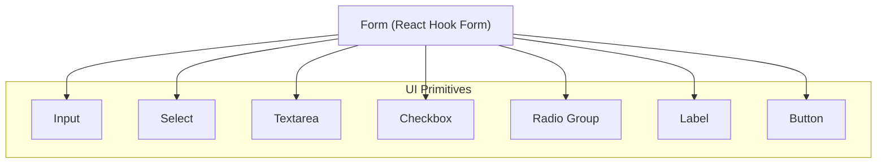
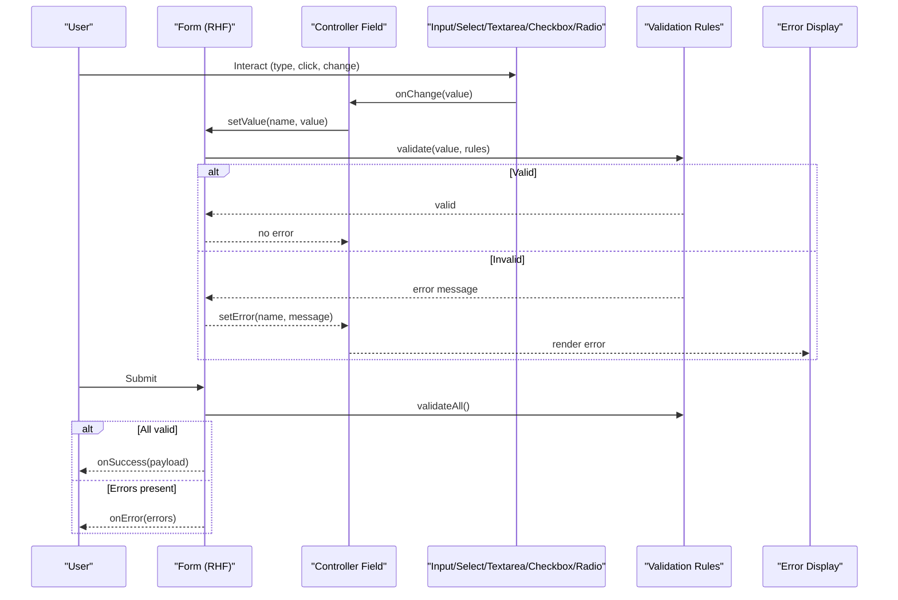
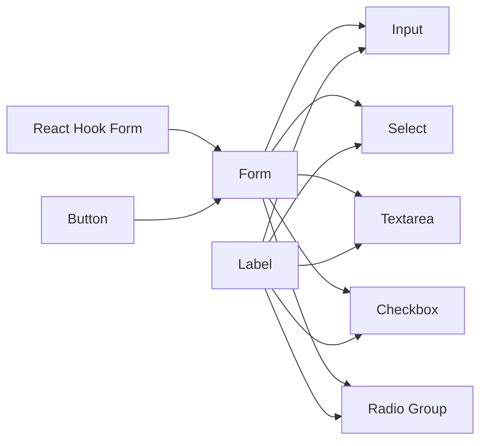
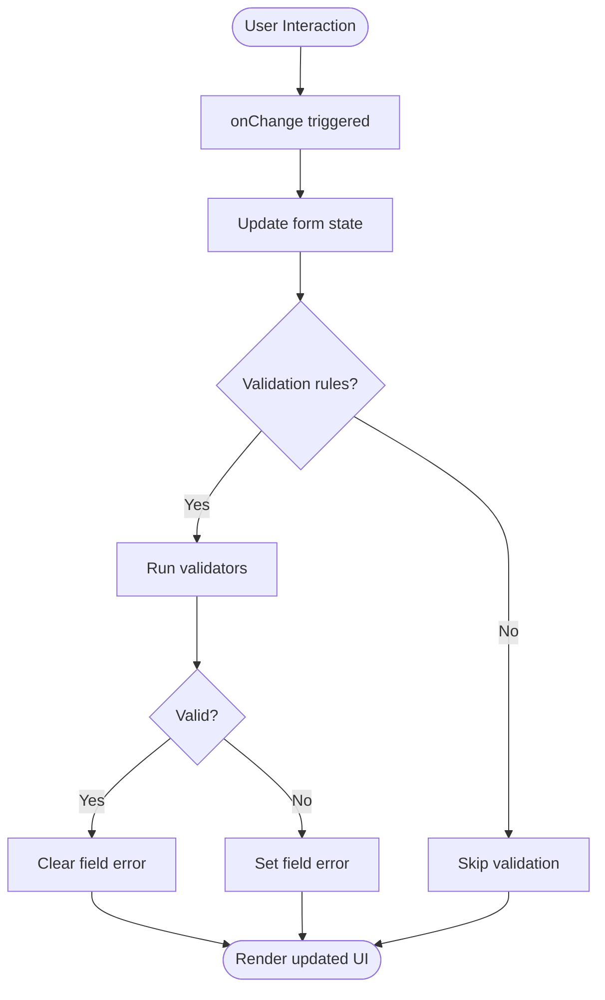

# Form & Input Components

<cite>
**Referenced Files in This Document**
- [input.tsx](file://src/components/ui/input.tsx)
- [select.tsx](file://src/components/ui/select.tsx)
- [form.tsx](file://src/components/ui/form.tsx)
- [textarea.tsx](file://src/components/ui/textarea.tsx)
- [checkbox.tsx](file://src/components/ui/checkbox.tsx)
- [radio-group.tsx](file://src/components/ui/radio-group.tsx)
- [label.tsx](file://src/components/ui/label.tsx)
- [button.tsx](file://src/components/ui/button.tsx)
</cite>

## Table of Contents
1. [Introduction](#introduction)
2. [Project Structure](#project-structure)
3. [Core Components](#core-components)
4. [Architecture Overview](#architecture-overview)
5. [Detailed Component Analysis](#detailed-component-analysis)
6. [Dependency Analysis](#dependency-analysis)
7. [Performance Considerations](#performance-considerations)
8. [Troubleshooting Guide](#troubleshooting-guide)
9. [Conclusion](#conclusion)
10. [Appendices](#appendices)

## Introduction
This document provides comprehensive documentation for the form and input components: Input, Select, Form, Textarea, Checkbox, and Radio Group. It covers validation integration, error handling, accessibility features, controlled vs uncontrolled usage patterns, form submission strategies, real-time validation, styling customization, disabled states, and integration with React Hook Form or other form libraries. It also addresses mobile input considerations and cross-browser compatibility.

## Project Structure
The form-related UI primitives are implemented as reusable components under src/components/ui. The Form component integrates with React Hook Form to provide a declarative API for validation and state management. Other components (Input, Select, Textarea, Checkbox, Radio Group) are built on top of accessible primitives and styled consistently using Tailwind CSS utilities.

[No sources needed since this diagram shows conceptual structure]

## Core Components
- Input: Text entry field with support for labels, placeholders, disabled states, and error messaging via React Hook Form.
- Select: Accessible select dropdown with keyboard navigation and label association.
- Textarea: Multi-line text input with the same semantics and behaviors as Input.
- Checkbox: Boolean toggle with label association and accessibility attributes.
- Radio Group: Mutually exclusive selection set with proper role and aria attributes.
- Label: Associates descriptive text with inputs for improved accessibility.
- Button: Triggers form submission or actions; supports loading/disabled states.

Key responsibilities:
- Provide consistent, accessible interfaces for user input.
- Integrate seamlessly with React Hook Form for validation and state.
- Support common UX states such as disabled, focused, and error.

**Section sources**
- [input.tsx](file://src/components/ui/input.tsx)
- [select.tsx](file://src/components/ui/select.tsx)
- [form.tsx](file://src/components/ui/form.tsx)
- [textarea.tsx](file://src/components/ui/textarea.tsx)
- [checkbox.tsx](file://src/components/ui/checkbox.tsx)
- [radio-group.tsx](file://src/components/ui/radio-group.tsx)
- [label.tsx](file://src/components/ui/label.tsx)
- [button.tsx](file://src/components/ui/button.tsx)

## Architecture Overview
The form architecture centers around React Hook Form’s controller pattern. Each input component is wrapped by a Controller that binds its value and onChange to the form state. Validation rules are declared at the field level and errors are surfaced through the form context. Labels are programmatically associated with inputs using htmlFor/id pairs.

**Diagram sources**
- [form.tsx](file://src/components/ui/form.tsx)
- [input.tsx](file://src/components/ui/input.tsx)
- [select.tsx](file://src/components/ui/select.tsx)
- [textarea.tsx](file://src/components/ui/textarea.tsx)
- [checkbox.tsx](file://src/components/ui/checkbox.tsx)
- [radio-group.tsx](file://src/components/ui/radio-group.tsx)

## Detailed Component Analysis

### Input
- Purpose: Single-line text input with label and optional helper/error text.
- Accessibility: Supports aria-invalid when invalid, aria-describedby for hints/errors, and associates with Label via htmlFor/id.
- States: default, focus, disabled, invalid.
- Styling: Tailwind utility classes for border, ring, color, and spacing.
- Integration: Controlled via React Hook Form Controller; can be used uncontrolled by passing defaultValue.

Controlled vs Uncontrolled:
- Controlled: Bind value and onChange from form state.
- Uncontrolled: Provide defaultValue and let the form manage changes internally.

Real-time validation:
- Use RHF’s mode: “onChange” or “onBlur” to trigger validation immediately or after blur.

Mobile considerations:
- Use appropriate inputMode and type attributes to improve mobile keyboards.

Cross-browser notes:
- Ensure consistent placeholder behavior and focus styles across browsers.

**Section sources**
- [input.tsx](file://src/components/ui/input.tsx)
- [label.tsx](file://src/components/ui/label.tsx)
- [form.tsx](file://src/components/ui/form.tsx)

### Select
- Purpose: Dropdown selection with keyboard navigation and screen reader support.
- Accessibility: Uses roles and aria-expanded, aria-controls, and aria-selected where applicable; associates with Label.
- States: default, open, disabled, invalid.
- Styling: Tailwind-based theme with consistent spacing and typography.
- Integration: Controlled via Controller; supports multiple selection if required by implementation.

Real-time validation:
- Validate on change or blur depending on configuration.

Mobile considerations:
- Prefer native select behavior on small screens for better UX.

**Section sources**
- [select.tsx](file://src/components/ui/select.tsx)
- [label.tsx](file://src/components/ui/label.tsx)
- [form.tsx](file://src/components/ui/form.tsx)

### Textarea
- Purpose: Multi-line text input with the same semantics as Input.
- Accessibility: aria-invalid, aria-describedby, and label association.
- States: default, focus, disabled, invalid.
- Styling: Tailwind utilities for height, resize, and borders.
- Integration: Controlled via Controller; supports maxLength and rows props.

Mobile considerations:
- Avoid fixed heights; allow natural growth and ensure comfortable touch targets.

**Section sources**
- [textarea.tsx](file://src/components/ui/textarea.tsx)
- [label.tsx](file://src/components/ui/label.tsx)
- [form.tsx](file://src/components/ui/form.tsx)

### Checkbox
- Purpose: Binary choice with label association.
- Accessibility: aria-checked, aria-invalid, and label association.
- States: checked, unchecked, disabled, invalid.
- Styling: Tailwind-based visual feedback for checked and focus states.
- Integration: Controlled via Controller; boolean values.

Real-time validation:
- Validate presence or custom conditions on change.

**Section sources**
- [checkbox.tsx](file://src/components/ui/checkbox.tsx)
- [label.tsx](file://src/components/ui/label.tsx)
- [form.tsx](file://src/components/ui/form.tsx)

### Radio Group
- Purpose: Mutually exclusive selection among options.
- Accessibility: role="radiogroup", each option has role="radio", aria-checked, and label association.
- States: selected, disabled, invalid.
- Styling: Tailwind utilities for layout and focus rings.
- Integration: Controlled via Controller; string or number values.

Real-time validation:
- Require selection before submission; show inline error if none chosen.

**Section sources**
- [radio-group.tsx](file://src/components/ui/radio-group.tsx)
- [label.tsx](file://src/components/ui/label.tsx)
- [form.tsx](file://src/components/ui/form.tsx)

### Form (React Hook Form Integration)
- Purpose: Declarative form orchestration with validation, submission, and error display.
- Features:
  - Register fields or use Controller for complex inputs.
  - Define validation rules per field.
  - Handle submit success and error flows.
  - Provide global and field-level errors.
- Submission patterns:
  - Synchronous validation with immediate feedback.
  - Asynchronous validation for server-side checks.
  - Batch submission with aggregated errors.

Real-time validation:
- Configure mode to validate on change or blur.
- Debounce expensive validations if necessary.

Accessibility:
- Associate labels with inputs.
- Announce errors via aria-live regions or descriptive text.

**Section sources**
- [form.tsx](file://src/components/ui/form.tsx)
- [label.tsx](file://src/components/ui/label.tsx)

### Label
- Purpose: Associates descriptive text with form controls for accessibility.
- Usage: Wrap or reference inputs via htmlFor/id pairing.
- Accessibility: Improves screen reader announcements and clickable target area.

**Section sources**
- [label.tsx](file://src/components/ui/label.tsx)

### Button
- Purpose: Triggers form submission or actions.
- States: default, loading, disabled.
- Accessibility: Proper role and aria-busy for loading states.

**Section sources**
- [button.tsx](file://src/components/ui/button.tsx)

## Dependency Analysis
The following diagram illustrates how the form components depend on React Hook Form and shared UI primitives.

**Diagram sources**
- [form.tsx](file://src/components/ui/form.tsx)
- [input.tsx](file://src/components/ui/input.tsx)
- [select.tsx](file://src/components/ui/select.tsx)
- [textarea.tsx](file://src/components/ui/textarea.tsx)
- [checkbox.tsx](file://src/components/ui/checkbox.tsx)
- [radio-group.tsx](file://src/components/ui/radio-group.tsx)
- [label.tsx](file://src/components/ui/label.tsx)
- [button.tsx](file://src/components/ui/button.tsx)

**Section sources**
- [form.tsx](file://src/components/ui/form.tsx)
- [input.tsx](file://src/components/ui/input.tsx)
- [select.tsx](file://src/components/ui/select.tsx)
- [textarea.tsx](file://src/components/ui/textarea.tsx)
- [checkbox.tsx](file://src/components/ui/checkbox.tsx)
- [radio-group.tsx](file://src/components/ui/radio-group.tsx)
- [label.tsx](file://src/components/ui/label.tsx)
- [button.tsx](file://src/components/ui/button.tsx)

## Performance Considerations
- Prefer controlled components for forms managed by React Hook Form to avoid double-rendering and inconsistent state.
- Use debounce for expensive validations (e.g., server lookups).
- Keep validation rules lightweight; move heavy computations to useMemo or external services.
- Avoid unnecessary re-renders by splitting large forms into smaller sections or using form sections with separate controllers.

[No sources needed since this section provides general guidance]

## Troubleshooting Guide
Common issues and resolutions:
- Inputs not updating: Ensure you are using Controller or register correctly and that value/onChange are bound.
- Validation not triggering: Check form mode and whether rules are defined for the field.
- Errors not displayed: Verify aria-describedby references and that error messages are rendered conditionally.
- Accessibility warnings: Confirm label associations and that aria attributes reflect current state.
- Mobile keyboard issues: Adjust input type and inputMode to match expected content.

**Section sources**
- [form.tsx](file://src/components/ui/form.tsx)
- [input.tsx](file://src/components/ui/input.tsx)
- [select.tsx](file://src/components/ui/select.tsx)
- [textarea.tsx](file://src/components/ui/textarea.tsx)
- [checkbox.tsx](file://src/components/ui/checkbox.tsx)
- [radio-group.tsx](file://src/components/ui/radio-group.tsx)
- [label.tsx](file://src/components/ui/label.tsx)

## Conclusion
These form and input components provide an accessible, customizable foundation for building robust user interfaces. By integrating with React Hook Form, they offer powerful validation and submission capabilities while maintaining clear separation between presentation and logic. Following the guidelines here will help you implement reliable forms with excellent user experience across devices and browsers.

[No sources needed since this section summarizes without analyzing specific files]

## Appendices

### Real-time Validation Flow

[No sources needed since this diagram shows conceptual workflow]

### Controlled vs Uncontrolled Patterns
- Controlled:
  - Bind value and onChange to form state.
  - Best for centralized validation and submission.
- Uncontrolled:
  - Provide defaultValue and read values on submit.
  - Useful for simple cases or performance-sensitive scenarios.

[No sources needed since this section provides general guidance]

### Styling Customization
- Use Tailwind utility classes for colors, spacing, borders, and focus rings.
- Override component styles via className props or theme configuration.
- Maintain consistent design tokens for disabled and error states.

[No sources needed since this section provides general guidance]

### Disabled States
- Disable inputs to prevent interaction during loading or when read-only.
- Ensure disabled elements remain accessible and visually distinct.

[No sources needed since this section provides general guidance]

### Mobile Input Considerations
- Choose appropriate input types (email, tel, number) to optimize keyboards.
- Use inputMode for numeric or decimal inputs on mobile.
- Ensure adequate touch target sizes and spacing.

[No sources needed since this section provides general guidance]

### Cross-Browser Compatibility
- Test focus styles, placeholder visibility, and date/time pickers across browsers.
- Normalize styles where necessary and rely on consistent Tailwind resets.

[No sources needed since this section provides general guidance]