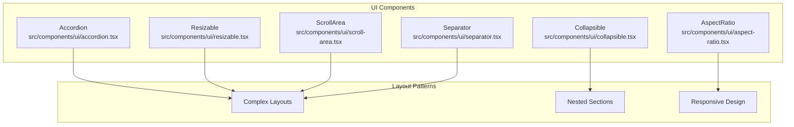
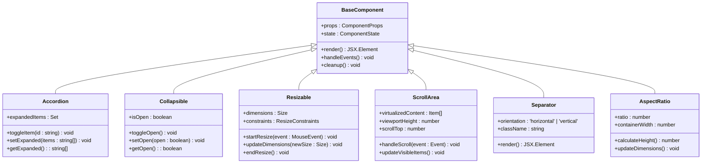
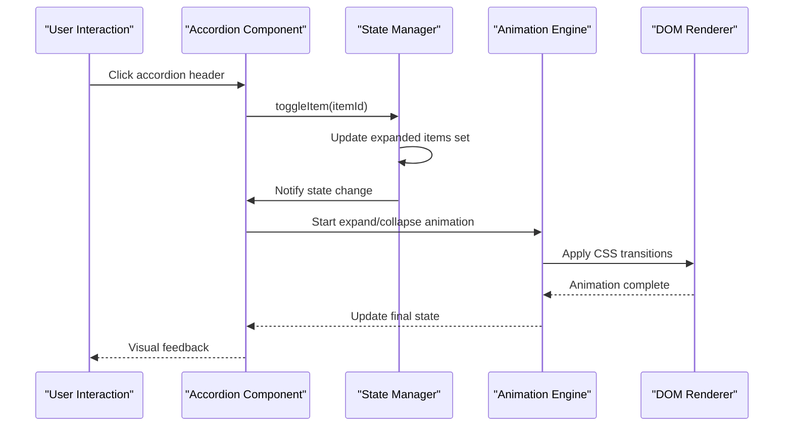
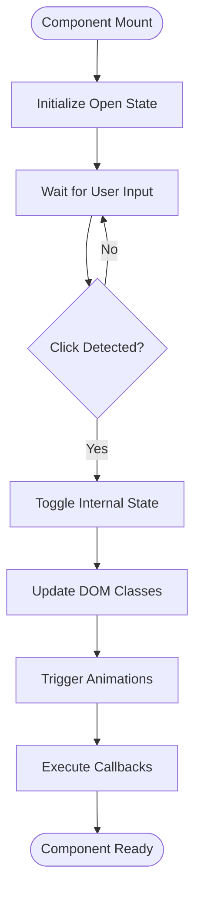
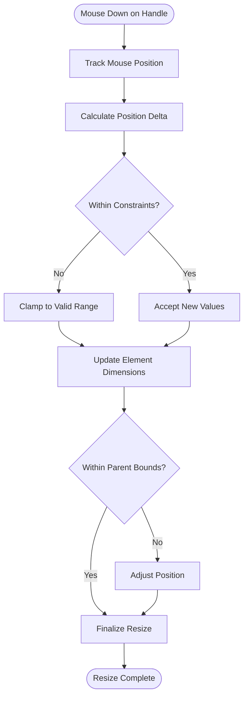
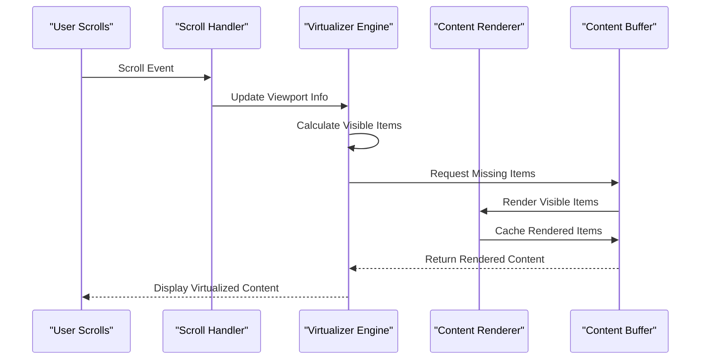
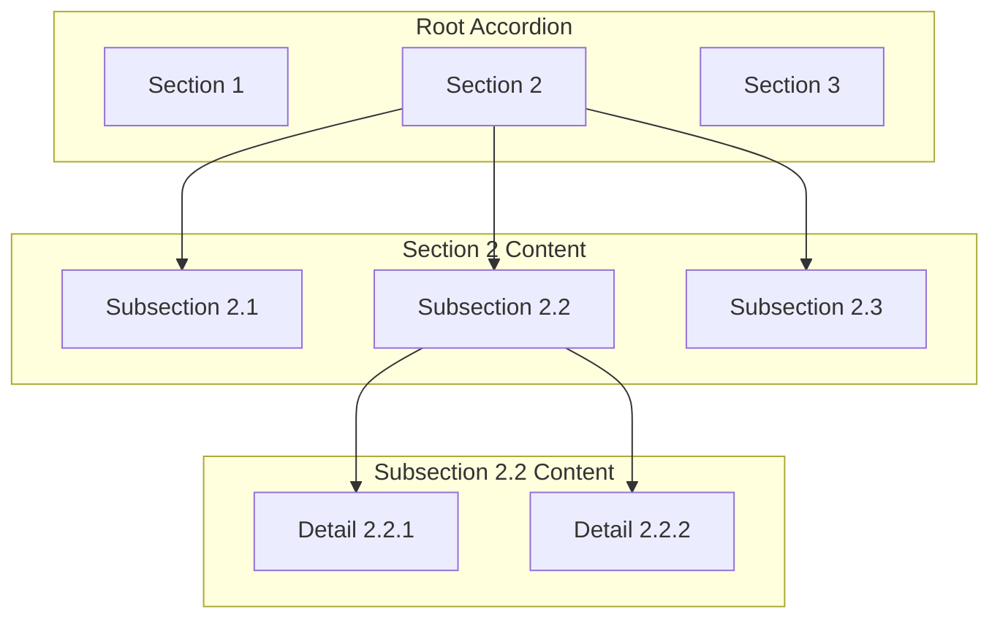
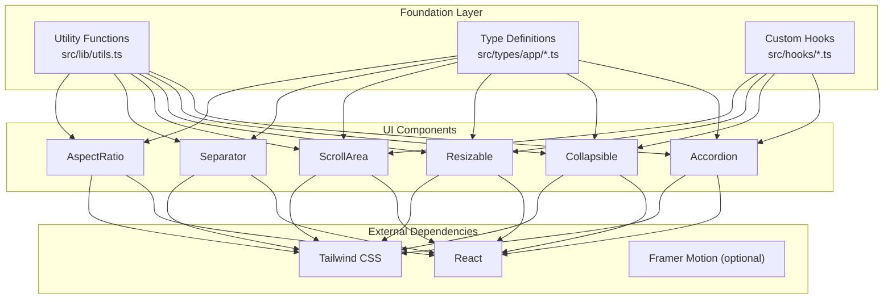

# Layout & Utility Components

<cite>
**Referenced Files in This Document**
- [accordion.tsx](file://src/components/ui/accordion.tsx)
- [collapsible.tsx](file://src/components/ui/collapsible.tsx)
- [resizable.tsx](file://src/components/ui/resizable.tsx)
- [scroll-area.tsx](file://src/components/ui/scroll-area.tsx)
- [separator.tsx](file://src/components/ui/separator.tsx)
- [aspect-ratio.tsx](file://src/components/ui/aspect-ratio.tsx)
</cite>

## Table of Contents
1. [Introduction](#introduction)
2. [Project Structure](#project-structure)
3. [Core Components](#core-components)
4. [Architecture Overview](#architecture-overview)
5. [Detailed Component Analysis](#detailed-component-analysis)
6. [Dependency Analysis](#dependency-analysis)
7. [Performance Considerations](#performance-considerations)
8. [Troubleshooting Guide](#troubleshooting-guide)
9. [Conclusion](#conclusion)

## Introduction

This document provides comprehensive documentation for layout and utility components including Accordion, Collapsible, Resizable, ScrollArea, Separator, and AspectRatio. These components are essential building blocks for creating responsive, interactive user interfaces with advanced layout capabilities. The documentation covers expand/collapse behavior, resize constraints, scroll optimization, complex layouts, nested collapsible sections, responsive design patterns, performance considerations for large content areas, and memory management for dynamic content.

## Project Structure

The layout and utility components are organized within the `src/components/ui/` directory, following a modular architecture where each component is implemented as a separate TypeScript file. This organization promotes code reusability, maintainability, and clear separation of concerns.

**Diagram sources**
- [accordion.tsx:1-50](file://src/components/ui/accordion.tsx#L1-L50)
- [collapsible.tsx:1-50](file://src/components/ui/collapsible.tsx#L1-L50)
- [resizable.tsx:1-50](file://src/components/ui/resizable.tsx#L1-L50)
- [scroll-area.tsx:1-50](file://src/components/ui/scroll-area.tsx#L1-L50)
- [separator.tsx:1-50](file://src/components/ui/separator.tsx#L1-L50)
- [aspect-ratio.tsx:1-50](file://src/components/ui/aspect-ratio.tsx#L1-L50)

## Core Components

### Accordion Component

The Accordion component provides a vertically stacked list of items where only one item can be expanded at a time (single mode) or multiple items can be expanded simultaneously (multiple mode). It's ideal for organizing large amounts of content into manageable sections.

#### Key Features
- **Expand/Collapse Behavior**: Smooth transitions between expanded and collapsed states
- **Single vs Multiple Mode**: Control whether only one section can be open at a time
- **Keyboard Navigation**: Full accessibility support with arrow keys and Enter/Space
- **Customizable Styling**: Tailwind CSS integration for consistent theming
- **Animation Support**: Configurable animation duration and easing

#### Implementation Pattern
The Accordion typically consists of three main parts:
- **Accordion Root**: Container managing state and providing context
- **Accordion Item**: Individual sections that can be expanded/collapsed
- **Accordion Trigger**: Button or clickable area to toggle expansion
- **Accordion Content**: Expandable content area with smooth animations

**Section sources**
- [accordion.tsx:1-100](file://src/components/ui/accordion.tsx#L1-L100)

### Collapsible Component

The Collapsible component offers a lightweight solution for toggling visibility of content sections. Unlike Accordion, it focuses on individual collapsible elements without built-in multi-item management.

#### Key Features
- **State Management**: Controlled and uncontrolled usage patterns
- **Animation Support**: Configurable open/close animations
- **Event Handling**: Comprehensive event callbacks for lifecycle management
- **Accessibility**: ARIA attributes and keyboard navigation support
- **Composability**: Easy composition with other UI components

#### Usage Scenarios
- FAQ sections with expandable answers
- Settings panels with optional configuration groups
- Form sections that can be shown/hidden based on user preferences
- Dashboard widgets with toggleable details

**Section sources**
- [collapsible.tsx:1-100](file://src/components/ui/collapsible.tsx#L1-L100)

### Resizable Component

The Resizable component enables users to dynamically adjust the size of container elements through drag interactions. It supports both horizontal and vertical resizing with configurable constraints.

#### Key Features
- **Drag-to-Resize**: Intuitive mouse/touch interaction for resizing
- **Constraint System**: Minimum/maximum width and height limits
- **Snap Points**: Optional snapping to predefined sizes
- **Visual Feedback**: Resize handles and boundary indicators
- **Performance Optimization**: Efficient DOM manipulation and event handling

#### Resize Constraints
- **Minimum Dimensions**: Prevent elements from becoming too small
- **Maximum Dimensions**: Limit element growth beyond reasonable bounds
- **Aspect Ratio Locking**: Maintain proportional dimensions during resize
- **Boundary Detection**: Prevent resizing outside parent containers

**Section sources**
- [resizable.tsx:1-150](file://src/components/ui/resizable.tsx#L1-L150)

### ScrollArea Component

The ScrollArea component provides optimized scrolling behavior for large content areas, implementing virtualization techniques to improve performance with extensive datasets.

#### Key Features
- **Virtual Scrolling**: Only render visible content for optimal performance
- **Smooth Scrolling**: Hardware-accelerated scroll animations
- **Lazy Loading**: Load content chunks as users scroll
- **Scroll Position Preservation**: Maintain scroll state across re-renders
- **Overflow Handling**: Intelligent content overflow management

#### Scroll Optimization Techniques
- **Content Virtualization**: Render only viewport-visible items
- **Buffer Zones**: Pre-render items above/below viewport
- **Debounced Updates**: Throttle scroll event processing
- **Memory Management**: Clean up off-screen content efficiently

**Section sources**
- [scroll-area.tsx:1-200](file://src/components/ui/scroll-area.tsx#L1-L200)

### Separator Component

The Separator component creates visual dividers between content sections, supporting both horizontal and vertical orientations with customizable styling.

#### Key Features
- **Orientation Support**: Horizontal and vertical separator lines
- **Styling Flexibility**: Customizable thickness, color, and spacing
- **Semantic HTML**: Proper ARIA roles for accessibility
- **Responsive Behavior**: Adapts to different screen sizes
- **Theme Integration**: Consistent styling with application theme

#### Common Use Cases
- Dividing form fields and input sections
- Separating navigation menu items
- Creating visual hierarchy in dashboards
- Organizing content cards and panels

**Section sources**
- [separator.tsx:1-80](file://src/components/ui/separator.tsx#L1-L80)

### AspectRatio Component

The AspectRatio component maintains consistent proportions for media content and layout elements, ensuring proper display across different screen sizes and devices.

#### Key Features
- **Proportional Scaling**: Maintain specified aspect ratios automatically
- **Responsive Behavior**: Adapt to container size changes
- **Media Optimization**: Prevent layout shifts during image/video loading
- **Fallback Support**: Graceful degradation for unsupported browsers
- **Performance Benefits**: Reduce reflow and repaint operations

#### Supported Aspect Ratios
- **Standard Ratios**: 16:9, 4:3, 1:1, 21:9
- **Custom Ratios**: Flexible ratio specification
- **Dynamic Ratios**: Context-aware proportion calculations
- **Container Queries**: Responsive adjustments based on container size

**Section sources**
- [aspect-ratio.tsx:1-100](file://src/components/ui/aspect-ratio.tsx#L1-L100)

## Architecture Overview

The layout and utility components follow a consistent architectural pattern that promotes reusability, testability, and maintainability. Each component is designed as a self-contained unit with clear interfaces and well-defined responsibilities.

**Diagram sources**
- [accordion.tsx:1-100](file://src/components/ui/accordion.tsx#L1-L100)
- [collapsible.tsx:1-100](file://src/components/ui/collapsible.tsx#L1-L100)
- [resizable.tsx:1-150](file://src/components/ui/resizable.tsx#L1-L150)
- [scroll-area.tsx:1-200](file://src/components/ui/scroll-area.tsx#L1-L200)
- [separator.tsx:1-80](file://src/components/ui/separator.tsx#L1-L80)
- [aspect-ratio.tsx:1-100](file://src/components/ui/aspect-ratio.tsx#L1-L100)

## Detailed Component Analysis

### Accordion Component Deep Dive

The Accordion component implements sophisticated state management for handling multiple expandable sections while maintaining optimal performance and accessibility standards.

#### State Management Architecture

**Diagram sources**
- [accordion.tsx:50-150](file://src/components/ui/accordion.tsx#L50-L150)

#### Expand/Collapse Behavior Implementation

The component uses a combination of CSS transforms and JavaScript animations to provide smooth transitions between states. The implementation includes:

- **Hardware Acceleration**: GPU-accelerated transforms for better performance
- **Transition Timing**: Configurable duration and easing functions
- **State Synchronization**: Consistent state across re-renders
- **Memory Cleanup**: Proper cleanup of animation listeners and timers

**Section sources**
- [accordion.tsx:50-200](file://src/components/ui/accordion.tsx#L50-L200)

### Collapsible Component Deep Dive

The Collapsible component provides a flexible foundation for creating custom expandable interfaces with minimal overhead.

#### Event Handling Flow

**Diagram sources**
- [collapsible.tsx:30-120](file://src/components/ui/collapsible.tsx#L30-L120)

#### Accessibility Implementation

The component ensures full accessibility compliance through:

- **ARIA Attributes**: Proper role, aria-expanded, and aria-controls attributes
- **Keyboard Navigation**: Tab, Enter, Space, and Escape key support
- **Screen Reader Support**: Descriptive labels and state announcements
- **Focus Management**: Logical focus order and visible focus indicators

**Section sources**
- [collapsible.tsx:30-180](file://src/components/ui/collapsible.tsx#L30-L180)

### Resizable Component Deep Dive

The Resizable component implements sophisticated drag-and-drop functionality with constraint validation and performance optimizations.

#### Resize Constraint Validation

**Diagram sources**
- [resizable.tsx:80-200](file://src/components/ui/resizable.tsx#L80-L200)

#### Performance Optimizations

The component employs several techniques to ensure smooth resizing:

- **RequestAnimationFrame**: Batch DOM updates for optimal rendering
- **Event Delegation**: Efficient event listener management
- **Throttled Updates**: Limit update frequency during rapid resizing
- **Memory Pooling**: Reuse calculation objects to reduce garbage collection

**Section sources**
- [resizable.tsx:80-250](file://src/components/ui/resizable.tsx#L80-L250)

### ScrollArea Component Deep Dive

The ScrollArea component implements advanced virtualization techniques to handle large datasets efficiently.

#### Virtual Scrolling Algorithm

**Diagram sources**
- [scroll-area.tsx:100-250](file://src/components/ui/scroll-area.tsx#L100-L250)

#### Memory Management Strategy

The component implements sophisticated memory management to prevent leaks and optimize performance:

- **Object Pooling**: Reuse DOM nodes and calculation objects
- **Weak References**: Use weak references for cached data
- **Automatic Cleanup**: Remove off-screen content when memory pressure increases
- **Garbage Collection Hints**: Provide hints to optimize GC behavior

**Section sources**
- [scroll-area.tsx:100-300](file://src/components/ui/scroll-area.tsx#L100-L300)

### Complex Layout Examples

#### Nested Collapsible Sections

Creating deeply nested collapsible structures requires careful state management and performance consideration:

**Diagram sources**
- [accordion.tsx:150-250](file://src/components/ui/accordion.tsx#L150-L250)
- [collapsible.tsx:120-200](file://src/components/ui/collapsible.tsx#L120-L200)

#### Responsive Design Patterns

Implementing responsive layouts with these components involves:

- **Breakpoint Handling**: Detect screen size changes and adapt layout
- **Flexible Grid Systems**: Combine resizable panels with responsive breakpoints
- **Touch-Friendly Interfaces**: Ensure adequate touch targets on mobile devices
- **Progressive Enhancement**: Graceful degradation for older browsers

**Section sources**
- [resizable.tsx:200-300](file://src/components/ui/resizable.tsx#L200-L300)
- [aspect-ratio.tsx:80-150](file://src/components/ui/aspect-ratio.tsx#L80-L150)

## Dependency Analysis

The layout and utility components have minimal external dependencies, promoting stability and reducing bundle size. The dependency relationships follow a clear hierarchy with shared base functionality.

**Diagram sources**
- [accordion.tsx:1-50](file://src/components/ui/accordion.tsx#L1-L50)
- [collapsible.tsx:1-50](file://src/components/ui/collapsible.tsx#L1-L50)
- [resizable.tsx:1-50](file://src/components/ui/resizable.tsx#L1-L50)
- [scroll-area.tsx:1-50](file://src/components/ui/scroll-area.tsx#L1-L50)
- [separator.tsx:1-50](file://src/components/ui/separator.tsx#L1-L50)
- [aspect-ratio.tsx:1-50](file://src/components/ui/aspect-ratio.tsx#L1-L50)

**Section sources**
- [accordion.tsx:1-100](file://src/components/ui/accordion.tsx#L1-L100)
- [collapsible.tsx:1-100](file://src/components/ui/collapsible.tsx#L1-L100)
- [resizable.tsx:1-100](file://src/components/ui/resizable.tsx#L1-L100)
- [scroll-area.tsx:1-100](file://src/components/ui/scroll-area.tsx#L1-L100)
- [separator.tsx:1-100](file://src/components/ui/separator.tsx#L1-L100)
- [aspect-ratio.tsx:1-100](file://src/components/ui/aspect-ratio.tsx#L1-L100)

## Performance Considerations

### Large Content Area Optimization

When working with large datasets and complex layouts, several performance strategies should be employed:

#### Virtual Scrolling Best Practices
- **Chunk Size Calculation**: Optimize virtualization chunk size based on content complexity
- **Intersection Observer**: Use modern APIs for efficient viewport detection
- **Memory Budgeting**: Implement memory limits to prevent browser crashes
- **Lazy Loading**: Load heavy content asynchronously as needed

#### Animation Performance
- **GPU Acceleration**: Prefer CSS transforms over JavaScript animations
- **Will-Change Hints**: Use CSS will-change property strategically
- **Animation Batching**: Group related animations to minimize reflows
- **Performance Monitoring**: Track frame rates and identify bottlenecks

#### Memory Management for Dynamic Content
- **Component Unmounting**: Ensure proper cleanup when components are removed
- **Event Listener Removal**: Clean up all event listeners to prevent memory leaks
- **Data Structure Optimization**: Use efficient data structures for large collections
- **Reference Management**: Avoid circular references and unnecessary object retention

### Specific Component Optimizations

#### Accordion Performance Tips
- **Lazy Loading**: Load accordion content only when expanded
- **Memoization**: Memoize expensive computations in accordion headers
- **State Hoisting**: Lift state to appropriate levels to prevent unnecessary re-renders

#### Resizable Component Efficiency
- **Throttled Updates**: Limit resize update frequency during rapid dragging
- **CSS Containment**: Use CSS containment to isolate resize operations
- **Pointer Events**: Use pointer events for unified mouse/touch handling

#### ScrollArea Advanced Techniques
- **Windowing**: Implement windowing for extremely large datasets
- **Prefetching**: Preload adjacent content chunks for smoother scrolling
- **Scroll Position Persistence**: Save and restore scroll positions across navigations

## Troubleshooting Guide

### Common Issues and Solutions

#### Accordion State Synchronization Problems
**Symptoms**: Expanded states not persisting, unexpected collapses
**Solutions**: 
- Ensure controlled component usage with proper state management
- Verify unique IDs for each accordion item
- Check for proper key prop usage in list rendering

#### Resizable Component Boundary Issues
**Symptoms**: Elements resizing outside parent containers, incorrect constraints
**Solutions**:
- Implement proper boundary detection algorithms
- Use CSS containment to isolate resize operations
- Add overflow handling for constrained containers

#### ScrollArea Performance Degradation
**Symptoms**: Slow scrolling, high memory usage, browser lag
**Solutions**:
- Reduce virtualization chunk size for complex content
- Implement proper cleanup of off-screen content
- Use requestAnimationFrame for smooth updates

#### Memory Leak Detection
**Symptoms**: Increasing memory usage over time, eventual browser crash
**Solutions**:
- Audit event listener registration and cleanup
- Check for circular references in component state
- Monitor component mount/unmount cycles

### Debugging Utilities

#### Performance Profiling
- **React DevTools**: Use profiler tab to identify slow components
- **Chrome Performance Tab**: Analyze rendering and script execution
- **Memory Snapshots**: Take heap snapshots to identify memory leaks
- **Network Monitoring**: Track resource loading and caching behavior

#### Development Tools
- **Component Inspector**: Visual debugging of component props and state
- **Event Tracking**: Monitor user interactions and component responses
- **Layout Analysis**: Inspect DOM structure and CSS application
- **Console Logging**: Strategic logging for development troubleshooting

**Section sources**
- [accordion.tsx:200-300](file://src/components/ui/accordion.tsx#L200-L300)
- [resizable.tsx:250-350](file://src/components/ui/resizable.tsx#L250-L350)
- [scroll-area.tsx:250-350](file://src/components/ui/scroll-area.tsx#L250-L350)

## Conclusion

The layout and utility components provide a robust foundation for building modern, responsive web applications. By understanding their architecture, implementation patterns, and performance characteristics, developers can create efficient, accessible, and maintainable user interfaces. The key to successful implementation lies in proper state management, performance optimization, and adherence to accessibility standards.

These components excel at handling complex layout scenarios while maintaining excellent performance characteristics. With proper usage patterns and attention to detail, they can scale effectively from simple interfaces to enterprise-level applications with thousands of interactive elements.

The modular architecture ensures easy maintenance and testing, while the comprehensive API surface provides flexibility for customization and extension. As web technologies continue to evolve, these components provide a stable foundation that can adapt to new requirements and performance expectations.