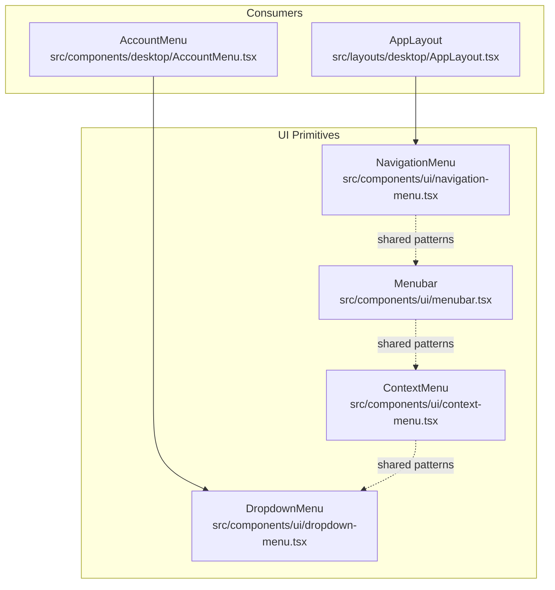
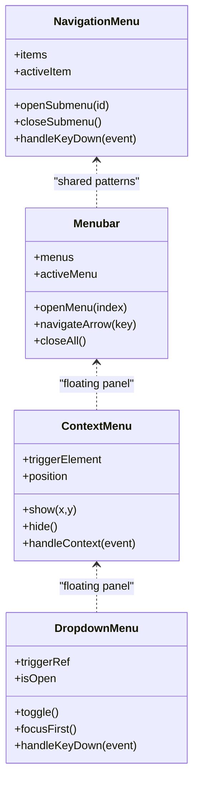
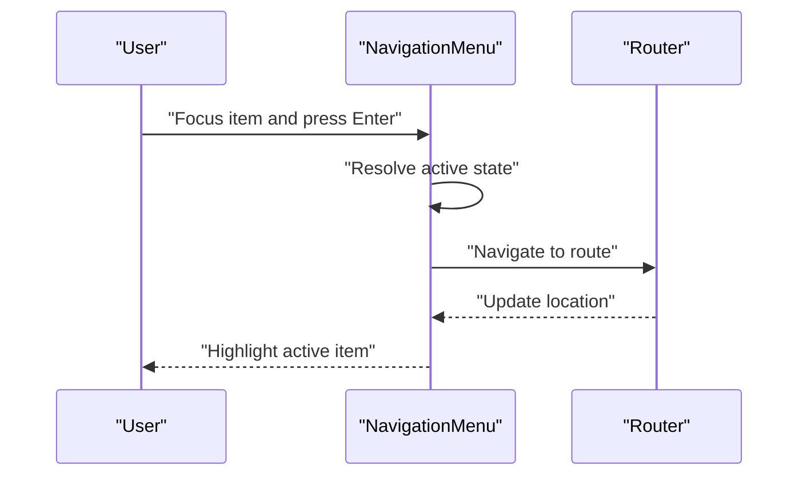
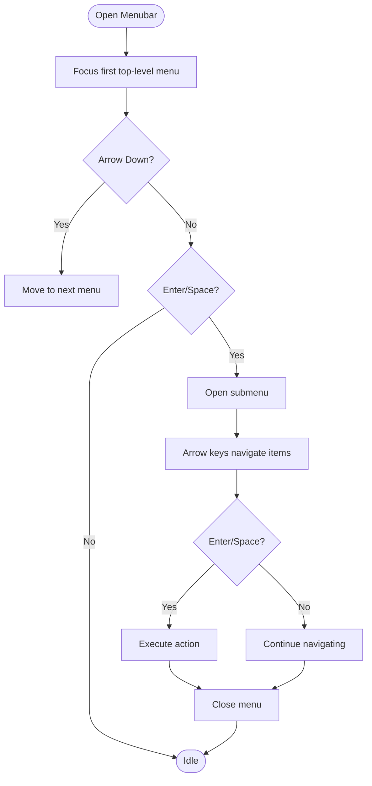
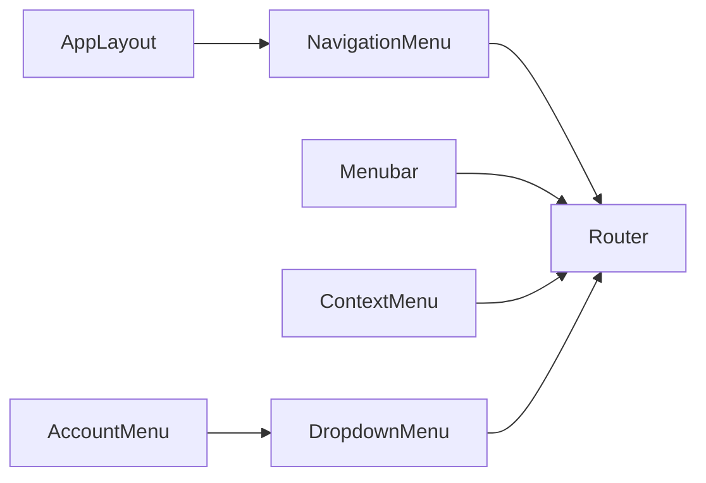

# Navigation Components

<cite>
**Referenced Files in This Document**
- [navigation-menu.tsx](file://src/components/ui/navigation-menu.tsx)
- [menubar.tsx](file://src/components/ui/menubar.tsx)
- [context-menu.tsx](file://src/components/ui/context-menu.tsx)
- [dropdown-menu.tsx](file://src/components/ui/dropdown-menu.tsx)
- [AppLayout.tsx](file://src/layouts/desktop/AppLayout.tsx)
- [AccountMenu.tsx](file://src/components/desktop/AccountMenu.tsx)
</cite>

## Table of Contents
1. [Introduction](#introduction)
2. [Project Structure](#project-structure)
3. [Core Components](#core-components)
4. [Architecture Overview](#architecture-overview)
5. [Detailed Component Analysis](#detailed-component-analysis)
6. [Dependency Analysis](#dependency-analysis)
7. [Performance Considerations](#performance-considerations)
8. [Troubleshooting Guide](#troubleshooting-guide)
9. [Conclusion](#conclusion)
10. [Appendices](#appendices)

## Introduction
This document provides comprehensive documentation for the navigation components used across the application: NavigationMenu, Menubar, ContextMenu, and DropdownMenu. It covers menu item configuration, keyboard navigation, accessibility features, nested menus, dynamic generation, custom items, positioning strategies, collision detection, responsive behavior, performance considerations for large menus, and integration with routing systems. The goal is to help both developers and designers implement consistent, accessible, and performant navigation experiences.

## Project Structure
The navigation components are implemented as reusable UI primitives under src/components/ui and consumed by layout and feature components. Key files include:
- src/components/ui/navigation-menu.tsx
- src/components/ui/menubar.tsx
- src/components/ui/context-menu.tsx
- src/components/ui/dropdown-menu.tsx
- src/layouts/desktop/AppLayout.tsx (consumes NavigationMenu)
- src/components/desktop/AccountMenu.tsx (consumes DropdownMenu)



**Diagram sources**
- [navigation-menu.tsx](file://src/components/ui/navigation-menu.tsx)
- [menubar.tsx](file://src/components/ui/menubar.tsx)
- [context-menu.tsx](file://src/components/ui/context-menu.tsx)
- [dropdown-menu.tsx](file://src/components/ui/dropdown-menu.tsx)
- [AppLayout.tsx](file://src/layouts/desktop/AppLayout.tsx)
- [AccountMenu.tsx](file://src/components/desktop/AccountMenu.tsx)

**Section sources**
- [navigation-menu.tsx](file://src/components/ui/navigation-menu.tsx)
- [menubar.tsx](file://src/components/ui/menubar.tsx)
- [context-menu.tsx](file://src/components/ui/context-menu.tsx)
- [dropdown-menu.tsx](file://src/components/ui/dropdown-menu.tsx)
- [AppLayout.tsx](file://src/layouts/desktop/AppLayout.tsx)
- [AccountMenu.tsx](file://src/components/desktop/AccountMenu.tsx)

## Core Components
This section summarizes each component’s purpose, typical usage, and key behaviors.

- NavigationMenu
  - Purpose: Top-level horizontal navigation for primary app sections.
  - Typical usage: Root container with multiple MenuItems; supports nested submenus via submenu containers.
  - Keyboard: Arrow keys move focus between items; Enter/Space activates; Escape closes open submenus.
  - Accessibility: ARIA roles and attributes for navigation landmarks and active states.
  - Positioning: Horizontal flow; submenus positioned relative to parent items.

- Menubar
  - Purpose: Desktop-style application menu bar (File, Edit, View, etc.).
  - Typical usage: Root menubar with menu groups and actions.
  - Keyboard: Arrow keys navigate within and between menus; Enter/Space opens; Escape closes.
  - Accessibility: Role="menubar", proper aria-haspopup and aria-expanded semantics.
  - Positioning: Vertical dropdowns from top-level items.

- ContextMenu
  - Purpose: Right-click or long-press contextual actions near content.
  - Typical usage: Triggered by contextmenu event on a target element.
  - Keyboard: Arrow keys navigate; Enter/Space activates; Escape closes.
  - Accessibility: Proper role and label semantics; focus management when opened.
  - Positioning: Floating panel positioned near trigger; collision handling to keep within viewport.

- DropdownMenu
  - Purpose: Compact action lists triggered by buttons or icons.
  - Typical usage: Button triggers a floating list of actions; supports separators and disabled items.
  - Keyboard: Arrow keys navigate; Enter/Space activates; Escape closes.
  - Accessibility: Role="menu" with aria-haspopup="true" on trigger; focus trap while open.
  - Positioning: Floating panel with collision detection to avoid overflow.

**Section sources**
- [navigation-menu.tsx](file://src/components/ui/navigation-menu.tsx)
- [menubar.tsx](file://src/components/ui/menubar.tsx)
- [context-menu.tsx](file://src/components/ui/context-menu.tsx)
- [dropdown-menu.tsx](file://src/components/ui/dropdown-menu.tsx)

## Architecture Overview
The navigation system follows a layered architecture:
- UI primitives provide composable building blocks with shared behaviors (keyboard, focus, ARIA).
- Consumers compose these primitives into higher-level layouts and feature-specific menus.
- Shared patterns (e.g., floating panels, collision detection, focus management) are reused across components.



**Diagram sources**
- [navigation-menu.tsx](file://src/components/ui/navigation-menu.tsx)
- [menubar.tsx](file://src/components/ui/menubar.tsx)
- [context-menu.tsx](file://src/components/ui/context-menu.tsx)
- [dropdown-menu.tsx](file://src/components/ui/dropdown-menu.tsx)

## Detailed Component Analysis

### NavigationMenu
- Menu Item Configuration
  - Define items with labels, routes, and optional nested children.
  - Support for active state highlighting based on current route.
  - Optional icon and secondary text per item.
- Nested Menus
  - Use submenu containers to group related actions.
  - Submenus open on hover/focus and close on blur or escape.
- Dynamic Generation
  - Render items from an array; compute active state using router state.
- Custom Items
  - Allow arbitrary React nodes inside items for advanced use cases.
- Keyboard Navigation
  - Left/Right arrows move between top-level items.
  - Down arrow opens submenu; Up arrow closes it.
  - Enter/Space activates selected item.
- Accessibility
  - ARIA roles for navigation and menu lists.
  - aria-current for active link indication.
- Positioning and Collision Detection
  - Submenus positioned relative to parent; adjust if overflowing viewport.
- Responsive Behavior
  - On small screens, consider collapsing into a drawer or mobile-friendly pattern.
- Routing Integration
  - Link items to routes; handle programmatic navigation on activation.



**Diagram sources**
- [navigation-menu.tsx](file://src/components/ui/navigation-menu.tsx)
- [AppLayout.tsx](file://src/layouts/desktop/AppLayout.tsx)

**Section sources**
- [navigation-menu.tsx](file://src/components/ui/navigation-menu.tsx)
- [AppLayout.tsx](file://src/layouts/desktop/AppLayout.tsx)

### Menubar
- Menu Item Configuration
  - Group actions under top-level menus (e.g., File, Edit).
  - Support for separators and disabled entries.
- Nested Menus
  - Multi-level nesting supported; maintain focus order.
- Dynamic Generation
  - Build menus from data structures; compute enabled/disabled states dynamically.
- Keyboard Navigation
  - Arrow keys traverse menus and items; Enter/Space opens and activates.
  - Escape closes all open menus.
- Accessibility
  - Role="menubar" and proper aria-haspopup/aria-expanded attributes.
- Positioning and Collision Detection
  - Dropdowns positioned below top-level items; reflow if near bottom edge.
- Responsive Behavior
  - Typically desktop-focused; hide or adapt on very small viewports.
- Routing Integration
  - Actions can trigger navigation or dispatch commands.



**Diagram sources**
- [menubar.tsx](file://src/components/ui/menubar.tsx)

**Section sources**
- [menubar.tsx](file://src/components/ui/menubar.tsx)

### ContextMenu
- Menu Item Configuration
  - Define actions relevant to the targeted content.
  - Support conditional visibility and disabled states.
- Nested Menus
  - Optional submenus for grouped actions.
- Dynamic Generation
  - Compute available actions based on selection or context.
- Keyboard Navigation
  - Arrow keys navigate; Enter/Space activates; Escape closes.
- Accessibility
  - Proper role and label semantics; ensure focus moves to menu when opened.
- Positioning and Collision Detection
  - Positioned at click coordinates; adjust to stay within viewport.
- Responsive Behavior
  - Works on touch devices via long-press triggers.
- Routing Integration
  - Actions may navigate or update application state.

```mermaid
sequenceDiagram
participant Target as "Target Element"
participant Ctx as "ContextMenu"
participant Pos as "Positioner"
Target->>Ctx : "contextmenu event"
Ctx->>Pos : "Compute position (x,y)"
Pos-->>Ctx : "Adjusted position"
Ctx-->>Target : "Show menu at position"
Note over Ctx,Target : "Keyboard navigates; Escape hides"
```

**Diagram sources**
- [context-menu.tsx](file://src/components/ui/context-menu.tsx)

**Section sources**
- [context-menu.tsx](file://src/components/ui/context-menu.tsx)

### DropdownMenu
- Menu Item Configuration
  - Simple list of actions; support for separators and disabled items.
- Nested Menus
  - Optional submenus for complex actions.
- Dynamic Generation
  - Render items from arrays; compute enabled states based on context.
- Keyboard Navigation
  - Arrow keys navigate; Enter/Space activates; Escape closes.
- Accessibility
  - Role="menu" with aria-haspopup on trigger; focus management.
- Positioning and Collision Detection
  - Floating panel positioned relative to trigger; reflow if needed.
- Responsive Behavior
  - Adapts to screen size; may switch placement direction.
- Routing Integration
  - Actions can trigger navigation or side effects.

```mermaid
sequenceDiagram
participant Btn as "Trigger Button"
participant Drop as "DropdownMenu"
participant Pos as "Positioner"
Btn->>Drop : "Click to toggle"
Drop->>Pos : "Calculate placement"
Pos-->>Drop : "Placement result"
Drop-->>Btn : "Render menu"
Note over Drop,Btn : "Arrow keys navigate; Escape closes"
```

**Diagram sources**
- [dropdown-menu.tsx](file://src/components/ui/dropdown-menu.tsx)
- [AccountMenu.tsx](file://src/components/desktop/AccountMenu.tsx)

**Section sources**
- [dropdown-menu.tsx](file://src/components/ui/dropdown-menu.tsx)
- [AccountMenu.tsx](file://src/components/desktop/AccountMenu.tsx)

## Dependency Analysis
- Internal Dependencies
  - All navigation primitives share common patterns for floating panels, focus management, and keyboard handling.
  - Consumers depend on primitives to build higher-level interfaces.
- External Dependencies
  - Routing integration depends on the application’s router library.
  - Styling relies on CSS classes and utility frameworks.



**Diagram sources**
- [navigation-menu.tsx](file://src/components/ui/navigation-menu.tsx)
- [menubar.tsx](file://src/components/ui/menubar.tsx)
- [context-menu.tsx](file://src/components/ui/context-menu.tsx)
- [dropdown-menu.tsx](file://src/components/ui/dropdown-menu.tsx)
- [AppLayout.tsx](file://src/layouts/desktop/AppLayout.tsx)
- [AccountMenu.tsx](file://src/components/desktop/AccountMenu.tsx)

**Section sources**
- [navigation-menu.tsx](file://src/components/ui/navigation-menu.tsx)
- [menubar.tsx](file://src/components/ui/menubar.tsx)
- [context-menu.tsx](file://src/components/ui/context-menu.tsx)
- [dropdown-menu.tsx](file://src/components/ui/dropdown-menu.tsx)
- [AppLayout.tsx](file://src/layouts/desktop/AppLayout.tsx)
- [AccountMenu.tsx](file://src/components/desktop/AccountMenu.tsx)

## Performance Considerations
- Large Menus
  - Virtualize or paginate items to reduce DOM size.
  - Debounce expensive computations (e.g., filtering) during input-driven searches.
- Rendering Optimization
  - Memoize computed props and derived lists to prevent unnecessary re-renders.
  - Avoid heavy work in render paths; offload to background tasks where possible.
- Event Handling
  - Coalesce frequent events (e.g., scroll, resize) that affect positioning.
- Memory Management
  - Clean up event listeners and timers when components unmount.
- Accessibility Impact
  - Ensure focus management does not cause layout thrashing; batch DOM reads/writes.

[No sources needed since this section provides general guidance]

## Troubleshooting Guide
- Keyboard Navigation Issues
  - Verify that focus is correctly moved into the menu when opened.
  - Confirm that Escape closes the menu and returns focus to the trigger.
- Accessibility Problems
  - Check ARIA roles and attributes (role, aria-haspopup, aria-expanded, aria-current).
  - Ensure screen readers announce menu state changes.
- Positioning and Collisions
  - Inspect computed positions and adjustments for viewport boundaries.
  - Test on various screen sizes and zoom levels.
- Dynamic Menus Not Updating
  - Ensure state updates trigger re-renders and that memoization dependencies are correct.
- Routing Integration
  - Validate that navigation calls occur after user activation and do not block rendering.

**Section sources**
- [navigation-menu.tsx](file://src/components/ui/navigation-menu.tsx)
- [menubar.tsx](file://src/components/ui/menubar.tsx)
- [context-menu.tsx](file://src/components/ui/context-menu.tsx)
- [dropdown-menu.tsx](file://src/components/ui/dropdown-menu.tsx)

## Conclusion
The navigation components provide a cohesive set of primitives for building accessible, keyboard-friendly, and responsive menus. By following the configuration guidelines, leveraging shared positioning and focus management, and applying performance best practices, teams can deliver robust navigation experiences across desktop and mobile contexts.

[No sources needed since this section summarizes without analyzing specific files]

## Appendices

### Menu Item Configuration Reference
- Common fields
  - Label: Display text for the item.
  - Icon: Optional visual indicator.
  - Disabled: Prevents activation.
  - Separator: Renders a divider instead of an action.
  - Children: Array of submenu items.
  - Route: For navigation-capable items.
  - Action: Callback for non-navigation actions.
- Example patterns
  - Static list: Render from a constant array.
  - Dynamic list: Compute from API responses or application state.
  - Conditional visibility: Filter items based on permissions or context.

[No sources needed since this section provides general guidance]

### Keyboard Navigation Matrix
- NavigationMenu
  - Left/Right: Move between top-level items.
  - Down: Open submenu.
  - Up: Close submenu.
  - Enter/Space: Activate item.
  - Escape: Close open submenu.
- Menubar
  - Arrow keys: Navigate menus and items.
  - Enter/Space: Open/activate.
  - Escape: Close all menus.
- ContextMenu/DropdownMenu
  - Arrow keys: Navigate items.
  - Enter/Space: Activate.
  - Escape: Close.

[No sources needed since this section provides general guidance]

### Positioning Strategies and Collision Detection
- Placement directions
  - Auto-detect preferred direction (top/bottom/left/right) based on available space.
- Collision resolution
  - Shift or flip placement to remain within viewport.
  - Adjust alignment to avoid overlapping content.
- Anchoring
  - Anchor floating panels to trigger elements or coordinates.
- Responsiveness
  - Re-evaluate placement on resize or orientation change.

[No sources needed since this section provides general guidance]

### Integration With Routing Systems
- Active State
  - Highlight items matching the current route.
- Programmatic Navigation
  - Trigger navigation on activation; avoid blocking renders.
- Deep Linking
  - Preserve query parameters and hash fragments when navigating.
- Guards and Permissions
  - Disable or hide items based on user roles or feature flags.

[No sources needed since this section provides general guidance]