# UI Primitives

<cite>
**Referenced Files in This Document**
- [button.tsx](file://src/components/ui/button.tsx)
- [dialog.tsx](file://src/components/ui/dialog.tsx)
- [table.tsx](file://src/components/ui/table.tsx)
- [card.tsx](file://src/components/ui/card.tsx)
- [input.tsx](file://src/components/ui/input.tsx)
- [select.tsx](file://src/components/ui/select.tsx)
- [form.tsx](file://src/components/ui/form.tsx)
- [label.tsx](file://src/components/ui/label.tsx)
- [components.json](file://components.json)
- [tailwind.config.js](file://tailwind.config.js)
- [index.css](file://src/index.css)
</cite>

## Table of Contents
1. [Introduction](#introduction)
2. [Project Structure](#project-structure)
3. [Core Components](#core-components)
4. [Architecture Overview](#architecture-overview)
5. [Detailed Component Analysis](#detailed-component-analysis)
6. [Dependency Analysis](#dependency-analysis)
7. [Performance Considerations](#performance-considerations)
8. [Troubleshooting Guide](#troubleshooting-guide)
9. [Conclusion](#conclusion)
10. [Appendices](#appendices)

## Introduction
This document provides comprehensive documentation for FinSight’s core UI primitive components: Button, Dialog, Table, Card, Input, Select, and Form. It covers prop specifications, event handling, styling options, accessibility features, theming support, responsive behavior, cross-browser considerations, composition patterns, and integration guidelines. The goal is to enable developers to build consistent, accessible, and maintainable interfaces using these primitives.

## Project Structure
FinSight organizes its UI primitives under src/components/ui as a cohesive set of React components styled with Tailwind CSS. Configuration files such as components.json and tailwind.config.js define component metadata and design tokens. Global styles are applied via index.css.

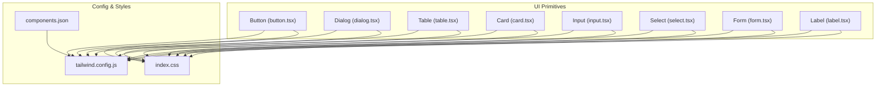

**Diagram sources**
- [button.tsx](file://src/components/ui/button.tsx)
- [dialog.tsx](file://src/components/ui/dialog.tsx)
- [table.tsx](file://src/components/ui/table.tsx)
- [card.tsx](file://src/components/ui/card.tsx)
- [input.tsx](file://src/components/ui/input.tsx)
- [select.tsx](file://src/components/ui/select.tsx)
- [form.tsx](file://src/components/ui/form.tsx)
- [label.tsx](file://src/components/ui/label.tsx)
- [components.json](file://components.json)
- [tailwind.config.js](file://tailwind.config.js)
- [index.css](file://src/index.css)

**Section sources**
- [components.json](file://components.json)
- [tailwind.config.js](file://tailwind.config.js)
- [index.css](file://src/index.css)

## Core Components
The following sections detail each primitive’s purpose, props, events, styling, accessibility, and usage patterns. Where applicable, TypeScript interface references are provided via file paths.

### Button
- Purpose: A clickable control used to trigger actions.
- Props:
  - variant: visual style preset (e.g., default, outline, ghost).
  - size: scale of the button (e.g., sm, md, lg).
  - disabled: prevents interaction when true.
  - loading: shows an indeterminate state without changing text.
  - className: additional Tailwind classes for customization.
  - type: HTML button type attribute (button, submit, reset).
- Events:
  - onClick: fires on pointer activation.
  - onKeyDown/onKeyUp: keyboard interactions.
- Styling:
  - Controlled by Tailwind utility classes; variants map to color and border presets.
  - Responsive sizing via size prop.
- Accessibility:
  - Semantic <button> element with proper role and focus management.
  - aria-disabled reflects disabled state.
  - Keyboard navigable and operable via Enter/Space.
- Usage example path: [button.tsx](file://src/components/ui/button.tsx)

**Section sources**
- [button.tsx](file://src/components/ui/button.tsx)

### Dialog
- Purpose: A modal overlay for focused tasks or confirmations.
- Props:
  - open: controlled visibility flag.
  - onOpenChange: callback when visibility changes.
  - title: dialog heading text.
  - description: optional descriptive text.
  - footer: content rendered below the body.
  - className: wrapper customization.
- Events:
  - onOpenChange: triggered by user interactions (close button, backdrop click, Escape key).
- Styling:
  - Backdrop and container use Tailwind utilities; can be extended via className.
- Accessibility:
  - Focus trap inside the dialog.
  - aria-modal and role="dialog".
  - Escape to close and focus restoration on close.
- Composition:
  - Often composed with Button (trigger), Label (field labels), and Form elements.
- Usage example path: [dialog.tsx](file://src/components/ui/dialog.tsx)

**Section sources**
- [dialog.tsx](file://src/components/ui/dialog.tsx)

### Table
- Purpose: Displays structured data in rows and columns with sorting, pagination, and selection capabilities at the consumer layer.
- Props:
  - columns: array of column definitions (header, accessor, width, align).
  - data: array of row objects.
  - sortable: enables header click sorting.
  - selectable: enables row selection.
  - striped: alternating row backgrounds.
  - bordered: adds borders between cells.
  - className: table-level customization.
- Events:
  - onSortChange: invoked when sort order changes.
  - onSelectChange: invoked when selection changes.
- Styling:
  - Uses semantic table elements with Tailwind utilities for spacing and alignment.
- Accessibility:
  - Proper table headers with scope attributes.
  - aria-sort on sortable headers.
  - Keyboard navigation across cells and rows.
- Composition:
  - Works well with Pagination and Filter controls.
- Usage example path: [table.tsx](file://src/components/ui/table.tsx)

**Section sources**
- [table.tsx](file://src/components/ui/table.tsx)

### Card
- Purpose: A container that groups related content and actions.
- Props:
  - title: card header text.
  - subtitle: optional secondary text.
  - footer: content rendered at the bottom.
  - padding: internal spacing control.
  - className: wrapper customization.
- Styling:
  - Rounded corners, subtle shadow, and background via Tailwind.
- Accessibility:
  - Semantic sectioning; can include headings and landmarks.
- Composition:
  - Commonly used with Button, Badge, and Chart placeholders.
- Usage example path: [card.tsx](file://src/components/ui/card.tsx)

**Section sources**
- [card.tsx](file://src/components/ui/card.tsx)

### Input
- Purpose: A text entry field for single-line input.
- Props:
  - value: controlled value.
  - onChange: handler for value updates.
  - placeholder: hint text.
  - disabled: disables interaction.
  - readOnly: allows read-only display.
  - type: input type (text, email, number, password, etc.).
  - error: boolean or string for validation feedback.
  - helperText: additional guidance text.
  - className: wrapper/customization.
- Events:
  - onChange, onBlur, onFocus, onKeyDown.
- Styling:
  - Base styles plus error/success states via Tailwind.
- Accessibility:
  - Associated Label via htmlFor/id.
  - aria-invalid and aria-describedby for errors.
- Composition:
  - Used within Form contexts for validation and submission.
- Usage example path: [input.tsx](file://src/components/ui/input.tsx)

**Section sources**
- [input.tsx](file://src/components/ui/input.tsx)

### Select
- Purpose: A dropdown list for choosing one or more options.
- Props:
  - value: selected option(s).
  - onChange: handler for selection changes.
  - options: array of { label, value } items.
  - placeholder: prompt shown when no selection.
  - disabled: disables interaction.
  - multiple: allows multi-selection.
  - error: validation state indicator.
  - className: wrapper/customization.
- Events:
  - onChange, onKeyDown for keyboard navigation.
- Styling:
  - Customizable via Tailwind; supports compact and expanded states.
- Accessibility:
  - Role="listbox" semantics with aria-selected and aria-activedescendant.
  - Arrow keys navigate options; Enter/Space selects.
- Composition:
  - Pairs with Label and Form for grouped inputs.
- Usage example path: [select.tsx](file://src/components/ui/select.tsx)

**Section sources**
- [select.tsx](file://src/components/ui/select.tsx)

### Form
- Purpose: A form builder that integrates validation, state, and submission with primitives like Input, Select, and Button.
- Props:
  - schema: validation schema definition.
  - defaultValues: initial values for fields.
  - onSubmit: handler invoked with validated data.
  - children: form fields and actions.
  - className: form-level customization.
- Events:
  - onSubmit: called after successful validation.
  - onInvalid: called when validation fails.
- Validation:
  - Integrates with a schema-based validator; displays field-level errors.
- Accessibility:
  - Associates Labels with Inputs via id/htmlFor.
  - Announces errors via aria-live regions.
- Composition:
  - Wraps Input, Select, Checkbox, RadioGroup, and action Buttons.
- Usage example path: [form.tsx](file://src/components/ui/form.tsx)

**Section sources**
- [form.tsx](file://src/components/ui/form.tsx)

### Label
- Purpose: Provides accessible labeling for form controls.
- Props:
  - htmlFor: associates label with an input by id.
  - className: wrapper customization.
- Accessibility:
  - Clicking the label focuses the associated control.
- Usage example path: [label.tsx](file://src/components/ui/label.tsx)

**Section sources**
- [label.tsx](file://src/components/ui/label.tsx)

## Architecture Overview
The UI primitives follow a layered architecture:
- Presentation Layer: Each primitive encapsulates rendering and styling.
- Behavior Layer: Event handlers and state management are localized per component.
- Theming Layer: Tailwind configuration defines tokens and variants consumed by components.
- Integration Layer: Forms orchestrate multiple primitives and manage validation/submission.

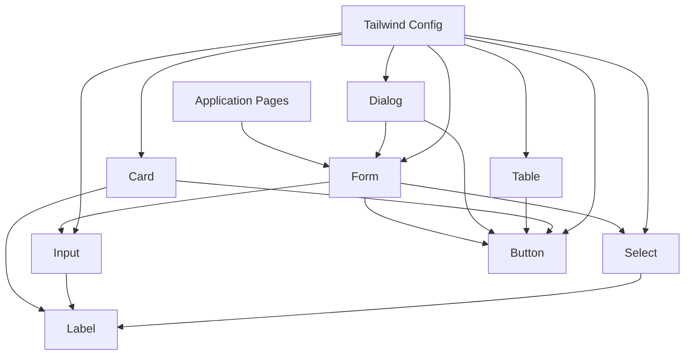

**Diagram sources**
- [button.tsx](file://src/components/ui/button.tsx)
- [dialog.tsx](file://src/components/ui/dialog.tsx)
- [table.tsx](file://src/components/ui/table.tsx)
- [card.tsx](file://src/components/ui/card.tsx)
- [input.tsx](file://src/components/ui/input.tsx)
- [select.tsx](file://src/components/ui/select.tsx)
- [form.tsx](file://src/components/ui/form.tsx)
- [label.tsx](file://src/components/ui/label.tsx)
- [tailwind.config.js](file://tailwind.config.js)

## Detailed Component Analysis

### Button
- Prop specification:
  - variant: string enum mapping to predefined styles.
  - size: string enum controlling padding and font scale.
  - disabled: boolean disabling interaction and setting aria-disabled.
  - loading: boolean toggling spinner and disabling clicks.
  - type: HTML button type.
  - className: additive Tailwind classes.
- Event handlers:
  - onClick: standard pointer event.
  - onKeyDown: supports Enter/Space activation.
- Styling options:
  - Variants and sizes are implemented via Tailwind class composition.
  - Hover/focus/disabled states are handled through utility classes.
- Accessibility:
  - Semantic button element ensures correct roles and keyboard behavior.
  - aria-disabled mirrors disabled prop.
- Usage examples:
  - Primary action: [button.tsx](file://src/components/ui/button.tsx)
  - Secondary action: [button.tsx](file://src/components/ui/button.tsx)
  - Danger action: [button.tsx](file://src/components/ui/button.tsx)

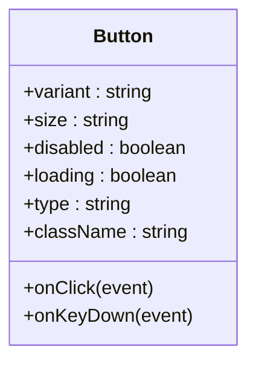

**Diagram sources**
- [button.tsx](file://src/components/ui/button.tsx)

**Section sources**
- [button.tsx](file://src/components/ui/button.tsx)

### Dialog
- Prop specification:
  - open: boolean controlling visibility.
  - onOpenChange: callback with new open state.
  - title: string for heading.
  - description: string for context.
  - footer: ReactNode for actions.
  - className: string for wrapper customization.
- Event handlers:
  - onOpenChange: triggered by backdrop click, close button, and Escape key.
- Styling options:
  - Backdrop and container styles are Tailwind-based; extend via className.
- Accessibility:
  - aria-modal and role="dialog".
  - Focus trap and focus restoration.
- Usage examples:
  - Confirmation dialog: [dialog.tsx](file://src/components/ui/dialog.tsx)
  - Settings panel: [dialog.tsx](file://src/components/ui/dialog.tsx)

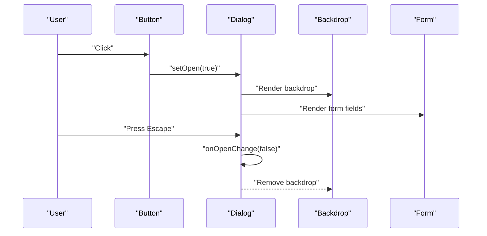

**Diagram sources**
- [dialog.tsx](file://src/components/ui/dialog.tsx)
- [button.tsx](file://src/components/ui/button.tsx)
- [form.tsx](file://src/components/ui/form.tsx)

**Section sources**
- [dialog.tsx](file://src/components/ui/dialog.tsx)

### Table
- Prop specification:
  - columns: array of column descriptors.
  - data: array of row records.
  - sortable: boolean enabling header sorting.
  - selectable: boolean enabling row selection.
  - striped: boolean for alternating row colors.
  - bordered: boolean for cell borders.
  - className: string for table customization.
- Event handlers:
  - onSortChange: invoked with updated sort config.
  - onSelectChange: invoked with selected row IDs.
- Styling options:
  - Tailwind utilities for layout, spacing, and borders.
- Accessibility:
  - Proper headers with scope.
  - aria-sort on sortable headers.
  - Keyboard navigation across cells and rows.
- Usage examples:
  - Sortable dataset: [table.tsx](file://src/components/ui/table.tsx)
  - Selectable dataset: [table.tsx](file://src/components/ui/table.tsx)

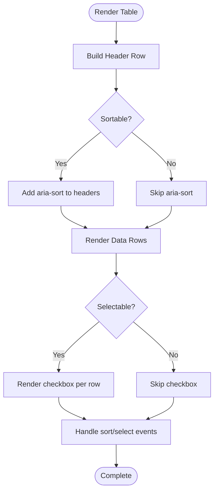

**Diagram sources**
- [table.tsx](file://src/components/ui/table.tsx)

**Section sources**
- [table.tsx](file://src/components/ui/table.tsx)

### Card
- Prop specification:
  - title: string for header.
  - subtitle: string for secondary text.
  - footer: ReactNode for bottom content.
  - padding: string controlling internal spacing.
  - className: string for wrapper customization.
- Styling options:
  - Background, rounded corners, and shadows via Tailwind.
- Accessibility:
  - Use semantic headings and landmarks within cards.
- Usage examples:
  - Metric summary: [card.tsx](file://src/components/ui/card.tsx)
  - Action panel: [card.tsx](file://src/components/ui/card.tsx)

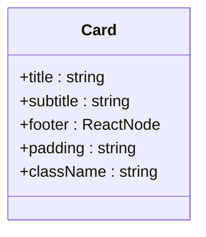

**Diagram sources**
- [card.tsx](file://src/components/ui/card.tsx)

**Section sources**
- [card.tsx](file://src/components/ui/card.tsx)

### Input
- Prop specification:
  - value: string or number depending on type.
  - onChange: handler receiving new value.
  - placeholder: string hint.
  - disabled: boolean.
  - readOnly: boolean.
  - type: string input type.
  - error: boolean or string for validation feedback.
  - helperText: string for additional guidance.
  - className: string for wrapper customization.
- Event handlers:
  - onChange, onBlur, onFocus, onKeyDown.
- Styling options:
  - Base styles plus error/success states via Tailwind.
- Accessibility:
  - Associated Label via htmlFor/id.
  - aria-invalid and aria-describedby for errors.
- Usage examples:
  - Text input: [input.tsx](file://src/components/ui/input.tsx)
  - Email input with validation: [input.tsx](file://src/components/ui/input.tsx)

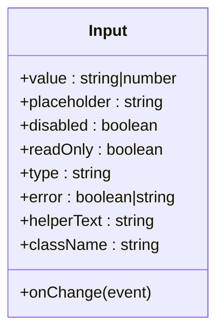

**Diagram sources**
- [input.tsx](file://src/components/ui/input.tsx)

**Section sources**
- [input.tsx](file://src/components/ui/input.tsx)

### Select
- Prop specification:
  - value: string or string[] depending on multiple.
  - onChange: handler receiving new selection.
  - options: array of { label, value }.
  - placeholder: string prompt.
  - disabled: boolean.
  - multiple: boolean allowing multi-select.
  - error: boolean or string for validation feedback.
  - className: string for wrapper customization.
- Event handlers:
  - onChange, onKeyDown for keyboard navigation.
- Styling options:
  - Tailwind-based dropdown styling; customizable via className.
- Accessibility:
  - Listbox semantics with aria-selected and aria-activedescendant.
  - Arrow keys navigate; Enter/Space selects.
- Usage examples:
  - Single select: [select.tsx](file://src/components/ui/select.tsx)
  - Multi select: [select.tsx](file://src/components/ui/select.tsx)

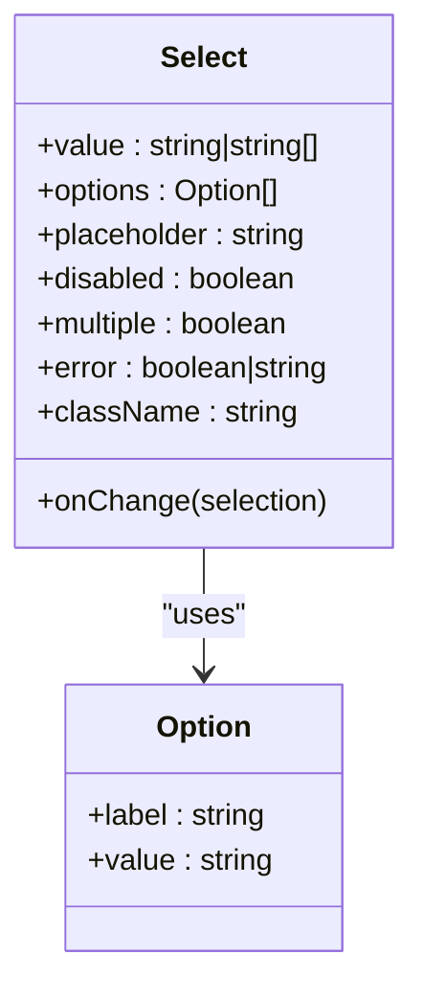

**Diagram sources**
- [select.tsx](file://src/components/ui/select.tsx)

**Section sources**
- [select.tsx](file://src/components/ui/select.tsx)

### Form
- Prop specification:
  - schema: validation schema object.
  - defaultValues: initial field values.
  - onSubmit: handler invoked with validated data.
  - children: form fields and actions.
  - className: string for form-level customization.
- Event handlers:
  - onSubmit: after validation passes.
  - onInvalid: when validation fails.
- Validation:
  - Schema-driven validation; displays field-level errors.
- Accessibility:
  - Labels associated with inputs via htmlFor/id.
  - aria-live regions announce errors.
- Composition patterns:
  - Wrap Input, Select, Checkbox, RadioGroup, and action Buttons.
- Usage examples:
  - Basic form: [form.tsx](file://src/components/ui/form.tsx)
  - Complex form with multiple fields: [form.tsx](file://src/components/ui/form.tsx)

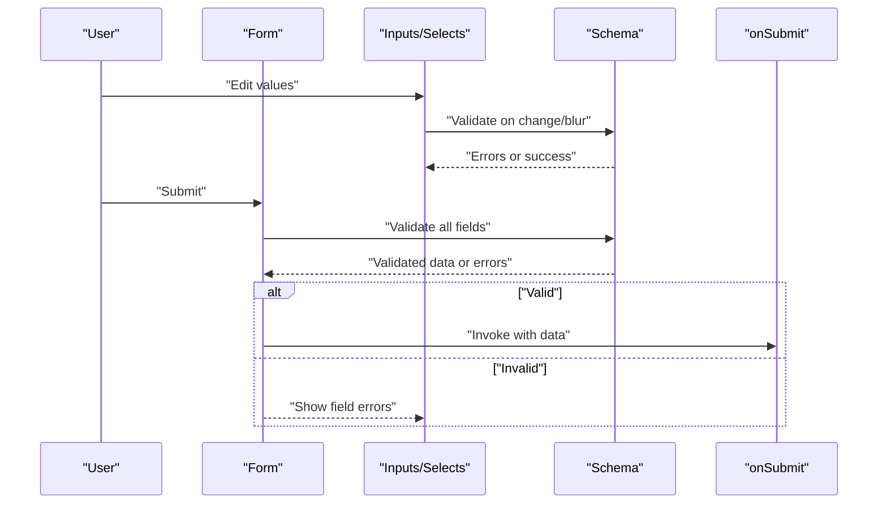

**Diagram sources**
- [form.tsx](file://src/components/ui/form.tsx)
- [input.tsx](file://src/components/ui/input.tsx)
- [select.tsx](file://src/components/ui/select.tsx)

**Section sources**
- [form.tsx](file://src/components/ui/form.tsx)

### Label
- Prop specification:
  - htmlFor: string linking label to input id.
  - className: string for wrapper customization.
- Accessibility:
  - Clicking label focuses associated control.
- Usage examples:
  - Label for Input: [label.tsx](file://src/components/ui/label.tsx)
  - Label for Select: [label.tsx](file://src/components/ui/label.tsx)

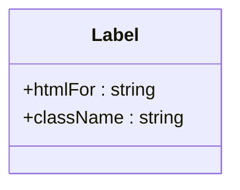

**Diagram sources**
- [label.tsx](file://src/components/ui/label.tsx)

**Section sources**
- [label.tsx](file://src/components/ui/label.tsx)

## Dependency Analysis
Primitives depend on Tailwind CSS for styling and may rely on shared utilities for common behaviors. The components.json file registers component metadata used by tooling.

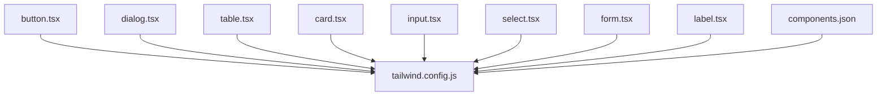

**Diagram sources**
- [button.tsx](file://src/components/ui/button.tsx)
- [dialog.tsx](file://src/components/ui/dialog.tsx)
- [table.tsx](file://src/components/ui/table.tsx)
- [card.tsx](file://src/components/ui/card.tsx)
- [input.tsx](file://src/components/ui/input.tsx)
- [select.tsx](file://src/components/ui/select.tsx)
- [form.tsx](file://src/components/ui/form.tsx)
- [label.tsx](file://src/components/ui/label.tsx)
- [components.json](file://components.json)
- [tailwind.config.js](file://tailwind.config.js)

**Section sources**
- [components.json](file://components.json)
- [tailwind.config.js](file://tailwind.config.js)

## Performance Considerations
- Prefer memoization for large tables: memoize column definitions and row renderers to avoid unnecessary re-renders.
- Debounce input onChange handlers for expensive operations (e.g., search).
- Use virtualization for very large datasets in Table to improve scroll performance.
- Avoid excessive nested dialogs; reuse a single Dialog instance where possible.
- Minimize reflows by batching state updates and avoiding inline style objects.

## Troubleshooting Guide
- Dialog not closing:
  - Ensure onOpenChange is wired to update open state.
  - Verify Escape key handling is enabled.
- Form validation not showing errors:
  - Confirm schema is correctly defined and fields are bound to the form.
  - Check aria-describedby associations for error messages.
- Input focus issues:
  - Ensure Label htmlFor matches Input id.
  - Validate that autoFocus is not conflicting with other focus traps.
- Select keyboard navigation:
  - Confirm listbox semantics and aria-activedescendant are present.
  - Test Arrow Up/Down and Enter/Space interactions.
- Table sorting not updating:
  - Ensure onSortChange updates local sort state and re-renders.
  - Verify aria-sort reflects current sort direction.

**Section sources**
- [dialog.tsx](file://src/components/ui/dialog.tsx)
- [form.tsx](file://src/components/ui/form.tsx)
- [input.tsx](file://src/components/ui/input.tsx)
- [select.tsx](file://src/components/ui/select.tsx)
- [table.tsx](file://src/components/ui/table.tsx)

## Conclusion
FinSight’s UI primitives provide a robust foundation for building consistent, accessible, and themeable interfaces. By composing Button, Dialog, Table, Card, Input, Select, and Form, teams can rapidly assemble complex screens while maintaining high standards for usability and cross-browser compatibility. Adhering to the documented prop contracts, event patterns, and accessibility practices ensures predictable behavior and a smooth developer experience.

## Appendices

### Theming Support
- Tokens and variants are configured via Tailwind. Extend or override styles by adding custom utilities or modifying existing ones in the Tailwind configuration.
- Global base styles are applied through index.css.

**Section sources**
- [tailwind.config.js](file://tailwind.config.js)
- [index.css](file://src/index.css)

### Responsive Behavior
- Use Tailwind responsive prefixes to adapt layouts and component sizes.
- For Table, consider horizontal scrolling on small screens and adjust column widths accordingly.
- For Dialog, ensure content remains usable on mobile viewports.

**Section sources**
- [tailwind.config.js](file://tailwind.config.js)

### Cross-Browser Compatibility
- Leverage modern web APIs supported by target browsers.
- Test keyboard navigation and focus management across browsers.
- Validate ARIA attributes and live regions for screen reader compatibility.

[No sources needed since this section provides general guidance]